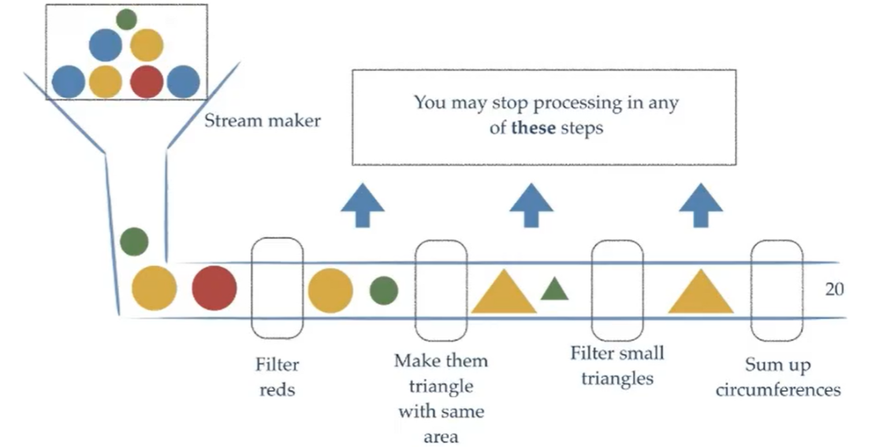
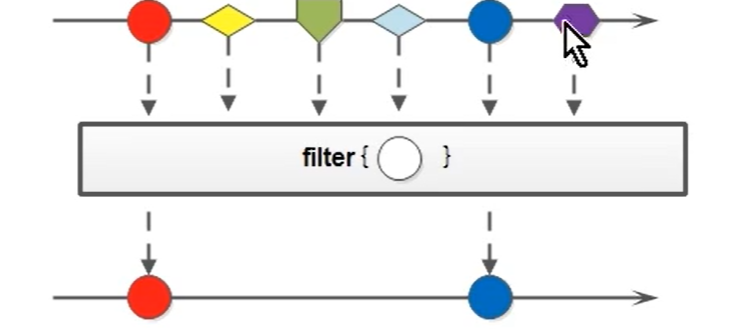
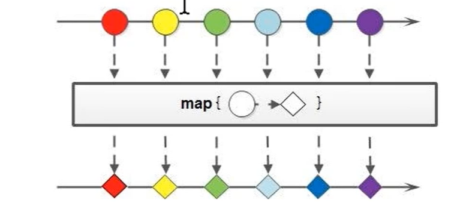
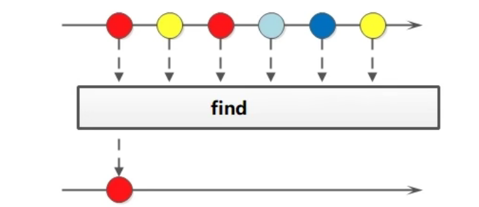
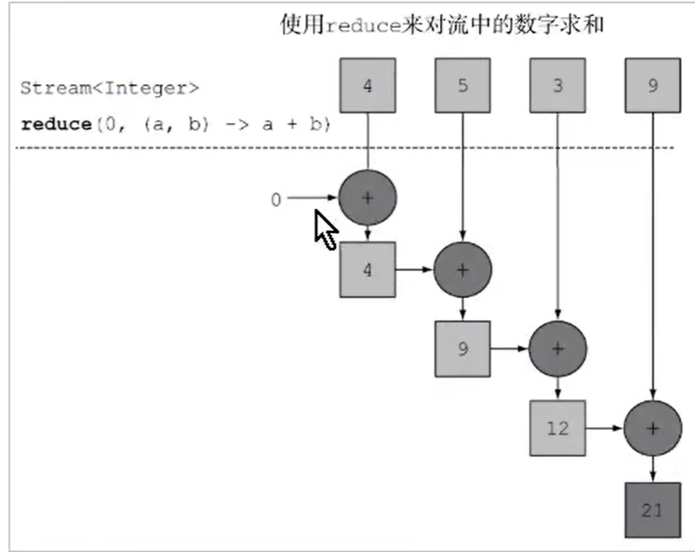

# Stream流式思想

> stream流式思想类似于工厂车间的“生产流水线”，stream流不是一种数据结构，不保存数据，而是对数据进行加工处理。stream可以看作流水线上的一个工序。在流水线上，通过多个工序让一个原材料加工成一个商品。



> stream api能让我们快速完成许多复杂的操作，如筛选，切片，映射，查找，去重复，统计，匹配和归约等


# 获取stream流的两种方式

* 通过collection获取流

  > 所有的collection集合都可以通过stream默认方法获取流。Map没有stream方法，可以通过KeySet去获取key的stream流

* 通过stream中的静态方法of获取流

  > Stream接口的静态方法of可以获取数组对应的流
  >
  > **注意：**

```java
String[] strs = {"a", "b", "c"};
Stream<String> stream1 = Stream.of(arr);

// 基本数据类型行不行？ 不行的，会将整个数组看作一个元素进行操作
int[] arr = {1, 2, 3};
Stream<int[]> stream2 = Stream.of(arr); // 不行，会把整个arr看作一个元素处理
```


# Stream流的常用方法和注意事项

**Stream方法分类：**

* 终结方法：返回值类型不再是Stream类型的方法，不再支持链式调用。
* 非中介方法：返回值类型是Stream类型的方法


**注意事项：**

1. Stream只能操作一次

   ```java
   Stream<String> stream = Stream.of("aa", "bb", "cc");
   long count1 = stream.count();
   long counts = stream.count();
   // 第二次会报错，一个stream流对象只能操作一次
   ```

2. Stream流方法若返回stream流，则这个流是新的流，可以再次调用
3. Stream不调用终结方法，中间操作不会执行


### 方法

**1. forEach(Consumer<T> 消费型接口)**

终结方法：是

作用：遍历集合/数组中的元素

```java
list.stream().forEach(s -> {
    System.out.println(s);
});
// 方法引用
list.stream().forEach(System.out::println);
```


**2. count()**

终结方法：是

作用：统计元素的个数

返回值：int

```java
int count =list.stream().count()
```


**3. filter(Predicate<? super T> predicate断定型接口)**

终结方法：否

作用：用于过滤数据，返回符合过滤条件的数据。



```java
list.stream().filter(str -> str.length() > 3).forEach(System.out::println)
```


**4. limit(int n)**

终结方法：否

作用：限制流的最大长度

```java
list.stream().limit(3).forEach(System.out::println)
```


**5. skip(int n)**

终结方法：否

作用：跳过stream流的前面n个数据

```java
list.stream().skip(1).forEach(System.out::println)
```


**6.map(Function<? super R, ? extends R> mapper 函数型接口)**

map：映射

终结方法：否

作用：接受一个函数型接口，作用的流中的每一个元素，可以生成另外一个类型的流



```java
list.stream().map(Integer::parseInt).forEach(System.out::println)
```


**7. sorted()方法**

终结方法：否

> Stream<T> sorted(); // 元素自然顺序排序
>
> Stream<T> sorted(Compartor<? super T> comparator);  // 更加比较器指定的规则排序
>
> i1 - i2 升序
>
> i2 - i1 降序

终结方法：否

作用：排序

```java
```


**8. distinct()**

终结方法：否

作用：对元素进行遍历是过滤掉重复的数据

> 基本类型：根据值是否相等去重
> String：根据内容进行去重
> 自定义类型：默认情况下无法去重，所有需要重新类的HashCode和equals方法

**代码：**

```java
list.stream().distinct().forEach(System.out::println);
```


**9. allMatch(Predicate<? super T> predicate);**

**anyMatch(Predicate<? super T> predicate)**

**noneMatch(Predicate<? super T> predicate)**

终结方法：是

作用：判断是否匹配指定的条件

返回值：boolean

```java
// allMatch 要求所有的元素都满足则返回true
Stream<Integer> s1 = Stream.of(1,3,5,6);
boolean b = s1.allMatch(i -> i > 7);
System.out.println(b);

// anyMatch 匹配某个元素，只要其中一个元素满足条件则返回true
boolean b1 = s1.allMatch(i -> i > 3);
System.out.println(b1);

// anyMatch 匹配所有元素，所有元素都不 满足条件则返回true
boolean b2 = s1.noneMatch(i -> i > 3);
System.out.println(b2);
```


**10 Stream流的find方法**

**Optional<T> findFirst();**

**Optional<T> findAny()**



> 如果需要找到某些数据，可以使用find相关方法。

终结方法：是

作用：找元素中数据，返回包装的Optional

​		findFirst：找到元素中的第一个元素

​		findAny：找元素中的任意一个

```java
Stream<Integer> s1 = Stream.of(1,3,5,6);
Optional o1 =s1.findFirst();
o1.get();
```


**11 max（）和 min（）函数**

> 通过 max（Comparator<? super T> comparator）和 min（）函数找最值，既然要找最值就应该告诉比较大小的规则即排序规则，接收一个Compartor接口


**12, reduce方法归约操作**

> 如果需要将所有的数据归纳总结得到一个数据，可以使用reduce方法。
>
> 可以用来获取最大值（谁大返回谁），求和

```java
T reduce(T identity, BinaryOperator<T> accumulator);
/*
参数说明
	identity: 默认值
	BinaryOperator<T> accumulato：对数据进行处理的方式
*/
```

代码

```java
Stream<Integer> s1 = Stream.of(4,5,3,9);
int res = s1.reduce(0, (x, y) -> x + y);
System.out.println(res);// 21,就是求和
```

**注：** reduce的执行过程

* 第一次，将默认值0赋值给了x，取出集合第一个元素赋值给y
* 第二次，将上一次放回的结果赋值给x，取出集合的第二个元素给y
* ...




**12.1 map 和 reduce的组合使用**


```java
public void testMapReduce() {
    
    Stream s = Stream.of(
    	new Person("alice", 19),
        new Person("asuna", 21),
        new Person("katou", 23),
        new Person("luola", 26),
    );
    
    // 求出所有年龄的总和
    // 1, 得到所有的年龄
    // 2，让所有的年龄相加
    int totalAge = s.map(p::getAge).reduce(0, (x, y) -> {
        return x + y;
    });
    System.out.println(totalAge);
    
    // 找最大年龄
    int totalAge = s.map(p::getAge).reduce(0, (x, y) -> {
        return x > y ? x : y;
    });
    System.out.println(totalAge);
    
    // 统计a出现的次数
    Stream.of("a", "b", "c", "a", "d", "a").map(s -> {
        return s.equals("a") ? 1 : 0;
    }).reduce(0, (x, y) -> {
        return x + y;
    })
    
}
```


**13, mapToInt()**

> Integer 占用的内存比int多，在Stream流操作中会自动装箱和拆箱
>
> 如果需要将Stream<Integer>中的Integer类型转成int类型，可以使用mapToInt方法。
>
> IntStream: 内部操作的是int类型的数据，就可以节省内存，减少自动装箱和拆箱
>
> **mapToXxx**

```java
IntSreaam mapToInt(ToIntFunction<? super T> mapper);

```


```java
Stream intStream = Stream.of(1, 2, 3, 4).mapToInt(num -> num.intValue());
```


**14， concat 方法**

> 如果有两个流，希望合并成一个流，那么就可以使用Stream接口的静态方法concant：

```java
static <T> Stream<T> concat(Stream<? extends T> a, Stream<? extends T> b);
```

**备注：** 这个和String的concat不是一回事

```java
Stream<String> sa = Stream.of("sa");
Stream<String> sb = Stream.of("sb");

// 合并流
Stream<String> newS = Stream.concat(sa, sb);
```

**注意：** 两个流合并后就不能在操作之前的流对象了，如sa，sb，不然报错


# 收集Stream流中的结果

> 将流中的结果报错到数组或者集合中，可以收集流中的数据


**1，将流中数据收集到集合中：**

```java
// collect收集流中的元素到集合（什么集合list，set 需要指定）
.collect(Collectors.toList());

.collect(Collectors.toSet());

// 如果想收集到指定的集合中
List<Object> list = new ArrayList<>();
.collect(Collectors.toCollection(list));

// 将流中的数据收集到数组中
stream.otArray(); // 返回的是Object类型的数组。不方便使用

// 进阶版的toArray. 收集到指定数组
stream.toArray(String[]::new);
```


**2，聚合操作**

> Stream流中的聚合操作类似于MySQL中聚合操作对流中的元素进行聚合运算，如最大值，最小值，平均值等。当然不通过聚合运算也能做到最大值，但是获取这个学生就不是那么容易了，但是求平均值，求和等是可以的

```java
Stream<Student> stream = Stream.of(
	new Student("kato", 19, 69),// name,age,score
    new Student("alice", 21, 90),
    new Student("asuna", 19, 95),
    new Student("yanggy", 26, 89),
);
// 获取最大分数的学生
Option<Student> s = stream.collect(Collectors.maxBy((s1, s2) -> {
    //s1, s2 都是学生对象。用于比较大小，不然怎么知道谁打谁小
    return s1.getScore() - s2.getScore();
}));

// 获取最小值的学生。注意类一个流对象只能使用一次
Option<Student> s = stream.collect(Collectors.minBy((s1, s2) -> {
    //s1, s2 都是学生对象。用于比较大小，不然怎么知道谁打谁小
    return s1.getScore() - s2.getScore();
}));

// 求平均值
Dobule avg = stream.collect(Collectors.averagingInt(s1 -> {
    //s1, s2 都是学生对象。用于比较大小，不然怎么知道谁打谁小
    return s1.getScore();
}));

// 。。。其他
```


**3，对流中的数据进行分组**

> 当我们使用Stream流处理数据后，可以根据某个属性将数据进行分组。和数据库的分组是相同的。分组也是收集数据的一种

**groupingBy 一个参数**

```java
Stream<Student> stream = Stream.of(
	new Student("kato", 19, 69),// name,age,score
    new Student("alice", 21, 90),
    new Student("asuna", 19, 95),
    new Student("yanggy", 26, 89),
);
// 将年龄相同的分为一组。groupingBy重载方法很多。返回map
Map<Integer, List<Student>> map = stream.collect(Collectors.groupingBy(s -> {
    return s.getAge(); // 返回age，将根据age进行分组
}));

Map<Integer, List<Student>> map = stream.collect(Collectors.groupingBy( Student::getAge
}));

// map 在jdk1.8之后支持了foreach方法
map.forEach((key, value) -> {
    System.out.println(key + "::" + value);
});

// 及格和不及格分组
// 将年龄相同的分为一组。groupingBy重载方法很多。返回map
Map<String, List<Student>> map = stream.collect(Collectors.groupingBy(s -> {
   if (s.getScore() > 60) {
       return "及格"
   } else {
		return "不及格"
   }
}));
// key就是及格 和 不及格
```


**4，stream流多级分组**

> 及分组下面还有分组

**groupingBy 两个参数**

```java

Stream<Student> stream = Stream.of(
	new Student("kato", 19, 69),// name,age,score
    new Student("alice", 21, 90),
    new Student("asuna", 19, 95),
    new Student("yanggy", 26, 89),
);
// 将年龄相同的分为一组。groupingBy重载方法很多。返回map
Map<Integer, Map<String, List<Student>>> map = stream.collect(Collectors.groupingBy(
	Student::getAge, Collectors.groupingBy(s -> {
        if (s.getScore() > 60) {
           return "及格"
       } else {
            return "不及格"
       }
    })	
));
```


**5, stream流分区**

> false 做一组，true做一组。和分组很类似，但是只能两个组

**partitionBy（）**


**6，对流中的数据进行拼接**

>  

```java
Stream<Student> stream = Stream.of(
	new Student("kato", 19, 69),// name,age,score
    new Student("alice", 21, 90),
    new Student("asuna", 19, 95),
    new Student("yanggy", 26, 89),
);
// 根据一个字符串拼接。join一个参数
String names = stream.map(Student::getName).collect(Collectors.join("拼接符"));

// join三个参数，（分隔符，前缀，后缀）：前缀xxx分隔符yyy分隔符ttt后缀
String names = stream.map(Student::getName).collect(Collectors.join(分隔符，前缀，后缀));
```

