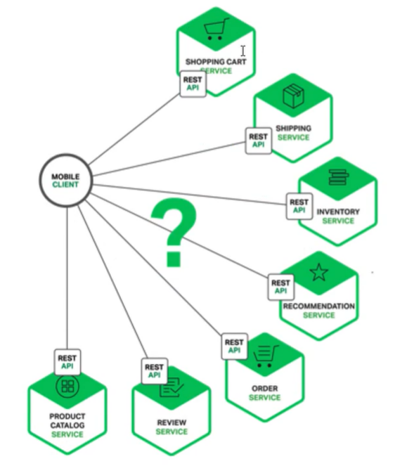
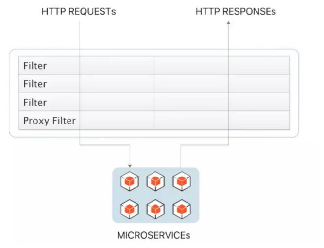
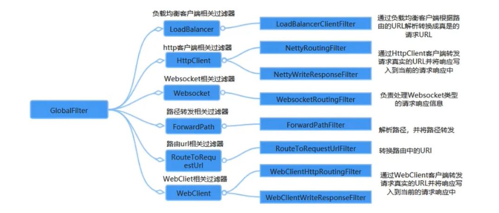
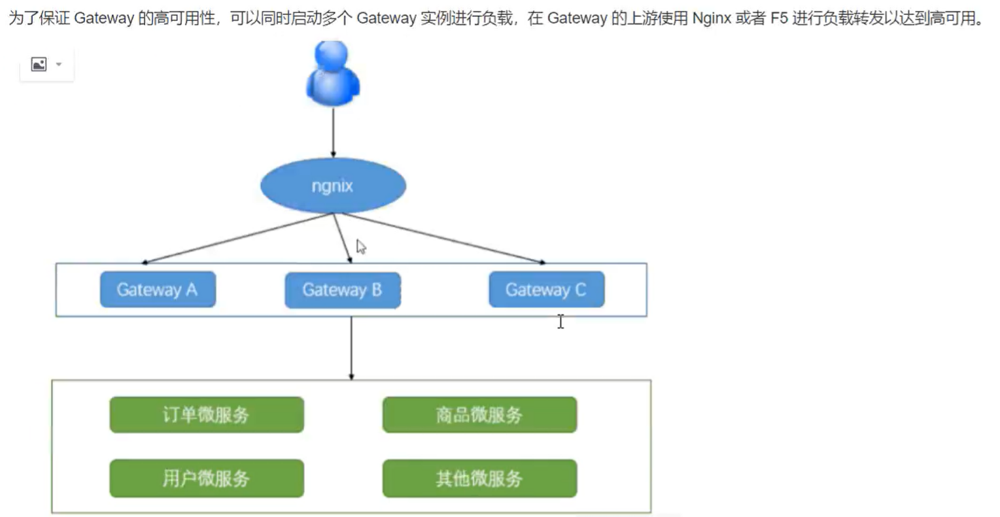

# Gateway

## 1，Gateway是什么

### 1.1 为什么引入网关

> 在一个微服务架构中，一个系统会被拆分为很多的微服务。那么作为客服端（浏览器）要如何去调用这么多的微服务呢？前端直接写死则不具有负载均衡作用，而且难维护，如果域名多时更难维护。
>
> 又例如跨域处理等等

无网关情况下



上面这些问题可以借助**API网关**来解决

**网关功能**

> **1.关注稳定和安全**
>
> * 全局流控
> * 日志统计
> * 防止SQL注入
> * 防止web攻击
> * 屏蔽工具扫描
> * 黑白IP名单
> * 证书/加密解密处理
>
> **2. 更好的服务**
>
> * 服务级流控
> * 服务降级与熔断
> * 路由与负载均衡，灰度策略
> * 服务过滤，聚合与发现
> * 业务规则与参数校验
> * 多级缓存策略


**总结：**

> 所谓的api网关，就是指系统的统一入口，他封装了应用程序的内部结构，为客服端提供统一服务，一些与业务本身功能无关的公共逻辑可以在这里实现，诸如认证，鉴权，监控，路由转发等等


## 2，什么是Spring Cloud Gateway

> 网关作为流量的入口，常用功能包括转发，权限校验，限流等。
>
> Gateway是第二代网关组件，是由WebFlux + Netty + Reactor实现响应式的API网关。他不能在传统的servlet容器中工作，也不能构建war包

**Spring Cloud Gatewat 功能特征**

* 动态路由：能够匹配任何请求属性（url，cookie，请求头）
* 支持路径重写：重写url
* 集成Spring Cloud服务发现功能（Nacos，Eruka）
* 可集成流控降级功能（Sentinel，Hystrix）
* 可以对路游指定易于编写的Pridicate（断言）和 Filter(过滤器)

### 2.1 核心概念

* **路由 route**

  > 路由是网关中最基础的部分，路由信息包括一个ID，一个目的URL，一组Filter组成。如果断言为真，则说明请求URL和配置的路由匹配。

* **断言 Predicate**

  > Java8中的断言函数，Spring Cloud Gateway中的断言函数类型是spring5.0 框架中的ServerWebExchange。断言函数允许开发者去定义匹配的HTTP Request中的任何信息，比如请求头和参数等。

* **过滤器 Filter**

  > Spring Cloud G ateway 中的过滤器filter分为Gateway Filter 和Global Filter。Filter可以对请求和响应进行处理。


## 3，Spring Cloud Gateway 快速开始

**依赖**、

```xml
dependencies>
    <!-- Spring Cloud Gateway -->
    <dependency>
        <groupId>org.springframework.cloud</groupId>
        <artifactId>spring-cloud-starter-gateway</artifactId>
    </dependency>
</dependencies>
```


**application.yaml**

```yaml
server:
  port: 8088

spring:
  application:
    name: App-Gateway

# Gateway 的配置
  cloud:
    gateway:
      # 路由规则
      routes:
        - id: order-route # 路由的唯一标识，路由到order
          uri: http://localhost:8081/order/id # 需要转发到的目的地址
          # 断言规则，用于路由规则的匹配，什么样的路由才能转发
          predicates:
            # predicates 的属性字符串，在这里这能用“=” 内部在解析，不能用yaml的赋值方式了。可以使用通配符
            - Path=/order/**
          filters:
           - StripPrefix=1 # 转发之前去掉第一层路径
```


## 4，整合Nacos

> Gateway 整合服务名可以使用服务名转发到服务了
>
> **lb://**  （load balance）即使用nacos的本地负载均衡策略

**依赖**

```xml
<!-- 整合 nacos -->
<dependency>
    <groupId>com.alibaba.cloud</groupId>
    <artifactId>spring-cloud-starter-alibaba-nacos-discovery</artifactId>
</dependency>
```

**application.yaml**

```yaml
spring:
  application:
    name: App-Gateway
# Gateway 的配置
  cloud:
    gateway:
      # 路由规则
      routes:
        - id: order-route # 路由的唯一标识，路由到order
          uri: lb://order-service # 需要转发到的目的地址, 整合nacos时使用服务员调用
          # 断言规则，用于路由规则的匹配，什么样的路由才能转发
          predicates:
            # predicates 的属性字符串，在这里这能用“=” 内部在解析，不能用 yaml的赋值方式了。可以使用通配符
            - Path=/order/**
          filters:
            - StripPrefix=1 # 转发之前去掉第一层路径
    nacos:
      # nacos server 地址
      server-addr: 106.14.137.179:8848
      discovery:
        # nacos server 用户名 密码 命名空间(默认可以省略，但是开启 Nacos权限控制时，必须明确写出用户名 密码)
        username: nacos
        password: nacos
```

**补充：如果使用服务名如oder-service作为访问前缀，那么uri, predicates, filters 都不需要配置（简写不写） **

> 但是需要配置
>
> locator.enabled=true


## 5.  路由断言工厂配置

> Spring Cloud Gateway 包括许多内置的断言工厂，所有这些断言都与HTTP请求的不同属性匹配。
>
> 作用：当请求gateway的时候，使用断言对请求进行匹配，如果匹配成功就路由转发，如果失败就返回404
>
> 内置断言工厂具体如下：

<font color="red">配置kv参数时，逗号,之后不要由空格</font>>

### *  基于Datetime 时间类型的断言工厂

> 此类型的断言根据时间做判断，主要由三个
>
> 作用：一般请求在某时间有效，一般都是活动
>
> 时期是带时区的：ZoneDateTime.now()输出

**AfterRoutePredicateFactory**

> 接收一个日期参数，判断请求日期是否在该日期之后，是则匹配

**BeforeRoutePredicateFactory**

> 接收一个日期参数，判断请求日期是否在该日期之前，是则匹配

**BetweenRoutePredicateFactory**

> 接收量个日期参数，判断请求日期是否在该时间段内，是则匹配

案例：

```yaml
- After=2019-12-31T13:59:59.789+08:00[Asia/shanghai]
```


### * 基于远程IP地址的断言工厂

> 接收一个IP地址端，判断请求主机是否是这个地址段
>
> 子网掩码可以不写

```yaml
- RemoteAddr=192.168.1.1/24
- RemoteAddr=192.168.1.1
```


### * 基于Cookie的断言工厂

> 接收两个参数，cookie名字和一个正则表达式（cookie的值）。判断要求
>
> cookie是否具有给定名称且则于正则表达式匹配

```yaml
- Cookie=cookie名,正则表达式
```


### * 基于Header的断言工厂

> 接收两个参数，标题名字和一个正则表达式。判断请求header是否具有给定名称且只于正则表达式匹配。

```yaml
- Header=请全体Headerming,正则表达式
```


### * 基于Host的断言工厂

> 接收一个参数，主机名模式（域名）。爬到请求的Host是否满足匹配规则

```yaml
- Host=**.testhost.org
```


### * 基于Method请求方法的断言工厂

> 接收一个参数，判断i请求类型是否满足路径规则

```yaml
- Method=GET
```


### * 基于Path请求路径的断言工厂

> 接收一个参数，判断请求的URI 部分是否满足路径规则(可以使用通配符, 占位符（动态路由）)

```yaml
- Path=/foo/{segment}
```


### * 基于Query请求参数的断言工厂

> 接收两个参数，请求param和正则表达式（即k和v，v可以使用正则），判断请求参数是否具有给定名称且值与正则表达式匹配。

```yaml
- Query=key名,正则
```


### * 基于路径权重的断言工厂

> 接收一个[组名，权重]，然后对同一组内的路由按权重转发

```yaml
- id: weight_hign
  uri: http://hign
  predicates:
  - Weight=group1, 8
  
- id: weight_low
  uri: http://low
  predicates:
  - Weight=group1, 2
```


### * 自定义断言工厂

> 自定义路由断言工厂需要继承 AbstractRoutePredicateFactory 类，重写apply 方法的逻辑。
>
> 在 apply方法中可以通过exchage.getRequest()拿到ServerHttpRequest对象 ,从而可以获取到请求参数，请求方式，请求头等信息
>
> **注意：**
>
> 1. 必须是spring组件bean
> 2. 类必须加上RoutePredicateFactory作为结尾(与反射获类有关，如断言属性： -Path，就会去找PathRoutePredicateFactory)
> 3. 必须继承AbstractRouteRedicateFactory
> 4. 必须声明静态内部类，声明属性类接收配置文件中对应的断言信息
> 5. 需要经过shortcutFieldOrder进行绑定
> 6. 通过apply进行逻辑判断，true就是匹配成功，否则就匹配失败

```java
@Component
public class CheckAuthRoutePredicateFactory extends AbstractRoutePredicateFactory<CheckAuthRoutePredicateFactory.Config> {

    public CheckAuthRoutePredicateFactory() {
        super(CheckAuthRoutePredicateFactory.Config.class);
    }

    @Override
    public List<String> shortcutFieldOrder() {
        return Arrays.asList("name");
    }

    @Override
    public Predicate<ServerWebExchange> apply(Config config) {
        return new GatewayPredicate() {
            @Override
            public boolean test(ServerWebExchange exchange) {
                if (config.getName().equals("katou")) {
                    return true;
                }
                return false;
            }

            @Override
            public String toString() {
                return "";
            }
        };
    }

    /**
     * 声明静态内部类，声明属性类接收配置文件中对应的断言信息
     * 结合shortcutFieldOrder 来绑定
     */
    @Validated
    @Data
    public static class Config {
        private String name;

    }

}
```

配置application.yaml

属性名就是类的前缀

```yaml
- CheckAuth=katou
```


## 6. Gateway Filter 内置过滤工厂配置

> Gateway 内置了很多的过滤器工厂，我们通过一些过滤器工厂可以进行一些业务逻辑处理，比如添加剔除响应头，添加去除参数等。



| 过滤器工厂          | 作用 | 参数 |
| ------------------- | ---- | ---- |
| AddRequestHeader    |      |      |
| AddRequestParameter |      |      |
| PrefixPath          |      |      |
|                     |      |      |
|                     |      |      |
|                     |      |      |
|                     |      |      |
|                     |      |      |
|                     |      |      |

### * 添加请求头 AddRequestHeader

```yaml
- AddRequestHeader=请求头key,请求头值
```

代码获取请求头

```java
@GetMapping
public String header(@RequestHeader("请求头key") String header) {
    System.out.println(header);
}
```


### * 添加请求参数AddRequestParameter

> 请求参数k，v形式

```yaml
- AddRequestParameter=color,bule
```

代码获取请求参数

```java
@GetMapping
public String params(@RequestParam("color") String color) {
    System.out.println(color);
}
```


### * 添加路由前缀 PrefixPath

> 相当于server添加了context-path属性

```yaml
- PrefixPath=/路由前缀
```


### * 重定向路由 RedirectTo

```yaml
- RedirectTo=http://www.baidu.com
```


### ...


## 7, 自定义局部过滤器工厂

> 继承AbstractGatewayFilterFactory且我们自定义的类必须以GatewayFilterFactory结尾，并且交给spring。
>
> 在 apply方法中可以通过exchage.getRequest()拿到ServerHttpRequest对象 ,从而可以获取到请求参数，请求方式，请求头等信息（exchage这些都是webflux中对象）
>
> 除了可以实现内置过滤器工厂功能外，能够拿到请求和响应对象可以做很多事情，如正常的**过滤功能**

代码

```java
@Component
public class CheckAuthGatewayFilterFactory extends AbstractGatewayFilterFactory<CheckAuthGatewayFilterFactory.Config> {

    public CheckAuthGatewayFilterFactory() {
        super(CheckAuthGatewayFilterFactory.Config.class);
    }

    @Override
    public List<String> shortcutFieldOrder() {
        return Arrays.asList("");
    }

    @Override
    public GatewayFilter apply(Config config) {
        return (exchange, chain) -> {
            String name = exchange.getRequest().getQueryParams().getFirst("name");

            if (Objects.equals(name, config.getValue())) {
                // 正常请求
                return chain.filter(exchange);
            } else {
                // 返回404 结束
                exchange.getResponse().setStatusCode(HttpStatus.NOT_FOUND);
                exchange.getResponse().setComplete();
            }
            return chain.filter(exchange);
        };
    }

    @Data
    public static class Config {
        private String value;
    }

}
```


application.yml配置

```yaml
filters:
  - CheckAuth=katou
```


## 8，全局过滤器配置（Global Filters）

> 针对所有的路由进行过滤，不需要像局部过滤器一样需要配置。
>
> 局部过滤器：针对某个路由，需要在路由中进行配置
>
> 全局过滤器：针对所有路由，一旦定义就会投入使用

下面式内置的全局过滤器



```java
public class AuthGlobalFilter implements GlobalFilter, Ordered {
    /**
     * 处理请求，对请求进行过滤
     * @param exchange 此对应主要用于获取请求对象并进行请求处理
     * @param chain 过滤链对象，通过此对象将请求传递给过滤链中的下一个过滤器
     * @return 数据流对象(通过此对象可以异步响应结果)
     */
    @Override
    public Mono<Void> filter(ServerWebExchange exchange,
                             GatewayFilterChain chain) {
        ServerHttpRequest request= exchange.getRequest();
        ServerHttpResponse response=exchange.getResponse();
        //将来这个信息可以来自redis数据库(缓存数据库)
        String token=request.getQueryParams().getFirst("token");
        if(!token.equals("admin")){
            System.out.println("认证失败");
            response.setStatusCode(HttpStatus.UNAUTHORIZED);
            return response.setComplete();//Mono<Void>
        }
        return chain.filter(exchange);//认证ok,继续执行其它的过滤器
    }
    /**
     * 定义过滤器的优先级
     * @return
     */
    @Override
    public int getOrder() {
        return -1;//数值约小优先级约高
    }
}
```


### 8.1  Gateway Filter 请求日志记录

> Gateway 已经实现了日志记录功能。通过Java的系统属性来实现或说环境变量
>
> 如果在开发阶段在idea，配置一些vm option就可以了

**IDEA**

> 日志会在控制台显示

```sh
-Dreactor.netty.http.server.accessLogEnable=true
```

记录到文件中需要配置

方式1：logback.xml

```xml
<appender name="accessLog" class="ch.qos.logback.core.FileAppender">
	<file>access_log.log</file>
    <encoder>
        <pattern>%msg%n</pattern>
    </encoder>
</appender>
<appender name="async" class="ch.qos.logback.core.AsyncAppender">
	<appender-ref ref="accessLog" />
</appender>
<logger name="reactor.netty.http.server.AccesssLog" level="INFO" additivity="false">
	<appender-ref ref="async" />
</logger>
```

方式2：application.yaml

```yaml
logging:
	file:
		path: xxxx
```


**部署**

``` sh
java -jar -Dreactor.netty.http.server.accessLogEnable=true
```


## 9，全局跨域配置

**配置方式 application.yaml**

```yaml
spring:
  cloud:
    gateway:
      globalcors:
        cors-configurations:
          '[/xx]': # /** 代表允许跨域的访问的资源
            allowedOrigins: "https://xxxx.com" # 跨域允许的来源 ，开发时允许所有 “*”
            allowedMethods:
              - GET
              - POST
```


**代码方式: 添加跨域过滤器**

```java
/**
 * 全局跨越配置
 */
@Configuration
public class CorsConfig {

    @Bean
    public CorsWebFilter corsWebFilter() {
		// WebFlux的，选择带Reactor响应式的类
        UrlBasedCorsConfigurationSource source = new UrlBasedCorsConfigurationSource(new PathPatternParser());
        //UrlBasedCorsConfigurationSource source = new UrlBasedCorsConfigurationSource();
        CorsConfiguration corsConfiguration = new CorsConfiguration();
        // 设置跨越
        // 允许的请求头参数
        corsConfiguration.addAllowedHeader("*");
        // 允许的method
        corsConfiguration.addAllowedMethod("*");
        // 允许的来源
        corsConfiguration.addAllowedOrigin("*");
        // cookies
        corsConfiguration.setAllowCredentials(true);

        source.registerCorsConfiguration("/**", corsConfiguration);
        return new CorsWebFilter(source);
    }
}
```


## 10, Gateway 整合Sentinel 流控降级

> 网关作为内部系统的一层屏障，对内抢到一定的保护作用，网关层的限流可以针对不同路由进行限流，也可以针对不同的业务接口进行限流，或者根据接口的特征分组限流

**1. 依赖**

> gateway 和 sentinel场景启动器

```xml
<!-- Spring Cloud Gateway -->
<dependency>
    <groupId>org.springframework.cloud</groupId>
    <artifactId>spring-cloud-starter-gateway</artifactId>
</dependency>

<!-- sentinel整合gateway -->
<dependency>
    <groupId>com.alibaba.cloud</groupId>
    <artifactId>spring-cloud-alibaba-sentinel-gateway</artifactId>
</dependency>

<!-- sentinel -->
<dependency>
    <groupId>com.alibaba.cloud</groupId>
    <artifactId>spring-cloud-starter-alibaba-sentinel</artifactId>
</dependency>
```

**2, 配置**

```yaml
spring:
  cloud:
    sentinel:
          transport:
            dashboard: 106.14.137.179:8848 # 控制台地址
```

> 流控规则可以通过控制台或者代码设置


## 11，Gateway高可用


