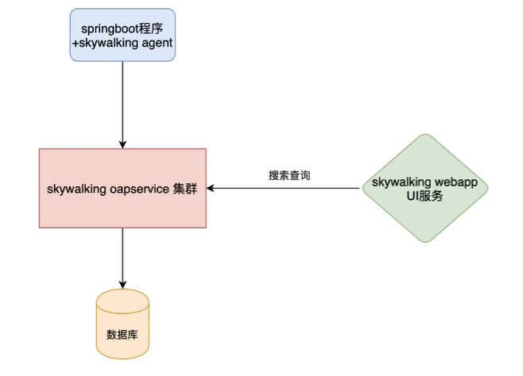

# SkyWalking 链路追踪

## 1，SkyWalking 是什么

> skywalking是一个国产的开源框架。它是一个款优秀的APM(Application Performance Management)工具，包括分布式链路追踪，性能指标分析，应用和服务依赖分析等等。
>
> github上有中文文档。


## 2，SkyWalking 环境部署



> **组成：**
>
> * skywalking agent：和业务系统绑定在一起，负责收集各种监控数据。
>
> * skywalking oapservice 集群：skywaling服务端。赋值收集处理监控的数据，比如接收skywalking agent的监控数据，并存储到数据库中；接受skywalking webapp的前端请求，从数据库查询数据，并返回给前端。skywalking oapservice通常以集群的形式存在。
> * skywalking webapp：前端界面，用于展示数据
> * 数据库：用于存储监控的数据库，比如MySQL，elasticsearch等。
>
> 


### 2.1 skywalking 服务端搭建

> **1. 下载：**
>
> https://skywalking.apache.org/downloads/
>
> **目录介绍：**
>
> * webapp: UI
> * oap-libs:
> * config: 启动后台应用程序的配置文件，是使用的各种配置
> * bin：启动脚本，一般使用startup.sh来启动web页面和对应后台应用
> * agent：
>   * config：代理服务启动时使用的配置文件
>
> **端口**：
>
> * 11800：收集监控数据的端口
> * 12800：接受前端请求的端口
> * 8868（手动改的）：UI端口默认是8080，需要手动修改避免端口冲突
>
> **2. 修改web端口**
>
> ```sh
> /skywalking-8.5.0/webapp/webapp.yml
> ```


### 2.2 skywalking agent （接入微服务）

> skywalking 是无侵入的接入。只需要在运行的时候添加vm参数即可。

**1，开发window环境-在IDEA中使用SkyWalking**

> Skywalking 跨多个微服务追踪，只需要每个服务启动时添加javaagent参数即可。
>
> idea开发时将xxx/skywalking-8.5.0/agent放在开发本地
>
> * 将skywalking-agent.jar及其父目录放置本地磁盘
>
> **添加启动参数：idea vm options**
>
> ```sh
> -javaagent:xxx/skywalking-8.5.0/agent/skywalking-agent.jar # agent jar包的本地路径，必须时本地物理路径
> -DSW_AGENT_NAME=服务名 # 在skywalking上显示服务名
> -DSW_AGENT_COLLECTOR_BACKEND_SERVICES=127.0.0.0:11800 #skywalking server地址和端口
> ```


**2，部署环境**

> 准备一个springboot项目，打包成jar包，写一个shell脚本，在启动脚本上进行配置。

```sh
#!/bin/bash
# SkyWalking Agent配置
export SW_AGENT_NAME= app-name # Agent名字，一般使用spring.application.name即服务名
export SW_AGENT_COLLECTOR_BACKEND_SERVICES=127.0.0.1:11800 # 配置服务地址
export SW_AGENT_SPAN_LIMIT=2000 # 配置链路的最大span数量，默认300
export JAVA_AGENT=-javaagent:XXX/agent/kywalking-agent.jar
java $JAVA_AGENT -jar xxx.jar # jar 启动
```

**注意：skywalking 默认是不支持gateway的**

> 如果需要gateway，将gateway的插件jar包放置到 **/agent/plugins**
>
> 将**/agent/optional-plugins**中的可选插件jar放置到插件目录，用最新的哪个gateway jar包
>
> ****
>
> 要多个微服务都接入skywalking，不然不接入的那部分链路是不显示的。


### 2.3 skywalking 持久化跟踪数据

> 默认使用H2数据库，内存的。
>
> 其实数据的丢失影响并不大，因为我们关心的时实时的数据，不会关心一个月之前的，但是基于内存的运行久了会消耗更多的内存。
>
> **skywalking-8.5.0/config/applicaton.yml**

#### **1, 基于MySQL的持久化**

**1，修改config目录下的application.yml, 使用MySQL作为持久化存储的仓库**

```ymal
storage:
  selector: ${SW_STORAGE:mysql}
  .....
  
  mysql:
    properties:
      jdbcUrl: ${SW_JDBC_URL:"jdbc:mysql://localhost:3306/数据库"}
      dataSource.user: ${SW_DATA_SOURCE_USER:用户名}
      dataSource.password: ${SW_DATA_SOURCE_PASSWORD:密码}
      dataSource.cachePrepStmts: ${SW_DATA_SOURCE_CACHE_PREP_STMTS:true}
      dataSource.prepStmtCacheSize: ${SW_DATA_SOURCE_PREP_STMT_CACHE_SQL_SIZE:250}
      dataSource.prepStmtCacheSqlLimit: ${SW_DATA_SOURCE_PREP_STMT_CACHE_SQL_LIMIT:2048}
      dataSource.useServerPrepStmts: ${SW_DATA_SOURCE_USE_SERVER_PREP_STMTS:true}
    metadataQueryMaxSize: ${SW_STORAGE_MYSQL_QUERY_MAX_SIZE:5000}
    maxSizeOfArrayColumn: ${SW_STORAGE_MAX_SIZE_OF_ARRAY_COLUMN:20}
    numOfSearchableValuesPerTag: ${SW_STORAGE_NUM_OF_SEARCHABLE_VALUES_PER_TAG:2}
```

**2，创建数据库**

> 我们只需要创建对应数据库，不需要创建表，skywalking启动的时候会自动创建。


**3，启动**

> **注意：skywalking没有MySQL启动包，需要自己去下载一个驱动包放置到/skywalking/oap-libs目录下**

