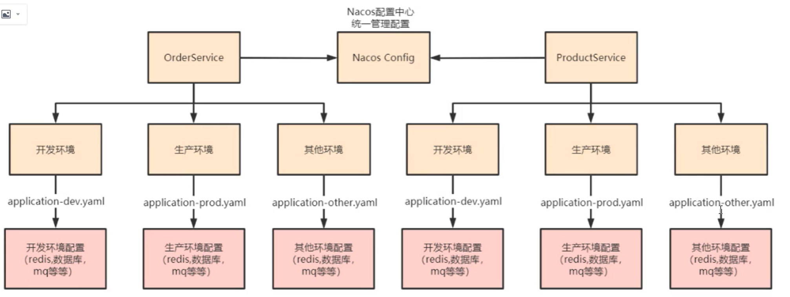
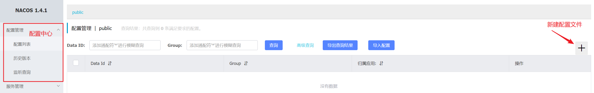
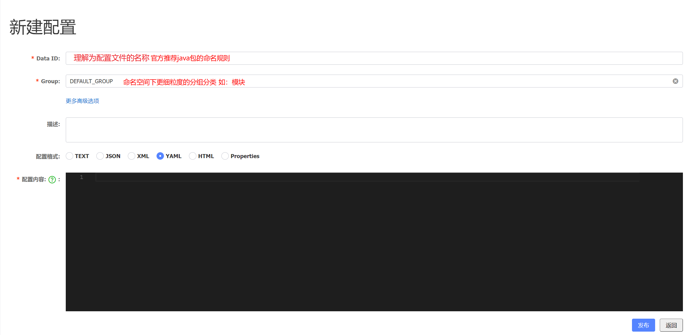
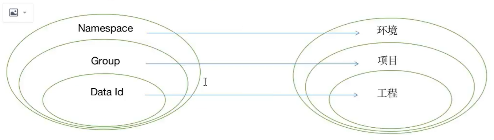

# Nacos 配置中心

> Nacos 提供了用于存储配置和其他元数据的key/value 存储，为分布式系统中的外部化配置提供了服务端和客户端支持。
>
> 解决传统配置的缺点：
>
> 1. 维护性：通过集中配置，提供可视化界面
> 2. 时效性：通过常轮询实时更新服务配置，同时不需要重启服务
> 3. 安全性：Nacos提供了权限控制，如开发人员无法查看和修改生产环境配置



## 1，主流配置中心介绍

> 目前市面上的配置中心有多个，但是推荐Nacos

| 配置中心 | Spring Cloud Config | apollo             | Nacos              |
| -------- | ------------------- | ------------------ | ------------------ |
| 实时推送 | 支持（配合Bus总线） | 支持（HTTP长轮询） | 支持（HTTP长轮询） |
| 版本管理 | 支持（git）         | 自动管理           | 自动管理           |
| 版本回退 | 支持（git）         | 支持               | 支持               |
| ...      |                     |                    |                    |


## 2, 使用Nacos 配置中心

### 2.1 Nacos Config 开始了解

http://192.168.134.128:8848/nacos/index.html

**新增配置**



**配置**

> DataId 一般都加文件后缀



#### 2.1.1 命名空间&分组最佳实践

**Nacos配置理解方式 1**

> **Namespace(命名空间)：**一般代表不同的环境，如开发，测试，生产环境
>
> **Group :** 代表某个项目，如XX医疗项目，XX电商项目
>
> **DataId：** 每个项目下往往有若干工程，每个配置集（DataId）是一个工程主配置文件, 推荐Java包路径形式命名



**Nacos配置理解方式 2**

> **Namespace(命名空间)：**理解为模块名
>
> **Group :** 理解为开发环境
>
> **DataId：** 每个项目下往往有若干工程，每个配置集（DataId）是一个工程主配置文件
>
> 这种方式虽然看似结构清晰，但是缺点很明显在只有一个项目的时候没有任何问题但是项目一多就会配置混乱。

**...**


### 2.2 权限控制

> Nacos 可以做到权限控制，但是只能做到对`命名空间`的控制。
>
> **注意：** 要是权限控制生效还需要修改Nacos的配置文件
>
> **注意：**用户名 密码默认可以省略，但是开启Nacos权限控制时，必须明确写出用户名 密码
>
> ./conf/application.properties

```properties
nacos.core.auth.enabled=true
```


### 2.3 Nacos Config 快速开始

#### 2.3.1 引入依赖

```xml
<!-- nacos config -->
<dependency>
    <groupId>com.alibaba.cloud</groupId>
    <artifactId>spring-cloud-starter-alibaba-nacos-config</artifactId>
</dependency>
```


#### 2.3.2 Nacos 配置中心进行配置

> ...


#### 2.3.3 引入配置中心

> **注意：**`使用了Nacos 配置中心，就必须使用bootstrap.properties 或者bootstrap.yml配置文件来配置Nacos Server地址以及引入配置中心的配置文件。这个与程序的启动和配置文件的加载时间有关，bootstrap.properties是先被加载之后程序才启动`
>
> Nacos config 相关配置必须写在bootstrap.properties 配置文件中
>
> Nacos 客服端 没10ms去 注册中心进行判断，根据MD5执行判断配置是否有更新，然后进行拉取

**<font color=red>bootstrap.properties：默认引入</font>**

> Nacos客服端，默认会拉取与该服务名称同名的配置文件，后缀名默认是properties，这个后缀名可不写。若后缀命名不是properties需要显示写出.
>
> **注意：一旦开启权限配置注册中心，和配置中心都需要指定用户名密码**

```properties
# spring.cloud.nacos.server-addr=106.14.137.179:8848
spring.cloud.nacos.config.server-addr=106.14.137.179:8848
spring.cloud.nacos.config.username=nacos
spring.cloud.nacos.config.password=nacos
# 指定命名空间，会自动根据服务名拉取dataId对应配置文件，前提是dataId等于服务名，如：com.cloud.order
spring.cloud.nacos.config.namespace=public
# 这个后缀名只对默认配置文件起作用（即与服务名同名的配置文件）
spring.cloud.nacos.config.file-extension-yaml
```

****

##### 2.3.3.1 关闭动态刷新

> 如果配置文件更新了，不想让客服端感知到则可以关闭动态刷新

**一般都不会设置**

```properties
spring.cloud.nacos.config.refresh.enable=false
```


##### 2.3.3.2 profile粒度的配置

> 在springboot工程支持profile粒度的支持，即多环境配置。
>
> nacos-config加载配置的时候，不仅仅加载了以dataId为`${spring.application.name}.${file-extension:properties}`为前缀的**基础配置**，还加载了`${spring.application.name}-${profile:dev|prod|test}.${file-extension:properties}`的基础配置。通过spring.profiles.active来切换配置环境，**注意：spring.profiles.active必须放在bootstrap.properties中**
>
> 只用默认的配置文件，才会用profile

```yaml
spring:
	profiles:
    	active: dev
```


### 2.4 自定义配置

#### 2.4.1 自定义namespace 的配置

> 用于进行租户粒度的配置隔离。不同命名空间下，可用存在相同的Group和DataId的配置。Namespace的常用场景就是不同环境(开发，测试，生产)的隔离

````properties
sprinig.cloud.nacos.config.namespace=public
````


### 2.4.2 自定义Group 的配置

> Group是组织配置的维度之一。Group对配置集进行分组，从而区分DataId相同的配置集。
>
> 常用场景：不同的应用和组件使用了相同批准类型

```properties
spring.cloud.nacos.config.group=default_group
```


### 2.4.3 自定义扩展DataId 的配置

> DataId 是组织划分配置的维度之一。DataId 通常采用类 Java包（如：com.taobao.tc.log.level) 的命名规则保证全局唯一性。此命名非强制性。
>
> `通过自定义扩展的DataId配置，既可以解决多个应用间配置共享问题，又支持一个应用又多个配置文件。`
>
> * shared-configs
> * extension-configs
>   * **refresh** : 是否动态感知，当配置中心的配置发送变化是是否可感知


**shared-configs**

> "-" : 代表数组可以和 "[]" 轮着用

```yaml
spring:
  cloud:
    nacos:
      config:
        shared-configs:
          - data-id: dataId1
            group: group1
            refresh: true

          - data-id: dataId2
            group: group2
            refresh: true
              
        extension-configs[0]:
          group: group3
          data-id: dataId3
          refresh: true
          
        extension-configs[1]:
          group: group3
          data-id: dataId3
          refresh: true
```


**profile > 默认配置文件 > extension-configs > shared-confgs(下标越大优先级越大）**

shared-confgs：一般配置各微服务都共享文件，如redis就是共享的


### 2.4.3 @RefreshScope

> @Value注解可以获取配置中心的值，但是无法动态感知修改后的值，需要利用@RefreshScope注解


## 3. nacos 配置持久化

**1，修改配置文件**

> /nacos-1.4.1/conf/application.properties
>
> **注意：**目前发现使用docker容器的mysql会出现no datasource set错误。
>
> 解决：no datasource set错误应该是时区问题导致的，将serverTimezone=UTC改为：serverTimezone=Asia/Shanghai

```properties
spring.datasource.platform=mysql
### Count of DB:
db.num=1
### Nacos 持久化:
db.url.0=jdbc:mysql://MySQL地址:3306/nacos?characterEncoding=utf8&connectTimeout=1000&socketTimeout=3000&autoReconnect=true&useUnicode=true&useSSL=false&serverTimezone=UTC
db.user.0=mysql用户名
db.password.0=mysql密码

### Connection pool configuration: hikariCP
db.pool.config.connectionTimeout=30000
db.pool.config.validationTimeout=10000
db.pool.config.maximumPoolSize=20
db.pool.config.minimumIdle=2

### 开启权限控制:
nacos.core.auth.enabled=true

```

**2，创建nacos 持久化数据库**

> 该sql放置在conf目录下。同时插入默认的用户密码不然无法登录

