# Alibaba 微服务组件Nacos注册中心

## 1，什么是Nacos

> 官方：nacos是一个易于构建云原生应用的动态 <font color="ored">服务发现</font>(Nacos DisCovery)、 <font color="ored">服务配置</font>(Nacos Config) 和服务管理平台
>
> 集注册中心 + 配置中心 + 服务管理平台

**Nacos的关键特性包括：**

* 服务发现和服务健康状态监测（注册中心）
* 动态配置服务（配置中心）
* 动态DNS服务
* 服务及其元数据管理（注册中心）

## 2，Nacos注册中心

### 2.1，注册中心演变及其设计思想

[processON图](https://www.processon.com/diagraming/61b972cb1efad406de41d587)

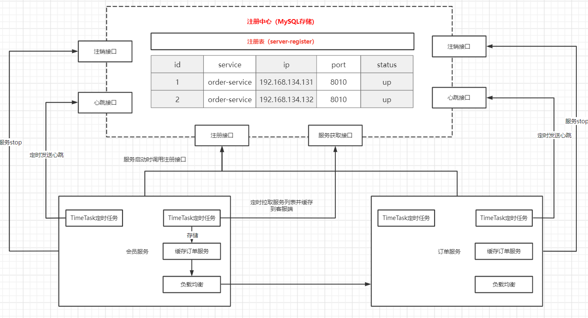

### 2.2 服务调用

> 注册中心存在的情况下，若只简单使用RestTemplate是无法通过服务名进行远程调用的，想要在加@LoadBalanced注解, 加负载均衡器

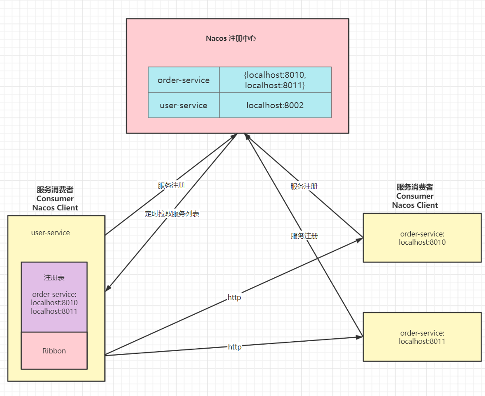

**RestTeamplate**

```java
@Configuration
public class BeanConfig {

    /**
     * 想要设置一下超时时间、基本认证信息等
     * @LoadBalanced 若不加改注解则restTemplate是无法通过服务进行服务调用的
     */
    @Bean
    @LoadBalanced
    public RestTemplate restTemplate(RestTemplateBuilder builder) {
        return builder
            //.basicAuthentication("username", "password")
            // .setConnectTimeout(Duration.ofSeconds(3))
            // .setReadTimeout(Duration.ofSeconds(5))
            // .rootUri("http://api.test.com/")
            .build();
    }

    /**
     * 普通使用
     */
    //    @Bean
    //    public RestTemplate restTemplate() {
    //        return new RestTemplate();
    //    }
}
```

**Controller**

```java
@RestController
@RequestMapping("/order")
public class OrderController {

    @Autowired
    private RestTemplate restTemplate;

    @GetMapping
    public String order() {
        String s = restTemplate.getForObject("http://localhost:8021/stock/sub", String.class);
        String s1 = restTemplate.getForObject("http://stock-service/stock/sub", String.class);
        return "调用订单服务" + "\n" + s;
    }
}
```


### 2.3 核心功能

**服务注册：**

> Nacos Client会通过发送Rest请求的方式向Nacos Server注册自己的服务，提供自身的元数据，比如：ip地址，端口号等。Nacos Server接收到注册请求后，就会把这些元数据存储在一个双层的内存Map中。

**服务心跳：**

> 在服务注册后，Nacos Client会维护一个定时心跳来继续通知Nacos Server，说明服务一直处于可用状态，防止被剔除。
>
> 默认5s发送一次心跳

**服务同步：**

> Nacos Server集群间相互同步服务实例，用来保证服务信息的一致性

**服务发现：**

> 服务消费者Nacos Client在调用服务提供者的服务时，会发送一个Rest请求给Nacos Server，获取上面注册的服务列表，并且缓存到Nacos Client本地，同时会在Nacos Client本地开启一个定时任务定时拉取服务端最新的注册表信息更新到本地缓存。

**服务健康状态检查：**

> Nacos Server会开启一个定时任务用来检查注册服务实例的健康状态，对于超过15s没有收到客服端心跳的实例会它的healthy属性设置为false（客服端服务发现时不会拉取），如果某个实例超过30s没有收到心跳，直接剔除实例（被剔除的实例如果恢复发送心跳则会重新注册）


**主流的注册中心**

CAP  C一致性 A 可用性 P 分区容错性

| 功能 | Nacos | Eureka | Consul | Zookeeper |
| ---- | ----- | ------ | ------ | --------- |
|      |       |        |        |           |


### 2.2 Nacos Client

**依赖**

```xml
<!-- nacos -->
<dependency>
    <groupId>com.alibaba.cloud</groupId>
    <artifactId>spring-cloud-starter-alibaba-nacos-discovery</artifactId>
</dependency>
```

**applicatom.yml**

```yaml
server:
  port: 8011
spring:
  application:
    name: order-service
  cloud:
    nacos:
      # nacos server 地址
      server-addr: 106.14.137.179:8848
      discovery:
        # nacos server 用户名 密码 命名空间(默认可以省略，但是开启Nacos权限控制时，必须明确写出用户名 密码)
        username: nacos
        password: nacos
        namespace: public
        # false则为永久实例，即使服务宕机该服务也不会从注册表中剔除
        ephemeral: true
```

**服务发现注解**

> @EnableDiscoveryClient 可有可无

```java
@SpringBootApplication
@EnableDiscoveryClient
public class StockApplication {
    public static void main(String[] args) {
        SpringApplication.run(StockApplication.class, args);
    }
}
```

**Dashboard**

> 服务管理：配置中心:
>
> * 创建服务：创建一个目前不存在的服务，等待后续服务来注册该服务
> * 隐藏空服务：隐藏创建的空服务（即没有服务来注册的）
> * 实例数：该服务主机的个数，即该服务集群部署时会有多个
> * 触发保护阈值：是否服务雪崩保护，服务详情介绍

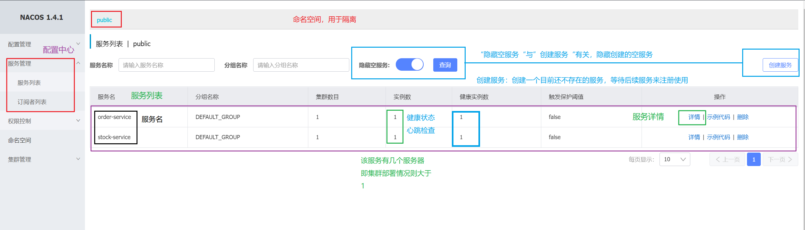

服务管理：创建空服务

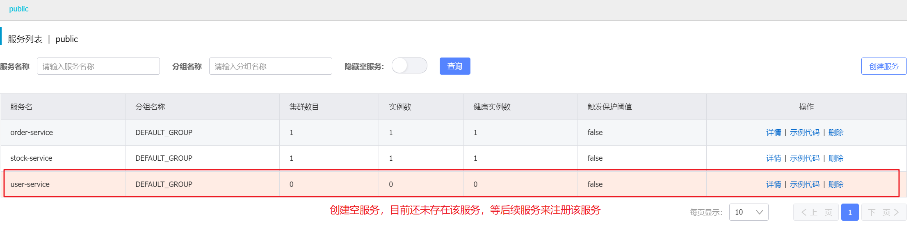

> 服务管理：服务详情

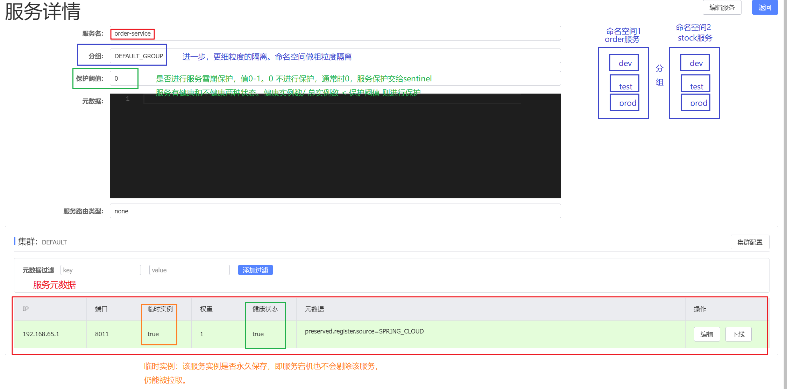

> * 临时实例：服务是否永久保存，通过spring.cloud.nacos.discovery.ephemeral=bool来设置，若永久保存则即使服务宕机也不会剔除该服务，服务拉取时仍能被拉取
> * 健康状态：服务健康状态，15s后收不到心跳，将该服务的健康状态为false，20s-30s收在不到心跳，将改服务从服务列表中剔除。健康检查演示(手动停掉服务)
> * 分组：最进一步的隔离
> * 保护阈值：是否进行服务雪崩保护，值0-1，即 健康实例 / 总实例数 < 保护阈值 则进行保护。通常不是设置因为该工作交给sentinel来处理。触发了服务将无法访问返回默认结果

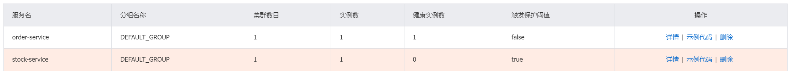

> 服务管理：订阅者列表

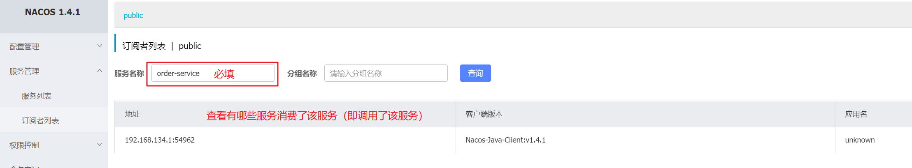

------

**权限控制**

> 对Nacos Server进行权限控制

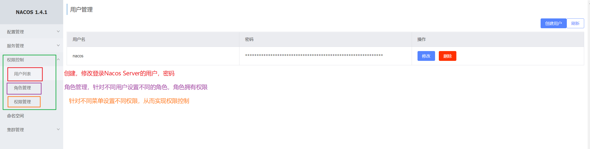


### 2.4  更多配置

| 配置项              | key                                                          | 默认值                     | 说明                                                         |
| ------------------- | ------------------------------------------------------------ | -------------------------- | ------------------------------------------------------------ |
| 服务地址            | spring.cloud.nacos.server-addr<br />spring.cloud.nacos.discovery.server-addr | 无                         | Nacos Server Ip地址和端口，<br />discovery地主之默认去去无discovery的地址值 |
| 服务名              | spring.cloud.nacos.discovery.service                         | ${spring.application.name} | 服务名                                                       |
| 服务分组            | spring.cloud.nacos.discovery.group                           | DFAULT_GROUP               | 设置服务所处的分组                                           |
| 权重                | spring.cloud.nacos.discovery.weight                          | 1                          | 取值1-100，值越大则权重越大。负载均衡                        |
| 注册的IP地址        | spring.cloud.nacos.discovery.ip                              | 无                         | 优先级最高，服务注册的IP，会自动探测                         |
| 注册的端口          | spring.cloud.nacos.discovery.port                            | -1                         | 服务注册的端口，默认不用配置，会自动探测                     |
| 命名空间            | spring.cloud.nacos.discovery.namespace                       | 无                         | 一般用于不同环境或服务的区分隔离。个人喜欢做服务隔离         |
| AccessKey           | spring.cloud.nacos.discovery.access-key                      | 无                         | 当要上阿里云时，一个阿里云的云账号                           |
| SecretKey           | spring.cloud.nacos.discovery.secret-key                      | 无                         | 阿里云账号密钥                                               |
| 日志文件名          | spring.cloud.nacos.discovery.log-name                        | 无                         |                                                              |
| 集群                | spring.cloud.nacos.discovery.cluster-name                    | DEFAULT                    | 配置成Nacos集合名称                                          |
| 接入点              | spring.cloud.nacos.discovery.enpoint                         |                            |                                                              |
| 是否集成Ribbon      | ribbon.nacos.enable                                          | true                       | 一般设置true，使用Ribbon负载均衡器                           |
| 是否开启Nacos Watch | spring.cloud.nacos.discovery.watch.enabled                   | true                       | 设置true，开启健康状态，心跳监听                             |


## 3，Nacos集群搭建


## 4，负载均衡

### 4.1 什么是Ribbon

> 目前主流的负载均衡方案分为以下两种：
>
> * 集中式负载均衡：在消费者和服务提供者放中间使用独立的代理方式进行负载均衡，如硬件（比如F5，交换机），也有软件（比如Nginx）
> * 客服端负载均衡：客服端根据自己的请求情况做负载均衡，Ribbon就属于客服端自己做负载均衡。
>
> Spring Cloud Ribbon是基于Netflix Ribbon实现的一套客服端的负载均衡工具，Ribbon提供了一系列晚上的的配置，如超时，重试等。通过Load Balanced获取服务提供的所有服务实例，Ribbon会自动基于某种规则（轮询，随机）去调用这些服务。Ribbon也可以实现我们自己的负载均衡算法。

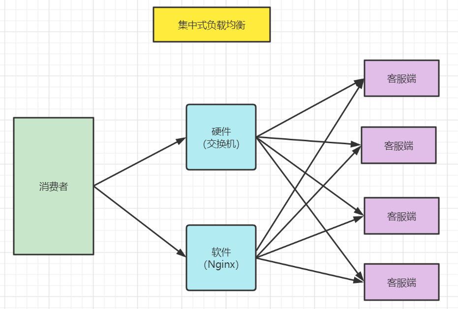

Ribbon

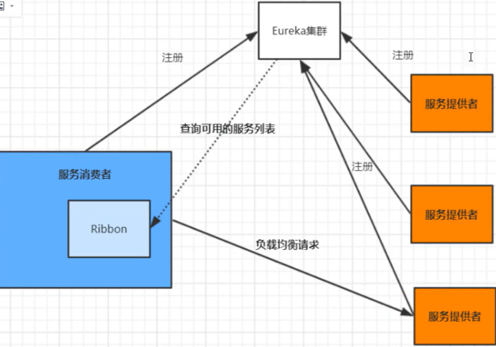


> **负载均衡算法：**
>
> * 随机：通过随机选择一台服务进行调用，一般很少用
> * 轮询：负载均衡默认实现方式，请求来了之后排队处理，轮询给各个服务器
> * 加权轮询：通过对服务器性能分析，给高配置，低负载的服务器分配更高的权重，均衡各个服务器压力
> * 地址hash：通过客服端请求的地址的hash值取模运算映射进行服务调度。ip hash
> * 最小连接数（活跃数小）：根据服务器压力进行分配

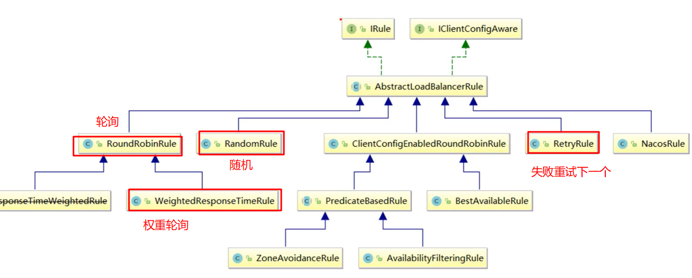

> **IRule**
>
> 这是所有负载均衡策略的父接口，里面的核心方法chose方法，用来创建一个服务实例
>
> **AbstractLoadBalancerRule**
>
> 这是一个抽象类，里面主要定义了一个LoadBalacer，就是我们所说的**负载均衡器**，主要是选择合适服务

* RandomRule：随机选择一个实例
* RoundRobinRule：轮询负载均衡
* RetryRule：重试。在某时间内选择实例，如果失败，重试获取下一个
* WeightResponseTimeRule: 权重（nacos的权重是NacosRule）
* ZoneAvoidanceRule：默认规则，复合判断server所在区域的性能和server的可用性选择服务器


### 4.2 Nacos 使用Ribbon

> Nacos Discovery 依赖集成了ribbon不需要重写导入
>
> **注意：**Ribbon是客服端负载均衡，是在服务消费方进行负载均衡，如订单服务调用库存服务，负载均衡在订单服务实现，而不是库存服务。

**1，依赖**

> 无

**2，添加@LoadBalanced注解**

```java
@Bean
@LoadBalanced
public RestTemplate restTemplate(RestTemplateBuilder builder) {
    return builder
        //.basicAuthentication("username", "password")
        // .setConnectTimeout(Duration.ofSeconds(3))
        // .setReadTimeout(Duration.ofSeconds(5))
        // .rootUri("http://api.test.com/")
        .build();
}
```

**3，restTeamplate使用服务名调用**


#### 4.2.1 修改默认负载均衡策略

**全局配置：** 调用其他服务，一律使用指定的负载均衡算法

```java
@Bean
public IRule iRule() {
    // 指定使用Nacos提供的负载均衡策略
    return new NacosRule();
}
```

> 
>
> **注意： **如果针对不同服务使用自定义的负载均衡策略，则该ribbon配置类不能写在@ConpomentScan扫描到的包，不然所有的服务都会使用相同的负载均衡策略。

```java
@Configuration
public class RibbonRulePolicyConfig {

    @Bean
    public IRule iRule() {
        return new RandomRule();
    }
}
```

启动类或者其他配置类配置服务的负载均衡策略

>  @RibbonClient属性
>
> * name：服务名，该服务要调用的远程服务名，本地服务即客服端对远程服务进行负载均衡
> * configuration：负载均衡配置类的字节码，由于该配置类不能被@ConpomentScan扫描，需要以属性配置

```java
@SpringBootApplication
@EnableDiscoveryClient
@RibbonClients(
    value = {
        @RibbonClient(name = "stock-service", configuration = RibbonRulePolicyConfig.class)
    }
)
public class OrderApplication {
    public static void main(String[] args) {
        SpringApplication.run(OrderApplication.class, args);
    }
}
```


**局部配置：**调用指定微服务提供的服务时，使用对应的负载均衡算法

修改application.yml

```yaml
# Ribbon 负载均衡策略
stock-servic: # 远程服务名，非本服务名
  ribbon:
    NFLoadBalancerRuleClassName: com.alibaba.cloud.nacos.ribbon.NacosRule
```


### 4.3 自定义负载均衡策略

> 实现IRule接口或者继承AbstractLoadBalancerRule抽象类。一般不做


## 5，SpringCloud 自己的负载均衡器LoadBalancer

> ribbon已经闭源，spring意识到这点开始了自己的负载均衡器，但是目前还无法取代，LoadBalancer目前还是太简单了，只提供一个简单的轮询策略

