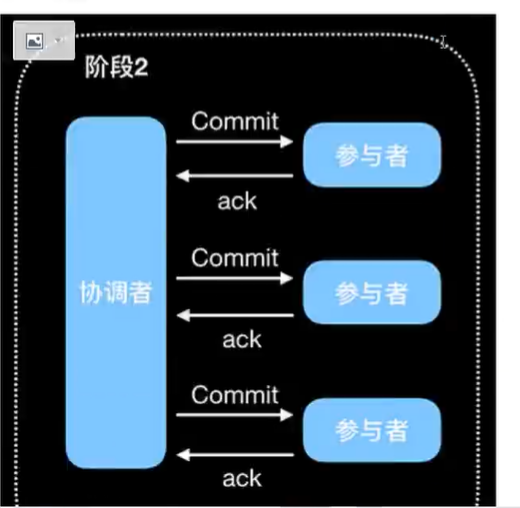

# Seata

## 1, 事务简介

### 1.1 什么是事务

> 事务（transaction）将一条或多条语句作为一个整体进行操作的功能，被称为数据库*事务*。
>
> 事务具有: 原子性，一致性，隔离性，持久性 ACID性。

**原子性（atomicity）：** 事务是一个不可分割的整体，事务中的操作要么都执行成功，要么都是失败。

**一致性(consistency)：** 事务使得数据库从一个一致性状态到另外一个一致性状态。事务操作是符号逻辑的。

**隔离性：** 一个事务的执行不能被其他事务干扰；一个事务的内部操作即中间结果对于另外一个事务而言是不可见的。

> 隔离级别：
>
> * 读未提交：可以读到未提交的数据，存在脏读（读到未提交的数据）问题。
> * 读已提交：只能读取已经提交的数据，解决脏读。
> * 可重复读：一个逻辑操作过程中连续读取结果是相同的（如：付款时先查询余额然后扣款，在扣款时就是第二次查询，两次查询结果是相同），解决虚读（连续读取结果不一致）。
> * 串行化：解决幻读（幻读：读取到不存在的数据，读取到的是新插入的）。

**持久化：** 指事务一旦提交，就持久化保存到磁盘中。


### 1.2 本地事务

**@EnableTransactionManagement**

**@Transactional**

> 大多数情况下，我的应用都只需要单一的数据库，这种请情况的事务称之为本地事务（同一个连接同一个数据库）。本地事务的ACID性是数据库提供支持的，事务都是依赖于jdbc中connection对象的。

### 1.3 分布式事务

> 只要违背了同一个连接同一个数据库那么都是分布式事务。


## 2，Seate

### 2.1 Seata是什么

> Seata是一款开源的分布式事务解决方案。Seata提供AT，TCC，SAGA和XA事务模式，为用户提供一站式的分布式解决方案。AT模式是阿里首推模式。
>
> 分布式事务的解决方案：
>
> * Seata（AT)
>
> * 消息队列 (TCC)
> * saga SAGA)
> * XA (XA)

#### 2.1.1 Seata的三大角色

在Seata的框架中，一个有三个角色：

**TC （Transaction Coordinator）- 事务协调者**

> 维护全局和分支事务的状态，驱动全局事务提交和回滚

**TM （Transaction Manager）- 事务管理器**

> 定义全局事务的范围：开始全局事务，提交或回滚全局事务

**RM（Resource Manager）-资源管理器**

> 关联分支事务的资源，与TC交谈以注册分支事务和报告分支事务状态，并驱动分支事务提交或回滚。

**其中，TC为单独部署的Server 服务端，TM和RM为嵌入到应用中的Client 客服端**


### 2.2 二阶段提交协议（2pc）

> 顾名思义，分为两个阶段：Prepare 和 Commit

**Prepare：提交事务请求**

* 参与者：可以是db或者应用，他没有规定一定是什么，2pc是一个普遍适用性的协议。该阶段参与者正处于阻塞状态


**过程：**

1. 询问：协调者向所有的参与者发送事务请求，询问是否可执行事务操作，然后等待各个参与者的响应。
2. 执行：各个事务参与者接收到协调者事务请求后，执行事务操作（例如更新），并将Undo和Redo（成功和回滚的数据）信息记录到事务日志中。
3. 响应：如果参与者成功执行了事务并写入Undo和Redo信息，则向事务协调者返回Yes响应，否则返回No响应。当然，参与者可能宕机，从而不会返回响应。


**Commit: 执行事务提交**

正常提交事务




### 2.2.2 2PC问题

* 同步阻塞
* 单点故障
* ...

## 3, AT 模式

> AT(auto transaction) 模式（自动事务）
>
> AT 模式是一种无侵入的分布式事务解决方案。
>
> 在AT模式下，用户只需要关注注解的业务SQL，用户的业务SQL作为一个阶段，Seata框架会自动生成事务的二阶段提交和回滚操作。


## 4，Seata Server 快速开始

> @GlobalTransactional

**过程：**

1. TM请求TC开启全局事务。TC会生成一个XID作为该事务的全局事务编号。XID会在微服务的调用链路中传播，包装将多个微服务的子事务关联在一起。
2. RM请求TC将本地事务注册为全局事务的分支事务，通过全局事务的XID进行关联。
3. TM请求TC告诉XID对应XID对应的全局事务是进行回滚还是提交


### 4.1 Seata Server （TC）环境搭建

https://seata.io/zh-cn/docs/overview/what-is-seata.html

> **server 端提供存储模式（store.mode)支持三种：**
>
> * file：单机模式，事务信息存储在本地
> * db：高可用模式，事务信息存储在db
>   * 打开 **/seata-1.3.0/conf/file.conf**
>   * 修改mode=db
>   * 修改数据库连接信息（MySQL >= 5.7）
>   * 创建数据库和表（sql脚本在资源目录下）
> * redis：存储在redis，存储信息丢失风险

**db存储模式 + nacos（注册&配置中心）高可用部署**

#### 4.1.1 全局事务配置信息

> **/seata-1.3.0/conf/file.conf**
>
> mode: 改为db
>
> 如果配置中心设置为nacos那么这个db设置是没有作用的。

```conf
## store mode: file、db、redis
     mode = "db"
# -------- db
## database store property
  db {    ## the implement of javax.sql.DataSource, such as DruidDataSource(druid)/BasicDataSource(dbcp)/HikariDataSource(hikari) etc.
    datasource = "druid"
    ## mysql/oracle/postgresql/h2/oceanbase etc.
    dbType = "mysql"
    driverClassName = "com.mysql.jdbc.Driver"
    url = "jdbc:mysql://127.0.0.1:3306/seata"
    user = "root"
    password = "M135472004+"
    # ...
  }

```


#### 4.1.2 创建表

> 表的信息都在资源目录（不在安装目录）

**资源目录：**（注意版本了（官网 运维指南 -> 部署 -> 新人文档 ->资源目录介绍 点击查看））

https://github.com/seata/seata/tree/1.3.0/script

* client：从农村client端sql脚本，参数配置
* config-center: 各配置中心参数导入脚本，config.txt(包含server和client，原名nacos-config.txt)为通用参数文件
* server：server端数据库脚本及各容器配置


#### 4.1.3 通信配置（注册中心和配置中心）

> TC与事务参与者要通信，怎么负载均衡等等。通过注册中心去负载均衡调用客服端即事务参与者。
>
> 其支持：file 、nacos 、eureka、redis、zk、consul、etcd3、sofa
>
> 选择nacos

**修改配置：**

> **/seata-1.3.0/conf/registry.conf**
>
> **注意：修改注册中心和配置中心两个项，都在同一个文件里**

```conf
# file 、nacos 、eureka、redis、zk、consul、etcd3、sofa
  type = "nacos"

  nacos {
    application = "seata-server"
    serverAddr = "106.14.137.179:8848"
    group = "SEATA_GROUP"
    namespace = "dev"
    cluster = "default"
    username = "nacos"
    password = "nacos"
  }
```

#### 4.1.4 配置信息注册到注册中心


> 将资源目录下的配置信息注册到注册中心。
>
> \script\config-center\config.txt
>
> 修改配置信息
>
> 允许该目录下的允许脚本
>
> seata-1.3.0\script\config-center\nacos\nacos-config.sh

service.vgroupMapping.`my_test_tx_group`=default 事务分组，做异点机房容错用到，值与注册中心配置文件的cluster一样。my_test_tx_group一般是机房地名

**把配置信息，注册到注册中心**

> 看README.md 如何push配置信息到nacos
>
> ```sh
> sh nacos-config.sh -h 127.0.0.1 -p 8848 -g SEATA_GROUP -t 57207aeb-7bd1-4fb0-90d3-74a2ec2735c3 -u nacos -w nacos
> 
> # -g 分组
> # -t 命名空间, 这个填写时要注意了
> ```


**<font color="red">注意事项：</font>**

> 1. nacos配置是，namespace使用的命名空间的hash值
> 2. seata 启动时是报错create connection SQLException errorCode 1045, state 28000 是用户名或密码错误了，检查nacos和file.conf的db配置。
> 3. seata的默认内存需要2G大小内存，可能无法启动，在启动脚本中限制内存大小

**启动时：可以指定自定义启动参数，修改端口，模式等等**


## 5，Seata Client 快速开始

**1，依赖**

```xml
<!-- nacos discovery -->
<dependency>
    <groupId>com.alibaba.cloud</groupId>
    <artifactId>spring-cloud-starter-alibaba-nacos-discovery</artifactId>
</dependency>

<!-- nacos config -->
<dependency>
    <groupId>com.alibaba.cloud</groupId>
    <artifactId>spring-cloud-starter-alibaba-nacos-config</artifactId>
</dependency>

<!-- sentinel -->
<dependency>
    <groupId>com.alibaba.cloud</groupId>
    <artifactId>spring-cloud-starter-alibaba-sentinel</artifactId>
</dependency>

<!-- OpenFeign -->
<dependency>
    <groupId>org.springframework.cloud</groupId>
    <artifactId>spring-cloud-starter-openfeign</artifactId>
</dependency>

<!-- 分布式事务seata -->
<dependency>
    <groupId>com.alibaba.cloud</groupId>
    <artifactId>spring-cloud-starter-alibaba-seata</artifactId>
</dependency>
```


**2, 各微服务对应的数据库添加undo_log表**

> 表在
>
> **\seata-1.3.0\script\client\at\db\mysql.sql**
>
> 作用：回滚日志记录

```sql
-- for AT mode you must to init this sql for you business database. the seata server not need it.
CREATE TABLE IF NOT EXISTS `undo_log`
(
    `branch_id`     BIGINT(20)   NOT NULL COMMENT 'branch transaction id',
    `xid`           VARCHAR(100) NOT NULL COMMENT 'global transaction id',
    `context`       VARCHAR(128) NOT NULL COMMENT 'undo_log context,such as serialization',
    `rollback_info` LONGBLOB     NOT NULL COMMENT 'rollback info',
    `log_status`    INT(11)      NOT NULL COMMENT '0:normal status,1:defense status',
    `log_created`   DATETIME(6)  NOT NULL COMMENT 'create datetime',
    `log_modified`  DATETIME(6)  NOT NULL COMMENT 'modify datetime',
    UNIQUE KEY `ux_undo_log` (`xid`, `branch_id`)
) ENGINE = InnoDB
  AUTO_INCREMENT = 1
  DEFAULT CHARSET = utf8 COMMENT ='AT transaction mode undo table';
```

**3，application.yaml 配置事务分组**

> 配置地域，在seata配置谁，这里就配置谁

```yaml
spring:
  cloud:
    alibaba:
      seata:
        tx-service-group: shanghai
```


**4，application.yaml中的seata client 和 seata server通信配置**

> seata client 如何知道seata server在哪里，是哪个服务。
>
> namespace(未测试是否要配)

```yaml
seata:
  registry:
    # 配置seata的注册中心，告诉seata client 怎么去访问seata server(TC)
    type: nacos
    nacos:
      # seata server(TC) 的服务名，默认seata-server
      application:
      # seata server 所在的nacos地址
      server-addr: 127.0.0.1:8848
      username: nacos
      password: nacos
      namespace: 57207aeb-7bd1-4fb0-90d3-74a2ec2735c3
      # seata server 的分组，默认 SEATA-GROUP
      group: SEATA-GROUP
  # 配置seata server的配置中心，client就可以读取server中关于client的配置
  config:
    type: nacos
    nacos:
      server-addr: 127.0.0.1:8848
      username: nacos
      password: nacos
      namespace: 57207aeb-7bd1-4fb0-90d3-74a2ec2735c3
      # seata server 的分组，默认 SEATA-GROUP
      group: SEATA-GROUP
```


**5，使用**

```java
@GlobalTransactional
public void order() {
    //...
}
```

