# Sentinel

## 1，引言

> Sentinel 主要是为了解决系统`可用性` 问题。
>
> 服务器挂掉原因：
>
> * 硬件问题
>   * 内存不够（内存溢出）
>   * 磁盘不足
>
> 开发角度思考：
>
> * **激增流量**：瞬时流量将服务器击垮（导致CPU Load飙高），服务器扛不住
>   * 如果抗住了，但是还会有问题
>     * 缓存没有预热
>     * 数据库对象还没创建
>     * 导致请求打到数据库DB，数据库服务器挂掉，服务得不到响应，拖垮服务器
> * **被其他服务拖垮**：如慢SQL 服务超时，第三发服务卡顿或网络不稳定等等，导致得不到响应，线程（请求）堆积，导致服务器被拖垮
> * **异常没处理**：如出现异常应该释放资源，若没有。导致资源耗尽服务宕机


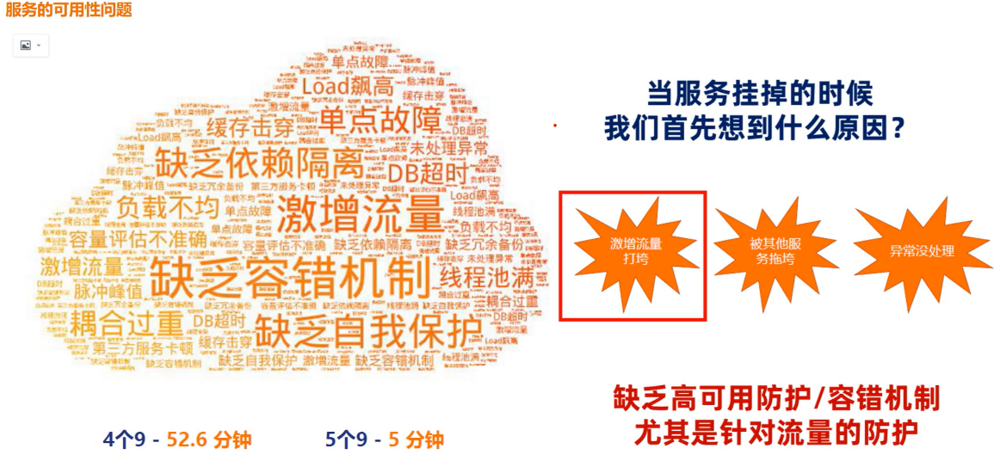


### 1.2 服务的可用性场景

> 在一个高度服务化的系统，我们实现的一个业务逻辑通常会依赖多个服务，如图：

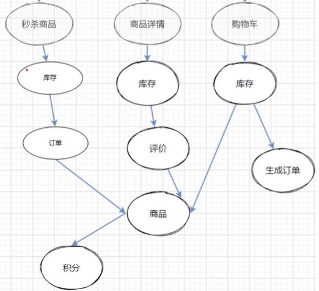


**问题**

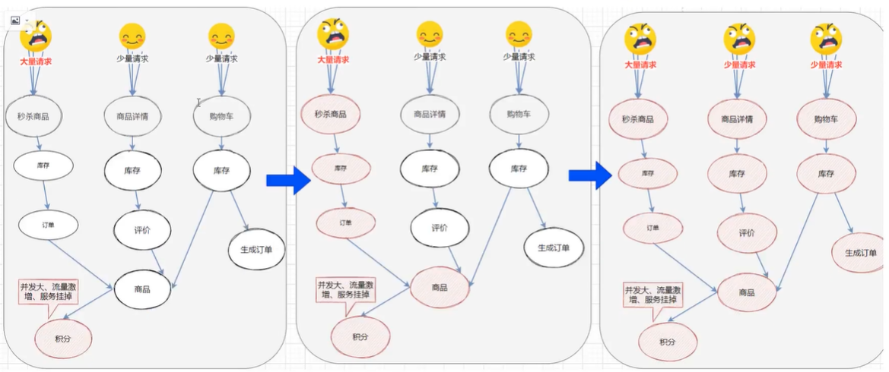

> **服务雪崩效应：**
>
> 因服务提供者的不可用导致服务调用者的不可用（不可用在调用链路上的蔓延），并将不可用逐渐放大的过程，就叫服务雪崩效应。
>
> **导致服务不可用的原因有很多，如：**

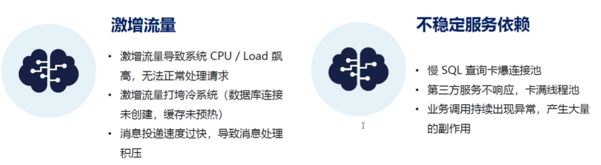


### 1.2 解决方案

> 常见的容错机制：
>
> * **超时机制**：
>
>   `在不做任何处理的情况下，服务提供者不可用会导致消费者请求线程强制等待，而造成系统资源耗尽。加入超时机制，一旦超时，就会释放资源。由于释放资源，一定程度上可以抑制资源耗尽的问题。`
>
> * **服务限流(QPS)**：(一般先进行压力测试得到一个临界值，设置这个值)根据**流量**(访问某个接口的每秒请求数)来限制
>
>   QPS（quest per secord): 每秒的请求数

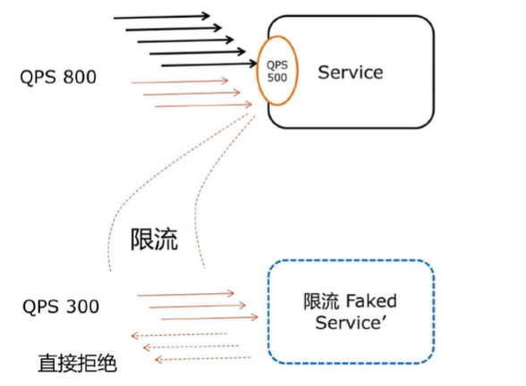

> * **线程隔离：**
>
>   > 和服务限流有点类似，而是根据**线程**数来限制的
>   >
>   > 原理：用户的请求将不再直接访问服务，而是通过线程池中的空闲线程来访问服务，如果线程池已经满了，则会进行降级处理，用户的请求不会被阻塞，至少可以看到一个执行结果（如提示信息），而不是无休止的等待或者看到系统崩溃。

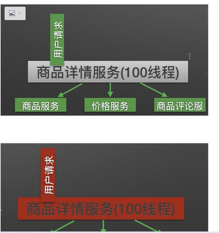


> **信号隔离（信号量）：**
>
> > 信号隔离也可以用来限制并发访问，防止阻塞扩散，与线程隔离最大不同在与执行依赖代码的线程依然时请求线程（该线程需要通过申请信号量，可以使用信号隔离替换线程隔离，降低开心）信号量大小是可以动态跳转的，线程池大小不可以。


> **服务熔断：（一般设置服务消费方）**
>
> > 就像家用保险丝一样，一旦负载过大，熔断保险丝从而保护电路。
> >
> > `服务熔断（停止访问）`：和这个差不多，当负载过大熔断调用链路。当依赖的服务有大量超时时，在让新的请求去访问这个服务（熔断）根本没有意义，只会无畏的消耗资源，此时熔断服务，没有必要让其他请求去访问这个服务，这个时候就应该使用断路器避免资源浪费(避免级联故障)。

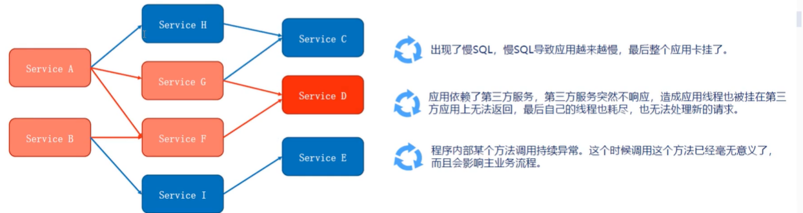

> **服务降级（弱依赖上使用，降低服务水平，一般设置服务提供方）**
>
> > 有服务熔断，必然有服务降级
> >
> > 所谓降级，就是当某个服务熔断之后，服务将不再被调用，此时客户端可以自己准备一个本地分fallback（回退）回调，返回一个缺省值。这样做，虽然服务水平下降，但好歹可用，比直接挂掉强，当然这也要看适合什么业务场景。


## 2，Sentinel 分布式流量防卫兵

### 2.1 Sentinel 是什么

> Sentinel 分布式流量防卫兵，高可用防护组件

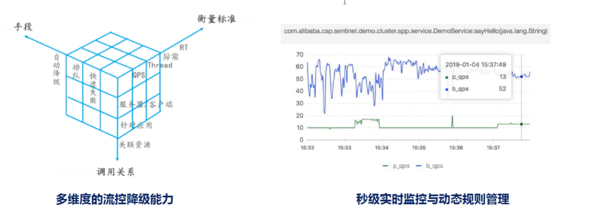


> sentinel 上层先进行流量控制 -> 整形（快速失败，预热，排队，熔断降级等）-> 熔断

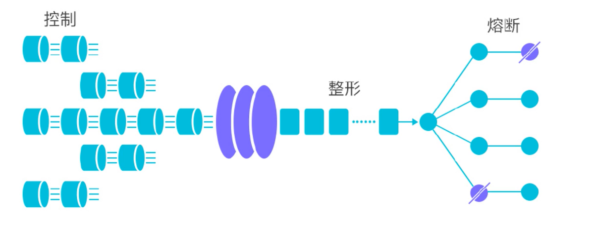

### 2.2 市面上的防护组件

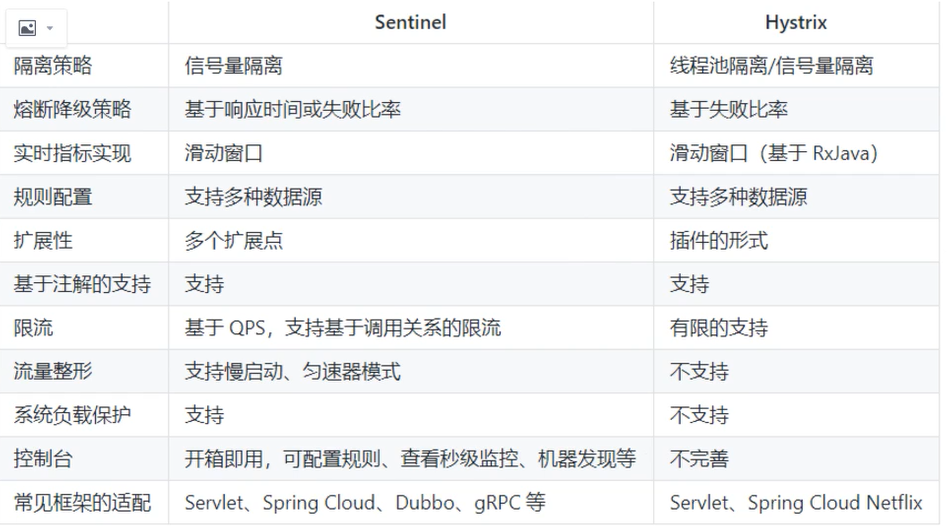


### 2.3 Sentinel 快速开始

#### 2.3.1 依赖 & 启动

**依赖**

> sentinel 可以在分布式架构中使用，不一定要在分布式中，所以不一定要整合SpringCloud，这个时候引入核心库就可以了。

```xml
<!-- sentinel -->
<dependency>
    <groupId>com.alibaba.cloud</groupId>
    <artifactId>spring-cloud-starter-alibaba-sentinel</artifactId>
</dependency>
```

**启动**

```sh
java -Dserver.port=8180 -Dcsp.sentinel.dashboard.server=localhost:8180 -Dsentinel.dashboard.auth.username=sentinel -Dsentinel.dashboard.auth.password=123456 -Dproject.name=sentinel-dashboard -jar sentinel-dashboard.jar
```


#### 2.3.2 流控规则代码演示（非微服务）

> sentinel的流控规则最终都是通过代码实现的，即使通过控制台设置，规则最终是保持在代码所在的服务内存中。这里使用分布式架构为例使用sentinel核心包进行代码的流量控制。
>
> **sentinel 的流控规则，降级规则都是针对资源（接口即资源，方法也可以是资源，接口提供了外界访问的资源，资源名默认与rest url相同）的，所以web依赖少不了**

```xml
<!-- sentinel 核心库 -->
<dependency>
    <groupId>com.alibaba.csp</groupId>
    <artifactId>sentinel-core</artifactId>
    <version>1.8.0</version>
</dependency>
<!-- 如果要使用@SentinelResource -->
<dependency>
    <groupId>com.alibaba.csp</groupId>
    <artifactId>sentinel-annotation-aspectj</artifactId>
    <version>1.8.0</version>
</dependency>
```

**代码实现：流控规则**

> 资源名自定义，默认都是与rest的url同名。
>
> 缺点: 代码侵入性太强了 -> 使用@SentinelResource注解
>
> @SentinelResource：改善接口中资源定义和被流控降级后的处理方法

```java
@RestController
public class HelloController {

    @PostConstruct
    private static void initFlowRules() {
        // 流控规则
        ArrayList<FlowRule> rules = new ArrayList<>();

        // 流控
        FlowRule rule = new FlowRule();
        // 设置受保护的资源
        rule.setResource("/hello");
        // 设置流控规则模式如：1代表-QPS(服务限流)
        rule.setGrade(1);
        // 设置收保护的资源阈值：QPS=1
        rule.setCount(1);
        rules.add(rule);

        // 加载配置好的规则
        FlowRuleManager.loadRules(rules);
    }

    @RequestMapping(value = "/hello", method = RequestMethod.GET)
    public String hello() {
        Entry entry = null;
        try {
            // 1.sentinel 针对资源进行限制
            SphU.entry("/hello");
            // 被保护的业务逻辑
            String str = "hello sentinel";
            return str;
        } catch (BlockException e) {
           return "被流控了";
        }catch (Exception e) {

        } finally {
            if (entry != null) {
                entry.exit();
            }
        }
        return null;
    }
}
```


**@SentinelResource**

> 作用：改善接口中资源定义和被流控降级后的处理方法。
>
> 怎么使用？
>
> 1. 添加依赖
> 2. 配置bean - SentinelResourceAspect
>
> 属性：
>
> value：定义资源
>
> fallback: 出现异常了（被流控）就可以交给fallback指定的方法进行处理
>
> blockHandler: 设置流控降级后的处理方法（默认该方法必须声明在接口类中, 若在其他类上使用blockHandlerClass）{
>
> ​		注意：
>
> ​		1.一定是public
>
> ​       2.返回值一定和源方法保持一致
>
> ​       3.在参数最后添加BlockException 参数(可以区分是什么规则的流控规则)
>
> }
>
> **注：** 如果fallback 和 blockHandler都被指定了blockHandler的优先级更高


**配置类：支持注解bean**

```java
@Configuration
public class BeanConfig {

    // 注解支持的配置Bean
    @Bean
    public SentinelResourceAspect sentinelResourceAspect() {
        return new SentinelResourceAspect();
    }
}
```

**使用**

```java
@PostConstruct
    private static void initFlowRules() {
        // 流控规则
        ArrayList<FlowRule> rules = new ArrayList<>();

        // 流控
        FlowRule rule = new FlowRule();
        // 设置受保护的资源
        rule.setResource("/hello");
        // 设置流控规则模式如：1代表-QPS(服务限流)
        rule.setGrade(1);
        // 设置收保护的资源阈值：QPS=1
        rule.setCount(1);
        rules.add(rule);

        // 流控
        FlowRule rule2 = new FlowRule();
        // 设置受保护的资源
        rule2.setResource("/user");
        // 设置流控规则模式如：1代表-QPS(服务限流)
        rule2.setGrade(1);
        // 设置收保护的资源阈值：QPS=1
        rule2.setCount(1);
        rules.add(rule2);

        // 加载配置好的规则
        FlowRuleManager.loadRules(rules);
    }

    @RequestMapping("/user")
    @SentinelResource(value = "/user", blockHandler = "blockHandlerGetUser")
    public String user() {
        return "hello user sentinel";
    }

    /**
     * 注意：
     * 1.一定是public
     * 2.返回值一定和源方法保持一致
     * 3.在参数最后添加BlockException 可以区分是什么规则的流控规则
     */
    public String blockHandlerGetUser(BlockException ex) {
        return "流控了";
    }
```


**降级规则: 目前没通**

```java
@RestController
public class DegradeRuleController {

    @PostConstruct
    public static void initDegradeRule() {
        ArrayList<DegradeRule> rules = new ArrayList<>();
        // 降级规则
        DegradeRule rule = new DegradeRule();
        // 设置资源
        rule.setResource("/degrade");
        // 设置降级模式: 异常数
        rule.setGrade(RuleConstant.DEGRADE_GRADE_EXCEPTION_COUNT);
        // 设置阈值：异常数
        rule.setCount(2);
        // 触发熔断的最小请求数
        rule.setMinRequestAmount(2);
        // 统计时常：在多少时间段内做的统计，默认1s
        rule.setStatIntervalMs(60 * 1000);
        // 时间窗口，熔断持续时间假设10，在时间窗口内请求接口时直接进入降级方法
        // 一定触发熔断，再次请求对应的接口就会直接调用降级方法
        // 10s过了之后，处于半开状态：恢复接口调用，如果第一次请求就出现异常，再次熔断
        rule.setTimeWindow(10);

        rules.add(rule);

        DegradeRuleManager.loadRules(rules);
    }

    @RequestMapping("/degrade")
    @SentinelResource(value = "/degrade",entryType = EntryType.IN, blockHandler = "blockHandlerForDegrade")
    public String degrade() throws InterruptedException {
        throw new RuntimeException("手动异常");
//        return "hello degrade sentinel";
    }

    public String blockHandlerForDegrade(BlockedException ex) {
        return "熔断降级";
    }
}
```


### 3，整合spring cloud

> **注意：** 如果sentinel Dashboard放在云端，可能会出现错误，如：“Failed to fetch metric from <http://192.168.134”。
>
> 可能因为本地ip不是公网IP，使用本地虚拟机尝试

#### 3.1 准备

**1. 引入依赖**

```xml
<!-- sentinel -->
<dependency>
    <groupId>com.alibaba.cloud</groupId>
    <artifactId>spring-cloud-starter-alibaba-sentinel</artifactId>
</dependency>
```

**2. 添加配置，设置Dashboard地址**

```yaml
spring:
  application:
    name: order-service
  cloud:
  	 # dashboard地址
  	 sentinel:
      transport:
        dashboard: 192.168.134.131:8180
```

> 只有访问了才会注册资源到sentinel


### 3.2 界面介绍

#### **3.2.1 实时监控**

> 监控接口的通过的QPS和拒绝的QPS

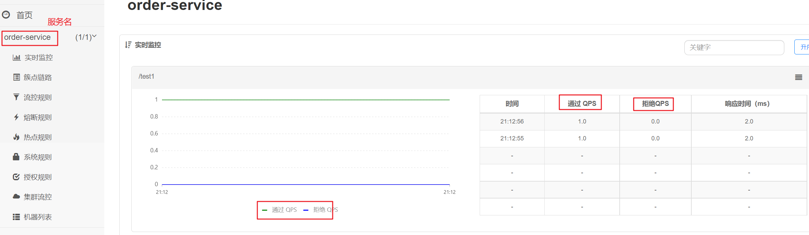

#### **3.2.2 簇点链路：流控**（服务提供端流控）

> 用来显示微服务的所监控的API
>
> 就是可以设置服务限流，服务降级的（访问接口，只有访问了才会出现）

**1. 流控规则**sentinel:
      transport:
        dashboard: 192.168.134.131:8180

> 流量控制（flow control），其原理是监控应用流量的QPS或并发线程数等指标，当达到指定的阈值时对流量进行控制，以避免被瞬时流量高峰冲垮，从而保障应用的高可用性。RT(响应时间) 1/0.2 = 5
>
> **流量控制设置在服务提供方，服务被调用，流量都集中在这里**

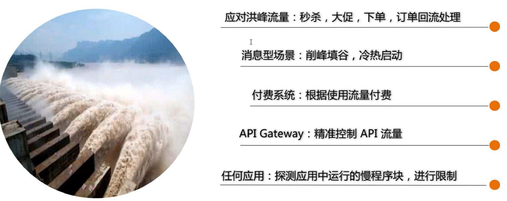

****

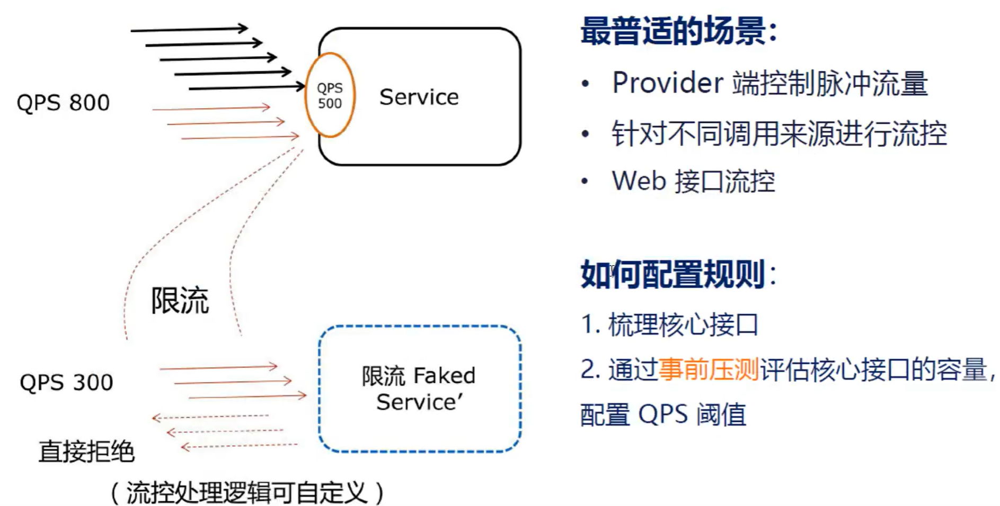


**<font color="red">2. 设置流控：服务限流QPS</font>**

> 限制服务QPS（每秒请求数）
>
> **注意：** 如果资源存在父级（存在@RequestMapper("/p1")是资源/p1/test 和 /test 读/test的流控设置只能在/test不然不生效）。
>
> 如果需要自定义失败处理或者说异常处理需要@SentinelResource注解，这个注解已经在sentinel代码实现介绍过。如果使用了@SentinelResource资源名需要自己定义，和路径一致可能导致流控失效

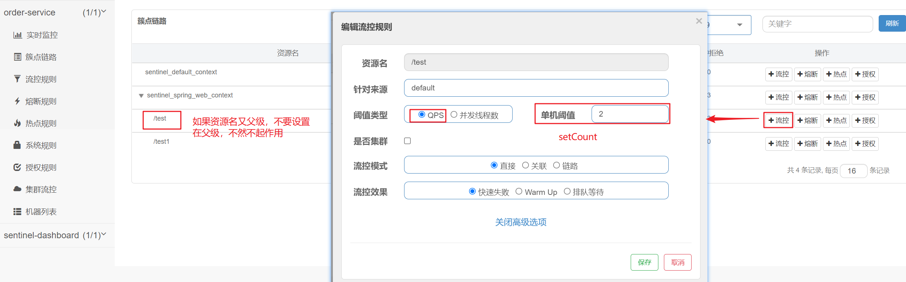


**代码实现**

>  @SentinelResource(value = "yyy", blockHandler = "xxx")
>
> 资源名value ：必须给，用"/"标识资源可能使得@SentinelResource不起作用

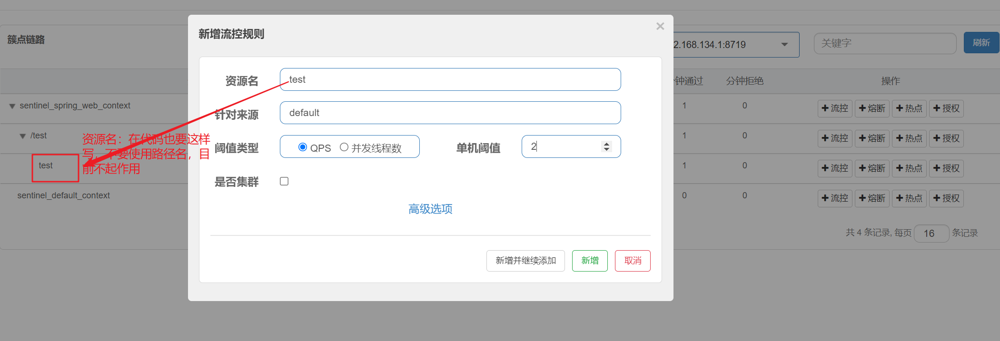

```java
@RestController
public class SentinelController {

    @GetMapping("/test")
    @SentinelResource(value = "test", blockHandler = "blockHandlerForTest")
    public String test() {
        return "hello sentinel";
    }
    // 自定义流控处理
    public String blockHandlerForTest(BlockException ex) {
        return "自定义限流处理";
    }

    @GetMapping("/test1")
    public String test1() {
        return "hello sentinel2";
    }
}
```


**<font color="red">3. 设置流控：并发线程数</font>**

> 并发数控制用于保护业务线程池不被慢调用耗尽。
>
> Sentinel并发控制不负责创建和管理线程池，而是简单统计当前请求上下文的线程数据（正在执行的调用数目），如果超出阈值，新的请求会被立即拒绝，效果类似于信号隔离。**并发数控制通常设置在调用端进行配置**
>
> 当调用**该**接口的线程数据达到（级某一时时刻的请求数即是线程数，但是请求数不一定等于线程数）达到阈值时，进行限流。


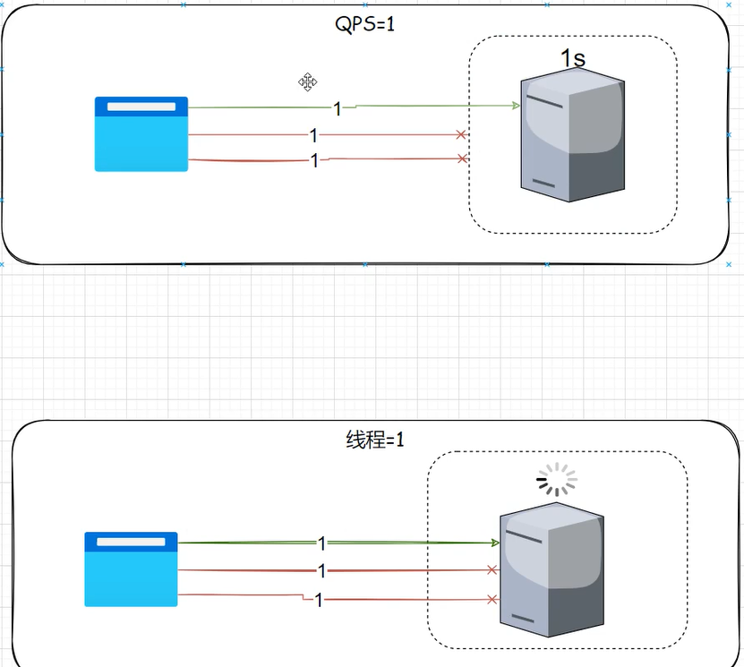

效果：（）是对/flowThread接口的资源进行并发线程数限流

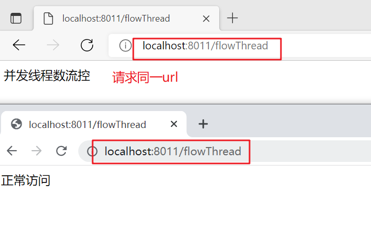

#### 3.2.2 sentinel统一异常处理

> 如果每个接口都写~~@SentinelResource~~注解处理太麻烦，可以使用统一异常处理，对限流（即异常）进行统一处理。自定义BlockExceptionHandler的实现类统一处理BlockException。
>
> 但是不能针对不同接口特定化处理，只能做通用处理返回通用结果。

```java
@Component
public class MyBlockExceptionHandler implements BlockExceptionHandler {
    log.info("日志：资源，规则信息等等")
    @Override
    public void handle(HttpServletRequest httpServletRequest, HttpServletResponse httpServletResponse, BlockException e)
        throws Exception {

        if (e instanceof FlowException) {
            System.out.println("接口服务限流");
        }
        if (e instanceof DegradeException) {
            System.out.println("服务降级");
        }
        if (e instanceof ParamFlowException) {
            System.out.println("热点参数限流");
        }
        if (e instanceof SystemBlockException) {
            System.out.println("系统保护规则");
        }
        if (e instanceof AuthorityException) {
            System.out.println("授权规则不通过");
        }
    }
}
```


#### 3.2.3 流控模式 (受流控触发方式)

##### 1. 直接模式

> 假设我们为A资源设置一个流控规则，一旦超过这个阈值受到影响的就是这个资源本身

##### 2. 关联模式

> 如果为关联模式，在当前资源给关联资源设置流控参数，当关联资源到达阈值时，**该资源才受到限流影响**。在设置B的流控规则，当B到达阈值时A受到影响，B不受影响
>
> **场景：**资源冲突场景，而且有侧重。如插入数据（下订单）和查询数据（获取商品）是相互影响，希望保证插入数据（下单）的性能，查询受到限流，则在查询资源中设置关联资源插入的流控规则

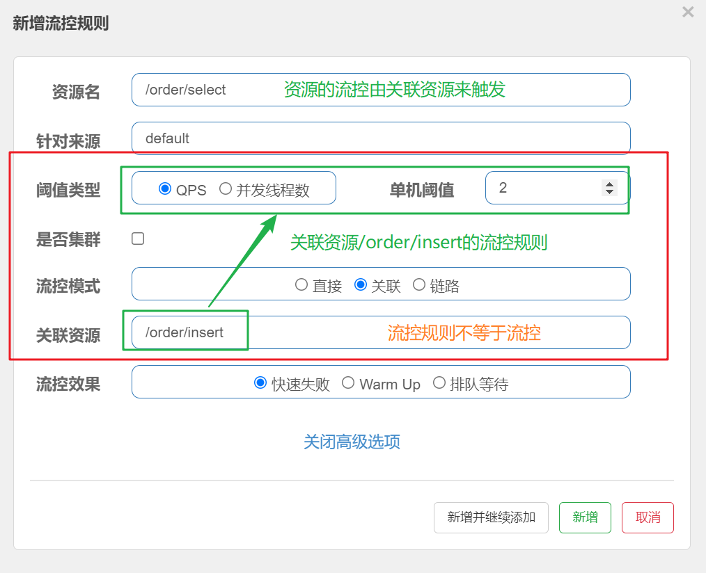

##### 3. 链路模式

> 受到影响的是调用链路的入口资源

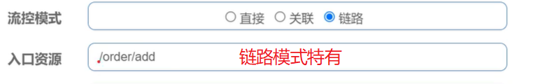


> 如下有调用链路。controller层的/order/test1和/order/test2同时都调用service层的getUser方法(/order/test1和/order/test2就是入口资源)，我们希望/order/test1受到影响，而/order/test2不受影响。
>
> **注意：流控规则不仅仅对controller层接口进行设置，对业务层同样可以设置但是需要@SentinelResource进行资源标识**
>
> **注意：高版本链路模式不起作用，因为没有维护调用链路即调用链路收敛了，需要设置**
>
> ```properties
> spring.cloud.sentinel.web-context-unify=false
> ```
>
> 


设置属性，展开链路, **对test1的进行流控**

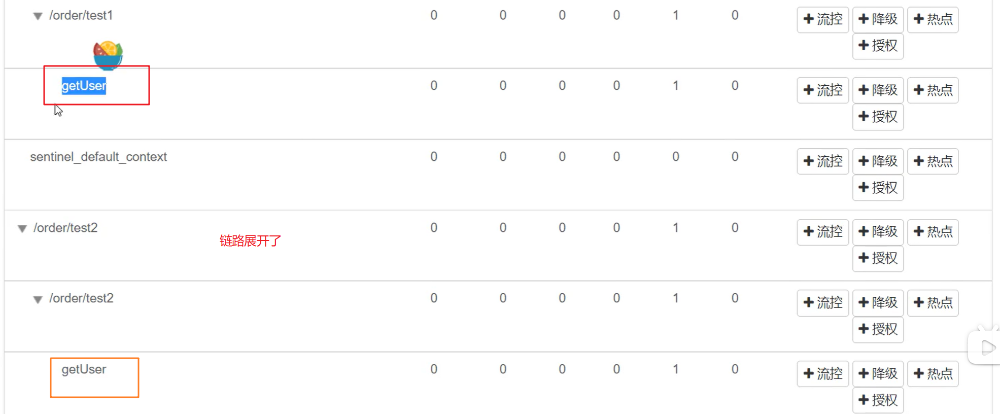


**代码：**

service

```java
@SentinelResource(value = "getUser", blockHandler = "handler")
public void getUser(){
    // 查询用户
}
```

controller

```java
@GetMapping("/order/test1")
public String test1() {
    userService.getUser();
}

@GetMapping("/order/test2")
public String test2() {
    userService.getUser();
}
```


**注意：**

* 配置属性：spring.cloud.sentinel.web-context-unify=false
* Sentinel全局异常处理是不起作用的，需要@SentinelResource指定异常处理函数
* 异常处理函数最后一个参数BlockException


##### 3.2.4 流控效果

* **快速失败**：一旦超过阈值，直接拒绝
* **Warm Up**：预热（可以设置预热时长）（请求不会被拒绝，而是在一个时间段内慢慢的被处理），这些请求递增处理例如 ：开始1秒处理5，而后1秒处理10个.....。放在激增流量打垮冷系统
* **排队等待**：超过阈值的请求排队等待处理，不会直接拒绝，但是也存在拒绝可能。加入阈值10，现在有20请求，超出的10个不会立即失败而是给出处理时常在这段时间内如果还有时间处理后续，就处理超出的另外10个。就好比我今天计划做10个任务，但是我半天就做完，那么剩余的时间去做其他任务。

##### Warm Up （预热，激增流量）

> 即预热/冷启动方式。当系统长期处于低水平的情况下，当流量突然增加时，直接把冷系统拉升到高水位可能瞬间把系统拉跨。因此，在一段时间内逐渐增加到阈值上限，给冷系统一个预热的时间，避免冷系统被压垮。
>
> **公式**：冷加载因子：codeFactor 默认是3，即请求QPS从 threadhold（阈值）/3开始，经过预热时长允许的QPS逐渐升到QPS阈值。

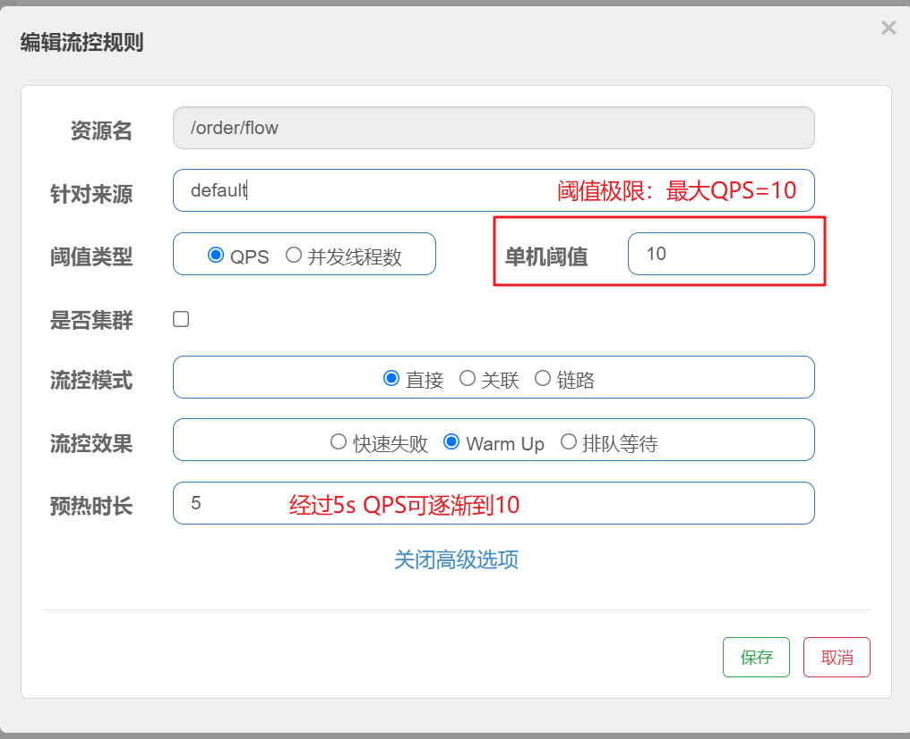


##### 排队等待 （脉冲流量）

> 针对脉冲流量
>
> 匀速排队方式会严格控制请求通过的时间间隔，也即是让请求均匀的速度经过，对应的是漏桶算法。
>
> 这种方式主要是用于处理间隔性突发的流量，如消息队列。
>
> 利用空闲时段

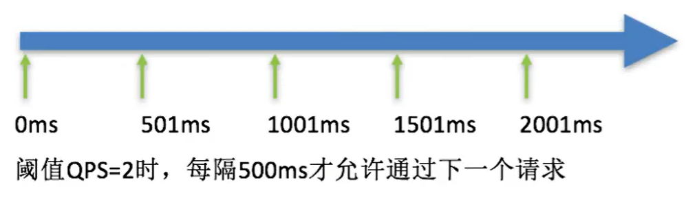

超时时间：即空闲时间，低谷水平时间

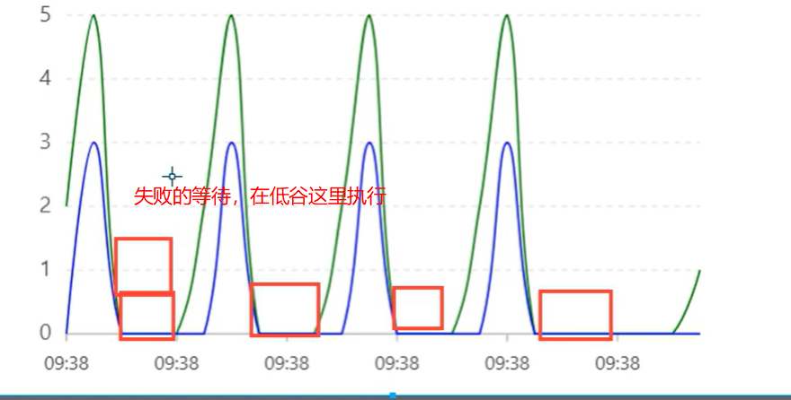


### 3.2.3 簇点链路：降级（服务消费端降级）

> 降级一般是针对弱服务依赖，都有熔断时长（等服务恢复）。
>
> 对调用链路中不稳定的资源进行熔断降级也是保障高可用的重要措施之一。我们需要对不稳定的**弱服务依赖调用**进行熔断降级，暂时性切断不稳定调用，避免局部不稳定导致整体的雪崩。熔断降级作为自身保护的受到，通常在客服端（调用端）进行配置。
>
> **保护手段：**
>
> * 并发控制（信号量隔离）
> * 基于慢调用比例熔断
> * 基于异常比例熔断
>
> **触发熔断后的处理逻辑：**
>
> * 提供fallback回调（服务降级，采用其他措施，如短信用不了，采用邮箱；数据库用不了，去缓存种去）
> * 返回result 
> * 读缓存（db访问降级）

##### 慢调用比例

> 选择以慢调用比例作为阈值，需要设置允许的慢调用RT（定义什么才是慢调用）即最大的响应时间，请求的响应时间大于该值则统计为慢调用。
>
> 1.当统计时常内请求数目大于设置的最小请求数目
>
> 2.并且慢调用的比例大于阈值
>
> 触发熔断

**注意：熔断，需要jmeter模拟，手动请求比较难**

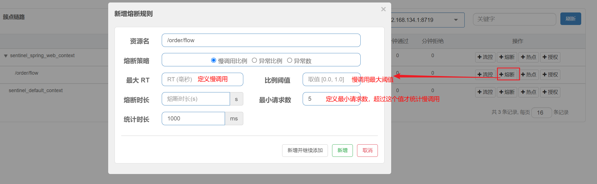


##### 异常比例

> 设置同慢调用比例


##### 异常数


## 4，Sentinel 整合OpenFeign进行降级

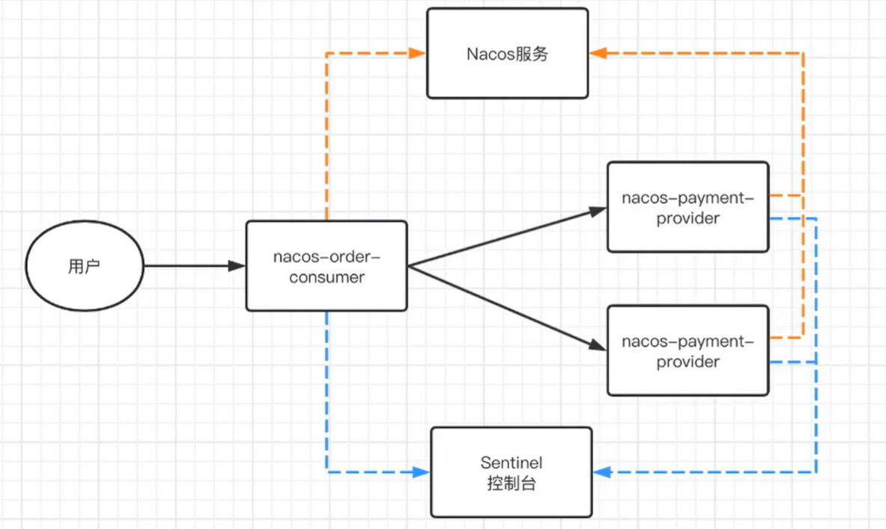

> 在远程过程调用时，如果服务提供者发生异常，会把异常结果传播给服务消费者，Sentinel 整合OpenFeign主要做的是当服务提供者发生异常时，调用失败的方法，sentinel主要是做这个。


**1，引入依赖**

```xml
<!-- sentinel -->
<dependency>
    <groupId>com.alibaba.cloud</groupId>
    <artifactId>spring-cloud-starter-alibaba-sentinel</artifactId>
</dependency>

<!-- OpenFeign -->
<dependency>
    <groupId>org.springframework.cloud</groupId>
    <artifactId>spring-cloud-starter-openfeign</artifactId>
</dependency>
```

**2,  application.yml**

```yaml
feign:
  sentinel:
    enabled: true # 添加feign对sentinel的支持
```


**3，openfeign 接口**

```java
/**
 * StockFeignServiceFallback是 StockFeignService的实现类
 */
@FeignClient(name = "stock-service", path = "/stock", fallback = StockFeignServiceFallback.class)
public interface StockFeignService {

    @GetMapping("/sub")
    String subStock();
}
```


**4, openfeign 实现类**

```java
@Component
public class StockFeignServiceFallback implements StockFeignService {

    @Override
    public String subStock() {
        return "服务降级了";
    }
}
```


## 5, 热点参数

**对应sentinel 热点参数**

> 何为热点？热点即经常访问的数据。很多时候我们希望统计某个热点数据种访问频次最高的数据，并对其进行限制。（缓存击穿）如：


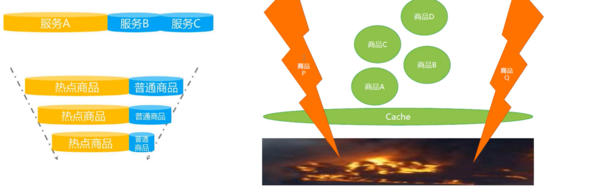

**场景 ：**

* 热点商品/数据的访问控制（防止缓存击穿）
*  防止某用户/IP恶意刷数据

**实现原理：**热点淘汰策略（LRU） + Token Bucket流控

> 热点参数限流会统计传入的热点参数，并根据配置的限流阈值与模式，对保护热点参数的资源调用进行限流。

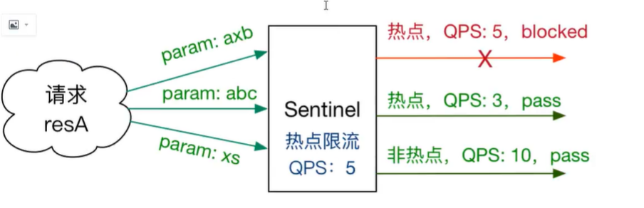

**注意：热点参数只能针对@SentinelResource进行限流，对接口限流是没有效果的**

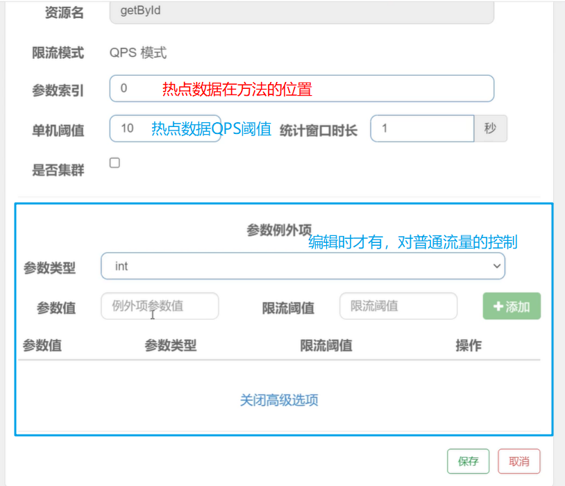

> 单机阈值：
>
> 1. 假设参数大部分值都是热点参数，那单机阈值就主要针对热点参数进行流控，后续额外对普通的参数值进行流控。
> 2. 假设大部分值都是普通流量
>
> **注意：** 热点参数必须设置blockhandler，不能将异常交给全局异常处理。


## 6，系统规则

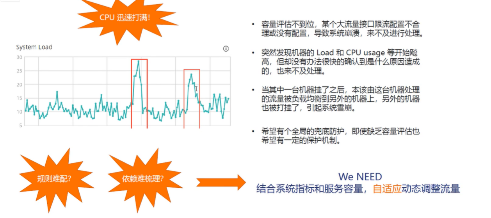
