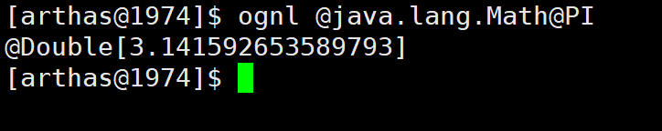

## 1. 概述概述
### Arthas（阿尔萨斯） 能为你做什么？


#####  Arthas 是Alibaba开源的Java诊断工具，深受开发者喜爱。当你遇到以下类似问题而束手无策时，Arthas可以帮助你解决：
* 1. 这个类从哪个 jar 包加载的？为什么会报各种类相关的 Exception？
* 2. 我改的代码为什么没有执行到？难道是我没 commit？分支搞错了？
* 3. 遇到问题无法在线上 debug，难道只能通过加日志再重新发布吗？
* 4. 线上遇到某个用户的数据处理有问题，但线上同样无法 debug，线下无法重现！
* 5. 是否有一个全局视角来查看系统的运行状况？
* 6. 有什么办法可以监控到JVM的实时运行状态？
* 7. 怎么快速定位应用的热点，生成火焰图？

##### Arthas支持JDK 6+，支持Linux/Mac/Winodws，采用命令行交互模式，同时提供丰富的 Tab 自动补全功能，进一步方便进行问题的定位和诊断。

## 2. 快速安装

### 2.1 在线安装

>   在线安装时，一开始下载的只是一个启动包，在启动时arthas会自动检查，把完整包下载到本地。

#### 2.1.1 linux 安装

* `下载arthas-boot.jar，然后用java -jar的方式启动：`

```shell
# 获取指定地址的资源 linux和windows都有该命令
curl -O https://alibaba.github.io/arthas/arthas-boot.jar
# 启动，若没有Java程序在运行时启动不起来的
java -jar arthas-boot.jar
```

* 如果下载速度比较慢，可以使用aliyun的镜像：
```
java -jar arthas-boot.jar --repo-mirror aliyun --use-http
```
**PS: **浏览器地址栏输入https://alibaba.github.io/arthas/arthas-boot.jar也是能下载的

**PS：**若没有Java程序在运行时，arthas启动不起来的

#### 2.1 .2 Windows 安装

**1. 在c:\下创建目录arthas，在windows命令窗口下，使用curl命令下载阿里服务器上的jar包，大小108k**


```cmd
# 获取指定地址的资源 linux和windows都有该命令
curl -O https://alibaba.github.io/arthas/arthas-boot.jar
# 启动
java -jar arthas-boot.jar
```


**2. 使用java启动arthas-boot.jar，来安装arthas，大小约10M。运行此命令会发现java进程，输入按回车。则自动从远程主机上下载arthas到本地目录**


**3. 安装的目录**

`C:\Users\Administrator\.arthas\lib\3.1.7\arthas\`

**ps：**该目录是无法更改的，默认就是该目录


#### 2.1.3 在线安装小结

*   下载arthas-boot.jar包
*   启动arthas-boot.jar，前提是必须要有java进程在运行。第一次运行会自动安装arthas

### 2.2 离线安装

>   Linux和window一摸一样

#### 1，下载url

```shell
# aiiyun仓库下载
https://maven.aliyun.com/repository/public/com/taobao/arthas/arthas-packaging/3.1.7/arthas-packaging-3.1.7-bin.zip
# github下载，自己找对应的版本
https://github.com/alibaba/arthas/releases
```

#### 2，解压

```sh
# 安装unzip，zip解压和压缩zip文件
yum install -y unzip zip
# 解压到当前目录
rm arthas-packaging-3.1.7-bin.zip 
# 或者解压到指定目录 -d
unzip xxx.zip -d xxxdir
```

#### 3，启动

```
# 普通启动
java -jar arthas-boot.jar
```
**ps：**日志存在/root/logs

#### 卸载

```shell
# arthas服务，可能不在这里
rm -rf ~/.arthas/
# arths日志，在用户目录下
rm -rf ~/logs/arthas
```
**ps：**Windows 平台直接删除user home下面的.arthas和logs/arthas目录

*   C:\Users\用户\\.arthas
*   C:\Users\用户\logs

## 3. 快速入门
1.   执行一个jar包（有Java程序在运行）

2.   通过arthas来attach粘附

3.   操作

### 1. 准备代码

>以下是一个简单的Java程序，每隔一秒生成一个随机数，再执行质因数分解，并打印出分解结果。

```java
import java.util.ArrayList;
import java.util.List;
import java.util.Random;
import java.util.concurrent.TimeUnit;

public class MathGame {
    private static Random random = new Random();
    //用于统计生成的不合法变量的个数
    public int illegalArgumentCount = 0;

    public static void main(String[] args) throws InterruptedException {
        MathGame game = new MathGame();
        //死循环，每过 1 秒调用 1 次下面的方法(不是开启一个线程)
        while (true) {
            game.run();
            TimeUnit.SECONDS.sleep(1);
        }
    }

    //分解质因数
    public void run() throws InterruptedException {
        try {
            //随机生成 1 万以内的整数
            int number = random.nextInt() / 10000;
            //调用方法进行质因数分解
            List<Integer> primeFactors = primeFactors(number);
            //打印结果
            print(number, primeFactors);
        } catch (Exception e) {
            System.out.println(String.format("illegalArgumentCount:%3d, ",
                    illegalArgumentCount) + e.getMessage());
        }
    }

    //打印质因数分解的结果
    public static void print(int number, List<Integer> primeFactors) {
        StringBuffer sb = new StringBuffer(number + "=");
        for (int factor : primeFactors) {
            sb.append(factor).append('*');
        }
        if (sb.charAt(sb.length() - 1) == '*') {
            sb.deleteCharAt(sb.length() - 1);
        }
        System.out.println(sb);
    }

    //计算number的质因数分解
    public List<Integer> primeFactors(int number) {
        //如果小于 2 ，则抛出异常，并且计数加 1
        if (number < 2) {
            illegalArgumentCount++;
            throw new IllegalArgumentException("number is: " + number + ", need >=
                    2");
        }
        //用于保存每个质数
        List<Integer> result = new ArrayList<Integer>();
        //分解过程，从 2 开始看能不能整除
        int i = 2;
        while (i <= number) { //如果i大于number就退出循环
            //能整除，则i为一个因数，number为整除的结果再继续从 2 开始
            if (number % i == 0) {
                result.add(i);
                number = number / i;
                i = 2;
            } else {
                i++; //否则i++
            }
        }
        return result;
    }
}
```

ps：jar包运行时，出现 “jar中没有主清单属性“

*   打开META-INF文件夹,看到MANIFEST.MF文件
*   添加：Main-Class: main方法所在类的全限定名称（注意有空格）

### 2. 启动 Demo

```shell
# 在命令行下执行
java -jar arthas-demo.jar
```
### 3. 启动 arthas

```sh
java -jar arthas-boot.jar
```

* 选择要粘附的进程：arthas-demo.jar


* 如果粘附成功，在arthas-demo.jar那个窗口中会出现日志记录的信息，(window记录在c:\Users\Administrator\logs目录下)


* 如果端口号被占用，也可以通过以下命令换成另一个端口号执行

```
java -jar arthas-boot.jar --telnet-port 9998 --http-port -1
```
### 4. 通过浏览器连接 arthas

>   本地运行才能web访问

Arthas目前支持Web Console，用户在attach成功之后，可以直接访问：http://127.0.0.1:3658/。

可以填入IP，远程连接其它机器上的arthas。


默认情况下，arthas只listen 127.0.0.1，所以如果想从远程连接，则可以使用 --target-ip参数指定listen的IP

## 4，入门命令

### 1. dashboard 

```sh
dashboard 
```

>    输入dashboard(仪表板)，展示当前系统的实时数据面板，按`ctrl+c`可以中断执行或者` q`。


注：输入前面部分字母，按tab可以自动补全命令

* 1. 第一部分是显示JVM中运行的所有线程：所在线程组，优先级，线程的状态，CPU的占用率，是否是后台进程等
* 2. 第二部分显示的JVM内存的使用情况
* 3. 第三部分是操作系统的一些信息和Java版本号


### 2.  thread 线程展示

>   通过 thread 命令来获取所有正在运行的线程

| 参数           | 说明                                                         |
| -------------- | ------------------------------------------------------------ |
| 数字           | 线程id，显示该线程详情                                       |
| [-n 数字]      | 打印最忙的前n个线程堆栈，如：[-n 3]                          |
| [-b]           | 找出当前被阻塞的线程，在dashboard也能看到状态，该命令有更详细的信息 |
| [-i  数字]     | 指定采用时间间隔                                             |
| [--state 状态] | 查看某状态的线程                                             |

#### 2.1 获取所有线程

```sh
# 默认
thread
# 获取最繁忙的前3个线程
thread -n 3
```


#### 2.2 获取指定线程

如获取上图main线程的，即arthas-demo进程的Main Class

```sh
# thread 数字
thread 1
```

thread 1会打印线程ID 1的栈，通常是main函数的线程。


#### 2.3 查询阻塞线程

>   有时候应用卡住了，通常是由于某个线程拿住了某个锁，并且其他线程都在等待这把锁（阻塞线程或死锁线程都会显示）。

```sh
thread -b
```


#### 2.4 查看某状态的线程 

```sh
thread --state WAITING
```


### 3， jad 反编译

>   反编译命令（java decompile），将class反编译成java。
>
>   反编绎默认情况下，反编译结果里会带有ClassLoader信息，通过--source-only选项，可以只打印源代码。方便和mc/redefine命令结合使用。
>
>   jad --source-only demo.MathGame

**参数：**

| 参数名称        |               参数说明               |
| --------------- | :----------------------------------: |
| `class-pattern` |       类名\|类的方法表达式匹配       |
| [-E]            | 开启正则表达式匹配，默认为通配符匹配 |
| > 文件路径      |  指定管道，反编译到那个目录下的文件  |

#### 反编译类

```shell
# 反编译类，并在控制台上显示
jad 包名.类名
# 反编译到文件
jad 包名.类名 > ./MathGame.java
# 只显示源代码
jad --source-only com.demo.MathGame
```


#### 反编译方法
```sh
# 格式
jad 包名.类名 方法
# 案例
jad demo.MathGame main
```


#### 补充

```sh
# 在内存中编译Hello.java为Hello.class，class文件存在内存
mc /root/Hello.java
# 可以通过-d参数，将编译的字节码输出到指定文件
mc -d /root/bbb /root/Hello.java
```

### 4. watch 方法监视

>   监视方法，可以用来监视程序在执行过程中的它的输出参数是什么，返回值是什么（类似debug）
>
>   详细内容在后面章节

```sh
watch 包名.类名 方法名 ognl表达式（指定查看的内容）[条件表达式]
```

如：通过watch命令来查看demo.MathGame#primeFactors函数的返回值


```shell
watch demo.MathGame primeFactors returnObj
```
`按 Q 或者 Ctrl + C 退出`

### 5. 退出 arthas

* 如果只是退出当前的连接，可以用quit或者exit命令(arthas还是在运行的)。Attach到目标进程上的arthas还会继续运行，端口会保持开放，下次连接时可以直接连接上。
* `如果想完全退出arthas，可以执行stop命令。`

```sh
stop
```

|  命令   | 功能  |
|  ----  | ----  |
| dashboard  | 仪表盘面板 |
| thread  | 打印线程信息 |
| jad  | 反编译 |
| watch  | 监视方法 |

## 5，辅助命令

*   help
*   cat
*   grep
*   pwd
*   cls

### 5.1，**help** 查看命令帮助信息

```sh
# 查看所有命令的帮助
help
# 查看指定命令的帮助信息，如：
thread -h
```

>   会显示出所有的arths命令，及其说明。


### 5.2，**cat** 显示文件内容

```sh
cat linux中目录下的文件
```

>**cat** 打印（显示）文件内容（路径绝对或相对路径），和linux里的cat命令类似。
>
>为什么arths会提供这个命令呢？
>
>>   为了不离开arthas控制台，去查询宿主机内某个文件的内容。
>
>注：汉字有乱码的问题如果没有写路径，则显示当前目录下的文件


### 5.3，**grep**  匹配查找

>   和linux里的grep命令类似，但它只能用于管道命令

|  参数列表   | 作用  |
|  ----  | ----  |
| -n  | number 显示行号 |
| -i  | ignore 忽略大小写来查找 |
| -m 行数 | max，最大显示行数，要与查询字符串一起使用即要带参数，如: -m 10 |
| -e "正则表达式" | 即regexp，使用正则表达式查找 |

#### 举例

```shell
# 只显示包含java字符串的行系统属性
sysprop | grep java
```


```shell
# 显示包含java字符串的行和行号的系统属性
sysprop | grep java -n
```


```shell
# 显示包含system字符串的 10 行信息
thread | grep system -m 10
```


```shell
# 使用正则表达式，显示包含 2 个o字符的线程信息
thread | grep -e "o+"
```


### 5.4，pwd 返回当前的工作目录

>   和linux命令类似。
>
>   打印的是linux的目录，是arthas所绑定java服务所在的目录
>
>   如：/usr/local/server/demo
>
>   这个目录是测试jar所在目录（其实我是在arthas目录下运行arths的）

### 5.5，cls 清屏幕

>   和linux不一样，linux是clear，但是仍可以是ctrl + l

### 5.6，session  查看会话信息

*   PID：就是依附在arthas或者说arthas正在监视的jar包程序的进程id，可以在外面使用jps查看一下两者一样。
*   SESSION_ID：会话id，是arthas绑定jar进程的会话id

 

### 5.7 reset 重置增强类

>   将被 Arthas 增强过的类全部还原，Arthas 服务端关闭（即arths服务）时会重置所有增强过的类。
>
>   类的增强：在运行的过程中，临时增加一些功能，当然它最终不会改变服务器上的类，在Arthas 服务端关闭（即arths服务）时会重置所有增强过的类。

```shell
# 还原指定类 
reset Test 
# 还原所有以List结尾的类 
reset *List 
# 还原所有的类 
reset
```
### 5.8 trace 方法追踪

>   **注意 ：**记得reset
>
>   详细看后面章节

  ```sh
  # 追踪
  trace 报名.类名 方法
  # 停止追踪
  reset
  ```

>   追踪方法信息：
>
>   ```txt
>   ts=2022-03-27 02:09:12;thread_name=main;id=1;is_daemon=false;priority=5;TCCL=sun.misc.Launcher$AppClassLoader@42a57993
>   ---[0.213361ms] com.demo.MathGame:print()
>   ```
>
>   *   ts：线程开始时间
>   *   thread_name：线程的名字
>   *   is_daemon：是否是后台进程
>   *   priority：优先级
>   *   AppClassLoader：类加载器
>   *   ---[0.213361ms] com.demo.MathGame:print()：执行所消耗的时间


### 5.9，version 

>   输出当前目标java进程所加载的arthas版本号

### 5.10，history 打印命令历史

>   打印自己所有输入的arths命令，记录犯罪线程。

  

### 5.11，quit 退出Arthas 

>   退出当前 Arthas 客户端，其他 Arthas 客户端不受影响（即监控其他jar进程的arthas服务不受影响）。

### 5.12，stop 关闭 Arthas 服务端

>   stop 关闭 Arthas 服务端，所有 Arthas 客户端全部退出。

 

### 5.13，keymap Arthas快捷键列表及自定义快捷键

  

##### Arthas 命令行快捷键
快捷键说明|命令说明
--|:--:
ctrl + a|跳到行首（同linux）
ctrl + e|end，跳到行尾（同linux）
ctrl + f|forward，向前移动一个单词
ctrl + b|back，向后移动一个单词
键盘左方向键|光标向前移动一个字符
键盘右方向键|光标向后移动一个字符
键盘下方向键|下翻显示下一个命令
键盘上方向键|上翻显示上一个命令
~~ctrl + h~~ |向后删除一个字符(无意义)
~~ctrl + shift + /~~| 向后删除一个字符(无意义) 
ctrl + u |撤销上一个命令，相当于清空当前行同(linux）
~~ctrl + d~~ |删除当前光标所在字符
ctrl + k |删除当前光标到行尾的所有字符(linux）
~~ctrl + i~~ |自动补全，相当于敲TAB
~~ctrl + j~~ |结束当前行，相当于敲回车
~~ctrl + m~~ |结束当前行，相当于敲回车

* 任何时候 tab 键，会根据当前的输入给出提示
* `命令后敲 “空格 ”或 “空格 +空格 ” ，然后按 tab 键，可以展示出此命令具体的选项。`

**后台异步命令相关快捷键：**

* ctrl + c: 终止当前命令
* ctrl + z: 挂起当前命令，后续可以 bg/fg 重新支持此命令，或 kill 掉
* ctrl + a: 回到行首
* ctrl + e: 回到行尾

## 6，其他命令

### 6.1 jvm 相关

> jvm 查看当前 JVM 的信息

 
#### THREAD 相关

* COUNT: JVM当前活跃的线程数
* DAEMON-COUNT: JVM当前活跃的守护线程数
* PEAK-COUNT: 从JVM启动开始曾经活着的最大线程数
* STARTED-COUNT: 从JVM启动开始总共启动过的线程次数
* DEADLOCK-COUNT: JVM当前死锁的线程数

#### FILE-DESCRIPTOR

>   文件描述符相关

* MAX-FILE-DESCRIPTOR-COUNT：JVM进程最大可以打开的文件描述符数
* OPEN-FILE-DESCRIPTOR-COUNT：JVM当前打开的文件描述符数

### 6.2，sysprop  查看和修改JVM系统属性

>   一般不修改，只查看。
>
>   **查看当属性：**
>
>   ```sh
>   sysprop 属性
>   ```
>
>   **修改属性：**
>
>   ```sh
>   sysprop 属性名 属性值
>   ```
>
>   

```shell
# 查看所有属性
sysprop
```

```shell
# 查看单个属性，支持通过tab补全
sysprop java.version
```

```shell
# 修改单个属性
sysprop user.country

sysprop user.country CN
```


### 6.3，sysenv  查看当前JVM的环境属性

>   环境是linux环境。

```shell
# 查看所有属性
sysenv
# 查看单个环境变量,
sysenv USER
```


### 6.3，vmoption  查看，更新JVM相关参数

**举例：**

```shell
# 查看所有的选项
vmoption
# 查看指定的选项
vmoption PrintGCDetails
```


```shell
# 更新指定的选项
vmoption PrintGCDetails true
```


### 6.4，getstatic  查看类的静态属性

```sh
getstatic 包名.类名 属性名
```

>   通过getstatic命令可以方便的查看类的静态属


## 7，ognl  表达式

**参数说明:**

参数名称|参数说明
--|:--:
‘express’|执行的表达式
[c:]|执行表达式的 ClassLoader 的 hashcode，默认值是SystemClassLoader
[数字]|结果对象的展开层次，默认值1，不要太高

**举例**

```shell
# 调用静态函数
ognl '@java.lang.System@out.println("hello")'
# 获取静态类的静态字段
ognl '@demo.MathGame@random'
# 执行多行表达式，赋值给临时变量，返回一个List
ognl '#value1=@System@getProperty("java.home"),
#value2=@System@getProperty("java.runtime.name"), {#value1, #value2}'
```

>   ognl，全称 Object Graphic Navigation Language(对象图导航语言)，根据约定的一些简单的规则，组装一个利于阅读、可执行的表达式语句。

### 7.1 ognl语法基础

#### 7.1.1 对象定位

>   java 中，一切都是对象，所以我们的 ognl 表达式必然是着手于某一个对象的，通常在 ognl 中，可以将待执行目标对象划分为三类.
>
>   *   简单对象：(如基本数据类型，String)
>   *   非简单对象：(非简单对象，实例访问)
>   *   静态对象：(静态类)
>
>   这三种类型，根据`不同开头`来标记。
>
>   **ps:** `ognl是可执行的表达式`

##### 静态对象

访问静态类的某个方法（或者静态类的成员）

>   **语法规则**：根据`@`开始，后面接上完整的类名

###### **访问静态方法：**

`@`开始，后面接上完整的类名@方法名+参数

```ognl
ognl @包名.类名@方法名(参数)
```

```ongl
ognl @java.lang.Math@max(10,20)
```


###### **访问静态属性：**

@开头，对象与成员之间用@连接

```ognl
ognl @包名.类名@属性
```

```ognl
ognl @java.lang.Math@PI
```



##### 非简单对象

即一般的实例对象。

访问一个普通对象的成员 or 方法以#开头。

**语法规则：**`#`开头，后面为对象名

**注意：**这个对象需要在 Ognl 的上下文中，且可以根据对象名可以唯一定位。

###### 访问实例方法：

其依赖于上下文，想访问某个实例，怎么保证其还存活呢

```ognl
ognl #对象名.方法名(参数)
# 案例
ognl #obj.method( 参数 )
```

###### 访问实例：

```ognl
ognl #实例名
```

##### 简单对象

###### 访问实例方法：

```ognl
# 字符串的长度
ognl "name".length()
```

###### 访问实例：

```ognl
// 数字计算
1+2
// boolean
true
// 基本对象的成员访问，和非基本对象成员方式一致
"name".hash
```

### 7.2 集合支持

ognl 针对常用的集合进行了特殊的支持

#### List

通过{}创建列表，通过[]来访问对象下标的元素

**案例：**下面表示创建一个列表，有三个元素: 1,2,3; 获取列表中下标为 2 的元素

````ognl
{1, 2, 3}[2]
````

#### Arrays

数组，可以结合 new 来使用

```ognl
new int[] {1,2,3}
```

#### Map

 \#{k:v, k:v} 方式来创建 map

**案例：**下面的语句，表示创建一个 map，并获取其中 key 为 name 的元素

```ognl
#{ "name" : "一灰灰Blog", "age" :  18}["name"]
```

### 7.3 表达式语句

前面是一些简单的，基本的成员访问，方法调用，除此之外还存在更牛逼的用法，支持表达式的执行.

#### **成员赋值**

```ognl
#demo.name = "一灰灰blog"
```

#### **表达式计算**

```ognl
500 + 20 - 30 * 3
```

#### **三目运算符**

```ognl
"name".length() % 2 == 0 ? "偶数长度" : "奇数长度"
```

#### **集合支持**

```ognl
// in 语句，判断列表中是否包含
"name" in {"name", "hello"}
// 遍历集合，获取所有的偶数
{1,2,3,4,5,6}.{? #this % 2 == 0}
// 遍历集合，获取第一个满足条件的元素
{1,2,3,4,5,6}.{^ #this % 2 == 0}
// 遍历集合，获取最后一个满足条件的元素
{1,2,3,4,5,6}.{$ #this % 2 == 0}
```

#### **对象创建**

可以直接通过 new 来创建一个对象，当我们需要执行的目标方法的参数为非基本类型时，可能会非常好用

```javascript
// new + 完整的类名
new java.lang.String("hello world")
```

## 8，class/classloader相关

>*   sc ：“Search-Class” 的简写，查看JVM已加载的类的信息。
*   sm：”Search-Method“的简写，搜索方法。

### 8.1 sc 搜索类

>   默认开启了子类匹配功能，其子类也会被搜索出来。

参数名称|参数说明
---|:--:
`class-pattern` |类名表达式匹配，支持全限定名，如com.taobao.test.AAA，也支持com/taobao/test/AAA格式.
`method-pattern` |方法名表达式匹配
[-d] |输出当前类的详细信息，包括这个类所加载的原始文件来源、类的声明、加载的 ClassLoader等详细信息.
[-E] |regexp 开启正则表达式匹配，默认为通配符匹配
[-f] |field 输出当前类的成员变量信息（需要配合参数-d一起使用）

**举例:**

```shell
# 模糊搜索，demo包下所有的类
sc com.demo.*
# 正则
sc -d demo.MathGame
```


```shell
# 打印出类的Field信息
sc -df demo.MathGame
```


### 8.2 sm 搜索方法

>   ”Search-Method“的简写，搜索方法。但是sm 命令只能看到由当前类所声明 (declaring) 的方法，父类则无法看到。
>
>   这些属性和方法都能看到了。

**参数说明：**

参数名称|参数说明
---|:--:
`class-pattern` |类名表达式匹配
`method-pattern` |方法名表达式匹配
[-d] |展示每个方法的详细信息
[-E] |开启正则表达式匹配，默认为通配符匹配

**案例：**

```shell
# 显示String类加载的方法
sm java.lang.String
```


```shell
# 显示String中的toString方法详细信息
sm -d java.lang.String toString
```


### 8.3 jad反编译

*   jad：反编译
*   mc：编译
*   redefin：把新生成的字节码文件在内存中执行

这几个组合完成了一个功能

>   看4章，第3节。

### 8.4 mc 编译

>   mc（Memory Compiler）：内存编译器，编译.java文件成.class文件

```sh
mc java文件路径
# 指定编译后文件所在目录
mc -d 目录 .java文件路径
```

**案例**

```sh
mc /root/Hello.java
```


默认.class输出到arthas的安装目录下

### 8.5 redefine 加载外部.class文件

>   arthas已经支持编译mc，反编译jad，有什么用呢？
>
>   redefine 加载外部.class文件，redefine到JVM里

* **注意：** redefine后的原来的类不能恢复，redefine有可能失败（比如增加了新的field或method），参考jdk本身的文档。
* `reset命令对redefine的类无效`，如果想重置，需要redefine原始的字节码。
* redefine命令和jad/watch/trace/monitor/tt等命令会冲突。执行完redefine之后，如果再执行上面提到的命令，则会把redefine的字节码重置。

####  redefine 限制

* 不允许新增field/method
* 正在跑的函数，没有退出不能生效，比如下面新增加的System.out.println，只有run()函数里的会生效


```java
public class MathGame {

public static void main(String[] args) throws InterruptedException {
    MathGame game = new MathGame();
    while (true) {
        game.run();
        TimeUnit.SECONDS.sleep( 1 );
        // 这个不生效，因为代码一直跑在 while里
        System.out.println("in loop");
    }
}

public void run() throws InterruptedException {
// 这个生效，因为run()函数每次都可以完整结束
System.out.println("call run()");
        try {
            int number = random.nextInt();
            List<Integer> primeFactors = primeFactors(number);
            print(number, primeFactors);
        } catch (Exception e) {
            System.out.println(String.format("illegalArgumentCount:%3d, ",
            illegalArgumentCount) + e.getMessage());
        }
    }
}
```
### 8.6 结合 jad/mc 命令使用
```shell
# 1. 使用jad反编译demo.MathGame输出到/root/MathGame.java
jad --source-only demo.MathGame > /root/MathGame.java
```

```shell
#2.按上面的代码编辑完毕以后，使用mc内存中对新的代码编译
mc /root/MathGame.java -d /root
```

```shell
# 3.使用redefine命令加载新的字节码
redefine /root/demo/MathGame.class
```


### 8.7 dump 保存字节码

将已加载类的字节码文件保存到特定目录，默认：logs/arthas/classdump/

**参数：**

参数名称|参数说明
---|:--:
class-pattern| 类名表达式匹配
[-c:] |类所属 ClassLoader 的 hashcode
[-E] |开启正则表达式匹配，默认为通配符匹配
**举例：**

```shell
# 把String类的字节码文件保存到~/logs/arthas/classdump/目录下
dump java.lang.String
```

```shell
# 把demo包下所有的类的字节码文件保存到~/logs/arthas/classdump/目录下
dump demo.*
```


### 8.8 classloader

*   显示所有类加载器信息
*   获取某个类加载器所在的jar包
*   获取某个资源在哪个jar包
*   加载某个类：类已经更新了能否重新加载？

>   查看类加载器相关信息。

* 1. classloader 命令将 JVM 中所有的classloader的信息统计出来，并可以展示继承树，urls等。
* 2. 可以让指定的classloader去getResources，打印出所有查找到的resources的url。对于ResourceNotFoundException异常比较有用。

**参数说明：**

参数名称|参数说明
---|:--:
[-l] |统计类加载器加载类的个数
[-t] |tree 打印所有ClassLoader的继承树
[-a] |列出所有ClassLoader加载的类，请**谨慎**使用
[-c hash码] |ClassLoader的hashcode
[-c hash码 -r 资源路径] |用ClassLoader去查找resource
[-c hash码 --load 资源路径] |用ClassLoader去加载指定的类

**案例**


```shell
# 按类加载类型查看统计信息
classloader
```


```shell
# 按类加载实例查看统计信息，可以看到类加载的hashCode
classloader -l
```


```shell
# 查看ClassLoader的继承树
classloader -t
```


```shell
# 通过类加载器的hash，查看此类加载器实际所在的位置
classloader -c 680f2737
```


```shell
# 使用ClassLoader去查找指定资源resource所在的位置
classloader -c 680f2737 -r META-INF/MANIFEST.MF
```


```shell
# 使用ClassLoader去查找类的class文件所在的位置
classloader -c 680f2737 -r java/lang/String.class
```


```
使用ClassLoader去加载类
classloader -c 70dea4e --load java.lang.String
```


## 9，monitor/watch/trace/stack相关

### 9.1 monitor 方法调用统计

>   用来监视一个时间段中指定方法的执行次数，成功次数，失败次数，耗时等这些信息。
>
>   监控指定类中方法执行情况，其是非实时监视的，其是不断的等待目标 Java 进程返回信息，直到用户输入 Ctrl+C 为止。

**参数说明**

方法拥有一个命名参数 [c:]，意思是统计周期（cycle of output），拥有一个整型的参数值

参数名称|参数说明
---|:--:
`class-pattern` |类名表达式匹配
`method-pattern` |方法名表达式匹配
[-E] |开启正则表达式匹配，默认为通配符匹配
[-c 数字] |cycle 统计周期，默认值为120秒

**案例：**

```shell
# 过 5 秒统计一次，统计类demo.MathGame中primeFactors方法
monitor -c 5 demo.MathGame primeFactors
```


**监控的维度说明**

监控项|说明
---|:--:
timestamp |时间戳
class |Java类
method |方法（构造方法、普通方法）
total |调用次数
success |成功次数
fail |失败次数
rt |平均耗时
fail-rate |失败率

### 9.2 watch 实时观察方法调用

>watch命令： 观察指定方法的调用情况。
>能观察到的范围：`入参` 、`返回值`、`抛出异常`、`出参`,通过编写OGNL 表达式进行对应变量的查看。
>
>出参：方法的入参传入后，在方法内部可能被修改，在方法出去后其与入参时不一样了。
```sh
watch 包名.类名 方法名 ognl表达式 [其他参数]
```

watch 的参数比较多，主要是因为它能在 4 个不同的场景观察对象

**参数**

参数名称|参数说明
---|:--:
class-pattern |类名表达式匹配
method-pattern |方法名表达式匹配
`{express}` |观察表达式(最重要，一般为ognl表达式)
`condition-express` |条件表达式
[-b] |before 在方法调用之前观察
[-e] |exception 在方法异常之后观察
[-s] |success 在方法返回之后观察
[-f] |finish 在方法结束之后 (正常返回和异常返回)观察
[-E] |regexp 开启正则表达式匹配，默认为通配符匹配
[-x 数字] |指定输出结果的遍历深度，默认为 1
[-n 数字] |观察指定方法，只显示n次

**这里重点要说明的是观察表达式，观察表达式的构成主要由ognl 表达式组成，所以你可以这样写"{params,returnObj}"，只要是一个合法的 ognl 表达式，都能被正常支持。**

#### 特别说明

* watch 命令定义了4个观察事件点，默认打开-f ，即 
    * -b 方法调用前
    * -e 方法异常后
    * -s 方法返回后
    * -f 方法结束后

* 这里要注意方法入参和方法出参的区别，有可能在中间被修改导致前后不一致，除了 -b 事件点params 代表方法入参外，其余事件都代表方法出参。
* 当使用 -b 时，由于观察事件点是在方法调用前，此时返回值或异常均不存在。

#### watch 中ognl使用

>   ognl在watch中使用，watch是观察指定方法的调用情况，所以ognl表达式描述的是这个“方法”，如：入参params，返回值retureObj
>
>   *   params：代表入参是一个数组（不知道就用其）
>
>   *   retureObj：代表返回值，一般和-x 一起用
>   *   target：表示执行方法的对象（当前调用该方法的对象）
>
>   单个：“params”
>
>   多个：“{params, target, retutnObj}”

##### 1. 方法出参和返回值 

```shell
# 观察demo.MathGame类中primeFactors方法出参和返回值，结果遍历深度为 2
# params表示所有参数数组，returnObject表示返回值
watch demo.MathGame primeFactors "{params,returnObj}" -x 2
```


##### 2. 观察方法入参

```shell
# 对比前一个例子，返回值为空（事件点为方法执行前，因此获取不到返回值）
watch demo.MathGame primeFactors "{params,returnObj}" -x 2 -b
```


##### 3.观察方法调用前和方法返回

```shell
# 参数里-n 2，表示只执行两次。结果中，
# 第一次输出的是方法调用前的观察表达式的结果，
# 第二次输出的是方法返回后的表达式的结果
watch demo.MathGame primeFactors "{params,target,returnObj}" -x 2 -b -s -n 2
```


##### 4. 观察当前对象中的属性

```shell
# 如果想查看方法运行前后，当前对象（调用该方法的对象）中的属性，可以使用target关键字，代表当前对象
watch demo.MathGame primeFactors 'target'
```


##### 5. 访问当前对象的某个属性

```shell
# 使用target.field_name访问当前对象的某个属性
watch demo.MathGame primeFactors 'target.illegalArgumentCount'
```


##### 6. 条件表达式-条件观察

符号条件表达式的才会被watch观察

```shell
# 条件表达式的例子，输出第 1 参数小于的情况
watch demo.MathGame primeFactors "{params[0],target}" "params[0]<0"
# 是java的条件
watch com.demo.web.controller.DemoController getR "{params,target, returnObj}" "params[0].equals('1111')"  -b -s -x 2
```


### 9.3 trace 

>用于对方法内部调用路径进行追踪，并输出方法路径上的每个节点上耗时。
>
>trace 命令能主动搜索 class-pattern／method-pattern 对应的方法调用路径，渲染和统计整个调用链路上的所有性能开销和追踪调用链路。
>
>**观察表达式**主要由ognl 表达式组成，如："{params,returnObj}"。
>
>很多时候我们只想看到某个方法的rt大于某个时间之后的trace结果，现在Arthas可以按照方法执行的耗时来进行过滤了，例如trace *StringUtils isBlank '#cost>100'表示当执行时间超过100ms的时候，才会输出trace的结果。
>
>watch/stack/trace这个三个命令都支持#cost

**参数说明**

参数名称|参数说明
---|:--:
class-pattern |类名表达式匹配
method-pattern |方法名表达式匹配
 express           |       观察表达式(ognl 表达式)        
 condition-express |              条件表达式              
 [-E]              | 开启正则表达式匹配，默认为通配符匹配 
 [-n 数字]         |             命令执行次数             
#cost |方法执行耗时
#### 观察指定方法

*   thread_name：线程名字
*   thread_name
*   priority

```shell
# trace函数指定类的指定方法
trace demo.MathGame run
```


```shell
# 如果方法调用的次数很多，那么可以用-n参数指定捕捉结果的次数。比如下面的例子里，捕捉到一次调用就退出命令。
trace demo.MathGame run -n 1
```


```shell
# 默认情况下，trace不会包含jdk里的函数调用，如果希望trace jdk里的函数，需要显式设置--skipJDKMethod false。
trace --skipJDKMethod false demo.MathGame run
```


#### 耗时过滤

```shell
# 据调用耗时过滤，trace大于0.5ms的调用路径
trace demo.MathGame run '#cost > .5'
```


#### 正则

```shell
# 可以用正则表匹配路径上的多个类和函数，一定程度上达到多层trace的效果。
trace -E com.test.ClassA|org.test.ClassB method1|method2|method3
```
### 9.4 stack

>输出当前方法被调用的调用路径(和trace似乎相反)。
>
>很多时候我们都知道一个方法被执行，但这个方法被执行的路径非常多，或者你根本就不知道这个方法是从那里被执行了，此时你需要的是 stack 命令。

### 参数说明

参数名称|参数说明
---|:--:
class-pattern |类名表达式匹配
method-pattern |方法名表达式匹配
condition-express |条件表达式
[-E] |开启正则表达式匹配，默认为通配符匹配
[-n 数字] |执行次数限制

```shell
# 获取primeFactors的调用路径
stack demo.MathGame primeFactors
```


```shell
# 条件表达式来过滤，第 0 个参数的值小于 0 ，-n表示获取 2 次
stack demo.MathGame primeFactors 'params[0]<0' -n 2
```


```shell
# 据执行时间来过滤，耗时大于 5 毫秒
stack demo.MathGame primeFactors '#cost>5'
```


## 10，tt 


> time-tunnel 时间隧道,记录下指定方法每次调用的`入参和返回信息`(类似watch)，并能对这些不同时间下调用的信息进行观测

* watch 虽然很方便和灵活，但需要提前想清楚`ognl`观察表达式的拼写，这对排查问题而言要求太高，因为很多时候我们并不清楚问题出自于何方，只能靠蛛丝马迹进行猜测。
* 这个时候如果能记录下当时方法调用的所有入参和返回值、抛出的异常会对整个问题的思考与判断非常有帮助。
* 于是乎，TimeTunnel 命令就诞生了。

**参数解析**

tt的参数|说明
---|:--:
-t |记录某个方法在一个时间段中的调用
-l |显示所有已经记录的列表
-n +次数 |只记录多少次（防止VM 内存撑爆）
-s +表达式 |搜索表达式
-i +索引号 |查看指定索引号的详细调用信息
-p |重新调用指定的索引号时间碎片


```
条件表达式来过滤，第 0 个参数的值小于 0 ，-n表示获取 2 次
stack demo.MathGame primeFactors 'params[0]<0' -n 2
```
**使用案例**

```shell
# 最基本的使用来说，就是记录下当前方法的每次调用环境现场。
tt -t demo.MathGame primeFactors
```


**字段说明**

表格字段|字段解释
---|:--:
INDEX |时间片段记录编号，每一个编号代表着一次调用，后续tt还有很多命令都是基于此编号指定记录操作，非常重要。
TIMESTAMP |方法执行的本机时间，记录了这个时间片段所发生的本机时间
COST(ms) |方法执行的耗时
IS-RET |方法是否以正常返回的形式结束
IS-EXP |方法是否以抛异常的形式结束
OBJECT |执行对象的hashCode()，注意，曾经有人误认为是对象在JVM中的内存地址，但很遗憾他不是。但他能帮助你简单的标记当前执行方法的类实体
CLASS |执行的类名
METHOD |执行的方法名

### 10.1 条件表达式
不知道大家是否有在使用过程中遇到以下困惑
* Arthas 似乎很难区分出重载的方法
* 我只需要观察特定参数，但是 tt 却全部都给我记录了下来

条件表达式也是用 OGNL 来编写，核心的判断对象依然是 Advice 对象。除了 tt 命令之外，watch、trace、stack 命令也都支持条件表达式。

* 解决方法重载

```shell
tt -t *Test print params.length==1
```
* 通过制定参数个数的形式解决不同的方法签名，如果参数个数一样，你还可以这样写

```
tt -t *Test print 'params[1] instanceof Integer'
```
* 解决指定参数

```
tt -t *Test print params[0].mobile=="13989838402"
```
### 检索调用记录

当你用 tt 记录了一大片的时间片段之后，你希望能从中筛选出自己需要的时间片段，这个时候你就需要对现有记录进行检索。
```shell
tt -l
```


##### 需要筛选出 primeFactors 方法的调用信息

```
tt -s 'method.name=="primeFactors"'
```


### 查看调用信息

对于具体一个时间片的信息而言，你可以通过 -i 参数后边跟着对应的 INDEX 编号查看到他的详细信息。
```shell
tt -i 1002
```


### 重做一次调用

当你稍稍做了一些调整之后，你可能需要前端系统重新触发一次你的调用，此时得求爷爷告奶奶的需要前端配合联调的同学再次发起一次调用。而有些场景下，这个调用不是这么好触发的。

tt 命令由于保存了当时调用的所有现场信息，所以我们可以自己主动对一个 INDEX 编号的时间片自主发起一次调用，从而解放你的沟通成本。此时你需要 -p 参数。通过 --replay-times 指定 调用次数，通过 --replay-interval 指定多次调用间隔(单位ms, 默认1000ms)

```shell
tt -i 1002 -p
```


>options 全局开关

名称|默认值|描述
---|:--:|---:
内容|内容|内容
内容|内容|内容
unsafe |false |是否支持对系统级别的类进行增强，打开该开关可能导致把JVM搞挂，请慎重选择！
dump |false |是否支持被增强了的类dump到外部文件中，如果打开开关，class文件会被dump到/${application dir}/arthas-class-dump/目录下，具体位置详见控制台输出
batch-re-transform |true |是否支持批量对匹配到的类执行retransform操作
json-format |false |是否支持json化的输出
disable-sub-class |false |是否禁用子类匹配，默认在匹配目标类的时候会默认匹配到其子类，如果想精确匹配，可以关闭此开关
debug-for-asm |false |打印ASM相关的调试信息
save-result |false |是否打开执行结果存日志功能，打开之后所有命令的运行结果都将保存到~/logs/arthas-cache/result.log中
job-timeout |1d |异步后台任务的默认超时时间，超过这个时间，任务自动停止；比如设置1d, 2h, 3m, 25s，分别代表天、小时、分、秒
print-parent-fields |true| 是否打印在parent class里的filed

### 案例

```shell
# 查看所有的 options
options
```


```shell
# 获取 option 的值
options json-format
```


```shell
# 设置指定的 option 例如，想打开执行结果存日志功能，输入如下命令即可：
options save-result true
```


### 小结
options的作用是：查看或设置arthas全局环境变量

>profiler  火焰图火焰图

* profiler 命令支持生成应用热点的火焰图。本质上是通过不断的采样，然后把收集到的采样结果生成火焰图。
* 命令基本运行结构是 profiler 命令 [命令参数]

### 案例

```shell
# 启动 profiler
profiler start
```
##### 默认情况下，生成的是cpu的火焰图，即event为cpu。可以用--event参数来指定。
```shell
# 显示支持的事件
profiler list
```

```shell
# 获取已采集的 sample 的数量
profiler getSamples
```

```shell
# 查看 profiler 状态
profiler status
```

##### 可以查看当前profiler在采样哪种event和采样时间。

```shell
# 停止 profiler 生成 svg 格式结果
profiler stop
```

```shell
# 默认情况下，生成的结果保存到应用的工作目录下的arthas-output目录。可以通过 --file参数来指定输出结果路径。比如：
profiler stop --file /tmp/output.svg
```
#### 生成 html 格式结果

```shell
# 默认情况下，结果文件是svg格式，如果想生成html格式，可以用--format参数指定：或者在--file参数里用文件名指名格式。比如--file /tmp/result.html 
profiler stop --format html
```

### 通过浏览器查看 arthas-output 下面的 profiler 结果

##### 默认情况下，arthas使用3658端口，则可以打开： http://localhost:3658/arthas-output/ 查看到arthas-output目录下面的profiler结果：


##### 点击可以查看具体的结果：

### 火焰图的含义
* 火焰图是基于 perf 结果产生的SVG 图片，用来展示 CPU 的调用栈。
    * y 轴表示调用栈，每一层都是一个函数。调用栈越深，火焰就越高，顶部就是正在执行的函数，下方都是它的父函数。
    * x 轴表示抽样数，如果一个函数在 x 轴占据的宽度越宽，就表示它被抽到的次数多，即执行的时间长。注意，x 轴不代表时间，而是所有的调用栈合并后，按字母顺序排列的。

##### 火焰图就是看顶层的哪个函数占据的宽度最大。只要有"平顶"（plateaus），就表示该函数可能存在性能问题。

##### 颜色没有特殊含义，因为火焰图表示的是 CPU 的繁忙程度，所以一般选择暖色调。

### 小结
profiler|命令作用
---|:--:
profiler start |启动profiler，默认情况下，生成cpu的火焰图
profiler list |显示所有支持的事件
profiler getSamples |获取已采集的sample的数量
profiler status |查看profiler的状态，运行的时间
profiler stop |停止profiler，生成火焰图的结果，指定输出目录和输出格式：svg或html


