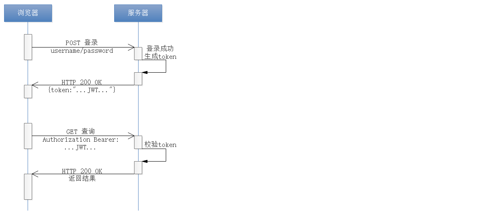

# 认证

jwt模块的定位是对于jwt令牌相关操作进行封装，为认证、鉴权提供支撑。

提供的功能：生成jwt token、解析jwt token的功能。

## 1，认证机制介绍

### 1.1， HTTP Basic Auth

HTTP Basic Auth 是一种简单的登录认证方式，Web浏览器或其他客户端程序在请求时提供用户名和密码，通常用户名和密码会通过HTTP头传递。`简单点说就是每次请求时都提供用户的username和password`

这种方式是先把用户名、冒号、密码拼接起来，并将得出的结果字符串用Base64算法编码。

**优点：**

基本上所有流行的网页浏览器都支持基本认证。

**缺点：**

由于用户名和密码都是Base64编码的，而Base64编码是可逆的，所以用户名和密码可以认为是明文。所以只有在客户端和服务器主机之间的连接是安全可信的前提下才可以使用。

### 1.2 Cookie-Session Auth

Cookie-session 认证机制是通过浏览器带上来Cookie对象来与服务器端的session对象匹配来实现状态管理。

第一次请求认证在服务端创建一个Session对象，同时在用户的浏览器端创建了一个Cookie对象；当我们关闭浏览器的时候，cookie会被删除。但可以通过修改cookie 的expire time使cookie在一定时间内有效。

**优点：**

相对HTTP Basic Auth更加安全。

**缺点：**

这种基于cookie-session的认证使应用本身很难得到扩展，随着不同客户端用户的增加，独立的服务器已无法承载更多的用户，而这时候基于session认证应用的问题就会暴露出来。

### 1.3 OAuth

OAuth 是一个关于授权（authorization）的开放网络标准。允许用户提供一个令牌，而不是用户名和密码来访问他们存放在特定服务提供者的数据（发放令牌访问资源）。

严格来说，OAuth2不是一个标准协议，而是一个安全的授权框架。它详细描述了系统中不同角色、用户、服务前端应用（比如API），以及客户端（比如网站或移动App）之间怎么实现相互认证。

OAuth流程如下图：

**优点：**

- 快速开发，代码量小，维护工作少。
- 如果API要被不同的App使用，并且每个App使用的方式也不一样，使用OAuth2是个不错的选择。

**缺点：**

OAuth2是一个安全框架，描述了在各种不同场景下，多个应用之间的授权问题。

### 1.4 Token Auth

基于token的认证鉴权机制类似于http协议，也是无状态的。

这个token必须要在每次请求时传递给服务端，它应该保存在请求头中，Token Auth 流程如下图：

**优点：**

- 支持跨域访问
- Token机制在服务端不需要存储session信息：Token 自身包含了所有登录用户的信息，只需要在客户端的cookie或本地介质存储状态信息
- 去耦：不需要绑定到一个特定的身份验证方案。Token可以在任何地方生成，只要在你的API被调用的时候，你可以进行Token生成调用即可
- 基于标准化

**缺点：**

- 占带宽
- 无法在服务端注销，因为服务端是无状态的，并没有保存客户端用户登录信息
- 对于有着严格性能要求的 Web 应用并不理想，尤其对于单线程环境 

# JWT

## 1，JWT介绍

JWT全称为JSON Web Token，是目前最流行的跨域身份验证解决方案。

JWT特别适用于分布式站点的单点登录（SSO）场景。

总结：jwt能做授权，信息交换（因为可以对JWT进行签名（例如，使用公钥/私钥对），所以您可以确保发件人是他们所说的人。）

### 1.1， JWT的数据结构

JWT其实就是一个字符串，字符之间通过"."分隔符分为三个子串，各字串之间没有换行符。每一个子串表示了一个功能块，总共有三个部分：**JWT头(header)**、**有效载荷(payload)**、**签名(signature)**，如下图所示：

### 1.1.1 JWT头

JWT头是一个描述JWT元数据的JSON对象，通常如下所示：

~~~json
{"alg": "HS256","typ": "JWT"}
~~~

alg：表示签名使用的算法，默认为HMAC SHA256（写为HS256）

typ：表示令牌的类型，JWT令牌统一写为JWT

最后，使用Base64 URL算法将上述JSON对象转换为字符串

### 1.1.2 有效载荷

有效载荷，是JWT的主体内容部分，也是一个JSON对象，包含需要传递的数据。 

有效载荷部分规定有如下七个默认字段供选择：

~~~makefile
iss：发行人
exp：到期时间
sub：主题
aud：用户
nbf：在此之前不可用
iat：发布时间
jti：JWT ID用于标识该JWT
~~~

除以上默认字段外，还可以自定义私有字段。

### 1.1.3 签名

签名实际上是一个加密的过程，是对上面两部分数据通过指定的算法生成哈希，以确保数据不会被篡改。

首先需要指定一个密码（secret），该密码仅仅保存在服务器中，并且不能向用户公开。然后使用JWT头中指定的签名算法（默认情况下为HMAC SHA256）。

## 2， JWT签名算法

JWT签名算法中，一般有两个选择：HS256和RS256。

HS256 (带有 SHA-256 的 HMAC )是一种`对称加密算法`, 双方之间仅共享一个密钥。由于使用相同的密钥生成签名和验证签名, 因此必须注意确保密钥不被泄密。

RS256 (采用SHA-256 的 RSA 签名) 是一种`非对称加密算法`, 它使用公共/私钥对: JWT的提供方采用私钥生成签名, JWT 的使用方获取公钥以验证签名。

### 2.1 jjwt介绍

其是一个提供JWT创建和验证的永远免费和开源Java库。

~~~xml
<dependency>
    <groupId>io.jsonwebtoken</groupId>
    <artifactId>jjwt</artifactId>
    <version>0.9.1</version>
</dependency>
~~~

### 2.2  jwt入门案例

**案例：**

~~~java

public class JwtTest {
    //生成jwt，不使用签名
    @Test
    public void test1(){
        //添加构成JWT的参数
        Map<String, Object> headMap = new HashMap();
        headMap.put("alg", "none");//不使用签名算法
        headMap.put("typ", "JWT");

        Map body = new HashMap();
        body.put("userId","1");
        body.put("username","xiaoming");
        body.put("role","admin");
        String jwt = Jwts.builder()
                .setHeader(headMap)
                .setClaims(body)
                .setId("jwt001")
                .compact();
        System.out.println(jwt);

        //解析jwt
        Jwt result = Jwts.parser().parse(jwt);
        Object jwtBody = result.getBody();
        Header header = result.getHeader();

        System.out.println(result);
        System.out.println(jwtBody);
        System.out.println(header);
    }

    //生成jwt时使用签名算法生成签名部分----基于HS256签名算法
    @Test
    public void test2(){
        //添加构成JWT的参数
        Map<String, Object> headMap = new HashMap();
        headMap.put("alg", SignatureAlgorithm.HS256.getValue());//使用HS256签名算法
        headMap.put("typ", "JWT");

        Map body = new HashMap();
        body.put("userId","1");
        body.put("username","xiaoming");
        body.put("role","admin");

        String jwt = Jwts.builder()
                        .setHeader(headMap)
                        .setClaims(body)
                        .setId("jwt001")
            			.signWith(SignatureAlgorithm.HS256,"itcast")
            			.compact();
        System.out.println(jwt);

        //解析jwt
        Jwt result = Jwts.parser().setSigningKey("itcast").parse(jwt);
        Object jwtBody = result.getBody();
        Header header = result.getHeader();

        System.out.println(result);
        System.out.println(jwtBody);
        System.out.println(header);
    }

    //生成jwt时使用签名算法生成签名部分----基于RS256签名算法
    @Test
    public void test3() throws Exception{
        //添加构成JWT的参数
        Map<String, Object> headMap = new HashMap();
        headMap.put("alg", SignatureAlgorithm.RS256.getValue());//使用RS256签名算法
        headMap.put("typ", "JWT");

        Map body = new HashMap();
        body.put("userId","1");
        body.put("username","xiaoming");
        body.put("role","admin");

        String jwt = Jwts.builder()
                .setHeader(headMap)
                .setClaims(body)
                .setId("jwt001")
                .signWith(SignatureAlgorithm.RS256,getPriKey())
                .compact();
        System.out.println(jwt);

        //解析jwt
        Jwt result = Jwts.parser().setSigningKey(getPubKey()).parse(jwt);
        Object jwtBody = result.getBody();
        Header header = result.getHeader();

        System.out.println(result);
        System.out.println(jwtBody);
        System.out.println(header);
    }

    //获取私钥
    public PrivateKey getPriKey() throws Exception{
        InputStream resourceAsStream = 
            this.getClass().getClassLoader().getResourceAsStream("pri.key");
        DataInputStream dis = new DataInputStream(resourceAsStream);
        byte[] keyBytes = new byte[resourceAsStream.available()];
        dis.readFully(keyBytes);
        PKCS8EncodedKeySpec spec = new PKCS8EncodedKeySpec(keyBytes);
        KeyFactory kf = KeyFactory.getInstance("RSA");
        return kf.generatePrivate(spec);
    }

    //获取公钥
    public PublicKey getPubKey() throws Exception{
        InputStream resourceAsStream = 
            this.getClass().getClassLoader().getResourceAsStream("pub.key");
        DataInputStream dis = new DataInputStream(resourceAsStream);
        byte[] keyBytes = new byte[resourceAsStream.available()];
        dis.readFully(keyBytes);
        X509EncodedKeySpec spec = new X509EncodedKeySpec(keyBytes);
        KeyFactory kf = KeyFactory.getInstance("RSA");
        return kf.generatePublic(spec);
    }

    //生成自己的 秘钥/公钥 对
    @Test
    public void test4() throws Exception{
        //自定义 随机密码,  请修改这里
        String password = "itcast";

        KeyPairGenerator keyPairGenerator = KeyPairGenerator.getInstance("RSA");
        SecureRandom secureRandom = new SecureRandom(password.getBytes());
        keyPairGenerator.initialize(1024, secureRandom);
        KeyPair keyPair = keyPairGenerator.genKeyPair();

        byte[] publicKeyBytes = keyPair.getPublic().getEncoded();
        byte[] privateKeyBytes = keyPair.getPrivate().getEncoded();

        FileUtil.writeBytes(publicKeyBytes, "d:\\pub.key");
        FileUtil.writeBytes(privateKeyBytes, "d:\\pri.key");
    }
}
~~~

### 3， jwt模块

​	底层是基于jjwt进行jwt令牌的生成和解析的。为了方便使用，模块中封装了两个工具类：

*   JwtTokenServerUtils主要是提供给权限服务的，类中包含生成jwt和解析jwt两个方法

*   JwtTokenClientUtils主要是提供给网关服务的，类中只有一个解析jwt的方法

