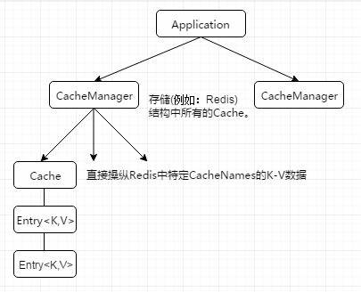
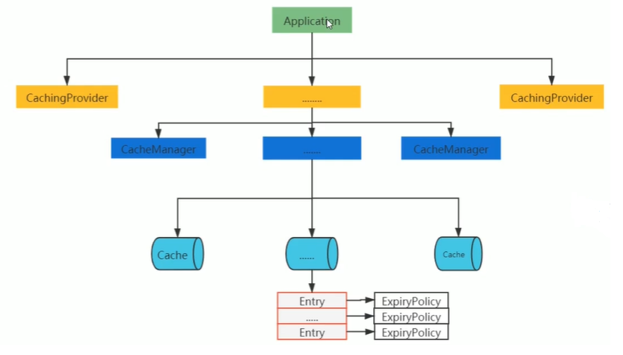

# 本地缓存-Ehcache

## 1，ehcache API

在使用本地缓存时，很少使用原生的API，大多数都会整合spring一起使用。

**2.x 版本依赖**

```xml
<dependency>
    <groupId>net.sf.ehcache</groupId>
    <artifactId>ehcache</artifactId>
    <version>2.10.6</version>
</dependency>
```

**3.x 版本依赖**

```xml
<dependency>
    <groupId>org.ehcache</groupId>
    <artifactId>ehcache</artifactId>
    <version>3.9.9</version>
</dependency>
```


### 1.1 cache 使用

#### 1.1.1 Ehcache API 相关对象

**CacheManager**

>   Cache的容器对象，并管理（添加或删除）Cache的生命周期。
>
>   获取方式：
>
>   *   create方法
>   *   newInstance方法

**Cache**

>   一个Cache实例可以包含多个Element，并被CachaManager管理。它实现了对缓存的逻辑行为。（一个Cache缓存多个同类的数据）

**Element**

>   需要被缓存的元素，它维护则一个k-v键值对，元素也可以设置有效期，0 代表无限制。

**PS**: EhCache 缓存是一个{name: [{key: value}]} 的结构，name 就是相当于一个Cache的命名空间一样做逻辑的划分。

****

#### 1.1.2 ehache xml配置

ehcache.xml

```xml
<?xml version="1.0" encoding="UTF-8"?>
<ehcache xmlns:xsi="http://www.w3.org/2001/XMLSchema-instance"
         xsi:noNamespaceSchemaLocation="https://www.ehcache.org/ehcache.xsd">
    <!--
       diskStore：为本地磁盘缓存路径，ehcache分为内存和磁盘两级，此属性定义磁盘的缓存位置。参数解释如下：
       user.home – 用户主目录
       user.dir  – 用户当前工作目录
       java.io.tmpdir – 默认临时文件路径(xxx/user/AppData/Local/Temp)
     -->
    <diskStore path="java.io.tmpdir"/>
    <!--
       defaultCache：默认缓存策略，当ehcache找不到定义的缓存时，则使用这个缓存策略。只能定义一个。
       属性对应的类：net.sf.ehcache.config.CacheConfiguration
     -->
    <!--
      name:缓存名称。
      maxElementsInMemory:内存中缓存最大数目
      maxEntriesLocalHeap:是用来限制当前缓存在堆内存上所能保存的最大元素数量
      maxElementsOnDisk:硬盘最大缓存个数。当内存已经缓存满时才会保存到磁盘，和标签<persistence>一起使用
      eternal:对象是否永久有效，一但设置true，timeout将不起作用，默认false。
      overflowToDisk:是否保存到磁盘，当系统宕机时
      timeToIdleSeconds:设置对象在失效前的允许闲置时间（单位：秒）。仅当eternal=false对象不是永久有效时使用，可选属性，默认值是0，也就是可闲置时间无穷大。
      timeToLiveSeconds:设置对象在失效前允许存活时间（单位：秒）。最大时间介于创建时间和失效时间之间。仅当eternal=false对象不是永久有效时使用，默认是0.，也就是对象存活时间无穷大。
      diskPersistent：是否缓存虚拟机重启期数据
      diskSpoolBufferSizeMB：这个参数设置DiskStore（磁盘缓存）的缓存区大小。默认是30MB。每个Cache都应该有自己的一个缓冲区。
      diskExpiryThreadIntervalSeconds：磁盘失效线程运行时间间隔，默认是120秒（即本地磁盘缓存失效时间）。
      memoryStoreEvictionPolicy：当达到maxElementsInMemory限制时，Ehcache将会根据指定的策略去清理内存。默认策略是LRU（最近最少使用）。你可以设置为FIFO（先进先出）或是LFU（较少使用）。
      clearOnFlush：内存数量最大时是否清除。
      statistics: 开启统计
      memoryStoreEvictionPolicy:可选策略有：LRU（最近最少使用，默认策略）、FIFO（先进先出）、LFU（最少访问次数）。
        FIFO，first in first out，这个是大家最熟的，先进先出。
        LFU， Less Frequently Used，就是上面例子中使用的策略，直白一点就是讲一直以来最少被使用的。如上面所讲，缓存的元素有一个hit属性，hit值最小的将会被清出缓存。
        LRU，Least Recently Used，最近最少使用的，缓存的元素有一个时间戳，当缓存容量满了，而又需要腾出地方来缓存新的元素的时候，那么现有缓存元素中时间戳离当前时间最远的元素将被清出缓存。
   -->
    <defaultCache
            eternal="false"
            maxElementsInMemory="10000"
            maxEntriesLocalHeap="10000"
            overflowToDisk="false"
            diskPersistent="false"
            timeToIdleSeconds="1800"
            timeToLiveSeconds="259200"
            memoryStoreEvictionPolicy="LRU"/>

    <cache
            name="user_cache"
            eternal="false"
            maxElementsInMemory="5000"
            overflowToDisk="false"
            diskPersistent="false"
            timeToIdleSeconds="1800"
            timeToLiveSeconds="1800"
            maxElementsOnDisk="10000"
            memoryStoreEvictionPolicy="LRU">
        <!-- persistence 在保存到磁盘时需要序列化，所以配置该标签时指定k-v的序列化，对象实现序列化接口即可 -->
        <persistence strategy="none"/>
    </cache>
</ehcache>
```

#### 1.1.3 缓存案例

*   获取cache
*   保存元素到cache
*   从cache中获取数据

```java
@Test
public void test1() {
    String xmlPath = "D:\\Project\\all-demo\\ehcache-demo\\src\\main\\resources\\ehcache.xml";
    // cacheManager 用来管理多个cache，每个cache相当于一个map，cacheManager管理多个map集合
    CacheManager cacheManager = CacheManager.create(xmlPath);
    // 获取CacheManager 管理的所有cache的名字
    String[] cacheNames = cacheManager.getCacheNames();
    System.out.println("所有的cache的名字：" + Arrays.toString(cacheNames));

    // 根据名字获取其中cache实例
    Cache userCache = cacheManager.getCache("user_cache");
    // 缓存一个数据到cache中
    User user = new User();
    user.setId(1).setName("kato").setAge(19).setSex("女");
    Element element = new Element(user.getId(), user);
    userCache.put(element);

    // 从cache中获取缓存的对象
    Element userElement = userCache.get(1);
    System.out.println("cache-value: " + userElement.getObjectValue());
}
```

### 1.2 EhCache 3.x 版本

该版本和2.x 版本相差比较大，不需要xml配置文件了，通过CacheConfiguration去配置。

```java
@Test
public void test2() {
        // 使用 CacheManagerBuilder 来创建一个CacheManager，同时创建预配置的缓存，如：preConfigured
    /*
            参数1：是一个别名，用于 Cache 和 CacheManager 进行配合
            参数2：是一个 CacheConfiguration，主要用来配置Cache
                   使用CacheConfigurationBuilder.newCacheConfigurationBuilder 静态方法来创建
         */
    CacheManager cacheManager = CacheManagerBuilder.newCacheManagerBuilder()
        .withCache("preConfigured",
                   CacheConfigurationBuilder.newCacheConfigurationBuilder(
                       Long.class, String.class, ResourcePoolsBuilder.heap(100)))
        // 在开始使用 CacheManager的时候，需要使用init方法进行初始化？
        .build(true);
    // cacheManager.init();

    // 我们能取回在上面中设定的pre-configrued别名，对应key和要传递的值类型，要求时类型安全的，否则抛出异常。
    Cache<Long, String> preConfigured = cacheManager.getCache("preConfigured", Long.class, String.class);
    // 缓存数据
    preConfigured.put(1L, "hello ehcache3.x");

    // 通过CacheManager创建新的Cache
    CacheConfigurationBuilder<Long, User> builder = CacheConfigurationBuilder
        .newCacheConfigurationBuilder(Long.class, User.class, ResourcePoolsBuilder.heap(100));
    Cache<Long, User> userCache = cacheManager.createCache("user_cache", builder);

    // 缓存数据
    User user = new User();
    user.setId(1).setName("kato").setAge(19).setSex("女");
    userCache.put(1L, user);

    // 获取Cache中的数据
    User user1 = userCache.get(1L);
    System.out.println(user1);
    // close 方法将释放CacheManager所管理的缓存资源
    cacheManager.close();
}
```

## 2，缓存抽象

### spring 缓存抽象

API 结构。有一个CacheManager，其和Ehcache差不多。

一个应用可以包含多个 CacheManager 每个 CacheManager 代表一个缓存技术实现（和 ehcache 不一样），如：redis，ehcache等；每个 CacheManager 有多个Cache，每个 Cache 就是一个区间的划分（逻辑划分），一个 Cache 下缓存一条条的缓存数据。



### JSR107 缓存抽象

API 结构。比较复杂



## 3，spring boot 整合

**1. 依赖**

```xml
<dependency>
    <groupId>org.springframework.boot</groupId>
    <artifactId>spring-boot-starter-cache</artifactId>
    <version>2.3.2.RELEASE</version>
</dependency>

<dependency>
    <groupId>net.sf.ehcache</groupId>
    <artifactId>ehcache</artifactId>
    <version>2.10.6</version>
</dependency>
```

**2. yaml 配置文件**

```yaml
spring:
  cache:
    ehcache:
      config: classpath:ehcache.xml
```

**3. 启用缓存**

在配置类上添加 @EnableCaching

****

上述完成之后，就可以用注解使用EhCache 或者通过自动注入引入 CacheManager。

