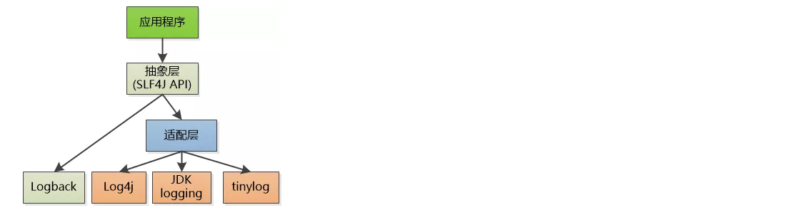

# 日志

## 1. log

tools-log模块定位为日志模块，本质也是一个starter。提供的日志功能主要有两个方面：

1、通过logback框架可以在控制台或者日志文件记录日志信息

2、拦截用户请求，将操作日志保存到数据库

tools-log涉及到的技术点：
1、切面Aspect、切点PointCut、通知Advice
2、Spring Event 异步监听事件
3、logback日志组件
4、函数式接口
5、ThreadLocal

### 1.1 logback

#### 1.1.1 logback介绍

Logback继承自log4j。Logback的架构非常的通用，适用于不同的使用场景。

通过上图可以看到logback和Log4j都是slf4j规范的具体实现，我们在程序中直接调用的API其实都是slf4j的api，底层则是真正的日志实现组件---logback或者log4j。

Logback 构建在三个主要的类上：Logger，Appender 和 Layout。这三个不同类型的组件一起作用能够让开发者根据消息的类型以及日志的级别来打印日志。 

**Logger**作为日志的记录器(logger.error("xxx"))，把它关联到应用的对应的context后，主要用于存放日志对象，也可以定义日志类型、级别。各个logger 都被关联到一个 LoggerContext，LoggerContext负责制造logger，也负责以树结构排列各 logger。

**Appender**主要用于指定日志输出的目的地，目的地可以是控制台、文件、 数据库等。

**Layout** 负责把事件转换成字符串，输出格式化的日志信息。

logback的maven坐标：(spring 默认集成)

~~~xml
<dependency>
    <groupId>ch.qos.logback</groupId>
    <artifactId>logback-classic</artifactId>
    <version>1.2.3</version>
</dependency>
<dependency>
    <groupId>ch.qos.logback</groupId>
    <artifactId>logback-core</artifactId>
    <version>1.2.3</version>
</dependency>
~~~

#### 1.1.2 logback层级

在 logback中每一个 logger 都依附在 LoggerContext 上，它负责产生 logger，并且通过一个**树状**的层级结构来进行管理。

一个 Logger 被当作为一个实体，它们的命名是大小写敏感的，并且遵循以下规则：

~~~makefile
如果一个logger的名字加上一个.作为另一个logger名字的前缀，那么该logger就是另一个logger的祖先。如果一个logger与另一个logger之间没有其它的logger，则该logger就是另一个logger的父级。

举例：
名为cn.it的logger是名为cn.it.service的logger的父级
名为cn的logger是名为cn.it的logger的父级，是名为cn.it.service的logger的祖先
~~~

在logback中有一个root logger，它是logger层次结构的最高层，它是一个特殊的logger，因为它是每一个层次结构的一部分。

#### 1.1.3 logback日志输出等级

logback的日志输出等级分为：TRACE, DEBUG, INFO, WARN, ERROR。

如果一个给定的logger没有指定一个日志输出等级，那么它就会继承离它最近的一个祖先的层级。

为了确保所有的logger都有一个日志输出等级，root logger会有一个默认输出等级 --- DEBUG。

#### 1.1.4 logback初始化步骤

1. logback会在类路径下寻找名为logback-test.xml的文件
2. 如果没有找到，logback会继续寻找名为logback.groovy的文件
3. 如果没有找到，logback会继续寻找名为logback.xml的文件
4. 如果没有找到，将会在类路径下寻找文件META-INFO/services/ch.qos.logback.classic.spi.Configurator，该文件的内容为实现了Configurator接口的实现类的全限定类名
5. 如果以上都没有成功，logback会通过BasicConfigurator为自己进行配置，并且日志将会全部在控制台打印出来

最后一步的目的是为了保证在所有的配置文件都没有被找到的情况下，提供一个默认的配置。

#### 1.1.5 logback入门案例

##### 1.1.5.1 案例一

本案例是一个logback简单应用，并且不提供配置文件而使用其提供的默认配置。

第一步：创建maven工程logback_demo并配置pom.xml文件

~~~xml
<?xml version="1.0" encoding="UTF-8"?>
<project xmlns="http://maven.apache.org/POM/4.0.0"
         xmlns:xsi="http://www.w3.org/2001/XMLSchema-instance"
         xsi:schemaLocation="http://maven.apache.org/POM/4.0.0 
                             http://maven.apache.org/xsd/maven-4.0.0.xsd">
    <modelVersion>4.0.0</modelVersion>
    <groupId>cn.itcast</groupId>
    <artifactId>logback_demo</artifactId>
    <version>1.0-SNAPSHOT</version>
    <dependencies>
        <dependency>
            <groupId>ch.qos.logback</groupId>
            <artifactId>logback-classic</artifactId>
            <version>1.2.3</version>
        </dependency>
        <dependency>
            <groupId>ch.qos.logback</groupId>
            <artifactId>logback-core</artifactId>
            <version>1.2.3</version>
        </dependency>
        <dependency>
            <groupId>junit</groupId>
            <artifactId>junit</artifactId>
            <version>4.12</version>
        </dependency>
    </dependencies>
</project>
~~~

第二步：编写单元测试

~~~java
package cn.itcast.logback;

import ch.qos.logback.classic.Level;
import ch.qos.logback.classic.LoggerContext;
import ch.qos.logback.core.util.StatusPrinter;
import org.junit.Test;
import org.slf4j.Logger;
import org.slf4j.LoggerFactory;

/**
* logback使用方法
*/
public class LogbackTest {
    //简单使用
    @Test
    public void test1(){
        Logger logger = LoggerFactory.getLogger("cn.itcast.logback.HelloWorld");
        logger.debug("debug ...");
    }

    //打印日志内部状态
    @Test
    public void test2(){
        Logger logger = LoggerFactory.getLogger("cn.itcast.logback.HelloWorld");
        logger.debug("debug ...");
        // 打印内部的状态
        LoggerContext lc = (LoggerContext)LoggerFactory.getILoggerFactory();
        StatusPrinter.print(lc);
    }

    /*
    * 日志输出级别：ERROR > WARN > INFO > DEBUG > TRACE
    * */

    //测试默认的日志输出级别
    @Test
    public void test3(){
        Logger logger = LoggerFactory.getLogger("cn.itcast.logback.HelloWorld");
        logger.error("error ...");
        logger.warn("warn ...");
        logger.info("info ...");
        logger.debug("debug ...");
        //因为默认的输出级别为debug，所以这一条日志不会输出
        logger.trace("trace ...");
    }

    //设置日志输出级别
    @Test
    public void test4(){
        ch.qos.logback.classic.Logger logger = (ch.qos.logback.classic.Logger) LoggerFactory.getLogger("cn.itcast.logback.HelloWorld");
        logger.setLevel(Level.WARN);
        logger.error("error ...");
        logger.warn("warn ...");
        logger.info("info ...");
        logger.debug("debug ...");
        logger.trace("trace ...");
    }

    //测试Logger的继承
    @Test
    public void test5(){
        ch.qos.logback.classic.Logger logger = 
            (ch.qos.logback.classic.Logger) LoggerFactory.getLogger("cn.itcast");
        logger.setLevel(Level.INFO);
        logger.error("error ...");
        logger.warn("warn ...");
        logger.info("info ...");
        logger.debug("debug ...");
        logger.trace("trace ...");

        // "cn.itcast.logback" 会继承 "cn.itcast" 的有效级别
        Logger barLogger = LoggerFactory.getLogger("cn.itcast.logback");
        // 这条日志会打印，因为 INFO >= INFO
        barLogger.info("子级信息");
        // 这条日志不会打印，因为 DEBUG < INFO
        barLogger.debug("子级调试信息");
    }

    //Logger获取，根据同一个名称获得的logger都是同一个实例
    @Test
    public void test6(){
        Logger logger1 = LoggerFactory.getLogger("cn.itcast");
        Logger logger2 = LoggerFactory.getLogger("cn.itcast");
        System.out.println(logger1 == logger2);
    }

    //参数化日志
    @Test
    public void test7(){
        Logger logger = LoggerFactory.getLogger("cn.itcast");
        logger.debug("hello {}","world");
    }
}
~~~

##### 1.1.5.2 案例二

本案例是logback中Spring Boot项目中的应用。

第一步：创建maven工程springboot_logback_demo并配置pom文件

~~~xml
<?xml version="1.0" encoding="UTF-8"?>
<project xmlns="http://maven.apache.org/POM/4.0.0"
         xmlns:xsi="http://www.w3.org/2001/XMLSchema-instance"
         xsi:schemaLocation="http://maven.apache.org/POM/4.0.0 
                             http://maven.apache.org/xsd/maven-4.0.0.xsd">
    <modelVersion>4.0.0</modelVersion>
    <parent>
        <groupId>org.springframework.boot</groupId>
        <artifactId>spring-boot-starter-parent</artifactId>
        <version>2.2.2.RELEASE</version>
        <relativePath/>
    </parent>
    <groupId>cn.itcast</groupId>
    <artifactId>springboot_logback_demo</artifactId>
    <version>1.0-SNAPSHOT</version>
    <dependencies>
        <dependency>
            <groupId>ch.qos.logback</groupId>
            <artifactId>logback-classic</artifactId>
            <version>1.2.3</version>
        </dependency>
        <dependency>
            <groupId>ch.qos.logback</groupId>
            <artifactId>logback-core</artifactId>
            <version>1.2.3</version>
        </dependency>
        <dependency>
            <groupId>junit</groupId>
            <artifactId>junit</artifactId>
            <version>4.12</version>
        </dependency>
        <dependency>
            <groupId>org.springframework.boot</groupId>
            <artifactId>spring-boot-starter-web</artifactId>
        </dependency>
    </dependencies>
</project>
~~~

第二步：在resources下编写logback配置文件logback-base.xml （公共设置放在此文件）和logback-spring.xml

logback-base.xml

~~~xml
<?xml version="1.0" encoding="UTF-8"?>
<included>
    <contextName>logback</contextName>
    <!-- 
		name的值是变量的名称，value的值时变量定义的值
		定义变量后，可以使“${}”来使用变量
	-->
    <property name="log.path" value="d:\\logs" />

    <!-- 彩色日志 -->
    <!-- 彩色日志依赖的渲染类 -->
    <conversionRule 
              conversionWord="clr" 
              converterClass="org.springframework.boot.logging.logback.ColorConverter" />
    <conversionRule 
              conversionWord="wex" converterClass="org.springframework.boot.logging.logback.WhitespaceThrowableProxyConverter" />
    <conversionRule conversionWord="wEx" converterClass="org.springframework.boot.logging.logback.ExtendedWhitespaceThrowableProxyConverter" />
    <!-- 彩色日志格式 -->
    <property name="CONSOLE_LOG_PATTERN" value="${CONSOLE_LOG_PATTERN:-%clr(%d{yyyy-MM-dd HH:mm:ss.SSS}){faint} %clr(${LOG_LEVEL_PATTERN:-%5p}) %clr(${PID:- }){magenta} %clr(---){faint} %clr([%15.15t]){faint} %clr(%-40.40logger{39}){cyan} %clr(:){faint} %m%n${LOG_EXCEPTION_CONVERSION_WORD:-%wEx}}"/>

    <!--输出到控制台-->
    <appender name="LOG_CONSOLE" class="ch.qos.logback.core.ConsoleAppender">
        <encoder>
            <Pattern>${CONSOLE_LOG_PATTERN}</Pattern>
            <!-- 设置字符集 -->
            <charset>UTF-8</charset>
        </encoder>
    </appender>

    <!--输出到文件-->
    <appender name="LOG_FILE" class="ch.qos.logback.core.rolling.RollingFileAppender">
        <!-- 正在记录的日志文件的路径及文件名 -->
        <file>${log.path}/logback.log</file>
        <!--日志文件输出格式-->
        <encoder>
            <pattern>%d{yyyy-MM-dd HH:mm:ss.SSS} [%thread] %-5level %logger{50} - %msg%n</pattern>
            <charset>UTF-8</charset>
        </encoder>
        <!-- 日志记录器的滚动策略（防止日志文件过大，过多），按日期，按大小记录 -->
        <rollingPolicy class="ch.qos.logback.core.rolling.TimeBasedRollingPolicy">
            <!-- 每天日志归档路径以及格式 -->
            <fileNamePattern>${log.path}/info/log-info-%d{yyyy-MM-dd}.%i.log</fileNamePattern>
            <timeBasedFileNamingAndTriggeringPolicy class="ch.qos.logback.core.rolling.SizeAndTimeBasedFNATP">
                <maxFileSize>100MB</maxFileSize>
            </timeBasedFileNamingAndTriggeringPolicy>
            <!--日志文件保留天数-->
            <maxHistory>15</maxHistory>
        </rollingPolicy>
    </appender>
</included>
~~~

logback-spring.xml

~~~xml
<?xml version="1.0" encoding="UTF-8"?>
<configuration>
    <!--引入其他配置文件-->
    <include resource="logback-base.xml" />
    <!--
    <logger>用来设置某一个包或者具体的某一个类的日志打印级别、
    以及指定<appender>。<logger>仅有一个name属性，
    一个可选的level和一个可选的addtivity属性。
    name:用来指定受此logger约束的某一个包或者具体的某一个类。
    level:用来设置打印级别，大小写无关：TRACE, DEBUG, INFO, WARN, ERROR, ALL 和 OFF，
          如果未设置此属性，那么当前logger将会继承上级的级别。
    addtivity:是否向上级logger传递打印信息。默认是true。
     -->

    <!--开发环境-->
    <springProfile name="dev">
        <logger name="cn.itcast.controller" additivity="false" level="debug">
            <appender-ref ref="LOG_CONSOLE"/>
        </logger>
    </springProfile>
    <!--生产环境-->
    <springProfile name="pro">
        <logger name="cn.itcast.controller" additivity="false" level="info">
            <appender-ref ref="LOG_FILE"/>
        </logger>
    </springProfile>

    <!--
    root节点是必选节点，用来指定最基础的日志输出级别，只有一个level属性
    level:设置打印级别，大小写无关：TRACE, DEBUG, INFO, WARN, ERROR, ALL 和 OFF 默认是DEBUG
    可以包含零个或多个元素，标识这个appender将会添加到这个logger。
    -->
    <root level="info">
        <appender-ref ref="LOG_CONSOLE" />
        <appender-ref ref="LOG_FILE" />
    </root>
</configuration>
~~~

第三步：编写application.yml

~~~yaml
server:
  port: 9000
logging:
  #在Spring Boot项目中默认加载类路径下的logback-spring.xml文件
  config: classpath:logback-spring.xml
spring:
  profiles:
    active: dev
~~~

第四步：创建UserControlle

~~~java
import org.slf4j.Logger;
import org.slf4j.LoggerFactory;
import org.springframework.web.bind.annotation.GetMapping;
import org.springframework.web.bind.annotation.RequestMapping;
import org.springframework.web.bind.annotation.RestController;

@RestController
@RequestMapping("/user")
public class UserController {
    Logger logger = LoggerFactory.getLogger(UserController.class);

    @GetMapping("/get")
    public String get(){
        logger.trace("trace...");
        logger.debug("debug...");
        logger.info("info...");
        logger.warn("warn...");
        logger.error("error...");
        return "OK";
    }
}
~~~

第五步：创建启动类

~~~java
package cn.itcast;

import org.springframework.boot.SpringApplication;
import org.springframework.boot.autoconfigure.SpringBootApplication;

@SpringBootApplication
public class LogbackApp {
    public static void main(String[] args) {
        SpringApplication.run(LogbackApp.class,args);
    }
}
~~~

启动项目，访问地址：http://localhost:9000/user/get

可以看到控制台已经开始输出日志信息。

修改application.yml文件中的开发模式为pro，重启项目这日志输出到了文件中。

### 2.2 Spring Event

#### 2.2.1 Spring Event介绍

Spring Event是Spring的事件通知机制，可以将相互耦合的代码解耦，从而方便功能的修改与添加。Spring Event是监听者模式的一个具体实现。

监听者模式包含了监听者Listener、事件Event、事件发布者EventPublish，过程就是EventPublish发布一个事件，被监听者捕获到，然后执行事件相应的方法。

Spring Event的相关API在spring-context包中。

#### 2.2.2 Spring Event入门案例

第一步：创建maven工程springevent_demo并配置pom.xml文件

~~~xml
<?xml version="1.0" encoding="UTF-8"?>
<project xmlns="http://maven.apache.org/POM/4.0.0"
         xmlns:xsi="http://www.w3.org/2001/XMLSchema-instance"
         xsi:schemaLocation="http://maven.apache.org/POM/4.0.0 
                             http://maven.apache.org/xsd/maven-4.0.0.xsd">
    <modelVersion>4.0.0</modelVersion>
    <parent>
        <groupId>org.springframework.boot</groupId>
        <artifactId>spring-boot-starter-parent</artifactId>
        <version>2.2.2.RELEASE</version>
        <relativePath/>
    </parent>
    <groupId>cn.itcast</groupId>
    <artifactId>springevent_demo</artifactId>
    <version>1.0-SNAPSHOT</version>
    <dependencies>
        <dependency>
            <groupId>org.springframework.boot</groupId>
            <artifactId>spring-boot-starter-web</artifactId>
        </dependency>
    </dependencies>
</project>
~~~

第二步：创建OptLogDTO类，用于封装操作日志信息

~~~java
import lombok.Data;

@Data
public class OptLogDTO {
    private String requestIp; //操作IP
    private String type; //日志类型 LogType{OPT:操作类型;EX:异常类型}
    private String userName; //操作人
    private String description; //操作描述
}
~~~

第三步：创建事件类SysLogEvent

~~~java
import cn.itcast.dto.OptLogDTO;
import org.springframework.context.ApplicationEvent;
/**
* 定义系统日志事件
*/
public class SysLogEvent extends ApplicationEvent {
    public SysLogEvent(OptLogDTO optLogDTO) {
        super(optLogDTO);
    }
}
~~~

第四步：创建监听器类SysLogListener

~~~java
import cn.itcast.dto.OptLogDTO;
import cn.itcast.event.SysLogEvent;
import org.springframework.context.event.EventListener;
import org.springframework.scheduling.annotation.Async;
import org.springframework.stereotype.Component;

/**
* 异步监听日志事件
*/
@Component
public class SysLogListener {
    @Async//异步处理（多线程处理）
    // 指定监听哪种类型，不然都监听了
    @EventListener(SysLogEvent.class)
    public void saveSysLog(SysLogEvent event) {
        OptLogDTO sysLog = (OptLogDTO) event.getSource();
        long id = Thread.currentThread().getId();
        System.out.println("监听到日志操作事件：" + sysLog + " 线程id：" + id);
        //将日志信息保存到数据库...
    }
}
~~~

第五步：创建Controller，用于发布事件

~~~java
import org.springframework.beans.factory.annotation.Autowired;
import org.springframework.context.ApplicationContext;
import org.springframework.context.ApplicationEvent;
import org.springframework.web.bind.annotation.GetMapping;
import org.springframework.web.bind.annotation.RequestMapping;
import org.springframework.web.bind.annotation.RestController;

@RestController
@RequestMapping("/user")
public class UserController {
    @Autowired
    private ApplicationContext applicationContext;
    @GetMapping("/getUser")
    public String getUser(){
        //构造操作日志信息
        OptLogDTO logInfo = new OptLogDTO();
        logInfo.setRequestIp("127.0.0.1");
        logInfo.setUserName("admin");
        logInfo.setType("OPT");
        logInfo.setDescription("查询用户信息");
		
        //构造事件对象
        ApplicationEvent event = new SysLogEvent(logInfo);
        
        //发布事件
        applicationContext.publishEvent(event);
        
        long id = Thread.currentThread().getId();
        System.out.println("发布事件,线程id：" + id);
        return "OK";
    }
}
~~~

第六步：创建启动类

~~~java
import org.springframework.boot.SpringApplication;
import org.springframework.boot.autoconfigure.SpringBootApplication;
import org.springframework.scheduling.annotation.EnableAsync;

@SpringBootApplication
@EnableAsync//启用异步处理
public class SpringEventApp {
    public static void main(String[] args) {
        SpringApplication.run(SpringEventApp.class,args);
    }
}
~~~

启动项目并访问Controller可以发现监听器触发了。

### 2.3 tools-log使用

pd-tools-log的开发步骤为：

1、定义日志操作事件类SysLogEvent

2、定义@SysLog注解，用于在Controller的方法上标注当前方法需要进行操作日志的保存处理

3、定义切面类SysLogAspect

4、在切面类SysLogAspect中定义切点，拦截Controller中添加@SysLog注解的方法

5、在切面类SysLogAspect中定义前置通知，在前置通知方法recordLog中收集操作日志相关信息封装为OptLogDTO对象并保存到ThreadLocal中

6、在切面类SysLogAspect中定义后置通知，在后置通知方法doAfterReturning中通过ThreadLocal 获取OptLogDTO并继续设置其他的操作信息到OptLogDTO

7、在切面类SysLogAspect的后置通知方法doAfterReturning中发布事件SysLogEvent

8、定义监听器SysLogListener，监听日志发布事件SysLogEvent

9、定义配置类LogAutoConfiguration，用于自动配置切面SysLogAspect对象

10、定义starter所需的META-INF/spring.factories文件，并配置自动配置类LogAutoConfiguration

**问题思考：**

通过分析tools-log的代码可以发现，它只是将日志信息进行收集然后发布日志事件，最后通过监听器来监听日志事件，并没有真正将日志信息保存到数据库，这是为什么呢？

这是因为不同的系统对于操作日志的处理方式可能不同，比如有的系统可能将日志保存到数据库，有的系统可能将日志保存到文件。pd-tools-log作为通用的日志组件不可能将具体的日志处理逻辑限制死，所以他只是将日志信息进行收集，具体的处理方式需要交给我们的应用系统来完成。

**具体使用过程：**

第一步：创建maven工程myLogApp并配置pom.xml文件

~~~xml
<?xml version="1.0" encoding="UTF-8"?>
<project xmlns="http://maven.apache.org/POM/4.0.0"
         xmlns:xsi="http://www.w3.org/2001/XMLSchema-instance"
         xsi:schemaLocation="http://maven.apache.org/POM/4.0.0 
                             http://maven.apache.org/xsd/maven-4.0.0.xsd">
    <modelVersion>4.0.0</modelVersion>
    <parent>
        <groupId>org.springframework.boot</groupId>
        <artifactId>spring-boot-starter-parent</artifactId>
        <version>2.2.2.RELEASE</version>
        <relativePath/>
    </parent>
    <groupId>com.itheima</groupId>
    <artifactId>myLogApp</artifactId>
    <version>1.0-SNAPSHOT</version>
    <dependencies>
        <dependency>
            <groupId>com.itheima</groupId>
            <artifactId>pd-tools-log</artifactId>
            <version>1.0-SNAPSHOT</version>
            <exclusions>
                <exclusion>
                    <groupId>com.alibaba.cloud</groupId>
                    <artifactId>spring-cloud-starter-alibaba-nacos-config</artifactId>
                </exclusion>
            </exclusions>
        </dependency>
        <dependency>
            <groupId>org.springframework.boot</groupId>
            <artifactId>spring-boot-starter-web</artifactId>
        </dependency>
        <dependency>
            <groupId>org.projectlombok</groupId>
            <artifactId>lombok</artifactId>
        </dependency>
    </dependencies>
</project>
~~~

第二步：创建logback配置文件logback-base.xml和logback-spring.xml

logback-base.xml

~~~xml
<?xml version="1.0" encoding="UTF-8"?>
<included>
    <contextName>logback</contextName>
    <!--
		name的值是变量的名称，value的值时变量定义的值
		定义变量后，可以使“${}”来使用变量
	-->
    <property name="log.path" value="d:\\logs" />

    <!-- 彩色日志 -->
    <!-- 彩色日志依赖的渲染类 -->
    <conversionRule
            conversionWord="clr"
            converterClass="org.springframework.boot.logging.logback.ColorConverter" />
    <conversionRule
            conversionWord="wex" converterClass="org.springframework.boot.logging.logback.WhitespaceThrowableProxyConverter" />
    <conversionRule conversionWord="wEx" converterClass="org.springframework.boot.logging.logback.ExtendedWhitespaceThrowableProxyConverter" />
    <!-- 彩色日志格式 -->
    <property name="CONSOLE_LOG_PATTERN" value="${CONSOLE_LOG_PATTERN:-%clr(%d{yyyy-MM-dd HH:mm:ss.SSS}){faint} %clr(${LOG_LEVEL_PATTERN:-%5p}) %clr(${PID:- }){magenta} %clr(---){faint} %clr([%15.15t]){faint} %clr(%-40.40logger{39}){cyan} %clr(:){faint} %m%n${LOG_EXCEPTION_CONVERSION_WORD:-%wEx}}"/>

    <!--输出到控制台-->
    <appender name="LOG_CONSOLE" class="ch.qos.logback.core.ConsoleAppender">
        <encoder>
            <Pattern>${CONSOLE_LOG_PATTERN}</Pattern>
            <!-- 设置字符集 -->
            <charset>UTF-8</charset>
        </encoder>
    </appender>

    <!--输出到文件-->
    <appender name="LOG_FILE" class="ch.qos.logback.core.rolling.RollingFileAppender">
        <!-- 正在记录的日志文件的路径及文件名 -->
        <file>${log.path}/logback.log</file>
        <!--日志文件输出格式-->
        <encoder>
            <pattern>%d{yyyy-MM-dd HH:mm:ss.SSS} [%thread] %-5level %logger{50} - %msg%n</pattern>
            <charset>UTF-8</charset>
        </encoder>
        <!-- 日志记录器的滚动策略，按日期，按大小记录 -->
        <rollingPolicy class="ch.qos.logback.core.rolling.TimeBasedRollingPolicy">
            <!-- 每天日志归档路径以及格式 -->
            <fileNamePattern>${log.path}/info/log-info-%d{yyyy-MM-dd}.%i.log</fileNamePattern>
            <timeBasedFileNamingAndTriggeringPolicy class="ch.qos.logback.core.rolling.SizeAndTimeBasedFNATP">
                <maxFileSize>100MB</maxFileSize>
            </timeBasedFileNamingAndTriggeringPolicy>
            <!--日志文件保留天数-->
            <maxHistory>15</maxHistory>
        </rollingPolicy>
    </appender>
</included>
~~~

logback-spring.xml

~~~xml
<?xml version="1.0" encoding="UTF-8"?>
<configuration>
    <!--引入其他配置文件-->
    <include resource="logback-base.xml" />

    <!--开发环境-->
    <springProfile name="dev">
        <logger name="com.itheima" additivity="false" level="debug">
            <appender-ref ref="LOG_CONSOLE"/>
        </logger>
    </springProfile>
    <!--生产环境-->
    <springProfile name="pro">
        <logger name="com.itheima" additivity="false" level="info">
            <appender-ref ref="LOG_FILE"/>
        </logger>
    </springProfile>

    <root level="info">
        <appender-ref ref="LOG_CONSOLE" />
        <appender-ref ref="LOG_FILE" />
    </root>
</configuration>
~~~

第三步：编写application.yml

~~~yaml
server:
  port: 8080
pinda:
  log:
    enabled: true
logging:
  #在Spring Boot项目中默认加载类路径下的logback-spring.xml文件
  config: classpath:logback-spring.xml
spring:
  profiles:
    active: dev
~~~

第四步：创建UserController

~~~java
import io.swagger.annotations.Api;
import io.swagger.annotations.ApiImplicitParam;
import io.swagger.annotations.ApiImplicitParams;
import io.swagger.annotations.ApiOperation;
import org.springframework.web.bind.annotation.*;

@RestController
@RequestMapping("/user")
@Api(tags = "用户控制器")
public class UserController {
    @SysLog("分页查询用户")//记录操作日志
    @ApiImplicitParams({
            @ApiImplicitParam(name = "pageNum", value = "页码",
                    required = true, type = "Integer"),
            @ApiImplicitParam(name = "pageSize", value = "每页条数",
                    required = true, type = "Integer"),
    })
    @ApiOperation(value = "分页查询用户信息")
    @GetMapping(value = "page/{pageNum}/{pageSize}")
    public String findByPage(@PathVariable Integer pageNum,
                             @PathVariable Integer pageSize) {
        return "OK";
    }
}
~~~

第五步：创建LogService

~~~java
import lombok.extern.slf4j.Slf4j;
import org.springframework.stereotype.Service;

@Service
@Slf4j
public class LogService {
    //将日志信息保存到数据库
    public void saveLog(OptLogDTO optLogDTO){
        //此处只是将日志信息进行输出，实际项目中可以将日志信息保存到数据库
        log.debug("保存日志信息：" + optLogDTO);
    }
}
~~~

第六步：创建配置类

~~~java
import org.springframework.boot.autoconfigure.condition.ConditionalOnMissingBean;
import org.springframework.context.annotation.Bean;
import org.springframework.context.annotation.Configuration;

/*
*日志配置类
*/

@Configuration
public class LogAutoConfiguration {
    //自动配置日志监听器组件
    @Bean
    @ConditionalOnMissingBean
    public SysLogListener sysLogListener(LogService logService){
        return new SysLogListener(optLogDTO -> logService.saveLog(optLogDTO));
    }
}
~~~

第七步：编写启动类

~~~java
package com.itheima;

import org.springframework.boot.SpringApplication;
import org.springframework.boot.autoconfigure.SpringBootApplication;

@SpringBootApplication
public class MyLogApplication {
    public static void main(String[] args) {
        SpringApplication.run(MyLogApplication.class,args);
    }
}
~~~

启动项目，访问地址：http://localhost:8080/user/page/1/10

可以看到LogService的saveLog方法已经被调用了。

