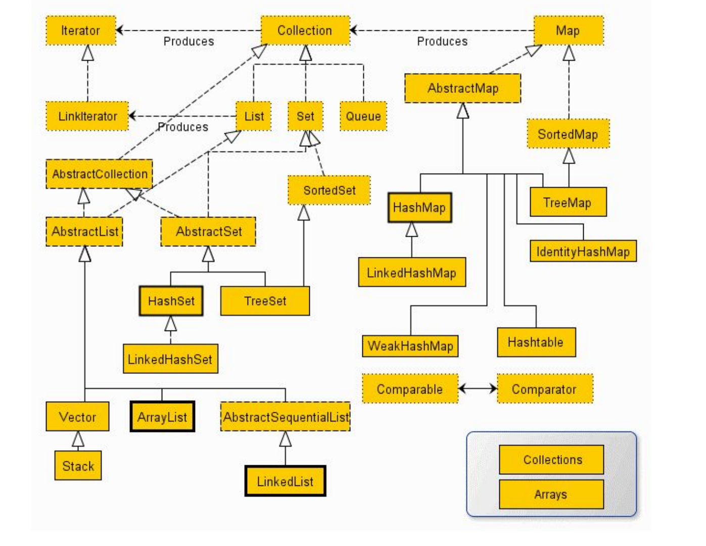
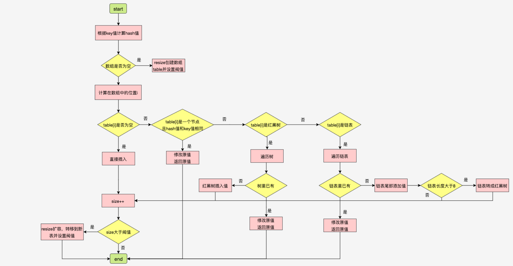
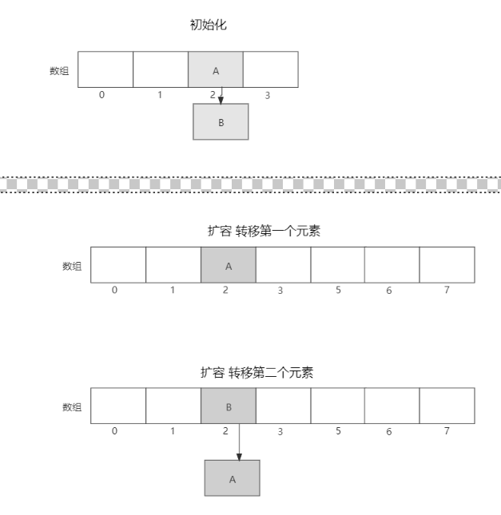

# 集合底层原理&并发



**PS: ** 序列化是为了：

*   **持久化存盘**：由于对象及其数据是存在内存中，希望把某个对象和数据保存下来，就需要持久化存盘。
*   **网络传输**：内存中对象要在网络中传输，必须序列化成为二进制文件才能传输。

## 1，ArrayList

>   存储结构：底层采用数组来实现的。
>
>   添加元素：默认尾部添加，效率比较高。
>
>   扩容：数组复制

### 1.1 基本属性

*   **默认长度**：10个（如果实例化时未指定容量，则在初次添加元素时会进行扩容使用此容量作为数组长度）
*   **扩容**：newCapacity = oldCapacity + (oldCapacity >> 1) 默认将扩容至原来容量的1.5 倍（即 = oldCappacity + oldCappacity  /  2）

```java
// 序列化版本号（类文件签名），如果不写会默认生成，类内容的改变会影响签名变化，导致反序列化失败
private static final long serialVersionUID = 8683452581122892189L;
// 如果实例化时未指定容量，则在初次添加元素时会进行扩容使用此容量作为数组长度
private static final int DEFAULT_CAPACITY = 10;
// static修饰，所有的未指定容量的实例(也未添加元素)共享此数组，两个空的数组有什么区别呢？ 就是第一次添加元素时知道该 elementData 从空的构造函数还是有参构造函数被初始化的。以便确认如何扩容。空的构造器则初始化为10，有参构造器则按照扩容因子扩容
private static final Object[] EMPTY_ELEMENTDATA = {};
private static final Object[] DEFAULTCAPACITY_EMPTY_ELEMENTDATA = {};
// arrayList真正存放元素的地方，长度大于等于size
transient Object[] elementData;
// arrayList中的元素个数
private int size;
```

### 1.2 构造方法

*   不指定容量：初始化时是空数组，大小为0，当第一次add元素的才初始化数组，大小为10.
*   指定容量：直接创建大小为指定容量的数组

```java
 // 无参构造器，构造函数只是给 elementData 赋值了一个空的数组，其实是在第一次添加元素时容量扩大至 10 的。
    public ArrayList() {
        this.elementData = DEFAULTCAPACITY_EMPTY_ELEMENTDATA;
    }
    // 当 initialCapacity 为零时则是把 EMPTY_ELEMENTDATA 赋值给 elementData。
    // 当 initialCapacity 大于零时初始化一个大小为 initialCapacity 的 object 数组并赋值给 elementData。
    public ArrayList(int initialCapacity) {
        if (initialCapacity > 0) {
            this.elementData = new Object[initialCapacity];
        } else if (initialCapacity == 0) {
            this.elementData = EMPTY_ELEMENTDATA;
        } else {
            throw new IllegalArgumentException("Illegal Capacity: "+ initialCapacity);
        }
    }
    // 将 Collection 转化为数组，数组长度赋值给 size。 如果 size 不为零，则判断 elementData 的 class 类型是否为 ArrayList，不是的话则做一次转换。 如果 size 为零，则把EMPTY_ELEMENTDATA 赋值给 elementData，相当于new ArrayList(0)。
   public ArrayList(Collection<? extends E> c) {
        Object[] a = c.toArray();
        if ((size = a.length) != 0) {
            if (c.getClass() == ArrayList.class) {
                elementData = a;
            } else {
                elementData = Arrays.copyOf(a, size, Object[].class);
            }
        } else {
        	// 指向空数组
            elementData = EMPTY_ELEMENTDATA;
        }
    }
```

### 1.3 添加元素

>   添加元素采用开辟原地复制的方法，不是移动。
>
>   *   检查下标，指定位置插入时，才需要检查下标
>   *   检查是否需要扩容
>   *   数组拷贝，指定位置插入才需要此操作
>   *   尾部添元素

**指定下标添加：**

```java
// 插入
public void add(int index, E element) {
    // 下标越界检查
    rangeCheckForAdd(index);
    //  判断扩容,记录操作数
    ensureCapacityInternal(size + 1);
    System.arraycopy(elementData, index, elementData, index + 1, size - index);
    elementData[index] = element;
    size++;
}
// 尾部追加
public boolean add(E e) {
    ensureCapacityInternal(size + 1);  // Increments modCount!!
    elementData[size++] = e;
    return true;
}
```

### 1.4 扩容

由代码可知，只有添加元素超过了数组长度时才会扩容

```java
// ....
if (minCapacity - elementData.length > 0)
            grow(minCapacity);
// ....

private void grow(int minCapacity) {
    // 获取当前数组长度
    int oldCapacity = elementData.length;
    // 默认将扩容至原来容量的1.5 倍
    int newCapacity = oldCapacity + (oldCapacity >> 1);
    if (newCapacity - minCapacity < 0)
        newCapacity = minCapacity;
    if (newCapacity - MAX_ARRAY_SIZE > 0)
        newCapacity = hugeCapacity(minCapacity);
    // minCapacity is usually close to size, so this is a win:
    elementData = Arrays.copyOf(elementData, newCapacity);
}
```

## 2，HashMap

>   key-value存储，key可以为null，value也同样可以为null，同样的key保存会被覆盖掉之前的，可以理解为更新。
>
>   **存储结构：**底层采用数组、链表Node、红黑树TreeNode来实现的。
>
>   Hashcode：通过字符串算出它的ascii码，进行mod（取模），算出哈希表中的下标。




**注意：**链表头插法在多线程情况下有循环引用问题，导致插不进去。

### 2.1 JDK8中的HashMap与JDK7的HashMap

#### 2.1.1 JDK8是通过数组+链表+红黑树来实现

整体存储是数组，当方式hash冲突是就是采用链表存储冲突的key-value，当链表长度大于8时，链表转换为红黑树（提高效率）

#### 2.1.2 JDK7链表采用头插法，而JDK8中改用尾插法

>   原因：因为头插法在多线程环境下时存在问题的，在并发扩容时导致循环。

正常扩容：

原本是A -> B，但是头插法在扩容后AB顺序插入则变成了B->A



在多线程环境下：有可能出现下面情况


#### 2.1.3 JDK8使用了红黑树

#### 2.1.4 JDK8中数组扩容的条件的变化

>   只会判断是否当前元素个数是否查过了阈值，而不再判断当前put进来的元素对应的数组下标位置是否有值。

#### 2.1.5 JDK7中是先扩容再添加新元素，JDK8中是先添加新元素然后再扩容

>   是在put的时候进行扩容的。

### 3，HashMap中PUT方法的流程

>   HashMap有两个内部类
>
>   *   Node：链表
>   *   TreeNode：红黑树

**1，通过key计算hashcode**

```java
// put 方法
public V put(K key, V value) {
    return putVal(hash(key), key, value, false, true);
}
```

**2. 通过hashcode和n-1的“与操作”计算出一个数组下标**

```java
if ((p = tab[i = (n - 1) & hash]) == null)
    tab[i] = newNode(hash, key, value, null);
```

**3, 判断数组下标对应的位置，是不是空，如果是空(不发生hash冲突)则把entry直接存在该数组位置**

```java
 tab[i] = newNode(hash, key, value, null);
```

**4，并且还需要判断该链表中是否存在相同的key，如果存在，则更新value**

```java
// hash相同，key也相同那么就是重复key了需要更新value
if (p.hash == hash &&((k = p.key) == key || (key != null && key.equals(k)))){
      e = p;
}
```


**5，如果该下标对应的位置不为空（发生hash冲突），则需要把entry插入到链表中**

```java
// 循环进行尾插法插入数据
for (int binCount = 0; ; ++binCount) {
    if ((e = p.next) == null) {
        // 尾插法插入
        p.next = newNode(hash, key, value, null);
        // 判断是否转换为红黑树
        if (binCount >= TREEIFY_THRESHOLD - 1) // -1 for 1st
            treeifyBin(tab, hash);
        break;
    }
    if (e.hash == hash &&
        ((k = e.key) == key || (key != null && key.equals(k))))
        break;
    p = e;
}
```

**6，如果是JDK8，则会遍历链表，并且在遍历链表的过程中，统计当前链表的元 素个数，如果超过8个，则先把链表转变为红黑树，并且把元素插入到红黑树中**

```java
// 判断是否转换为红黑树
if (binCount >= TREEIFY_THRESHOLD - 1) // -1 for 1st
    treeifyBin(tab, hash);
```


### 4，HashMap扩容流程

1.   HashMap的扩容指的就是数组的扩容， 因为数组占用的是连续内存空间， 所以数组的扩容其实只能新开一个新的数组，然后把老数组上的元素转移到新 数组上来，这样才是数组的扩容。
2.   在HashMap中也是一样，先新建一个2倍数组大小的数组。（ArrayList是1.5倍）
3.   就把这个链 表上的元素转移到新数组上去。
4.   在jdk8中，因为涉及到红黑树，比较复杂。
5.    元素转移完了之后，在把新数组对象赋值给HashMap的table属性，老数组 会被回收到。

### 5，为什么HashMap的数组的大小是2的幂次方数？

>   hashcode是一个数字，然后通过 **hashcode & (table.length - 1) 运算得到一个数组下标index**，是通过与运算计算出 来一个数组下标的，而不是通过取余，与运算相比于取余运算速度更快，但是也有一 个前提条件，就是数组的长度得是一个2的幂次方数。
>
>   总之与计算数组下标有关。


## 3，ConcurrentHashMap（并发安全）

>   ConcurrentHashMap是并发安全的HashMap ，比Hashtable效率更高，Hashtable是synchronized锁住方法的，粒度比较大。
>
>   ConcurrentHashMap内部大量采用CAS操作。

