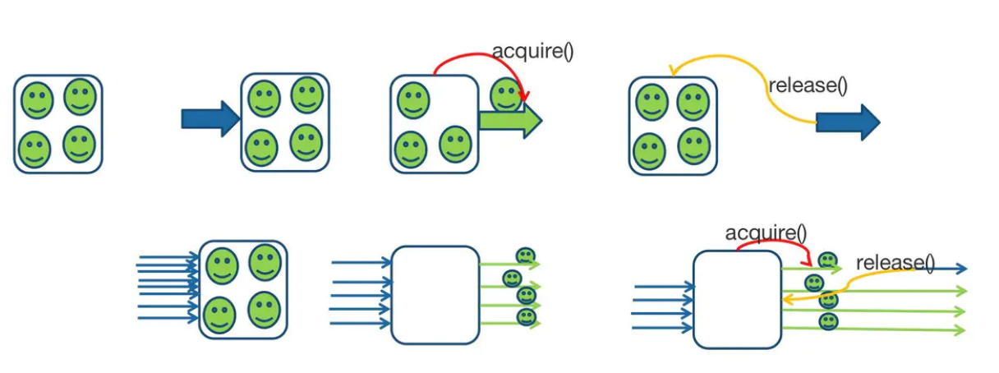
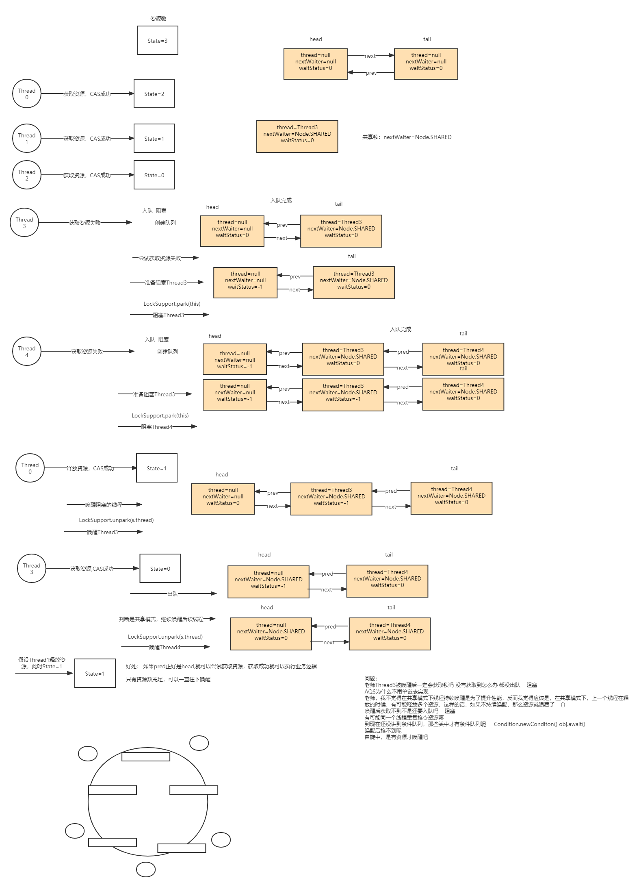
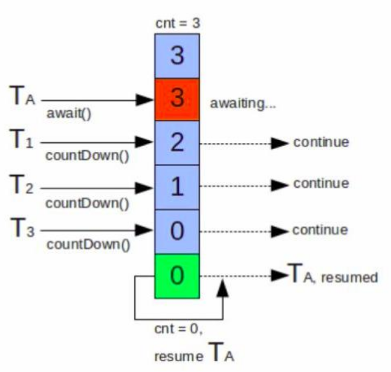

# Semaphore

​	Semaphore，俗称信号量，它是操作系统中PV操作（P表示通过的意思，V表示释放的意思）的原语在java的实现，它也是基于 AbstractQueuedSynchronizer实现的。

>   Semaphore信号量理解为代表资源的变量或者许可证，如果大小为1就可以表示互斥锁，大小为n（n>0）的信号量可以实现限流的功能，它可以实现只能有n个线程同时获取信号量，线程需要持有许可证才能执行。



## 1，Semaphore 常用方法

### 1.1 构造器

>   在构造Semaphore 指定资源的数量或者说许可证的数量。

```java
public Semaphore(int permits) {
    sync = new NonfairSync(permits);
}

/**
* permits: 表示许可证的数量（资源数
* fair：表示公平性
*/
public Semaphore(int permits, boolean fair) {
    sync = fair ? new FairSync(permits) : new NonfairSync(permits);
}
```

### 1.2 实例方法

```java
// acquire() 表示阻塞并获取一个许可
public void acquire() throws InterruptedException;
// 该方法在没有许可的情况下会立即返回 false，要获取许可的线程不会阻塞
public boolean tryAcquire();
// 释放1个许可
public void release();
// 返回此信号量中当前可用的许可证数
public int availablePermits();
// 返回正在等待获取许可证的线程数
public final int getQueueLength();
// 是否有线程正在等待获取许可证
public final boolean hasQueuedThreads();
// 减少 reduction 个许可证
protected void reducePermits(int reduction);
// 返回所有等待获取许可证的线程集合
Collection getQueuedThreads();
```

### 1.3 应用场景

可以用于做流量控制，特别是公用资源有限的应用场景，持有信号量才能继续执行.

#### 1. 限流

```java
public class SemaphoneTest2 {
    /**
     * 实现一个同时只能处理5个请求的限流器
     */
    private static Semaphore semaphore = new Semaphore(5);

    /**
     * 定义一个线程池
     */
    private static ThreadPoolExecutor executor = new ThreadPoolExecutor(10, 50, 60, TimeUnit.SECONDS, new LinkedBlockingDeque<>(200));

    /**
     * 模拟执行方法
     */
    public static void exec() {
        try {
            // 持有信号量才能继续执行
            semaphore.acquire(1);
            // 模拟真实方法执行
            System.out.println("执行exec方法" );
            Thread.sleep(2000);
        } catch (Exception e) {
            e.printStackTrace();
        } finally {
            semaphore.release(1);
        }
    }

    public static void main(String[] args) throws InterruptedException {
        {
            for (; ; ) {
                Thread.sleep(100);
                // 模拟请求以10个/s的速度
                executor.execute(() -> exec());
            }
        }
    }
```

## 2，Semaphore源码分析

关注点：

1.   Semaphore的加锁解锁（共享锁）逻辑实现

2.   线程竞争锁失败入队阻塞逻辑和获取锁的线程释放锁唤醒阻塞线程竞争锁的逻辑实现

>   实现原理和ReetrantLock有点类似。

### 2.1 获取许可

调用Semaphore#acquire方法最后来到这里，尝试获取许可证。

```java
final int nonfairTryAcquireShared(int acquires) {
    for (;;) {
        // 获取state资源数（使用AQS的state保存许可证数）
        int available = getState();
        // 计算剩余的许可
        int remaining = available - acquires;
        // 1. 当计算剩余许可 < 0 return结束，外面park线程前会再次尝试获取，如果还失败直接park
        // 2. 当计算剩余许可 > 0 并且cas失败（其他线程更改了），再次循环尝试获取许可
        if (remaining < 0 || compareAndSetState(available, remaining))
            return remaining;
    }
}
```

**2. **

```java
// 当计算剩余许可 < 0 return 返回到该函数，再次尝试获取许可
// 如果计算剩余的许可 > 0 线程继续往下执行
public final void acquireSharedInterruptibly(int arg)
    throws InterruptedException {
    if (Thread.interrupted())
        throw new InterruptedException();
    if (tryAcquireShared(arg) < 0)
        doAcquireSharedInterruptibly(arg);
}
```

**3. 再次尝试获取或阻塞线程**

shouldParkAfterFailedAcquire

```java
private void doAcquireSharedInterruptibly(int arg)
    throws InterruptedException {
    // addWaiter入同步（阻塞）队列，同时再次尝试获取许可
    final Node node = addWaiter(Node.SHARED);
    boolean failed = true;
    try {
        for (;;) {
            final Node p = node.predecessor();
             // 该节点的前驱是头节点
            if (p == head) {
                // 再次尝试获取
                int r = tryAcquireShared(arg);
                if (r >= 0) {
                    // 再次尝试获取成功，则移除该节点即出队
                    setHeadAndPropagate(node, r);
                    p.next = null; // help GC
                    failed = false;
                    return;
                }
            }
            // 获取失败或者该节点不是第一个节点（即轮不到该节点h），park线程
            if (shouldParkAfterFailedAcquire(p, node) &&
                parkAndCheckInterrupt())
                throw new InterruptedException();
        }
    } finally {
        if (failed)
            cancelAcquire(node);
    }
}
```

### 2.1 释放许可

调用Semaphore#release方法许释放许可证。释放许可需要将阻塞线程唤醒同时同步队列（阻塞队列）节点出队。

**1.**

```java
public final boolean releaseShared(int arg) {
    // 1.先释放许可证
    if (tryReleaseShared(arg)) {
        // 唤醒线程，同时队列出队
        doReleaseShared();
        return true;
    }
    return false;
}
```

**2.**

```java
protected final boolean tryReleaseShared(int releases) {
    for (;;) {
        int current = getState();
        // 计算释放资源后的许可证总数
        int next = current + releases;
        if (next < current) // overflow
            throw new Error("Maximum permit count exceeded");
        // cas循环释放许可
        if (compareAndSetState(current, next))
            return true;
    }
}
```

**3.**

```java
// 释放资源动作
private void doReleaseShared() {
     for (;;) {
         // 获取头节点
         Node h = head;
         // 头和尾都不为null说明同步队列才有阻塞的线程
         if (h != null && h != tail) {
             int ws = h.waitStatus;
             // ws = -1 说明可以唤醒next节点
             if (ws == Node.SIGNAL) {
                 // 把head的waitStatus改为0
                 if (!compareAndSetWaitStatus(h, Node.SIGNAL, 0))
                     continue;            // loop to recheck cases
                 // uppark唤醒线程
                 unparkSuccessor(h);
             }
             else if (ws == 0 &&
                      !compareAndSetWaitStatus(h, 0, Node.PROPAGATE))
                 continue;                // loop on failed CAS
         }
         if (h == head)                   // loop if head changed
             break;
     }
 }
```

**4. 唤醒线程**

```java
/**
* Wakes up node's successor, if one exists.
*/
private void unparkSuccessor(Node node) {
    int ws = node.waitStatus;
    if (ws < 0)
        compareAndSetWaitStatus(node, ws, 0);
    Node s = node.next;
    if (s == null || s.waitStatus > 0) {
        s = null;
        for (Node t = tail; t != null && t != node; t = t.prev)
            if (t.waitStatus <= 0)
                s = t;
    }
    if (s != null)
        LockSupport.unpark(s.thread);
}
```



# CountDownLatch

>   CountDownLatch（闭锁）是一个同步协助类，允许一个或多个线程等待，直到其他线程完成操作集(某个线程只有等待其他线程都结束该线程才会继续执行)。
>
>   CountDownLatch使用给定的计数值（count）初始化。await方法会阻塞当前线程直到当前的计数值（count）由于其他线程调用闭锁的countDown方法的调用达到0，count为0之后所有等待的线程都会被释放，并且随后对await方法的调用都会立即返回。这是一个一次性现象 —— count不会被重置。如果你需要一个重置count的版本，那么请考虑使用CyclicBarrier。



## 1. CountDownLatch方法

### 构造方法

```java
public CountDownLatch(int count) {
    if (count < 0) throw new IllegalArgumentException("count < 0");
    this.sync = new Sync(count);
}
```

### 常用方法

```java
// 调用 await() 方法的线程会被挂起，它会等待直到 count 值为 0 才继续执行
public void await() throws InterruptedException { };  
// 和 await() 类似，若等待 timeout 时长后，count 值还是没有变为 0，不再等待，继续执行
public boolean await(long timeout, TimeUnit unit) throws InterruptedException { };  
// 会将 count 减 1，直至为 0
public void countDown(){};
```

## 2，应用场景

CountDownLatch一般用作多线程倒计时计数器，强制它们等待其他一组（CountDownLatch的初始化决定）任务执行完成。

CountDownLatch的两种使用场景：

-   场景1：让多个线程等待
-   场景2：让单个线程等待

**场景1 ：让多个线程等待**

>   count = 1，让多个线程等待某个线程发号施令一起执行，这一点和CyclicBarrier类似。

```java
public class CountDownLatchTest {
    public static void main(String[] args) throws InterruptedException {
        CountDownLatch countDownLatch = new CountDownLatch(1);
        for (int i = 0; i < 5; i++) {
            new Thread(() -> {
                try {
                    // await方法阻塞当前线程，直到count为0
                    countDownLatch.await();
                    String parter = "【" + Thread.currentThread().getName() + "】";
                    System.out.println(parter + "开始执行……");
                } catch (InterruptedException e) {
                    e.printStackTrace();
                }
            }).start();
        }
		// 裁判准备发令
        Thread.sleep(2000);
        // 发令枪：执行发令
        countDownLatch.countDown();
    }
}
```


**场景2：让单个线程等待**

>   让单个(多个，一般一个)线程等待多个线程(任务)完成后，进行汇总合并，这个与让多个线程等待刚好相反。
>
>   count > 1

```java
public class CountDownLatchTest2 {
    public static void main(String[] args) throws Exception {
        CountDownLatch countDownLatch = new CountDownLatch(5);
        for (int i = 0; i < 5; i++) {
            final int index = i;
            new Thread(() -> {
                try {
                    Thread.sleep(1000 + ThreadLocalRandom.current().nextInt(1000));
                    System.out.println(Thread.currentThread().getName()+" finish task" + index );
					// count - 1
                    countDownLatch.countDown();
                } catch (InterruptedException e) {
                    e.printStackTrace();
                }
            }).start();
        }
        // 主线程在阻塞，当计数器==0，就唤醒主线程往下执行。
        countDownLatch.await();
        System.out.println("主线程:在所有任务运行完成后，进行结果汇总");

    }
}
```

## 3，CountDownLatch源码分析

>   ​		底层基于 AbstractQueuedSynchronizer 实现，CountDownLatch 构造函数中指定的count直接赋给AQS的state；每次countDown()则都是release(1)减1，最后减到0时unpark阻塞线程；这一步是由最后一个执行countdown方法的线程执行的。
>
>   ​		而调用await()方法时，当前线程就会判断state属性是否为0，如果为0，则继续往下执行，如果不为0，则使当前线程进入等待状态，直到某个线程将state属性置为0，其就会唤醒在await()方法中等待的线程。

**CountDownLatch与join区别**

-   CountDownLatch的作用就是允许一个或多个线程等待其他线程完成操作，看起来有点类似join() 方法，但其提供了比 join() 更加灵活的API。
-   CountDownLatch可以手动控制在n个线程里调用n次countDown()方法使计数器进行减一操作，也可以在一个线程里调用n次执行减一操作。
-   而 join() 的实现原理是不停检查join线程是否存活，如果 join 线程存活则让当前线程永远等待。所以两者之间相对来说还是CountDownLatch使用起来较为灵活

