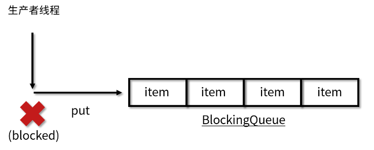
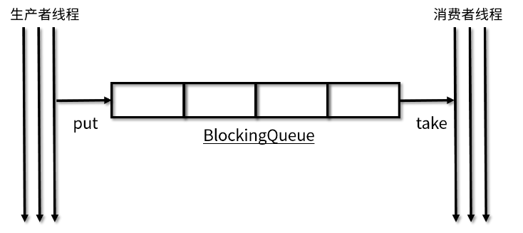
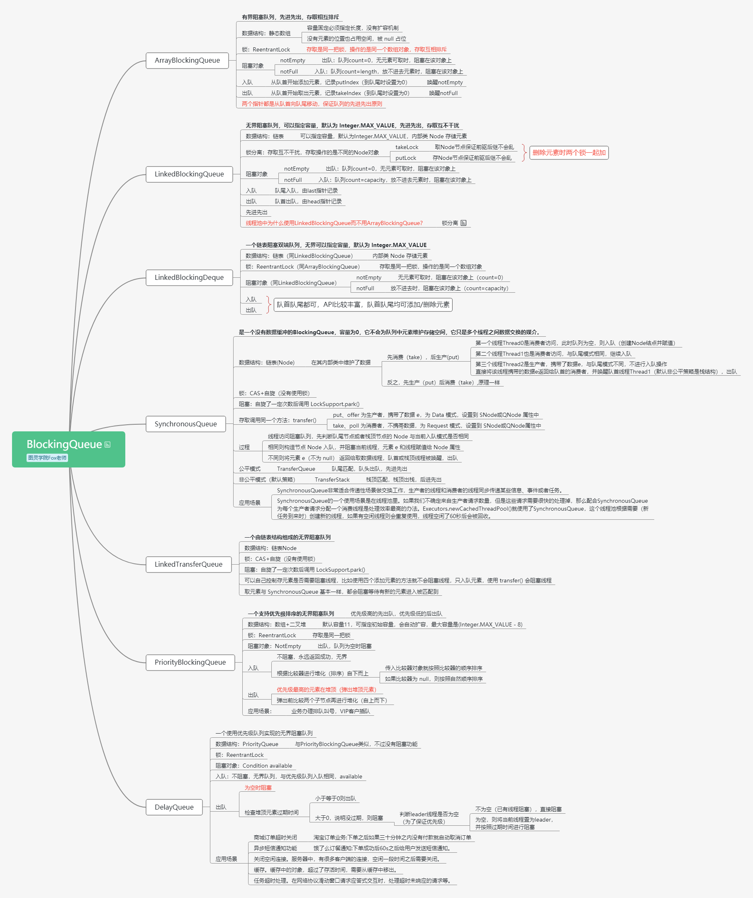
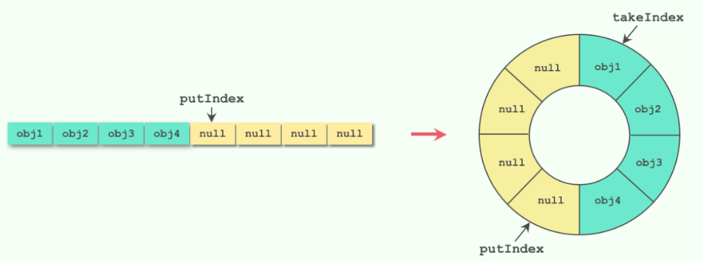

# 阻塞队列

**阻塞队列**

> 阻塞队列，顾名思义首先它是一个队列，通过一个共享的队列，可以使得数据又队列的一端输入，从另一端输出，重点其还是`阻塞的`。
>
> 1. 当队列空时，从队列中获取元素的操作将会被阻塞
> 2. 当队列满时，向队列添加元素的操作将会被阻塞

**为什么需要阻塞队列？**

> 好处时我们不需要关系是么时候需要阻塞线程，什么时候需要唤醒线程，因为这一切操作BlockingQueue都会帮我们完成，从而达到生产与消费的平衡。

## 1，Queue接口

Queue是阻塞队列的顶级接口定义阻塞队列公共的规范，如：添加元素，删除元素，获取元素

总的来说有：抛异常的，和不抛异常的

```java
public interface Queue<E> extends Collection<E> {
    //添加一个元素，添加成功返回true, 如果队列满了，就会抛出异常
    boolean add(E e);
    //添加一个元素，添加成功返回true, 如果队列满了，返回false
    boolean offer(E e);
    //返回并删除队首元素，队列为空则抛出异常
    E remove();
    //返回并删除队首元素，队列为空则返回null
    E poll();
    //返回队首元素，但不移除，队列为空则抛出异常
    E element();
    //获取队首元素，但不移除，队列为空则返回null
    E peek();
}
```

## 2，BlockingQueue接口

BlockingQueue 继承了 Queue 接口，阻塞队列（BlockingQueue）是一个在队列基础上又支持了两个附加操作的队列，常用解耦。

**附件操作**：

1.   支持阻塞的插入方法`put`: 队列满时，队列会阻塞插入元素的线程，直到队列不满。
2.   支持阻塞的移除方法`take`: 队列空时，获取元素的线程会等待队列变为非空。

```java
public interface BlockingQueue<E> extends Queue<E> {

    boolean add(E e);

    boolean offer(E e);

    void put(E e) throws InterruptedException;

    boolean offer(E e, long timeout, TimeUnit unit)
        throws InterruptedException;

    E take() throws InterruptedException;

    E poll(long timeout, TimeUnit unit)
        throws InterruptedException;

    int remainingCapacity();

    boolean remove(Object o);

    public boolean contains(Object o);

    int drainTo(Collection<? super E> c);

    int drainTo(Collection<? super E> c, int maxElements);
}

```

BlockingQueue和JDK集合包中的Queue接口兼容，同时在其基础上增加了`阻塞功能`。

### 2.1 常用方法

**BlockingQueue常用方法**

>   当队列满了无法添加元素，或者是队列空了无法移除元素时：
>
>   1.  **抛出异常**：add（添加）、remove（移除）、element（获取）
>   2.  返回结果但不抛出异常：offer（添加）、poll（移除）、peek（获取）
>   3.  阻塞：put（添加）、take（移除）

| 方法         | 抛出异常 | 返回特定值 | 阻塞 | 阻塞特定时间       |
| ------------ | -------- | ---------- | ---- | ------------------ |
| 入队         | add      | offer      | put  | put(e, time, unit) |
| 出队         | remove   | poll       | take | take(time, unit)   |
| 获取队首元素 | element  | peek       | -    | -                  |

```java
public class BlockingQueueTest {
    public static void main(String[] args) {
        // ...
    }

    /**
     * add 方法是往队列里添加一个元素，如果队列满了，就会抛出异常来提示队列已满。
     */
    private static void addTest() {
        BlockingQueue<Integer> blockingQueue = new ArrayBlockingQueue<Integer>(2);
        System.out.println(blockingQueue.add(1));
        System.out.println(blockingQueue.add(2));
        System.out.println(blockingQueue.add(3));
    }

    /**
     * remove 方法的作用是删除元素并返回队列的头节点，如果删除的队列是空的， remove 方法就会抛出异常。
     */
    private static void removeTest() {
        ArrayBlockingQueue<Integer> blockingQueue = new ArrayBlockingQueue<Integer>(2);
        blockingQueue.add(1);
        blockingQueue.add(2);
        System.out.println(blockingQueue.remove());
        System.out.println(blockingQueue.remove());
        System.out.println(blockingQueue.remove());
    }

    /**
     * element 方法是返回队列的头部节点，但是并不删除。如果队列为空，抛出异常
     */
    private static void elementTest() {
        ArrayBlockingQueue<Integer> blockingQueue = new ArrayBlockingQueue<Integer>(2);
        blockingQueue.element();
    }

    /**
     * offer 方法用来插入一个元素。如果添加成功会返回 true，而如果队列已经满了，返回false
     */
    private static void offerTest(){
        ArrayBlockingQueue<Integer> blockingQueue = new ArrayBlockingQueue<Integer>(2);
        System.out.println(blockingQueue.offer(1));
        System.out.println(blockingQueue.offer(2));
        System.out.println(blockingQueue.offer(3));
    }

    /**
     * poll 方法作用也是移除并返回队列的头节点。 如果队列为空，返回null
     */
    private static void pollTest() {
        ArrayBlockingQueue<Integer> blockingQueue = new ArrayBlockingQueue<Integer>(3);
        blockingQueue.offer(1);
        blockingQueue.offer(2);
        blockingQueue.offer(3);
        System.out.println(blockingQueue.poll());
        System.out.println(blockingQueue.poll());
        System.out.println(blockingQueue.poll());
        System.out.println(blockingQueue.poll());
    }

    /**
     * peek 方法返回队列的头元素但并不删除。 如果队列为空，返回null
     */
    private static void peekTest() {
        ArrayBlockingQueue<Integer> blockingQueue = new ArrayBlockingQueue<Integer>(2);
        System.out.println(blockingQueue.peek());
    }

    /**
     * put 方法的作用是插入元素。如果队列已满就无法继续插入,阻塞插入线程，直至队列空出位置 
     */
    private static void putTest(){
        BlockingQueue<Integer> blockingQueue = new ArrayBlockingQueue<Integer>(2);
        try {
            blockingQueue.put(1);
            blockingQueue.put(2);
            blockingQueue.put(3);
        } catch (InterruptedException e) {
            e.printStackTrace();
        }
    }

    /**
     * take 方法的作用是获取并移除队列的头结点。如果执队列里无数据，则阻塞，直到队列里有数据
     */
    private static void takeTest(){
        BlockingQueue<Integer> blockingQueue = new ArrayBlockingQueue<Integer>(2);
        try {
            blockingQueue.take();
        } catch (InterruptedException e) {
            e.printStackTrace();
        }
    }
```

## 3 ，阻塞队列特性

**阻塞**：阻塞队列区别于其他类型的队列的最主要的特点就是“阻塞”这两个字，所以下面重点介绍阻塞功能。

​		阻塞功能使得生产者和消费者两端的能力得以平衡，当有任何一端速度过快时，阻塞队列便会把过快的速度给降下来。实现阻塞最重要的两个方法是 `take` 方法和 `put` 方法。

### 2.1 take 方法

​		take 方法的功能是获取并移除队列的头结点，通常在队列里有数据的时候是可以正常移除的。可是一旦执行 take 方法的时候，队列里无数据，则阻塞线程直到队列里有数据。一旦队列里有数据了，就会立刻唤醒线程解除阻塞状态，并且取到数据。


### 2.2 put 方法

​		put 方法插入元素时，如果队列没有满，那就和普通的插入一样是正常的插入，但是如果队列已满，则阻塞线程，直到队列里有了空闲空间。如果后续队列有了空闲空间，比如消费者消费了一个元素，那么此时队列就会解除阻塞状态，并把需要添加的数据添加到队列中。



### 2.3  队列有界？

​		阻塞队列还有一个非常重要的属性，那就是容量的大小，分为有界和无界两种。无界队列意味着里面可以容纳非常多的元素，例如 LinkedBlockingQueue 的上限是内存大小，是非常大的一个数，可以近似认为是无限容量，因为我们几乎无法把这个容量装满。但是有的阻塞队列是有界的，例如 ArrayBlockingQueue 如果容量满了，也`不会扩容`，所以一旦满了就无法再往里放数据了。

### 2.4 应用场景

​		BlockingQueue 是线程安全的，我们在很多场景下都可以利用线程安全的队列来优雅地解决我们业务自身的线程安全问题。比如说，使用`生产者/消费者模式`的时候，我们生产者只需要往队列里添加元素，而消费者只需要从队列里取出它们就可以了。因为阻塞队列是线程安全的，所以生产者和消费者都可以是多线程的，不会发生线程安全问题。

​		同时，队列它还能起到一个隔离的作用。上下游不关心对方是是如何实现的。



### 2.5 常见的阻塞队列

| **队列**                  | 描述                                                      |
| ------------------------- | --------------------------------------------------------- |
| **ArrayBlockingQueue**    | 基于数组结构实现的一个有界阻塞队列                        |
| **LinkedBlockingQueue**   | 基于链表结构实现的一个有界阻塞队列                        |
| **PriorityBlockingQueue** | 支持按优先级排序的无界阻塞队列                            |
| **DelayQueue**            | 基于优先级队列（PriorityBlockingQueue）实现的无界阻塞队列 |
| **SynchronousQueue**      | 不存储元素的阻塞队列                                      |
| **LinkedTransferQueue**   | 基于链表结构实现的一个无界阻塞队列                        |
| **LinkedBlockingDeque**   | 基于链表结构实现的一个双端阻塞队列                        |



## 4，jdk阻塞队列源码分析

### 4.1 ArrayBlockingQueue

>   ​		ArrayBlockingQueue是最典型的有界阻塞队列，其内部是用数组存储元素的，初始化时需要指定容量大小，利用 ReentrantLock 实现线程安全，阻塞使用Conditon来实现。
>
>   ​		使用独占锁ReentrantLock实现线程安全，入队和出队操作使用同一个锁对象，也就是只能有一个线程可以进行入队或者出队操作；这也就意味着生产者和消费者无法并行操作，在高并发场景下会成为性能瓶颈。

**构造方法**| 最全

```java
public ArrayBlockingQueue(int capacity, boolean fair) {
    if (capacity <= 0)
        throw new IllegalArgumentException();
    this.items = new Object[capacity];
    lock = new ReentrantLock(fair);
    notEmpty = lock.newCondition();
    notFull =  lock.newCondition();
}
```

#### ArrayBlockingQueue原理

**数据结构**：`利用了Lock锁的Condition通知机制进行阻塞控制。`

**核心**：一把锁（ReentrantLock），两个条件（notEmpty，notFull队空队满的阻塞条件）

**其他**：其内部使用到了循环数组，在取出元素合插入元素是不需要移动元素，提高性能

ArrayBlockingQueue属性合构造方法

```java
// 数据元素数组
final Object[] items;
// 下一个待取出元素索引
int takeIndex;
// 下一个待添加元素索引
int putIndex;
// 元素个数
int count;
// 内部锁
final ReentrantLock lock;
// 消费者-出队为空时阻塞条件
private final Condition notEmpty;
// 生产者-入队满时阻塞条件
private final Condition notFull;  

public ArrayBlockingQueue(int capacity) {
    this(capacity, false);
}
public ArrayBlockingQueue(int capacity, boolean fair) {
    ...
    lock = new ReentrantLock(fair); //公平，非公平
    notEmpty = lock.newCondition();
    notFull =  lock.newCondition();
}
```

**入队 put** 

​		put方法需要判断队列是否满，若满需要阻塞，入队可以被中断的

```java
public void put(E e) throws InterruptedException {
    checkNotNull(e);
    final ReentrantLock lock = this.lock;
    lock.lockInterruptibly();
    try {
        while (count == items.length)
            notFull.await();
        enqueue(e);
    } finally {
        lock.unlock();
    }
}
```

 if (++putIndex == items.length)
        putIndex = 0;

入队这里实现了循环队列，循环队列实现从而不需要移动元素

```java
private void enqueue(E x) {
    final Object[] items = this.items;
    // 入队 使用的putIndex（下一个put元素的下标，即超前一个）
    items[putIndex] = x;
    if (++putIndex == items.length) 
        putIndex = 0;  //设计的精髓： 环形数组，putIndex指针到数组尽头了，返回头部
    count++;
    // notEmpty条件队列转同步队列，准备唤醒消费者线程，因为入队了一个元素，肯定不为空了
    notEmpty.signal();
}
```

**出队 take**

```java
public E take() throws InterruptedException {
    final ReentrantLock lock = this.lock;
    //加锁，如果线程中断抛出异常 
    lock.lockInterruptibly();
    try {
       // 如果队列为空，则消费者挂起
        while (count == 0)
            notEmpty.await();
        // 出队
        return dequeue();
    } finally {
        lock.unlock(); // 唤醒生产者线程
    }
}
```

```java
private E dequeue() {
    final Object[] items = this.items;
    @SuppressWarnings("unchecked")
    E x = (E) items[takeIndex]; //取出takeIndex位置的元素
    items[takeIndex] = null;
    if (++takeIndex == items.length)
        takeIndex = 0; //设计的精髓：环形数组，takeIndex 指针到数组尽头了，返回头部
    count--;
    if (itrs != null)
        itrs.elementDequeued();
    // notFull条件队列转同步队列，准备唤醒生产者线程，此时队列有空位
    notFull.signal();
    return x;
}
```

**循环队列**



### 4.2 LinkedBlockingQueue

>   ​		LinkedBlockingQueue是一个基于链表实现的阻塞队列，默认情况下，该阻塞队列的大小为Integer.MAX_VALUE，由于这个数值特别大，所以也被称作无界队列，但是随着元素的添加而动态增长，但是如果没有剩余内存，则队列将抛出OOM错误。所以为了避免队列过大造成机器负载或者内存爆满的情况出现，我们在使用的时候建议手动传一个队列的大小。
>
>   ​		LinkedBlockingQueue内部由单链表实现，只能从head取元素，从tail添加元素。其采用两把锁的锁分离技术实现入队出队互不阻塞，添加元素和获取元素都有独立的锁，也就是说LinkedBlockingQueue是读写分离的，读写操作可以并行执行。

**内部属性**

```java
// 容量,指定容量就是有界队列
private final int capacity;
// 元素数量
private final AtomicInteger count = new AtomicInteger();
// 链表头, 本身是不存储任何元素的，初始化时item指向null
transient Node<E> head;
// 链表尾
private transient Node<E> last;
// take锁   锁分离，提高效率
private final ReentrantLock takeLock = new ReentrantLock();
// notEmpty条件
// 当队列无元素时，take锁会阻塞在notEmpty条件上，等待其它线程唤醒
private final Condition notEmpty = takeLock.newCondition();
// put锁
private final ReentrantLock putLock = new ReentrantLock();
// notFull条件
// 当队列满了时，put锁会会阻塞在notFull上，等待其它线程唤醒
private final Condition notFull = putLock.newCondition();

// 典型的单链表结构
static class Node<E> {
    E item;  //存储元素
    Node<E> next;  //后继节点    单链表结构
    Node(E x) { item = x; }
}
```

**构造函数**

```java
public LinkedBlockingQueue() {
    // 如果没传容量，就使用最大int值初始化其容量
    this(Integer.MAX_VALUE);
}

public LinkedBlockingQueue(int capacity) {
    if (capacity <= 0) throw new IllegalArgumentException();
    this.capacity = capacity;
    // 初始化head和last指针为空值节点
    last = head = new Node<E>(null);
}
```

**入队**

```java
public void put(E e) throws InterruptedException {    
    // 不允许null元素
    if (e == null) throw new NullPointerException();
    int c = -1;
    // 新建一个节点
    Node<E> node = new Node<E>(e);
    final ReentrantLock putLock = this.putLock;
    final AtomicInteger count = this.count;
    // 使用put锁加锁
    putLock.lockInterruptibly();
    try {
        // 如果队列满了，就阻塞在notFull上等待被其它线程唤醒（阻塞生产者线程）
        while (count.get() == capacity) {
            notFull.await();
        }  
        // 队列不满，就入队
        enqueue(node);
        c = count.getAndIncrement();// 队列长度加1，返回原值
        // 如果现队列长度小于容量，notFull条件队列转同步队列，准备唤醒一个阻塞在notFull条件上的线程(可以继续入队) 
        // 这里为啥要唤醒一下呢？
        // 因为可能有很多线程阻塞在notFull这个条件上,而取元素时只有取之前队列是满的才会唤醒notFull,此处不用等到取元素时才唤醒
        if (c + 1 < capacity)
            notFull.signal();
    } finally {
        putLock.unlock(); // 真正唤醒生产者线程
    }  
    // 如果原队列长度为0，现在加了一个元素后立即唤醒阻塞在notEmpty上的线程
    if (c == 0)
        signalNotEmpty();
}
```

```java
private void enqueue(Node<E> node) { 
    // 直接加到last后面,last指向入队元素
    last = last.next = node;
} 
```

```java
private void signalNotEmpty() {
    final ReentrantLock takeLock = this.takeLock; 
    takeLock.lock();// 加take锁
    try {  
        notEmpty.signal();// notEmpty条件队列转同步队列，准备唤醒阻塞在notEmpty上的线程
    } finally {
        takeLock.unlock();  // 真正唤醒消费者线程
    }
}
```

**出队**

```java
public E take() throws InterruptedException {
    E x;
    int c = -1;
    final AtomicInteger count = this.count;
    final ReentrantLock takeLock = this.takeLock;
    // 使用takeLock加锁
    takeLock.lockInterruptibly();
    try {
        // 如果队列无元素，则阻塞在notEmpty条件上（消费者线程阻塞）
        while (count.get() == 0) {
            notEmpty.await();
        }
        // 否则，出队
        x = dequeue();
        c = count.getAndDecrement();//长度-1，返回原值
        if (c > 1)// 如果取之前队列长度大于1，notEmpty条件队列转同步队列，准备唤醒阻塞在notEmpty上的线程，原因与入队同理
            notEmpty.signal();
    } finally {
        takeLock.unlock(); // 真正唤醒消费者线程
    }
    // 为什么队列是满的才唤醒阻塞在notFull上的线程呢？
    // 因为唤醒是需要加putLock的，这是为了减少锁的次数,所以，这里索性在放完元素就检测一下，未满就唤醒其它notFull上的线程,
    // 这也是锁分离带来的代价
    // 如果取之前队列长度等于容量（已满），则唤醒阻塞在notFull的线程
    if (c == capacity)
        signalNotFull();
    return x;
}
private E dequeue() {
     // head节点本身是不存储任何元素的
    // 这里把head删除，并把head下一个节点作为新的值
    // 并把其值置空，返回原来的值
    Node<E> h = head;
    Node<E> first = h.next;
    h.next = h; // 方便GC
    head = first;
    E x = first.item;
    first.item = null;
    return x;
}
private void signalNotFull() {
    final ReentrantLock putLock = this.putLock;
    putLock.lock();
    try {
        notFull.signal();// notFull条件队列转同步队列，准备唤醒阻塞在notFull上的线程
    } finally {
        putLock.unlock(); // 解锁，这才会真正的唤醒生产者线程
    }
}
```

### 4.3 DelayQueue