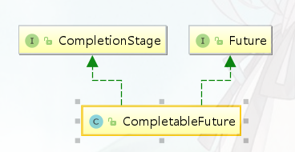

# Future

## 1，Callable&Future&FutureTask介绍

​		创建一个线程，可以直接extends Thread重写run方法或者实现Runnable接口交给Thread对象，但是这两种方法都有一个问题就是：<font color="red">没有返回值</font>，也就是不能获取执行完的结果(当然可以通过final变量取拿但不好)。

​		因此，jdk提供的Future和FutureTask就可以和Callable接口配合起来使用，弥补Runnable没有返回值的缺点。

### 1.1 Callable和Runnable

**Runnable**

```java
@FunctionalInterface
public interface Runnable {
    public abstract void run();
}
```

**缺陷**：

1.   不能返回一个返回值
2.   不能抛出受检异常，只能try catch

****

**Callable**

```java
@FunctionalInterface
public interface Callable<V> {
    V call() throws Exception;
}
```

>   Callable的call方法可以有返回值，并且可以抛出异常。
>
>   和Callable配合的有一个Future类，通过Tuture可以了解任务的执行情况，或者取消任务的执行，又或者获取任务执行结果。

```java
FutureTask task = new FutureTask(new Callable() {
    @Override
    public Object call() throws Exception {
        System.out.println("通过Callable方式执行任务");
        Thread.sleep(3000);
        return "返回任务结果";
    }
});
new Thread(task).start();
```


### 1.2 Future 功能

>   ​		Future就是对于具体的Runnable或者Callable任务的执行进行取消、查询是否完成、获取结果。必要时可以通过get方法获取执行结果，该方法会阻塞直到任务返回结果。

#### API

```java
// 取消任务的执行, 参数指定是否立即中断任务执行
boolean cancel (boolean mayInterruptIfRunning);
// 任务是否已经取消，任务正常完成前将其取消，则返回 true
boolean isCancelled ();
// 任务是否已经完成,注意的是如果任务正常终止、异常或取消，都将返回true
boolean isDone ();
// 等待任务执行结束，然后获得V类型的结果
V get () throws InterruptedException, ExecutionException;
// 获取结果，如果超时，将抛出TimeoutException
V get (long timeout, TimeUnit unit) throws InterruptedException, ExecutionException, TimeoutException
```


#### 使用

>   ​		Future实际采用FutureTask实现，该对象相当于是消费者和生产者的桥梁，消费者通过 FutureTask 存储任务的处理结果，更新任务的状态，如：未开始、正在处理、已完成等。
>
>   ​		生产者拿到的 FutureTask 被转型为 Future 接口，可以阻塞式获取任务的处理结果，非阻塞式获取任务处理状态。

**使用**：把 Callable 实例当作 FutureTask 构造函数的参数，生成 FutureTask 的对象，然后把这个对象当作一个 Runnable 对象，放到线程池中或另起线程去执行，最后还可以通过 FutureTask 获取任务执行的结果。

```java
public class FutureTaskDemo {
    public static void main(String[] args) throws ExecutionException, InterruptedException {
        Task task = new Task();
        //构建futureTask
        FutureTask<Integer> futureTask = new FutureTask<>(task);
        //作为Runnable入参
        new Thread(futureTask).start();
        System.out.println("task运行结果："+futureTask.get());
    }

    static class Task implements Callable<Integer> {
        @Override
        public Integer call() throws Exception {
            System.out.println("子线程正在计算");
            int sum = 0;
            for (int i = 0; i < 100; i++) {
                sum += i;
            }
            return sum;
        }
    }
}
```

**线程池的execute方法和submit方法？**

*   execute方法：无返回值，不抛出异常
*   submit方法：可以获取返回值	

** **

### 1.3 Future 源码

state是FutureTask成员变量，任务的执行状态

**get方法**

```java
public V get() throws InterruptedException, ExecutionException {
    int s = state;
    if (s <= COMPLETING)
        // 若任务没有执行完成，则阻塞park当前线程，任务完成时唤醒线程
        s = awaitDone(false, 0L);
    // 返回结果
    return report(s);
}
```

**注意事项**：

*   当 for 循环批量获取 Future 的结果时容易 block，get 方法调用时应使用 timeout 限制
*   Future 的生命周期不能后退，即一旦完成了任务，它就永久停在了“已完成”的状态，不能从头再来。

****

**唤醒get线程**

```java
public void run() {
    if (state != NEW ||
        !UNSAFE.compareAndSwapObject(this, runnerOffset,
                                     null, Thread.currentThread()))
        return;
    try {
        Callable<V> c = callable;
        if (c != null && state == NEW) {
            V result;
            boolean ran;
            try {
                result = c.call();
                ran = true;
            } catch (Throwable ex) {
                result = null;
                ran = false;
                setException(ex);
            }
            if (ran)
                // 里面unpark唤醒线程
                set(result);
        }
    } finally {
        // runner must be non-null until state is settled to
        // prevent concurrent calls to run()
        runner = null;
        // state must be re-read after nulling runner to prevent
        // leaked interrupts
        int s = state;
        if (s >= INTERRUPTING)
            handlePossibleCancellationInterrupt(s);
    }
}
```

#### 1.4 Future 局限性

>   从本质上说，**Future表示一个异步计算的结果**。它提供了isDone()来检测计算是否已经完成，并且在计算结束后，可以通过get()方法来获取计算结果。在异步计算中，Future确实是个非常优秀的接口。但是，它的本身也确实存在着许多限制。

1.   **并发执行多任务**：Future只提供了get()阻塞方法来获取结果，多线程仍有性能问题。
2.   **无法对多个任务进行链式调用**：即多个任务无法按指定计划依次执行
3.   **无法组合多个任务**：即无法在一组任务都执行完毕之后执行特定的动作
4.   **没有异常处理**：Future接口中没有关于异常处理的方法；

### 2，CompletionService

>   ​		Callable+Future 可以实现多个task并行执行，但是如果遇到前面的task执行较慢时需要阻塞等待前面的task执行完后面task才能取得结果。而CompletionService的主要功能就是`一边生成任务，一边获取任务的返回值`。让两件事分开执行，任务之间不会互相阻塞，可以实现先执行完的先取结果，不再依赖任务顺序了。
>
>   ****
>
>   **实现原理**：
>
>   ​		内部通过阻塞队列+FutureTask，实现了任务先完成可优先获取到，即结果按照完成先后顺序排序，内部有一个先进先出的阻塞队列，用于保存已经执行完成的Future，通过调用它的take方法或poll方法可以获取到一个已经执行完成的Future，进而通过调用Future接口实现类的get方法获取最终的结果。

**案例**

**询价应用：向不同电商平台询价，并保存价格**

1.   **采用“ThreadPoolExecutor+Future”的方案：异步执行询价然后再保存**

     ```java
     //    创建线程池 
     ExecutorService    executor = Executors.newFixedThreadPool(3); 
     //    异步向电商S1询价 
     Future<Integer>    f1 = executor.submit(()->getPriceByS1()); 
     //    异步向电商S2询价 
     Future<Integer>    f2=    executor.submit(()->getPriceByS2());             
     //    获取电商S1报价并异步保存 
     executor.execute(()->save(f1.get()));        
     //    获取电商S2报价并异步保存 
     executor.execute(()->save(f2.get())   
     ```

     如果获取电商S1报价的耗时很长，那么即便获取电商S2报价的耗时很短，也无法让保存S2报价的操作先执行，因为这个主线程都阻塞 在了f1.get()操作上。

****

2.   **使用CompletionService实现先获取的报价先保存到数据库**

     ```java
     //创建线程池
     ExecutorService executor = Executors.newFixedThreadPool(10);
     //创建CompletionService
     CompletionService<Integer> cs = new ExecutorCompletionService<>(executor);
     //异步向电商S1询价
     cs.submit(() -> getPriceByS1());
     //异步向电商S2询价
     cs.submit(() -> getPriceByS2());
     //异步向电商S3询价
     cs.submit(() -> getPriceByS3());
     //将询价结果异步保存到数据库
     for (int i = 0; i < 3; i++) {
         Integer r = cs.take().get();
         executor.execute(() -> save(r));
     }
     ```

     ****

     **应用场景总结**

     -   当需要批量提交异步任务的时候建议你使用CompletionService。CompletionService将线程池Executor和阻塞队列BlockingQueue的功能融合在了一起，能够让批量异步任务的管理更简单。
     -   CompletionService能够让异步任务的执行结果有序化。先执行完的先进入阻塞队列，利用这个特性，你可以轻松实现后续处理的有序性，避免无谓的等待，同时还可以快速实现诸如Forking Cluster这样的需求。
     -   线程池隔离。CompletionService支持自己创建线程池，这种隔离性能避免几个特别耗时的任务拖垮整个应用的风险。

     ****

     # CompletableFuture

>   ​		简单的任务，用Future获取结果还好，但我们并行提交的多个异步任务，往往并不是独立的，很多时候业务逻辑处理存在串行[依赖]、并行、聚合的关系。如果要我们手动用 Fueture 实现，是非常麻烦的。
>
>   **CompletableFuture是Future接口的扩展和增强**。**CompletableFuture实现了对任务的编排能力**。



*   **CompletionStage接口**：执行某一个阶段，可向下执行后续阶段

## 1，API使用-异步编排

### 1.1 创建异步操作

CompletableFuture 提供了四个静态方法来创建一个异步操作

```java
// runXxx 参数是Runnable无返回结果
public static CompletableFuture<Void> runAsync(Runnable runnable)
public static CompletableFuture<Void> runAsync(Runnable runnable, Executor executor)
// supplyXxx 参数supplier有返回结果， get() 方法获取返回值（会阻塞）
public static <U> CompletableFuture<U> supplyAsync(Supplier<U> supplier)
public static <U> CompletableFuture<U> supplyAsync(Supplier<U> supplier, Executor executor)
```

**案例**

```java
Runnable runnable = () -> System.out.println("执行无返回结果的异步任务");
CompletableFuture.runAsync(runnable);
CompletableFuture<String> future = CompletableFuture.supplyAsync(() -> {
    System.out.println("执行有返回值的异步任务");
    try {
        Thread.sleep(5000);
    } catch (InterruptedException e) {
        e.printStackTrace();
    }
    return "Hello World";
});
String result = future.get();
```

**注意**：没有指定Executor的方法会使用ForkJoinPool.commonPool() 作为它的线程池执行异步代码，强烈不推荐。

### 1.2 获取结果

**join&get**

>   join()和get()方法都是用来获取CompletableFuture异步之后的返回值。
>
>   1.   join()方法抛出的是uncheck异常（即未经检查的异常)，不会强制开发者抛出。
>   2.   get()方法抛出的是经过检查的异常，ExecutionException, InterruptedException 需要用户手动处理（抛出或者 try catch）

### 1.3 结果处理-结果感知

当CompletableFuture的计算结果完成，或者抛出异常的时候，我们可以拿结果执行特定的 Action，有两种方法。

1. 通过future.get()阻塞等待，等task完成之后去执行

2. 通过CompletableFuture 完成时的回调函数去执行

    **注意：**

    ​	1. 回调函数本身也是一个任务

    ​	2. BiConsumer消费型接口没有返回值

```java
public CompletableFuture<T> whenComplete(BiConsumer<? super T,? super Throwable> action)
public CompletableFuture<T> whenCompleteAsync(BiConsumer<? super T,? super Throwable> action)
public CompletableFuture<T> whenCompleteAsync(BiConsumer<? super T,? super Throwable> action, Executor executor
```

**案例**

```java
// 正常
public static void main(String[] args) throws ExecutionException, InterruptedException {
    ExecutorService executorService = Executors.newFixedThreadPool(10);
    CompletableFuture<String> completableFuture = CompletableFuture.supplyAsync(() -> "hello world", executorService)
        .whenComplete((result, e) -> {
            Optional.ofNullable(e).ifPresent((e1) -> {
                System.out.println("异常是：" + e1);
            });
            System.out.println("结果是：" + result);
        });
}

// 异常
public static void main(String[] args) throws ExecutionException, InterruptedException {
    ExecutorService executorService = Executors.newFixedThreadPool(10);
    CompletableFuture<String> completableFuture = CompletableFuture.supplyAsync(() -> "hello world".substring(50), executorService)
        .whenComplete((result, e) -> {
            Optional.ofNullable(e).ifPresent((e1) -> {
                System.out.println("异常是：" + e1);
            });
            System.out.println("结果是：" + result);
        });
}

// 有异常时处理
future.exceptionally(new Function<Throwable, String>() {
    @Override
    public String apply(Throwable t) {
        System.out.println("执行失败：" + t.getMessage());
        return "异常xxxx";
    }
}
```

### 1.4 结果转化

所谓结果转换，就是将上一段任务的执行结果作为下一阶段任务的入参参与重新计算，产生新的结果。

```java
public <U> CompletableFuture<U> thenApply(Function<? super T,? extends U> fn)
public <U> CompletableFuture<U> thenApplyAsync(Function<? super T,? extends U> fn)
public <U> CompletableFuture<U> thenCompose(Function<? super T, ? extends CompletionStage<U>> fn);
public <U> CompletableFuture<U> thenComposeAsync(Function<? super T, ? extends CompletionStage<U>> fn) ;    
```

**thenApply**:

thenApply 接收一个函数作为参数，使用该函数处理上一个CompletableFuture 调用的结果，并返回一个具有处理结果的Future对象。

```java
CompletableFuture<Integer> future = CompletableFuture.supplyAsync(() -> {
    int result = 100;
    System.out.println("一阶段：" + result);
    return result;
}).thenApply(number -> {
    int result = number * 3;
    System.out.println("二阶段：" + result);
    return result;
});
```

****

**thenCompose**:

thenCompose 的参数为一个返回 CompletableFuture 实例的函数，该函数的参数是先前计算步骤的结果。

```java
CompletableFuture<Integer> future = CompletableFuture
    .supplyAsync(new Supplier<Integer>() {
        @Override
        public Integer get() {
            int number = new Random().nextInt(30);
            System.out.println("第一阶段：" + number);
            return number;
        }
    })
    .thenCompose(new Function<Integer, CompletionStage<Integer>>() {
        @Override
        public CompletionStage<Integer> apply(Integer param) {
            return CompletableFuture.supplyAsync(new Supplier<Integer>() {
                @Override
                public Integer get() {
                    int number = param * 2;
                    System.out.println("第二阶段：" + number);
                    return number;
                }
            });
        }
    });
}
```

**thenApply 和 thenCompose的区别**

-   thenApply 转换的是泛型中的类型，返回的是同一个CompletableFuture；
-   thenCompose 将内部的 CompletableFuture 调用展开来并使用上一个CompletableFutre 调用的结果在下一步的 CompletableFuture 调用中进行运算，是生成一个新的CompletableFuture。

### 1.5 结果消费

​		与结果处理和结果转换系列函数返回一个新的 CompletableFuture 不同，结果消费系列函数只对结果执行Action，而不返回新的计算值，即返回的Future是Void调用get方法是没有结果的。

#### thenAccept

通过观察该系列函数的参数类型可知，它们是函数式接口Consumer，这个接口只有输入，没有返回值。

```java
public CompletionStage<Void> thenAccept(Consumer<? super T> action);
public CompletionStage<Void> thenAcceptAsync(Consumer<? super T> action);
```

**案例**

```java
// Void
CompletableFuture<Void> future = CompletableFuture
    .supplyAsync(() -> {
        int number = new Random().nextInt(10);
        System.out.println("第一阶段：" + number);
        return number;
    }).thenAccept(number -> System.out.println("第二阶段：" + number * 5));
}
```

#### thenAcceptBoth

thenAcceptBoth 函数的作用是，当两个 CompletionStage 都正常完成计算的时候，就会执行提供的action消费两个异步的结果。

```java
CompletableFuture<Integer> futrue1 = CompletableFuture.supplyAsync(new Supplier<Integer>() {
    @Override
    public Integer get() {
        int number = new Random().nextInt(3) + 1;
        try {
            TimeUnit.SECONDS.sleep(number);
        } catch (InterruptedException e) {
            e.printStackTrace();
        }
        System.out.println("第一阶段：" + number);
        return number;
    }
});

CompletableFuture<Integer> future2 = CompletableFuture.supplyAsync(new Supplier<Integer>() {
    @Override
    public Integer get() {
        int number = new Random().nextInt(3) + 1;
        try {
            TimeUnit.SECONDS.sleep(number);
        } catch (InterruptedException e) {
            e.printStackTrace();
        }
        System.out.println("第二阶段：" + number);
        return number;
    }
});

futrue1.thenAcceptBoth(future2, new BiConsumer<Integer, Integer>() {
    @Override
    public void accept(Integer x, Integer y) {
        System.out.println("最终结果：" + (x + y));
    }
}
```

#### thenRun

​		thenRun 也是对线程任务结果的一种消费函数，与thenAccept不同的是，thenRun 会在上一阶段 CompletableFuture 计算完成的时候执行一个Runnable，Runnable并不使用该 CompletableFuture 计算的结果(非结果消费)。

```java
public CompletionStage<Void> thenRun(Runnable action);
public CompletionStage<Void> thenRunAsync(Runnable action);
```

**案例**

```java
CompletableFuture<Void> future = CompletableFuture.supplyAsync(() -> {
    int number = new Random().nextInt(10);
    System.out.println("第一阶段：" + number);
    return number;
}).thenRun(() ->
        System.out.println("thenRun 执行"));
}
```


## 2，任务组合

### 2.1 两个任务组合

#### 1. 两个结果组合

两个任务必须都完成，触发action。

**thenCombine**：组合两个 future，获取两个 future 的返回结果，并返回当前任务的返回值

* 感知两个任务完成，并且接收其执行结果, 返回新的结果

 **thenAcceptBoth**：组合两个 future，获取两个 future 任务的返回结果，然后处理任务，没有返回值

* 感知两个任务完成，并且接收其执行结果, 并不返回新的结果

```java
thenCombine()// 任务合并，有返回值
thenAccepetBoth() // 两个任务执行完成后，将结果交给thenAccepetBoth消耗，无返回值。
```

**案例**

```java
// ******************************
public static void main(String[] args) throws ExecutionException, InterruptedException {
    ExecutorService executorService = Executors.newFixedThreadPool(10);
    // 第一个任务
    CompletableFuture<Integer> future1 = CompletableFuture.supplyAsync(() -> {
        System.out.println("任务一启动执行了");
        int i = 10 / 2;
        return i;
    }, executorService);

    // 第二个任务
    CompletableFuture<Void> future2 = CompletableFuture.runAsync(() -> {
        System.out.println("任务二启动执行了");
    }, executorService);

    // 第三任务即lambda表达式
    CompletableFuture<String> future3 = future1.thenCombineAsync(future2, (result1, result2) -> {
        System.out.println("任务一结果：" + result1);
        System.out.println("任务二结果：" + result2);
        return "hello thenCombineAsync";
    });
    System.out.println(future3.get());
}

//************* 发现若线程没有返回结果，则使用thenAcceptBothAsync接收的结果为null
public static void main(String[] args) throws ExecutionException, InterruptedException {
    ExecutorService executorService = Executors.newFixedThreadPool(10);
    // 第一个任务
    CompletableFuture<Integer> future1 = CompletableFuture.supplyAsync(() -> {
        System.out.println("任务一启动执行了");
        int i = 10 / 2;
        return i;
    }, executorService);

    // 第二个任务
    CompletableFuture<Void> future2 = CompletableFuture.runAsync(() -> {
        System.out.println("任务二启动执行了");
    }, executorService);

    // 第三任务即lambda表达式
    future1.thenAcceptBothAsync(future2, (result1, result2) -> {
        System.out.println("任务一结果：" + result1);
        System.out.println("任务二结果：" + result2);
    });
}
```

#### 2. 感知两个任务完成

runAfterBoth 仅仅感知两个任务完成，不获取结果，也不返回新结果。

```java
// ------------------------------ runAfterBoth
public static void main(String[] args) throws ExecutionException, InterruptedException {
    ExecutorService executorService = Executors.newFixedThreadPool(10);
    // 第一个任务
    CompletableFuture<Integer> future1 = CompletableFuture.supplyAsync(() -> {
        System.out.println("任务一启动执行了");
        int i = 10 / 2;
        return i;
    }, executorService);

    // 第二个任务
    CompletableFuture<Void> future2 = CompletableFuture.runAsync(() -> {
        System.out.println("任务二启动执行了");
    }, executorService);

    // 第三任务即lambda表达式
    future1.runAfterBoth(future2, () -> {
        System.out.println("任务3在等待任务1 和 2都在执行后执行");
    });
}
```

### 2.2 任务交换

​		所谓线程交互，是指将两个线程任务获取结果的速度相比较，按一定的规则进行下一步处理（即两种其中之一完成就执行下一步）。

****

**applyToEither**: 结果转化

两个线程任务相比较，先获得执行结果的，就对该结果进行下一步的`结果转化`操作。

```java
public <U> CompletionStage<U> applyToEither(CompletionStage<? extends T> other,Function<? super T, U> fn);
public <U> CompletionStage<U> applyToEitherAsync(CompletionStage<? extends T> other,Function<? super T, U> fn);
```

**案例**

```java
CompletableFuture<Integer> future1 = CompletableFuture
    .supplyAsync(new Supplier<Integer>() {
        @Override
        public Integer get() {
            int number = new Random().nextInt(10);
            System.out.println("第一阶段start：" + number);
            try {
                TimeUnit.SECONDS.sleep(number);
            } catch (InterruptedException e) {
                e.printStackTrace();
            }
            System.out.println("第一阶段end：" + number);
            return number;
        }
    });

CompletableFuture<Integer> future2 = CompletableFuture
    .supplyAsync(new Supplier<Integer>() {
        @Override
        public Integer get() {
            int number = new Random().nextInt(10);
            System.out.println("第二阶段start：" + number);
            try {
                TimeUnit.SECONDS.sleep(number);
            } catch (InterruptedException e) {
                e.printStackTrace();
            }
            System.out.println("第二阶段end：" + number);
            return number;
        }
    });

future1.applyToEither(future2, new Function<Integer, Integer>() {
        @Override
        public Integer apply(Integer number) {
            System.out.println("最快结果：" + number);
            return number * 2;
        }
	});
```

****

**acceptEither** : 结果消费

两个线程任务相比较，先获得执行结果的，就对该结果进行下一步的`结果消费`操作。

```java
public CompletionStage<Void> acceptEither(CompletionStage<? extends T> other,Consumer<? super T> action);
public CompletionStage<Void> acceptEitherAsync(CompletionStage<? extends T> other,Consumer<? super T> action);
```

**案例**

```java
CompletableFuture<Integer> future1 = CompletableFuture
        .supplyAsync(new Supplier<Integer>() {
            @Override
            public Integer get() {
                int number = new Random().nextInt(10) + 1;
                try {
                    TimeUnit.SECONDS.sleep(number);
                } catch (InterruptedException e) {
                    e.printStackTrace();
                }
                System.out.println("第一阶段：" + number);
                return number;
            }
        });

CompletableFuture<Integer> future2 = CompletableFuture
        .supplyAsync(new Supplier<Integer>() {
            @Override
            public Integer get() {
                int number = new Random().nextInt(10) + 1;
                try {
                    TimeUnit.SECONDS.sleep(number);
                } catch (InterruptedException e) {
                    e.printStackTrace();
                }
                System.out.println("第二阶段：" + number);
                return number;
            }
        });

future1.acceptEither(future2, new Consumer<Integer>() {
        @Override
        public void accept(Integer number) {
            System.out.println("最快结果：" + number);
        }
    });
```

****

**runAfterEither**

两个线程任务相比较，有任何一个执行完成，就进行下一步操作，不关心运行结果。

```java
public CompletionStage<Void> runAfterEither(CompletionStage<?> other,Runnable action); public CompletionStage<Void> runAfterEitherAsync(CompletionStage<?> other,Runnable action);  
```

 **案例**

```java
CompletableFuture<Integer> future1 = CompletableFuture
        .supplyAsync(new Supplier<Integer>() {
            @Override
            public Integer get() {
                int number = new Random().nextInt(5);
                try {
                    TimeUnit.SECONDS.sleep(number);
                } catch (InterruptedException e) {
                    e.printStackTrace();
                }
                System.out.println("第一阶段：" + number);
                return number;
            }
        });

CompletableFuture<Integer> future2 = CompletableFuture
        .supplyAsync(new Supplier<Integer>() {
            @Override
            public Integer get() {
                int number = new Random().nextInt(5);
                try {
                    TimeUnit.SECONDS.sleep(number);
                } catch (InterruptedException e) {
                    e.printStackTrace();
                }
                System.out.println("第二阶段：" + number);
                return number;
            }
        });

future1.runAfterEither(future2, new Runnable() {
    @Override
    public void run() {
        System.out.println("已经有一个任务完成了");
    }
}).join();
```

###  2.3 多个任务的组合

> 静态方法：
>
> **allOf**: 等待所有的任务完成，才触发
>
> **anyOf**：只要有一个任务完成就会触发

```java
public static CompletableFuture<Void> allOf(CompletableFuture<?>... cfs) {
    return andTree(cfs, 0, cfs.length - 1);
}

public static CompletableFuture<Object> anyOf(CompletableFuture<?>... cfs) {
    return orTree(cfs, 0, cfs.length - 1);
}
```


```java
public static void main(String[] args) throws ExecutionException, InterruptedException {
    ExecutorService executorService = Executors.newFixedThreadPool(10);
    // 第一个任务
    CompletableFuture<Integer> future1 = CompletableFuture.supplyAsync(() -> {
        System.out.println("任务一启动执行了");
        int i = 10 / 2;
        return i;
    }, executorService);

    // 第二个任务
    CompletableFuture<Integer> future2 = CompletableFuture.supplyAsync(() -> {
        try {
            Thread.sleep(2000);
            System.out.println("任务二启动执行了");
            return 1;
        } catch (InterruptedException e) {
            e.printStackTrace();
        }
        return 0;
    }, executorService);

    CompletableFuture<Integer> future3 = CompletableFuture.supplyAsync(() -> {
        System.out.println("任务三启动执行了");
        return 55;
    }, executorService);
    CompletableFuture<Void> allOf = CompletableFuture.allOf(future1, future2, future3);
    // 等待所有任务完成
    allOf.join(); // 获取allOf.get()
    System.out.println("任务结束");
}
```

**总结**


