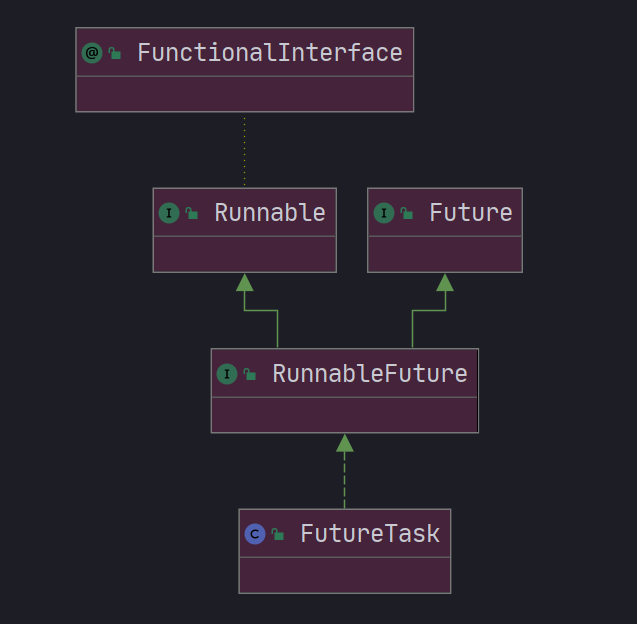
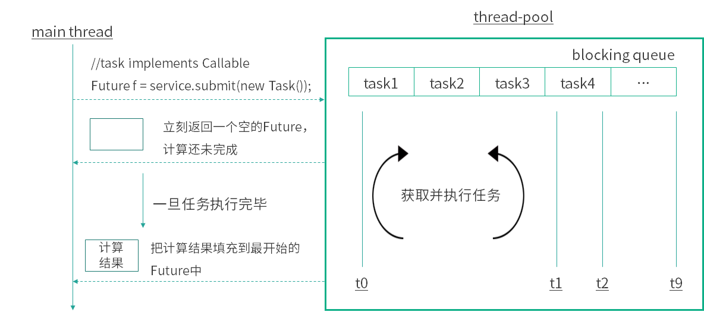

# Future

## 1，Callable&Future&FutureTask介绍

​		创建一个线程，可以直接extends Thread重写run方法或者实现Runnable接口交给Thread对象，但是这两种方法都有一个问题就是：<font color="red">没有返回值</font>，也就是不能获取执行完的结果(当然可以通过final变量取拿但不好)。

​		因此，jdk提供的Future和FutureTask就可以和Callable接口配合起来使用，弥补Runnable没有返回值的缺点。

### 1.1 Callable和Runnable

**Runnable**

```java
@FunctionalInterface
public interface Runnable {
    public abstract void run();
}
```

**缺陷**：

1.   不能返回一个返回值
2.   不能抛出受检异常，只能try catch

****

**Callable**

```java
@FunctionalInterface
public interface Callable<V> {
    V call() throws Exception;
}
```

>   Callable的call方法可以有返回值，并且可以抛出异常。
>
>   和Callable配合的有一个Future类，通过Tuture可以了解任务的执行情况，或者取消任务的执行，又或者获取任务执行结果。

```java
FutureTask task = new FutureTask(new Callable() {
    @Override
    public Object call() throws Exception {
        System.out.println("通过Callable方式执行任务");
        Thread.sleep(3000);
        return "返回任务结果";
    }
});
new Thread(task).start();
```



### 1.2 Future 功能

>   ​		Future就是对于具体的Runnable或者Callable任务的执行进行取消、查询是否完成、获取结果。必要时可以通过get方法获取执行结果，该方法会阻塞直到任务返回结果。

#### API

```java
// 取消任务的执行, 参数指定是否立即中断任务执行
boolean cancel (boolean mayInterruptIfRunning);
// 任务是否已经取消，任务正常完成前将其取消，则返回 true
boolean isCancelled ();
// 任务是否已经完成,注意的是如果任务正常终止、异常或取消，都将返回true
boolean isDone ();
// 等待任务执行结束，然后获得V类型的结果
V get () throws InterruptedException, ExecutionException;
// 获取结果，如果超时，将抛出TimeoutException
V get (long timeout, TimeUnit unit) throws InterruptedException, ExecutionException, TimeoutException
```



#### 使用

>   ​		Future实际采用FutureTask实现，该对象相当于是消费者和生产者的桥梁，消费者通过 FutureTask 存储任务的处理结果，更新任务的状态，如：未开始、正在处理、已完成等。
>
>   ​		生产者拿到的 FutureTask 被转型为 Future 接口，可以阻塞式获取任务的处理结果，非阻塞式获取任务处理状态。

**使用**：把 Callable 实例当作 FutureTask 构造函数的参数，生成 FutureTask 的对象，然后把这个对象当作一个 Runnable 对象，放到线程池中或另起线程去执行，最后还可以通过 FutureTask 获取任务执行的结果。

```java
public class FutureTaskDemo {
    public static void main(String[] args) throws ExecutionException, InterruptedException {
        Task task = new Task();
        //构建futureTask
        FutureTask<Integer> futureTask = new FutureTask<>(task);
        //作为Runnable入参
        new Thread(futureTask).start();
        System.out.println("task运行结果："+futureTask.get());
    }

    static class Task implements Callable<Integer> {
        @Override
        public Integer call() throws Exception {
            System.out.println("子线程正在计算");
            int sum = 0;
            for (int i = 0; i < 100; i++) {
                sum += i;
            }
            return sum;
        }
    }
}
```

**线程池的execute方法和submit方法？**

*   execute方法：无返回值，不抛出异常
*   submit方法：可以获取返回值	

** **

### 1.3 Future 源码

state是FutureTask成员变量，任务的执行状态

**get方法**

```java
public V get() throws InterruptedException, ExecutionException {
    int s = state;
    if (s <= COMPLETING)
        // 若任务没有执行完成，则阻塞park当前线程，任务完成时唤醒线程
        s = awaitDone(false, 0L);
    // 返回结果
    return report(s);
}
```

**注意事项**：

*   当 for 循环批量获取 Future 的结果时容易 block，get 方法调用时应使用 timeout 限制
*   Future 的生命周期不能后退，即一旦完成了任务，它就永久停在了“已完成”的状态，不能从头再来。

****

**唤醒get线程**

```java
public void run() {
    if (state != NEW ||
        !UNSAFE.compareAndSwapObject(this, runnerOffset,
                                     null, Thread.currentThread()))
        return;
    try {
        Callable<V> c = callable;
        if (c != null && state == NEW) {
            V result;
            boolean ran;
            try {
                result = c.call();
                ran = true;
            } catch (Throwable ex) {
                result = null;
                ran = false;
                setException(ex);
            }
            if (ran)
                // 里面unpark唤醒线程
                set(result);
        }
    } finally {
        // runner must be non-null until state is settled to
        // prevent concurrent calls to run()
        runner = null;
        // state must be re-read after nulling runner to prevent
        // leaked interrupts
        int s = state;
        if (s >= INTERRUPTING)
            handlePossibleCancellationInterrupt(s);
    }
}
```


#### 1.4 Future 局限性

>   从本质上说，**Future表示一个异步计算的结果**。它提供了isDone()来检测计算是否已经完成，并且在计算结束后，可以通过get()方法来获取计算结果。在异步计算中，Future确实是个非常优秀的接口。但是，它的本身也确实存在着许多限制。

1.   **并发执行多任务**：Future只提供了get()阻塞方法来获取结果，多线程仍有性能问题。
2.   **无法对多个任务进行链式调用**：即多个任务无法按指定计划依次执行
3.   **无法组合多个任务**：即无法在一组任务都执行完毕之后执行特定的动作
4.   **没有异常处理**：Future接口中没有关于异常处理的方法；

### 2，CompletionService

>   ​		Callable+Future 可以实现多个task并行执行，但是如果遇到前面的task执行较慢时需要阻塞等待前面的task执行完后面task才能取得结果。而CompletionService的主要功能就是`一边生成任务，一边获取任务的返回值`。让两件事分开执行，任务之间不会互相阻塞，可以实现先执行完的先取结果，不再依赖任务顺序了。
>
>   ****
>
>   **实现原理**：
>
>   ​		内部通过阻塞队列+FutureTask，实现了任务先完成可优先获取到，即结果按照完成先后顺序排序，内部有一个先进先出的阻塞队列，用于保存已经执行完成的Future，通过调用它的take方法或poll方法可以获取到一个已经执行完成的Future，进而通过调用Future接口实现类的get方法获取最终的结果。

**案例**

**询价应用：向不同电商平台询价，并保存价格**

1.   **采用“ThreadPoolExecutor+Future”的方案：异步执行询价然后再保存**

     ```java
     //    创建线程池 
     ExecutorService    executor = Executors.newFixedThreadPool(3); 
     //    异步向电商S1询价 
     Future<Integer>    f1 = executor.submit(()->getPriceByS1()); 
     //    异步向电商S2询价 
     Future<Integer>    f2=    executor.submit(()->getPriceByS2());             
     //    获取电商S1报价并异步保存 
     executor.execute(()->save(f1.get()));        
     //    获取电商S2报价并异步保存 
     executor.execute(()->save(f2.get())   
     ```

     如果获取电商S1报价的耗时很长，那么即便获取电商S2报价的耗时很短，也无法让保存S2报价的操作先执行，因为这个主线程都阻塞 在了f1.get()操作上。

****

2.   **使用CompletionService实现先获取的报价先保存到数据库**

     ```java
     //创建线程池
     ExecutorService executor = Executors.newFixedThreadPool(10);
     //创建CompletionService
     CompletionService<Integer> cs = new ExecutorCompletionService<>(executor);
     //异步向电商S1询价
     cs.submit(() -> getPriceByS1());
     //异步向电商S2询价
     cs.submit(() -> getPriceByS2());
     //异步向电商S3询价
     cs.submit(() -> getPriceByS3());
     //将询价结果异步保存到数据库
     for (int i = 0; i < 3; i++) {
         Integer r = cs.take().get();
         executor.execute(() -> save(r));
     }
     ```

     ****

     **应用场景总结**

     -   当需要批量提交异步任务的时候建议你使用CompletionService。CompletionService将线程池Executor和阻塞队列BlockingQueue的功能融合在了一起，能够让批量异步任务的管理更简单。
     -   CompletionService能够让异步任务的执行结果有序化。先执行完的先进入阻塞队列，利用这个特性，你可以轻松实现后续处理的有序性，避免无谓的等待，同时还可以快速实现诸如Forking Cluster这样的需求。
     -   线程池隔离。CompletionService支持自己创建线程池，这种隔离性能避免几个特别耗时的任务拖垮整个应用的风险。

     ****

     # CompletableFuture

