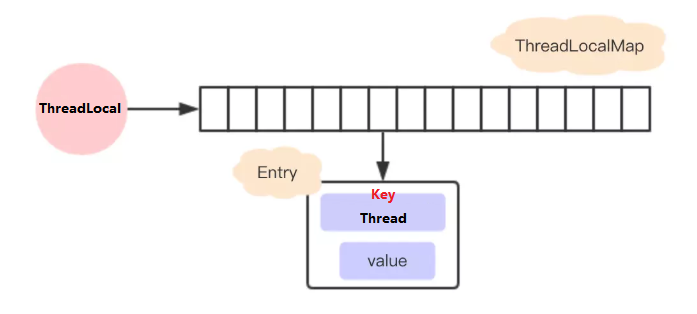
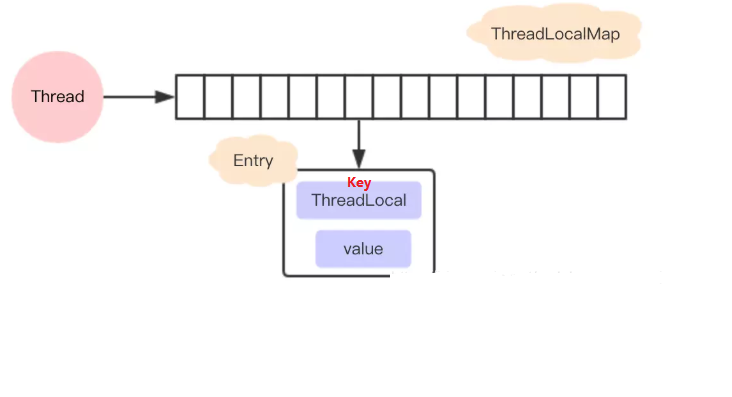
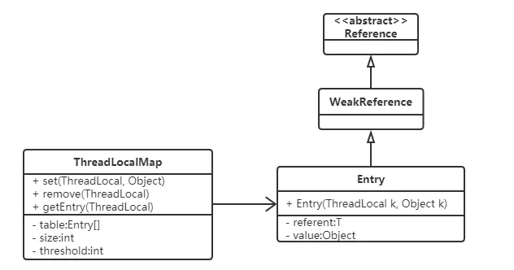

# ThreadLocal

​		TheadLocal 类用来提供线程内部的局部变量。这种变量在多线程环境时包装各个线程的变量相对独立于其他线程内的变量。ThreadLocal 实例通常来说都是 `private static`类型的，用于关联线程和线程上下文。

​		所以 ThreadLocal 的作用就是提供线程内的局部变量，不同线程之间不会相互干扰，这种变量在线程的生命周期内起作用，减少同一个线程内多个函数或组件之间一些公共变量的传递的复杂度。

```markdown
总结：
1. 线程并发
2. 传递数据
3. 线程隔离
```

## 1，基本使用

### 1.1 常用方法

| 方法          | 描述                       |
| ------------- | -------------------------- |
| ThreadLocal() | 构造方法                   |
| set(T value)  | 设置当前线程绑定的局部变量 |
| T get()       | 获取当前线程绑定的局部变量 |
| remove()      | 移除当前线程绑定的局部变量 |

### 1.2 ThreadLocal 与 synchronized

​		虽然 ThreadLocal 与 synchronized 都是用于处理多线程并发访问的问题，但是两者处理问题的角度和思路不同。

|        | synchronized                                         | ThreadLocal                                                  |
| ------ | ---------------------------------------------------- | ------------------------------------------------------------ |
| 原理   | 同步机制，同一时刻只能有一个线程访问（以时间换空间） | 副本机制，为每个线程提供一份变量的副本，从而实现线程间互不干扰（以空间换时间） |
| 侧重点 | 多个线程之间同步访问资源                             | 多线程环境让每个线程之间的数据相互隔离                       |

### 1.3 使用场景

## 2，ThreadLocal 源码

### 2.1 内部结构

**早期设计**

​		如果我们不去看源代码的话，可能会猜测ThreadLocal是这样子设计的：每个ThreadLocal 都创建一个Map，然后用线程作为 Map 的 key，要存储的局部变量作为 Map的 value，这样就能达到各个线程的局部变量隔离的效果。这是最简单的设计方法，JDK最早期的 ThreadLocal 确实是这样设计的，但现在早已不是了。



**目前设计**

​		 在JDK8中 `ThreadLocal`的设计是：每个`Thread`维护一个`ThreadLocalMap`，这个Map的`key`是`ThreadLocal`实例本身，`value`才是真正要存储的值。所以 ThreadLocal 本身不保存任何值，其只是用来关联 Thread 中的 ThreadLocalMap。

​		由于通一个线程使用到 ThreadLocal 可能有多个，所以`Thread`维护的`ThreadLocalMap`保存了多个 ThreadLocal 实例及其 value 值。

这样设计：

*   每个 Thread 线程内部都有一个Map (ThreadLocalMap)

*   Map 里面存储 一个个 Entry对象，key 是 ThreadLocal 实例对象（线程绑定的ThreadLocal 可能是多个），value 是线程的变量副本。
*   Thread 内部的 Map 又是通过 ThreadLocal 实例进行维护的，即通过 ThreadLocal 向Thread 中的 map 设置线程的变量值，获取变量值或是销毁等。



****

**新版设计优势**

*   每个`Map`存储的`Entry`数量就会变少。因为之前的存储数量由`Thread`的数量决定，现在是由`ThreadLocal`的数量决定。
*   当`Thread`销毁之后，对应的`ThreadLocalMap`也会随之销毁，能减少内存的使用。

### 2.2 源码分析

#### 2.2.1 set 方法

```java
/**
* 设置当前线程对应的ThreadLocal的值
*
* @param value 将要保存在当前线程对应的ThreadLocal的值
*/
public void set(T value) {
    // 获取当前线程对象
    Thread t = Thread.currentThread();
    // 获取此线程对象中维护的ThreadLocalMap对象
    ThreadLocalMap map = getMap(t);
    // 判断map是否存在
    if (map != null)
        // 存在则调用map.set设置此实体entry
        map.set(this, value);
    else
        // 1）当前线程Thread 不存在ThreadLocalMap对象
        // 2）则调用createMap进行ThreadLocalMap对象的初始化
        // 3）并将 t(当前线程)和value(t对应的值)作为第一个entry存放至ThreadLocalMap中
        createMap(t, value);
}

/**
* 获取当前线程Thread对应维护的ThreadLocalMap 
* 
* @param  t the current thread 当前线程
* @return the map 对应维护的ThreadLocalMap 
*/
ThreadLocalMap getMap(Thread t) {
    return t.threadLocals;
}
/**
*创建当前线程Thread对应维护的ThreadLocalMap 
*
* @param t 当前线程
* @param firstValue 存放到map中第一个entry的值
*/
void createMap(Thread t, T firstValue) {
    //这里的this是调用此方法的threadLocal
    t.threadLocals = new ThreadLocalMap(this, firstValue);
}
```

过程：

 A. 首先获取当前线程，并根据当前线程获取一个Map

 B. 如果获取的Map不为空，则将参数设置到Map中（当前ThreadLocal的引用作为key）

 C. 如果Map为空，则给该线程创建 Map，并设置初始值

#### 2.2.2 get 方法

```java
    /**
     * 返回当前线程中保存ThreadLocal的值
     * 如果当前线程没有此ThreadLocal变量，
     * 则它会通过调用{@link #initialValue} 方法进行初始化值
     *
     * @return 返回当前线程对应此ThreadLocal的值
     */
    public T get() {
        // 获取当前线程对象
        Thread t = Thread.currentThread();
        // 获取此线程对象中维护的ThreadLocalMap对象
        ThreadLocalMap map = getMap(t);
        // 如果此map存在
        if (map != null) {
            // 以当前的ThreadLocal 为 key，调用getEntry获取对应的存储实体e
            ThreadLocalMap.Entry e = map.getEntry(this);
            // 对e进行判空 
            if (e != null) {
                @SuppressWarnings("unchecked")
                // 获取存储实体 e 对应的 value值
                // 即为我们想要的当前线程对应此ThreadLocal的值
                T result = (T)e.value;
                return result;
            }
        }
        /*
        	初始化 : 有两种情况有执行当前代码
        	第一种情况: map不存在，表示此线程没有维护的ThreadLocalMap对象
        	第二种情况: map存在, 但是没有与当前ThreadLocal关联的entry
         */
        return setInitialValue();
    }

    /**
     * 初始化
     *
     * @return the initial value 初始化后的值
     */
    private T setInitialValue() {
        // 调用initialValue获取初始化的值
        // 此方法可以被子类重写, 如果不重写默认返回null
        T value = initialValue();
        // 获取当前线程对象
        Thread t = Thread.currentThread();
        // 获取此线程对象中维护的ThreadLocalMap对象
        ThreadLocalMap map = getMap(t);
        // 判断map是否存在
        if (map != null)
            // 存在则调用map.set设置此实体entry
            map.set(this, value);
        else
            // 1）当前线程Thread 不存在ThreadLocalMap对象
            // 2）则调用createMap进行ThreadLocalMap对象的初始化
            // 3）并将 t(当前线程)和value(t对应的值)作为第一个entry存放至ThreadLocalMap中
            createMap(t, value);
        // 返回设置的值value
        return value;
    }

```

总结: **先获取当前线程的 ThreadLocalMap 变量，如果存在则返回值，不存在则创建并返回初始值。**

#### 2.2.3 remove 方法

```java
/**
* 删除当前线程中保存的ThreadLocal对应的实体entry
*/
public void remove() {
    // 获取当前线程对象中维护的ThreadLocalMap对象
    ThreadLocalMap m = getMap(Thread.currentThread());
    // 如果此map存在
    if (m != null)
        // 存在则调用map.remove
        // 以当前ThreadLocal为key删除对应的实体entry
        m.remove(this);
}

```

**总结**

ThreadLocal的操作实际上是围绕ThreadLocalMap展开的。



**ThreadLocalMap**是ThreadLocal的内部类，没有实现Map接口，用独立的方式实现了Map的功能，其内部的Entry也是独立实现。

**成员变量**

```java
    /**
     * 初始容量 —— 必须是2的整次幂
     */
    private static final int INITIAL_CAPACITY = 16;

    /**
     * 存放数据的table，Entry类的定义在下面分析
     * 同样，数组长度必须是2的整次幂。
     */
    private Entry[] table;

    /**
     * 数组里面entrys的个数，可以用于判断table当前使用量是否超过阈值。
     */
    private int size = 0;

    /**
     * 进行扩容的阈值，表使用量大于它的时候进行扩容。
     */
    private int threshold; // Default to 0
    

```

**存储结构 Entry**：ThreadLocalMap中用Entry来保存K-V结构数据的，Entry 继承 WeakReference，也就是key（ThreadLocal）是弱引用，其目的是将 ThreadLocal 对象的生命周期和线程生命周期解绑。

```java
/*
 * Entry继承WeakReference，并且用ThreadLocal作为key.
 * 如果key为null(entry.get() == null)，意味着key不再被引用，
 * 因此这时候entry也可以从table中清除。
 */
static class Entry extends WeakReference<ThreadLocal<?>> {
    /** The value associated with this ThreadLocal. */
    Object value;

    Entry(ThreadLocal<?> k, Object v) {
        super(k);
        value = v;
    }
}
```

## 3，内存泄漏

### 3.1 相关概念

**内存溢出 Memory overflow**：

>   内存溢出，没有足够的内存可以提供给申请者使用。

**内存泄漏 Memory leak**：

>   内存泄漏是指程序中已经动态分配的堆内存由于某种原因程序未释放或无法释放，造成系统内存的浪费，导致程序运行速度减慢甚至系统崩溃等严重后果。内存泄漏的堆积终将导致内存溢出。

****

#### 3.1.2 引用

不同的引用类型，主要体现的是对象不同的可达性（reachable）状态和对垃圾收集的影响。

**强引用**

>   就是我们最常见的普通对象引用（赋值操作），只要还有强引用指向一个对象，垃圾回收器就不会回收这种对象。

**软引用**：SoftReference

>   软引用是一种相对强引用弱化一些的引用，可以让对象豁免一些垃圾收集，只有当 JVM 认为内存不足时，才会去试图回收软引用指向的对象。软引用通常用来实现内存敏感的缓存，如果还有空闲内存，就可以暂时保留缓存，当内存不足时清理掉。

**弱引用**：WeakReference

>   弱引用仅仅是提供一种访问在弱引用状态下对象的途径。垃圾回收器一旦发现了只具有弱引用的对象，不管当前内存空间足够与否，都会回收它的内存。


### 3.2 ThreadLocal 内存溢出分析

ThreadLocalMap中的key使用了弱引用。


>    同样假设在业务代码中使用完ThreadLocal ，threadLocal Ref被回收了。由于ThreadLocalMap只持有ThreadLocal的弱引用，没有任何强引用指向threadlocal实例, 所以threadlocal就可以顺利被gc回收，此时Entry中的key=null。
>
>   但是在没有手动删除这个Entry以及CurrentThread依然运行的前提下，也存在有强引用链 threadRef->currentThread->threadLocalMap->entry -> value ，value不会被回收， 而这块value永远不会被访问到了，导致value内存泄漏。

**原因**：

>   内存泄漏的发生跟ThreadLocalMap中的key是否使用弱引用是没有关系的。
>
>   那么内存泄漏的的真正原因是什么呢？
>
>   ```markdown
>   1.没有手动删除这个Entry
>   2.CurrentThread依然运行(使用线程池时始终都会有至少一个线程在执行)
>   ```

​		由于ThreadLocalMap是Thread的一个属性，被当前线程所引用，所以它的生命周期跟Thread一样长。那么在使用完ThreadLocal之后，如果当前Thread也随之执行结束，ThreadLocalMap自然也会被gc回收，从根源上避免了内存泄漏。

​		只要记得在使用完ThreadLocal及时的调用remove，无论key是强引用还是弱引用都不会有问题。那么为什么key要用弱引用呢？

 		事实上，在ThreadLocalMap中的set/getEntry方法中，会对key为null（也即是ThreadLocal为null）进行判断，如果为null的话，那么是会对value置为null的。

​		这就意味着使用完ThreadLocal，CurrentThread依然运行的前提下，就算忘记调用remove方法，弱引用比强引用可以多一层保障：弱引用的ThreadLocal会被回收，对应的value在下一次ThreadLocalMap调用set,get,remove中的任一方法的时候会被清除，从而避免内存泄漏。

