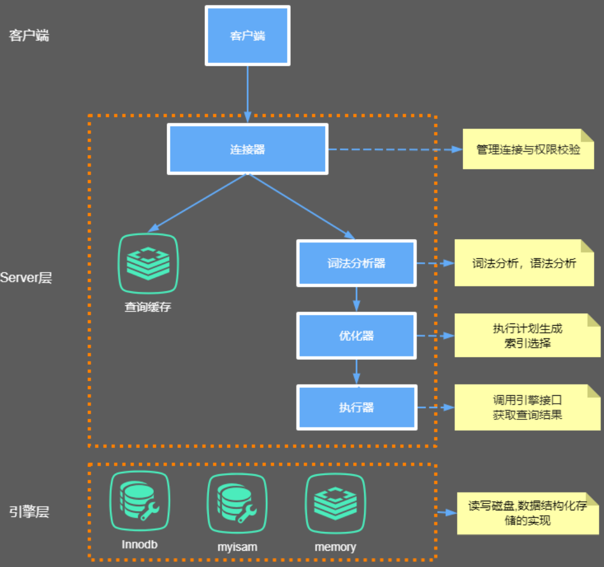
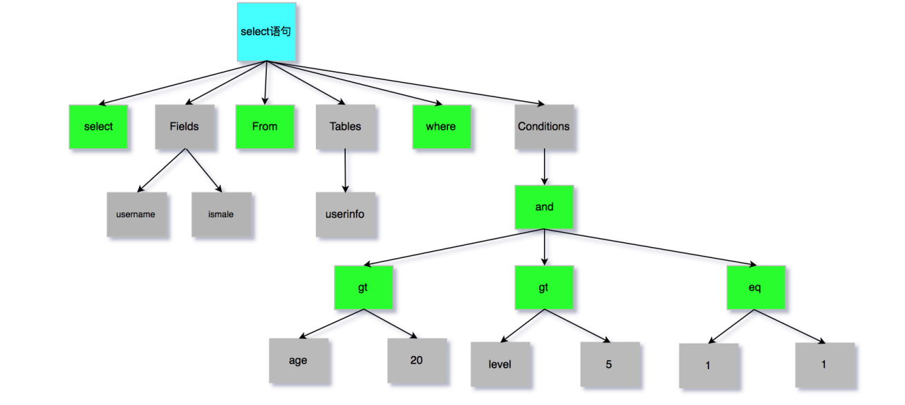

# mysql底层原理

## 1，mysql内部结构



### 1.1 客服端

>   客服端就是我们连接mysql数据库的一份如navicat, mysql front, jdbc, SQLyogt等。

### 1.2 Server层

主要包括连接器、~~查询缓存~~、分析器、优化器、执行器等，涵盖 mysql的大多数核心服务功能，以及所有的内置函数 （如日期、时间、数学和加密函数等），所有跨存储引擎的功能都在这一层实现，比如存储过程、触发器、视图等。

### 1.3 引擎层

存储引擎层负责数据的`存储`和`提取`。

默认存储引擎为InnoDB。

默认隔离级别-可重复读

## 2，连接器

>   mysql有非常多客户端如：navicat,mysql front,jdbc,SQLyog等。
>
>   这些客户端client要向mysql发起通信都必须先跟Server端建立通信连接，而建立连接的工作就是有连接器完成的。
>
>   连接器负责跟客户端`建立连接`、`获取权限`、`维持和管理连接`。

```sh
mysql ‐h host[数据库地址] ‐u root[用户] ‐p root[密码] ‐P 3306
```

**过程：**

*   如果用户名或密码不对，你就会收到一个"Access denied for user"的错误。

*   如果用户名密码认证通过，连接器会到权限表里面查出你拥有的权限。

    >   之后的操作权限判断逻辑，都将依赖于此时读到的权限。这就意味着，一个用户成功建立连接后，即使你用管理员账号对这个用户的权限做了修改，也不会影响已经存在连接的权限。
    >
    >   权限存储在mysql中uesr表中。

### 2.1 创建用户

```sh
 CREATE USER '用户名'@'连接主机一般用%' IDENTIFIED BY '密码';
```

### 2.2 用户授权

赋权限, %表示所有(host)

```sh
grant all privileges on *.* to 'username'@'%';
flush privileges;
```

### 2.3 修改密码

```sh
 update user set password=password(”123456″) where user=’root’;
```

### 2.4 查看用户权限

```sh
 show grants for 用户名@"%";
```

### 2.5 连接

**长连接**：是指连接成功后，如果客户端持续有请求，则一直使用同一个连接。

**短连接**：则是指每次执行完很少的几次 查询就断开连接，下次查询再重新建立一个。

ps：开发当中我们大多数时候用的都是长连接, 把连接放在Pool内进行管理，但是长连接有些时候会导致 MySQL 占用内存涨得特别快，这是因为 MySQL 在执行过程中临时使用的内存是管理在连接对象里面的。


**怎么解决这类问题呢？**

*   定期断开长连接。
*   如果你用的是 MySQL 5.7 或更新版本，可以在每次执行一个比较大的操作后，通过执行 mysql_reset_connection 来重新初始化连接资 源。


## 3，查询缓存

**大多数情况查询缓存就是个鸡肋**

>   因为查询缓存往往弊大于利。查询缓存的失效非常频繁，只要有对一个表的更新，这个表上所有的查询缓存都会被清空。


## 4，分析器

>   要对 SQL 语句做解析（sql是否正确，sql中字符串代表什么意思）。
>
>   *   词法分析：要识别出里面的字符串分别是什么，代表什么。
>   *   语法分析：根据词法分析的结果及语法规则，判断你输入的这个 SQL 语句是否满足 MySQL 语法。
>   *   语义分析
>   *   构造执行树
>   *   生成执行计划
>   *   计划的执行 下图是SQL词法分

**语法树**

****




## 5，优化器

>   经过了分析器，MySQL 就知道你要做什么了。在开始执行之前，还要先经过优化器的处理。
>
>   性能优化。

## 6，执行器

>   


# bin-log归档

>   删库是不需要跑路的，因为我们的SQL执行时，会将sql语句的执行逻辑记录在我们的bin-log当中。

## 1，什么是是bin-log

>   binlog是Server层实现的二进制日志,他会记录我们的cud操作。
>
>   1、Binlog在MySQL的Server层实现（引擎共用） 
>
>   2、Binlog为逻辑日志,记录的是一条语句的原始逻辑 
>
>   3、Binlog不限大小,追加写入,不会覆盖以前的日志
>
>   如果，我们误删了数据库,可以使用binlog进行归档!要使用binlog归档，首先我们得记录binlog，因此需要先开启MySQL的binlog功能。

### 1.1 开启bin-log功能

**配置my.cnf**

```cnf
# bin-log存放位置
log‐bin=/usr/local/mysql/data/binlog/mysql‐bin
# 注意5.7以及更高版本需要配置本项（自定义,保证唯一性）;
server‐id=123454
# binlog格式，有3种statement,row,mixed
binlog‐format=ROW
# 表示每1次执行写入就与硬盘同步，会影响性能，为0时表示，事务提交时mysql不做刷盘操作，由系统决定
sync‐binlog=0
```

### 1.2 bin-log命令

```sh
[mysqld]
# 查看bin‐log是否开启
 show variables like '%log_bin%'; 
 # 多一个最新的bin‐log日志
 flush logs;
 # 查看最后一个bin‐log日志的相关信息
 show master status;
 # 清空所有的bin‐log日志
 reset master;
```

### 1.3 查看bin-log内容

进入docker容器中执行mysqlbinlog命令

docker中mysql命名位置：/usr/bin

docker为例

```sh
root@004edefd64e2> mysqlbinlog --no-defaults /var/lib/mysql/mysql-bin.000001
```

>   **binlog里的内容不具备可读性，所以需要我们自己去判断恢复的逻辑点位，怎么观察呢？**
>
>   看重点信息，`比如begin,commit`这种关键词信息，只要在binlog当中看到了，你就可以理解为begin-commit之间的信息是一个完整的事务逻辑,然后再根据位置 position判断恢复即可。

**mysql查看**

```mysql
 # 只查看第一个binlog文件的内容
show binlog events;
# 查看指定binlog文件的内容
show binlog events in 'mysql-bin.000002';
# 获取binlog文件列表
show binary logs;
# 查看当前正在写入的binlog文件
show master status;
```


### 1.4 数据归档

**从bin-log恢复数据**

docker中mysql命名位置：/usr/bin

docker为例

**mysqlbinlog 是mysql提供的sh命名，使用./可能不能正确执行**

```sh
# 恢复指定位置的数据 位置看日志的at
mysqlbinlog --no-defaults --start‐position="1197" --stop‐position="1327" /var/lib/mysql/mysql-bin.000001 |mysql -u root -p
```

```sh
# 恢复指定时间段数据，时间要按bin-log上的时间
./mysqlbinlog --no-defaults --start‐datetime= "2022‐03‐17 12:00:00" --stop‐datetime= "2022‐03‐17 23:40:00" /var/lib/mysql/mysql-bin.000009 |mysql -u root -p
```

