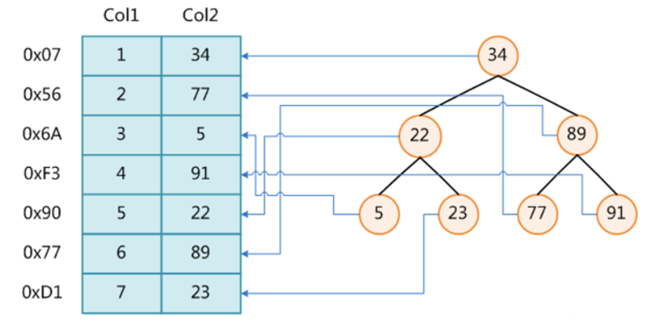
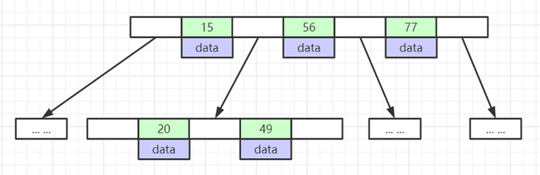
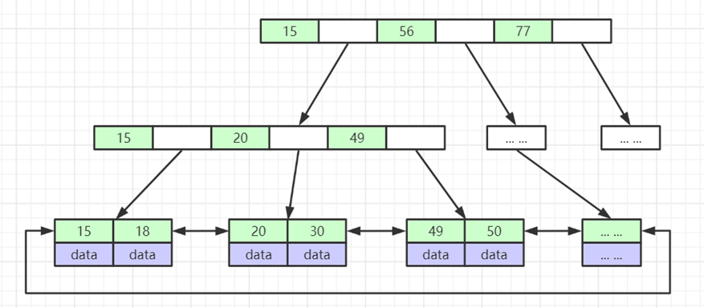
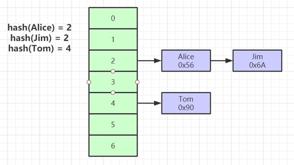
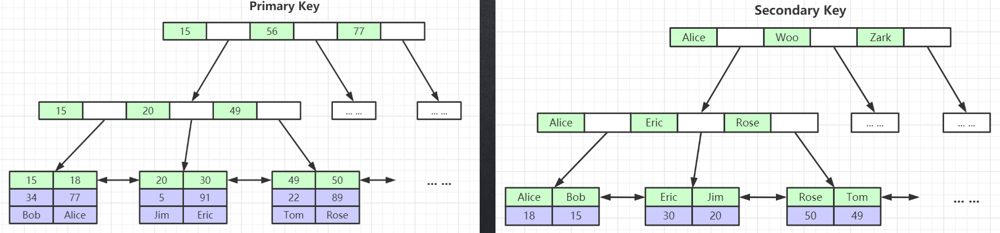
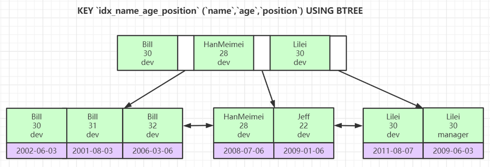

# mysql索引结构

## 简介

**索引：**MySQL是帮助MySQL高效获取数据的`排好序`的`数据结构。`

常用的索引结构：

*   二叉树
*   平衡二叉树
*   Hash表
*   B-Tree

**问题：** 无法解决排序中范围查询问题，IO次数多（层次太高）

## 2，B-Tree

**B-Tree定义：**

>   它是一种平衡的多叉树，称为B树。
>
>   一棵m阶B树(balanced tree of order m)是一棵平衡的m路搜索树（m个分支）。它或者是空树，或者是满足下列性质的树：
>
>   1、根结点至少有两个子女；
>
>   2、每个非根节点所包含的关键字个数 j 满足：┌m/2┐ - 1 <= j <= m - 1；
>
>   3、除根结点以外的所有结点（不包括叶子结点）的度数正好是关键字总数加1，故**内部子树**个数 k 满足：┌m/2┐ <= k <= m ；
>
>   4、所有的叶子结点都位于同一层。是null，实际上并不存在外部结点，指向这些外部结点的指针为空。

**问题：** 无法解决排序中范围查询问题

## 3，B+Tree

**B+Tree定义：**

>   B+树是B树的一种变形形式，B+树上的叶子结点存储关键字以及相应记录的地址，叶子结点以上各层作为`索引使用`。一棵`m阶`的B+树定义如下:
>
>   (1)每个结点至多有m个子女;
>
>   (2)除根结点外，每个结点至少有[m/2]个子女，根结点至少有两个子女；
>
>   (3)有k个子女的结点必有k个关键字。

## 4，Hash索引

>   Hash索引只能做单值索引。仅满足=和IN查询，而且有hash冲突。

## 5，mysql存储引擎

### 5.1 MyISAM

>   MyISAM索引文件和数据文件是分离的即非聚集索引。
>
>   是通过索引找到数据所在的地址，在到数据文件中根据地址找到数据。

### 5.2 InnoDB

>   InnoDB的主键索引是聚集索引即索引文和数据保存在一起。但是其他的索引还是非聚集索引不保存所有字段的数据。
>
>   *   为什么建议InnoDB表必须建主键，并且推荐使用整型的自增主键？
>
>       ​	PS: mysql的索引是存在排序的
>
>   *   为什么非主键索引结构叶子节点存储的是主键值？
>
>         PS:  一致性和节省存储空间

### 5.3 索引最左前缀原则

>   原因还是mysql索引是一个有序。
>
>   多个字段进行排序的

