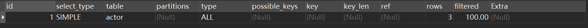
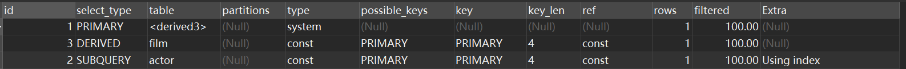
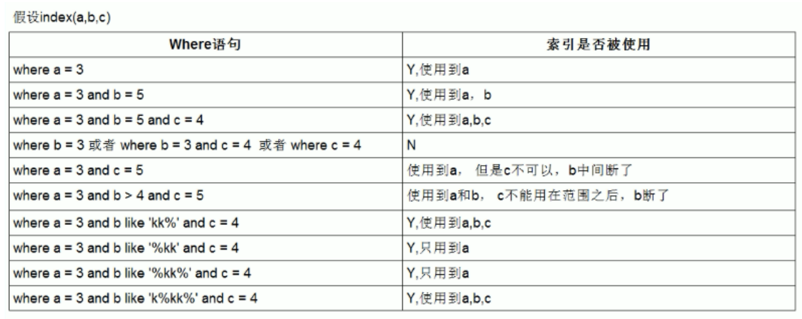
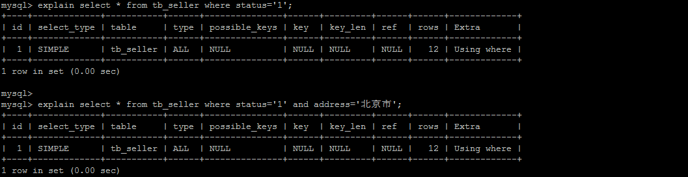

# explain工具

​	使用EXPLAIN关键字可以模拟优化器执行SQL语句，分析你的查询语句或是结构的性能瓶颈。

 	explain 关键字，MySQL 会在查询上设置一个标记，执行查询会返回执行计划的信息，`而不是执行这条SQL`

**注意：如果 from 中包含子查询，仍会执行该子查询，将结果放入临时表中**


## 2，explain中的列

explain 中每个列的信息。



### 2.1 id列

>   id列的编号是 select 的序列号，代表select执行顺序。
>
>   有几个 select 就有几个id，id值大则优先执行，为null则最后执行。


### 2.2 select_type列

>   select_type 表示对应select的查询类型，简单查询复合查询等。

| select_type     | 说明                                                         |
| --------------- | ------------------------------------------------------------ |
| simple          | 该select为简单查询（不包含子查询和union查询）                |
| primary         | 复杂查询中最外层的select查询（即sql中开头中的select）        |
| subquery        | 包含在select中的select子查询（不在from子句中）               |
| derived（派生） | from子句中的select子查询。（mysql会将其查询放在临时表即派生表中） |
| union           | union查询中随后的select查询                                  |

#### 2.2.1 派生表合并优化

在测试subquery查询时，需要关闭派生表合并优化才能观察到现象。

```sql
# 关闭mysql5.7新特性对衍生表的合并优化
set session optimizer_switch='derived_merge=off';
# 测试完成之后要开启
set session optimizer_switch='derived_merge=on';
```

**sql**

```sql
explain select (select 1 from actor where id = 1) from (select * from film where id = 1) der;
```



### 2.3 table列

>   这一列表示 explain 的一行（即select）正在访问哪个表。
>
>   **\<derivenN\>**: 当 from 子句中有子查询时，table列是\<derivenN\>格式，表示当前查询依赖 id=N 的查询，于是先执行 id=N 的查询。
>
>   **\<union1,2\>**: 当有 union 时，1和2表示参与 union 的 select 行id。


### 2.4 type列

>   表示select的中`表示表的连接类型`，即msyql决定如何查找表中的行（全表还是索引等），查找数据行记录的大概范围。
>
>   **优先级：**`system > const > eq_ref > ref > range > index > ALL`
>
>   (NULL > system > const > eq_ref > ref > fulltext > ref_or_null > index_merge > unique_subquery > index_subquery > range > index > ALL)

| type         | ~~描述~~                                                     |
| ------------ | ------------------------------------------------------------ |
| ~~`system`~~ | 表只有一行记录(等于系统表)，这是const类型的特例，不可能出现。 |
| `const`      | 表示通过索引一次就找到，只匹配一行数据，所以很快。 **"主键" 或 "唯一"** 。索引的所有部分与常量值进行比较 |
| `eq_ref`     | 主键或唯一索引扫描，使用的是唯一或主键索引的关联查询，记录只有一条 |
| `ref`        | 非唯一性索引扫描                                             |
| `range`      | 使用一个索引来检索给定范围的行，常出现在 in(), between ,> ,<, >= 等操作中 |
| `index`      | 扫描全部索引， 通常比ALL 快， ALL 是遍历数据文件。           |
| `all`        | 遍历全表以找到匹配的行                                       |


### 2.5 possible_keys列

>   查询可能使用到的索引。
>
>   如果该列是NULL，则没有相关的索引。在这种情况下，可以通过检查 where 子句看是否可以创造一个适当的索引来提高查询性能，然后用 explain 查看效果。

### 2.6 key列

>   显示mysql实际采用的索引。
>
>   如果没有使用索引，则该列是 NULL。如果想强制mysql使用或忽视possible_keys列中的索引，在查询中使用 force index、ignore index，推荐不改。

### 2.7 key_len列

列显示了mysql在索引里使用的字节数。

### 2.8 ref列

>   显示了在key列记录的索引中，表查找值所用到的列或常量，常见的有：const（常量），字段名（例：film.id）

### 2.9 rows列

>   mysql估计要读取并检测的行数，注意这个不是结果集里的行数。

### 2.10 Extra列

| Extra                        | 描述                                                         |
| ---------------------------- | ------------------------------------------------------------ |
| `Using index`                | 使用覆盖索引                                                 |
| `Using where`                | 使用 where 语句来处理结果，并且查询的列未被索引覆盖          |
| `Using index condition`      | 查询的列不完全被索引覆盖，where条件中是一个前导列的范围。即返回列多了，超过了索引列。 |
| Using temporary              | mysql需要创建一张临时表来处理查询。首先是想到用索引来优化。  |
| Using filesort               | 使用外部排序。这种情况下一 般也是要考虑使用索引来优化的。    |
| Select tables optimized away | 使用某些聚合函数                                             |


## 3，索引使用

**索引是数据库优化最常用也是最重要的手段之一，创建索引（不一定提高效率），要合理利用索引。**

注意：<font color="red">索引是有序的数据结构</font>



>   --- 创建联合索引
>   create index idx_seller_name_sta_addr on tb_seller(name,status,address);

### 3.1 索引列全值匹配

>   联合索引下，对索引中所有列都指定具体值。
>
>   这个时候条件字段的顺序任意，因为mysql底层会做优化处理，自动最左前缀。

```java
explain select * from tb_seller where name='小米科技' and status='1' and address='北京市
```


### 3.2 最左前缀法则

>   联合索引下，要遵守最左前缀法则。即联合索引是有序的多个索引在一起相当于整数的个，百，千位一样，如果位数的顺序乱了或者缺失了是无法比较大小的。仅高位即可判断大小的底位可以缺失，顺序上mysql是存在优化的。


**违法最左前缀法则 ， 索引失效**




###  3.3 索引将效 - 不要在索引列上进行运算操作

>   ​		索引是有序的数据结构，对进行运算相当于索引列都运算完成之后得到新的表在进行查询，运算之后的表若还根据原字段排序肯定和原来不同。
>
>   ​	因此，不在索引列上做任何操作（计算、函数、（自动or手动）类型转换），会导致索引失效而转向全表扫描


### 3.4 索引将效 - 范围查询之后的字段索引将失效

>   不能使用索引中范围条件右边的列，范围查询之后的字段索引将失效。
>
>   还是因为索引是有序的数据结构，左边是范围，是模糊的，右边的列大小无法决定经过。
>
>   如有数：191和159 个位决定不了大小。
>
>   范围：< > <= >= betwent ，not in ，not exists 等等 (in 索引任存在)


### 3.5 覆盖索引

>   尽量使用覆盖索引（索引覆盖：只访问索引的查询（索引列完全包含查询列））。
>
>   索引列包含索引列的值，以及主键，存在回表的可能。


### 3.6 is null, is not null 一般情况下也无法使用索引


### 3.7 like

>   关键还是能不能排序
>
>   通配符号在后面能使用索引。


### 3.8 字符串数字不加单引号索引失效 


**注意：**尽量使用复合索引（相当创建了多个索引），而少使用单列索引（多个单列索引都用到时，只有一个生效）


# sql优化

## 1，批量插入

*    主键顺序插入

*   关闭唯一性校验

*   手动提交事务

    >   适应insert values多条也可以

## 2，select 优化

### 2.1 优化order by

>   其实order by就是排序，那么既然是排序就可以考虑利用索引。

**排序方式：**

*   FileSort 排序：就是文件排序，通过对返回数据进行排序，也就是通常说的文件排序。
*   using index：通过有序索引顺序扫描直接返回有序数据，即索引排序。

MySQL的排序方式，优化目标就清晰了：尽量减少额外的排序，通过索引直接返回有序数据。`where 条件和Order by 使用相同的索引`，并且`Order By 的顺序和索引顺序相同`， 并且Order  by 的字段`都是升序，或者都是降序`。否则肯定需要额外的操作，这样就会出现FileSort。


### 2.2 优化group by

>   mysql的分组其实是通过先排序，后划分的，通用可以利用索引。
>
>   与ORDER BY 相比，GROUP BY 主要只是多了排序之后的分组操作。
>
>   如果查询包含 group by 但是用户想要避免排序结果的消耗， 则可以执行order by null 禁止排序。

```sql
explain select age,count(*) from emp group by age;
# 优化后（结果不排序）
explain select age,count(*) from emp group by age order by null;
```


### 2.3 优化嵌套查询

>   嵌套查询：即子查询，一个查询当作另外一个查询的条件等。
>
>   但是，有些情况下，子查询是可以被更高效的连接（JOIN）替代。
>
>   连接(Join)查询之所以更有效率一些 ，是因为MySQL`不需要在内存中创建临时表`来完成这个逻辑上需要两个步骤的查询工作。


### 2.4 优化分页

>   一般分页查询时，通过创建覆盖索引能够比较好地提高性能。一个常见又非常头疼的问题就是 limit 2000000,10  ，此时需要MySQL排序前2000010 记录，仅仅返回2000000 - 2000010 的记录，其他记录丢弃，查询排序的代价非常大 。

#### 2.4.1 优化思路1

>   在索引上完成排序分页操作，最后根据主键关联回原表查询所需要的其他列内容。
>
>   利用order by主键排序，limit主键是很容易的，然后根据主键返回数据。

```sql
explain select * from tb_item t,(select id from tb_item order by id limit 2000000,10) a where t.id = a.id;
```

