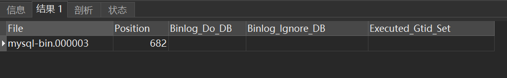
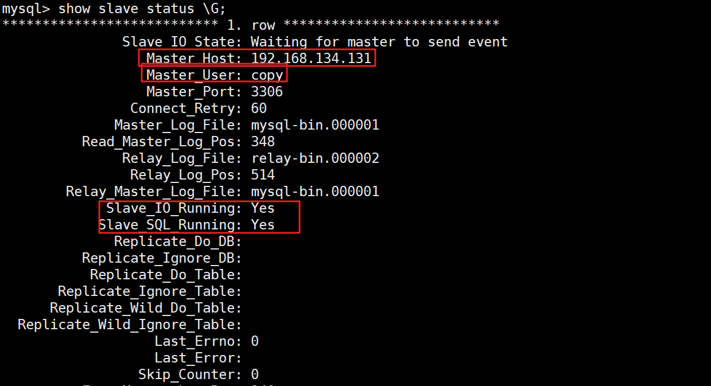

# MySQL 安装

## 1，压缩包本地安装

### 1，卸载 mariadb [ maridb 与 msyql 在 linux 中有冲突 ]

* **检查mariadb，mysql**

    ```sh
     yum list installed | grep maridb
     yum list installed | grep mysql
    ```

* **卸载mariadb，mysql**

  ```sh
  yum -y remove xxxx
  ```
  
  注：如果卸载不成功，需要去掉参数-y，手动确认卸载。

### 2，上传 mysql 安装包 并解压

* **解压**

    ```sh
    tar -zxvf mysql-xxxx
    ```

* **改名**

    ```sh
    mv mysql-xxx mysql-5.7.xxx
    ```


### 3，创建数据库文件夹 data

* **在安装目录下（解压目录mysql-5.7.xx）创建 data**

  >   data文件夹是mysql用来存放数据库文件的，数据库的表数据都放在data目录。
  >
  >   默认没有data目录，手工创建data目录。

### 4，创建用来执行 mysqld 命令的 linux 用户及目录所属

**出于安全便利，创建一个操作数据库的专门用户.**

```shell
# 创建用户组
groupadd mysql
# 创建用户
useradd -r -g mysql mysql
# 给用户设值密码
passwd mysql
....
# 给目录/xxl/mysql 更改拥有者，即mysql安装目录
chown -R mysql:mysql /usr/local/mysql/
```

### 5，配置启动文件

>   创建my.cnf到 /etc/my.cnf(mysqld启动时自动读取)

```cnf
[mysql]
# 默认字符集
default-character-set=utf8

[mysqld]
# mysql 服务端口
port=3306
# 默认存储引擎
default-storage-engine=INNODB
# 默认字符集
character_set_server=utf8
# mysql服务ID,保证整个集群环境中唯一
server-id=1
# 开启 binlog 日志或说binlog 日志的存储路径和文件名
log-bin=mysql-bin
# 设置logbin格式：可以不设置
binlog_format=STATEMENT
# 是否只读,1 代表只读, 0 代表读写
read-only=0
```

### 6，复制/support-files/mysql.server到/etc/init.d/

>   目的想实现开机自动执行效果

**复制并改名**

```sh
cp ./mysql.server /etc/init.d/mysql mysql
```

**修改/etc/init.d/mysql参数，即mysql.server的**

```cnf
basedir=mysql安装路径
datadir=mysql的data路径
```

### 7，初始化 mysql

>   使用 mysqld 命令初始化数据库基本信息。
>
>   切换到 mysql bin下执行。

```shell
./mysqld --initialize --user=mysql --datadir=mysql的data目录 --basedir=mysql安装目录
```

>   --initialize 初始化mysql，创建mysql的root, 随机生成密码。记住密码，登录msyql使用。
>
>   --user执行msyqld 命令的linux用户名
>
>   --datadir : mysql数据文件的存放位置，目录位置参照本机的设置。
>
>   --basedir : msyql安装程序的目录，目录位置参照本机的设置。
>
>   **注意：记录登录临时密码**

### 8，给数据库加密

>   在服务器与客户机之间来回传输的所有数据进行加密。通过证书提供了身份验证机制，mysql命令程序 mysql_ssl_rsa_setup 提供了开启数据加密功能，生成数字证书。

```sh
# bin 目录下
./mysql_ssl_rsa_setup --datadir=mysql data目录
```

### 9，启动服务

```sh
# bin目录下，以命名方式启动
./mysqld_safe --user=mysql &

# 自定义 my.cnf 文件
./mysqld_safe --defaults-file=/xxx/my.cnf &

# 检查mysql是否启动
ps -ef|grep mysql
```

### 10，关闭服务

切换到bin目录下，使用 mysqladmin 命令 shutdown。

**方式1：使用端口、主机关闭，推荐使用**

```sh
./mysqladmin -uroot -p -P3306 -h127.0.0.1 shutdown
```

**方式2：MySQL的客户端执行 shutdown**

```sql
> shutdown
> exit
```

**方式3**：当配置mysql服务时

```sh
service mysql stop
```

## 2，进入客户端

### 1.登录

```sh
./mysql -uroot -p
# 输入临时密码
```

### 2，修改密码

```sql
mysql> set password=password('新密码');
```

### 3，设置远程访问

>   其中*.* 的第一个*表示所有数据库名，第二个*表示所有的数据库表;
>
>   root@'%' 中的root表示用户名，%表示ip地址，%也可以指定具体的ip地址

```sql
mysql> grant all privileges on *.* to root@'%' identified by '密码';
```

**刷新：**

```sql
mysql> flush privileges;
```

### 4，修改数据库编码

```sql
set character_set_client=utf8;
set character_set_connection=utf8;
set character_set_database=utf8;
set character_set_results=utf8;
set character_set_server=utf8;
set character_set_system=utf8;
set collation_connection=utf8;
set collation_database=utf8;
set collation_server=utf8;
```

## 3，设置开机自启动

### 1、添加服务mysql

```sh
chkconfig --add mysql
```

### 2、设置mysql服务为自启动

```sh
chkconfig mysql on
```

### 3，配置环境变量

```sh
vim /etc/profile
```

```txt
export PATH=/mysql安装目录/bin:$PATH
```

### 4，刷新环境变量

```sh
source /etc/profile
```

# MySQL 主从复制

## 1，配置主节点

1.   **配置mysql服务参数**

     ```cnf
     [mysql]
     # 默认字符集
     default-character-set=utf8
     
     [mysqld]
     # 服务节点的唯一标识
     server-id=1
     # 设置连接端口
     port=3306
     # 默认存储引擎
     default-storage-engine=INNODB
     # 默认字符集
     character_set_server=utf8
     # 开启 binlog，文件名以指定mysql-bin为前缀
     log_bin=mysql-bin
     log_bin-index=mysql-bin.index
     skip-name-resolve
     # 设置logbin格式：可以不设置
     binlog_format=STATEMENT
     # 设置mysql的安装目录
     basedir=/usr/local/server/mysql-5.7.24
     # 设置mysql数据库的数据的存放目录
     datadir=/usr/local/server/mysql-5.7.24/data
     # 允许最大连接数
     max_connections=200
     # 允许连接失败的次数。
     max_connect_errors=10
     # 服务端使用的字符集默认为UTF8
     character-set-server=utf8
     # 创建新表时将使用的默认存储引擎
     default-storage-engine=INNODB
     # 默认使用“mysql_native_password”插件认证
     #mysql_native_password
     default_authentication_plugin=mysql_native_password
     ```

2.   **创建复制数据的账号并授权**

     ```sql
     > grant replication slave on *.* to 'copy'@'%' identified by '123456';
     ```

     注意：该语句可完成授权、创建用户、修改密码操作。如果远程连接执行不成功则本地执行。

3.   **查看主服务器状态**：最好主从都是空的

     ```sql
     >show master status;
     ```

     

*   File：当前日志的binlog文件
*   Position：文件中的索引（偏移量）

>   开启binlog后，数据库中的所有操作都会被记录到datadir当中，以一组轮询文件的方式循环记录。而指令查到的File和Position就是当前日志的文件和位置。而在后面配置从服务时，就需要通过这个File和Position通知从服务从哪个地方开始记录binLog。

```sql
# 如果主服务状态不是初始状态，一般需要重置状态，以免同步不上
> reset master;
```

## 2，配置从节点

1.   **配置mysql服务参数**

     ```cnf
     [mysql]
     # 默认字符集
     default-character-set=utf8
     
     [mysqld]
     # 服务节点的唯一标识
     server-id=2
     # 打开 MySQL 中继日志
     relay-log=relay-bin
     relay-log-index=relay-bin.index
     # 开启服务binlog
     log-bin=mysql-bin
     # 使得更新的数据写进二进制日志中
     log-slave-updates=1
     # 设置3306端口
     port=3306
     # 设置mysql的安装目录
     basedir=/usr/local/server/mysql-5.7.24
     # 设置mysql数据库的数据的存放目录
     datadir=/usr/local/server/mysql-5.7.24/data
     # 允许最大连接数
     max_connections=200
     # 允许连接失败的次数。
     max_connect_errors=10
     # 服务端使用的字符集默认为UTF8
     character-set-server=utf8
     # 创建新表时将使用的默认存储引擎
     default-storage-engine=INNODB
     # 默认使用“mysql_native_password”插件认证
     #mysql_native_password
     default_authentication_plugin=mysql_native_password
     # 是否只读,1 代表只读, 0 代表读写
     read-only=1
     ```

     2.   **设置从服务器的master**

          ```sql
          #登录从服务
          >mysql -u root -p;
          
          #设置同步主节点：
          >change master to master_host='127.0.0.1',
          master_user='copy',
          master_password='123456',
          master_port=3306,
          master_log_file='mysql-bin.xxxx',
          master_log_pos=xxx;
          
          # 开启slave, 在从机器上执行开始复制命令
          >start slave;
          
          #查看主从同步状态
          >show slave status;
          # 或者用 
          >show slave status \G;
          ```

     ****

     如果同步失败，则：

     ```sql
     # 停止复制
     >stop slave; 
     
     # 根据需要重置主和从的
     reset slave;
     reset master;
     
     # 重新设置从服务器的master
     ```

     成功案例

     

