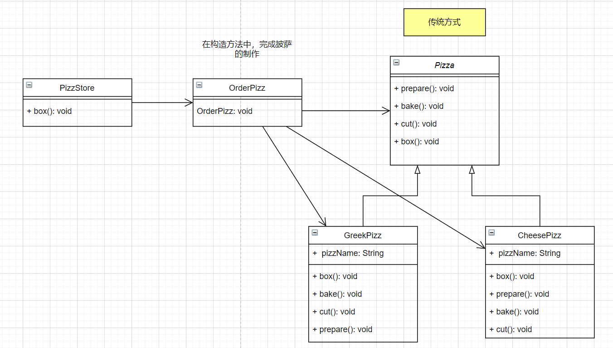

# 简单工厂模式

应用背景

> 看一个披萨的项目：要便于披萨种类的扩展，要便于维护
>
> 1）披萨的种类很多（如：GreekPizz，CheesePizz）
>
> 2）披萨的制作比较固定（如 prepare准备，bake烘烤，cut切，box）
>
> 3）完成披萨店的订购功能

特点：同一种品种产品比较多，同一产品的制造过程相同

**传统方式: **

* OrderPizz类：订单类能够订购所有的pizz，所以在创建OrderPizz对象时必然要创建所有的pizz对象
* PizzStore类：披萨店类中“客户”通过创建OrderPizz对象去得order订购pizz

**缺点：**

* OrderPizz的地方很多（创建OrderPizz的代码很多），每一个OrderPizz对象都需要创建所有的Pizz种类（因为要在里面中Order pizz），所以不仅仅是添加一个新的Pizz类，修改的代码也很多。违反opc原则

# 简单工厂模式

> 1) 简单工厂模式是属于**创建型**模式，是工厂模式的一种。简单工厂模式是由**一个工厂对象**决定创建出哪一种品类的实例
> 2) 简单工厂模式：定义了一个创建对象的类，由这个类来封装实例化对象的代码
> 3) 当会用到大量创建某种，某类，或者某批对象时，就会使用工厂模式

特地：

* 创建对象
* 对象属于某个品类，该品类的对象类型多种

**补充：**

如果将简单工厂模式createPizz方法修改成静态方法，就是静态工厂模式

