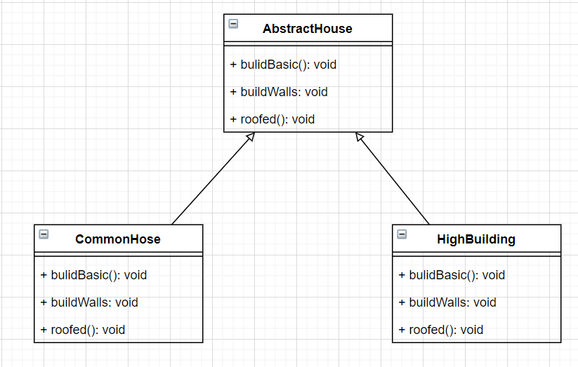

# 建造者模式

## 基本介绍

> 1. 建造者模式（builder pattern），是一种对象构建模式。它可以将**复杂**对象的建造过程抽象出来（抽象类别），使这个抽象过程的不同实现方法可以构建出不同表现（属性）的对象
>
> 2. 建造者模式是一步一步创建一个复杂的对象（这里和工厂模式不一样），它允许用户只通过复杂对象的类型和内容去构建他们。用户不需要知道内部的具体构建细节。
>
>    **注意：** 建造者模式创建的对象都有相同的属性和方法（只是属性的值，和方法的行为不同），产品不同取决于要素。

**注意：** 对象不一定都能new出来的，有一些对象比较复杂

**背景**

> 盖房项目需求：
>
> 1） 需要建房子：这个过程为打桩（地基），砌墙，封顶。创建对象的过程固定
>
> 2）房子有各种各样的：比如普通房，高楼，别墅，各种各样的防止的过程虽然一样，但是要求不要相同


**传统方案：**

> 使用继承的方式进行



```java
public abstract class AbstractHouse{
    // 打地基
    public abstract void bulidBasic();
    
    // 砌墙
    public abstract void buildWalls();
    
    // 盖顶
    public abstract void roofed();
    
    // 建房
    public void build() {
        bulidBasic();
         buildWalls();
        roofed();
    }
}
```

**普通房：**

```java
public class CommonHouse extends AbstractHouse{
    // 打地基
    public void bulidBasic() {
        System.out.println("打地基5m");
    }
    
    // 砌墙
    public void buildWalls(){
        System.out.println("砌墙 10cm");
    }
    
    // 盖顶
    public void roofed() {
        System.out.println("盖顶");
    }
}
```

**高楼**

```java
public class HighHouse extends AbstractHouse{
    // 打地基
    public void bulidBasic() {
        System.out.println("打地基50m");
    }
    
    // 砌墙
    public void buildWalls(){
        System.out.println("砌墙 50cm");
    }
    
    // 盖顶
    public void roofed() {
        System.out.println("盖顶");
    }
}
```


**分析：**

> 优点：比较好理解，简单易操作
>
> 缺点：设计的程序结构过于简单，没有设计缓存层对象(???)，程序的扩展和维护不好，也就是说：这种设计方案，把产品（即：房子）和创建产品的过程（即：建房子的过程）封装在一起（build方法），耦合性增强。
>
> j解决方案：将产品的和产品的创建过程解耦 ---> 建造者模式。


# 建造者模式的四个角色

1) **Product (产品角色):** 一个具体的产品对象
2) **Builder (抽象建造者): ** 创建一个Product对象的各种部件指定的接口。
3) **ConcreteBuilder（具体建造者）：** 实现接口，构建和装配各个部件。
4) **Director（指挥者）：** 构建一个使用Builder接口的对象。它主要是用于创建一个复杂的对象。它主要有两个作用，一是：隔离客户于对象的生产过程，二是：负责控制产品对象的生产过程。

**注意：** 源码不一定按上面形式写

**产品**

```java
// 产品 --> Product 
@Data
public class House{
    private String basic;
    private String wall;
    private String roofed;
}
```

**Builder 抽象的：建造流程**

```java
public abstract class HouseBuilder {
   // 组合产品
    protected House house = new House();
    
    // 将建造流程写好，抽象的方法
    
    // 打地基
    public abstract void bulidBasic();
    
    // 砌墙
    public abstract void buildWalls();
    
    // 盖顶
    public abstract void roofed();
    
    // 建造房子好，将产品（房子）返回
    public House buildHouse() {
        return house;
    }
}
```


**CommonHouse 具体的建造者**

```java
public class CommonHose extends HouseBuilder {
   // 打地基
    public void bulidBasic() {
        System.out.println("打地基5m");
    }
    
    // 砌墙
    public void buildWalls(){
        System.out.println("砌墙");
    }
    
    // 盖顶
    public void roofed() {
        System.out.println("盖顶");
    }
}
```

> 普通房子的建造过程写在房子的子类，产品本身的属性封装在House里面的，把制造的流程和产品本身分离


**Director 指挥者**

```java
public class HouseDirector {
    HouseBuilder houseBuilder = null;
    
    // 构造器传入 houseBuilder
    public HouseDirector(HouseBuilder houseBuilder) {
        this.houseBuilder = houseBuilder;
    }
    
    // 通过setter 传入houseBuilder
    public void setHouseBuilder(HouseBuilder houseBuilder) {
        this.houseBuilder = houseBuilder;
    }
    
    // 如何处理建造房子的流程，交给指挥者
    public House constrcutHouse() {
        houseBuilder.buildBasic();
         houseBuilder.buildWall();
         houseBuilder.roofed();
         return houseBuilder.buildHouse();
    }
}
```

**Client**

```java
public static void main(String[] args) {
    // 盖房子
    CommonHouse commonHouse = new CommonHouse();
    // 准备创建房子的指挥者
    HouseDirector houseDirector new HouseDirector(commonHouse);
    // 盖房子
    House house = houseDirector.constrcutHouse();
}
```


