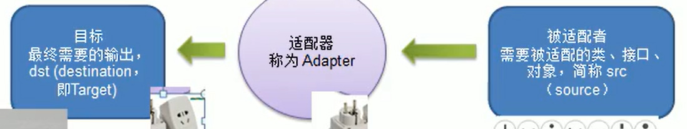

# 适配器模式

> 问题引入：
>
> ​	假设去欧洲旅游，欧洲插座是欧洲标准，和国标不一样，可以买一个多功能转化插头（适配器），这样就可以使用了。
>
> **程序会出现这样的情况吗？**
>
> ​	会的

**适配器模式介绍**

> 1) 适配器模式（Adapter Pattern）将某个类的接口转换成客服端期望的另外一个接口表示，主要目的就是为了兼容性（可以因为参数类型，个数等原因而无法直接调用原接口），让原本因接口不匹配不能一起工作的两个类可以协同工作。其别名为包装器（Wrapper）
> 2) 适配器模式属于结构型模式
> 3) 主要分为三类：类适配器模式，对象适配器模式，接口适配器模式


**工作原理**

> 1) 适配器模式：将一个类的接口转换为另外一个接口，让原本接口不兼容的类可以兼容（A调用B，但由于不兼容如参数个数类型不同，改为A调用C，C调用B从而实现A调用B）
> 2) 从用户的角度看不到被适配者，是解耦的
> 3) 用户调用适配器转换出来的目标接口方法，适配器在调用被适配的相关接口方法
> 4) 用户收到的反馈结果，感觉只是和目标接口交互，如图：




# 类适配器

**介绍**

> 类适配器：Adapter类，通过继承 src类，实现dst类接口，完成src -> dst 的适配

**案例：手机充当器**

源src：220v 交流电

适配器：充电器

目标dst：5v直流电


**代码：**

**src** : 被适配的类

```java
public class Volatge220V {
    public int output220V() {
        int src = 220;
        System.out.println("电压=" + src + "伏特")
        return src;
    }
}
```


**dst** : 需要Adapter来转换220V，适配接口

```java
public interface IVolatge5V {
    public int output5V();
}
```


**Adapter** : 适配器

```java
public class VolatgeAdapter extends Volatge220V implements IVolatge5V {
    
     public int output5V() {
         // 获取220V电压
         int src = output220V();
         int dstV = srcV / 44; // 这一步就是在做适配
         return dstV;
     }
}
```


**Phone**

```java
public class Phone {
    // 虽然依赖的是IVolatge5V，但是传递的时候是VolatgeAdapter适配器类
    pulic void charging(IVolatge5V volatge5V) {
        if (IVolatge5V.output5V == 5) {
           System.out.println("充电");
        } else {
            System.out.println("无法充电");
        }
    }
}
```

**注意: ** 虽然依赖的是dst目标对象，但是传递的时候穿传的是适配器对象，适配器已经实现了适配接口


**Client**

```java
public static void main(String[] args) {
    Phone p = new Phone();
    p.charging(new VoltageAdapter());
}
```


**总结：**

> 1) Java 是单继承的，所以类适配器需要继承src源类这一点算是一个缺点，因为要求dst目标类必须是一个接口，有一定的局限性
> 2) src类的方法在Adapter中都会暴露出来（因为继承了src类），也增加了使用成本（如果调用src的方法过多）。缺点
> 3) adapter可以重写src的方法，这个是一个优点（继承重写）


# 对象设配器

> 1) 基本思路和类的适配器模式相同，只是将Adapter类做修改，不是继承src被适配类，而是持有src类的实例，以解决兼容性问题。即持有stc类，实现dst类接口，完成src -> dst的适配
> 2) 以关联关系取代继承关系
> 3) 对象适配器模式是适配器模式常用的一种

**Adapter** : 适配器

```java
public class VolatgeAdapter implements IVolatge5V {
    
    private Voltage220V voltage220; // 持有Voltage220V对象
    
    public VolatgeAdapter(Voltage220V voltage220) {
        this.voltage220 = voltage220;
    }
    
     public int output5V() {
         // 获取220V电压
         int src = voltage220V.output220V();
         int dstV = srcV / 44; // 这一步就是在做适配
         return dstV;
     }
}
```


# 接口适配器模式