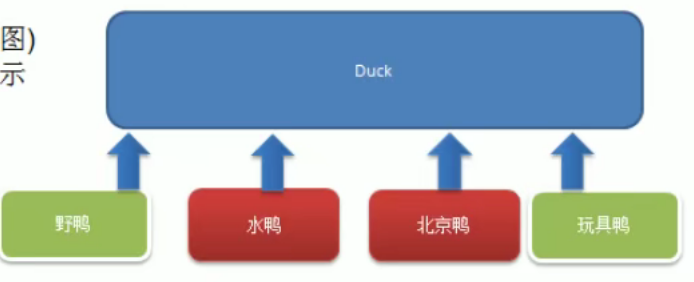
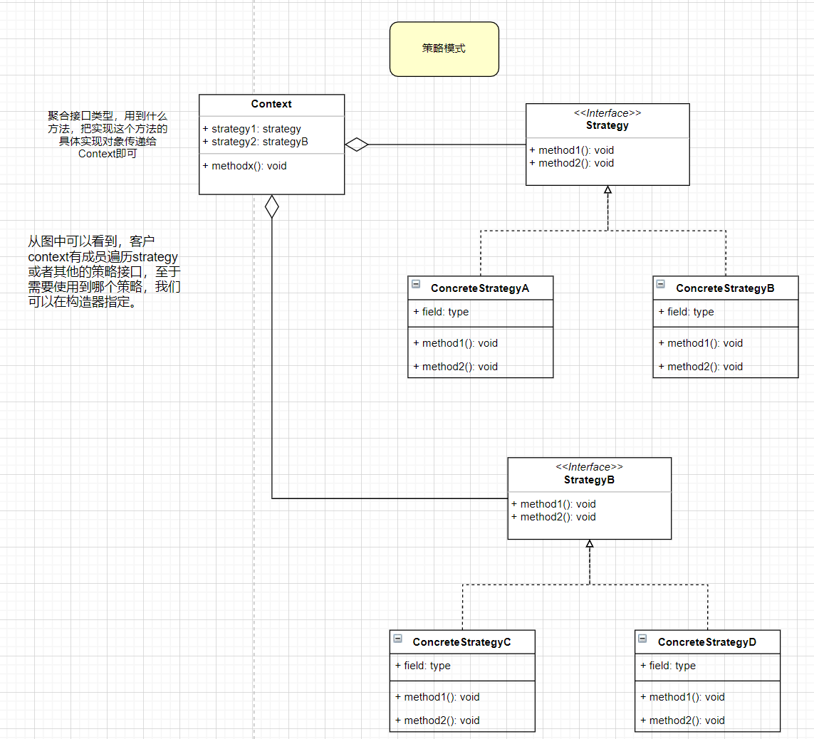
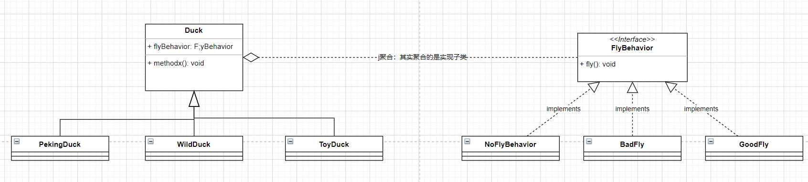

# 策略模式

策略模式：

1，适合对象是多样的，不同的对象的行为又是不一样的情况

2，对象的种类是单一，但是同类的对象的行为是多样的并且是可变化（如人可以选择飞机，或火车等旅游）

鸭子问题：

> 1) 有各种鸭子（野鸭，北京鸭等，鸭子有各种行为，比如飞，叫等）
> 2) 显示鸭子的信息


**传统的方案解决鸭子问题：**




## 基本介绍

1）策略模式（Strategy Pattern）中，定义算法族，让他们之间可以相互替换，此模式让算法的变化独立与使用算法的客户。

2）多用组合/聚合少用继承（客户通过组合方式使用策略）







**思路分析（类图）**

> 策略模式：分别封装行为接口，实现算法族，超类里放行为接口对象，在子类里具体设定行为对象。
>
> 原则就是：分离变化部分，封装接口，基于接口编程各种功能。此模式让行为的变化独立与算法的使用者。


**代码实现**

1, 策略接口

```java
public interface FlyBehavior {
	void fly(); // 子类具体实现
}
```

1.1 策略接口实现类

```java
// ********************************* 实现类1
public class GoodFlyBehavior implements FlyBehavior {
	@Override
	public void fly() {
		System.out.println(" 飞翔技术高超 ~~~");
	}
}

// ********************************* 实现类2
public class NoFlyBehavior implements FlyBehavior{
	@Override
	public void fly() {
		// TODO Auto-generated method stub
		System.out.println(" 不会飞翔  ");
	}
}

// ********************************* 实现类3
public class BadFlyBehavior implements FlyBehavior {
	@Override
	public void fly() {
		// TODO Auto-generated method stub
		System.out.println(" 飞翔技术坏 ");
	}
}
```


2，聚合接口（算法使用 - 策略）

```java
public abstract class Duck {

	// 属性, 策略接口
	FlyBehavior flyBehavior;
	// 其它属性 <-> 策略接口
	QuackBehavior quackBehavior;

	public Duck() {

	}

	public abstract void display();//显示鸭子信息

	public void quack() {
		System.out.println("鸭子嘎嘎叫~~");
	}

	public void swim() {
		System.out.println("鸭子会游泳~~");
	}

	public void fly() {
		//改进
		if(flyBehavior != null) {
			flyBehavior.fly();
		}
	}

	public void setFlyBehavior(FlyBehavior flyBehavior) {
		this.flyBehavior = flyBehavior;
	}


	public void setQuackBehavior(QuackBehavior quackBehavior) {
		this.quackBehavior = quackBehavior;
	}
}
```


2.1 聚合接口实现类

```java
public class WildDuck extends Duck {
	//构造器，传入FlyBehavor 的对象
	public  WildDuck() {
		// ***************** 通过构造方法注入策略接口的实现类
		flyBehavior = new GoodFlyBehavior();
	}

	@Override
	public void display() {
		System.out.println(" 这是野鸭 ");
	}
}
```

```java
public class PekingDuck extends Duck {
	//假如北京鸭可以飞翔，但是飞翔技术一般
	public PekingDuck() {
		//  ***************** 通过构造方法注入策略接口的实现类
		flyBehavior = new BadFlyBehavior();

	}

	@Override
	public void display() {
		System.out.println("~~北京鸭~~~");
	}
}
```

**: 行为以属性的方式去控制**

**：策略接口是算法的提供者，使用者通过注入算法接口的实现类灵活使用各种算法**


## 策略模式的注意事项和细节

1）策略模式的关键：分析项目的变化部分（策略接口，算法族）和不变部分（算法使用者）

2）策略模式的核心思想：多用组合/聚合，少用继承；用行为类组合，而不是行为的继承。更具弹性

3）体现了“对修改关闭，对扩展开发的”的原则，客户端增加行为不用修改原有代码，只要添加一种策略（或行为）接口。部门使用多重转移语句（if....else if ... else 什么场景就注入什么行为类)

4）通过setter方法可以切换策略接口的实现类，从而切换行为

5）缺点：每添加一个策略就要增加一个类，可能造成类爆炸

