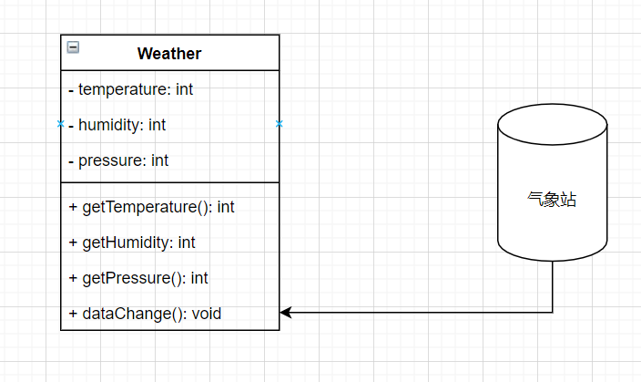
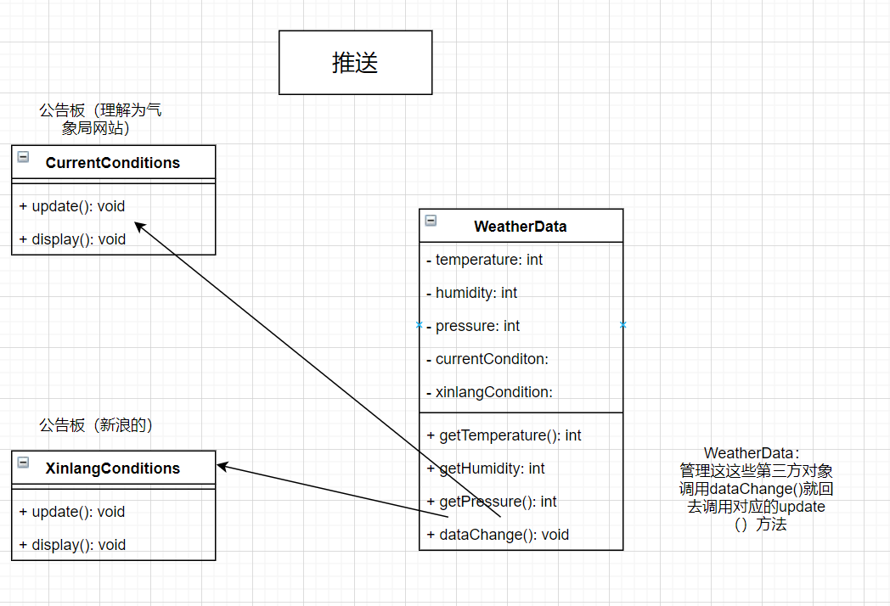
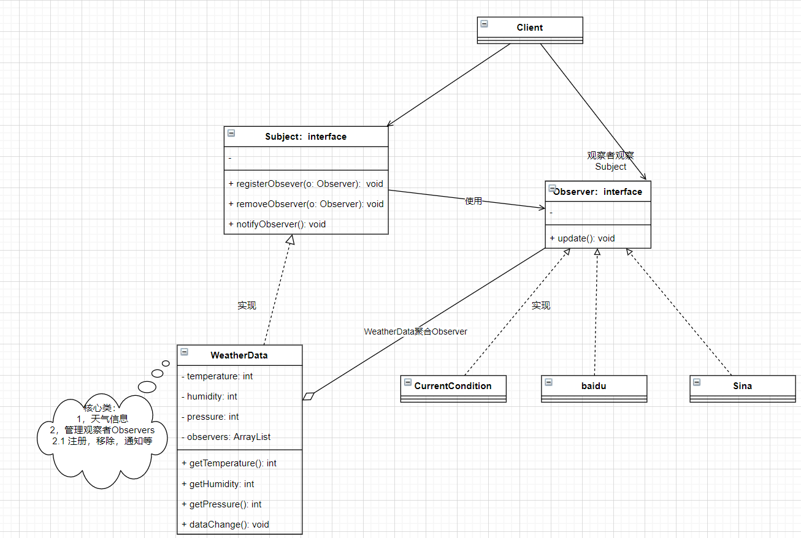

# 观察者模式

> **天气预报项目需求**
>
> 1）气象站可以将每天测量的温度，湿度，气压等以公告的形式发布出去（比如发布到自己的网站或者第三方）
>
> 2）需要设计开发型API，以便于第三方接入
>
> 3）提供文档，气压和湿度接口
>
> 4）测量数据更新时，要**实时**的通知第三方

## 1，普通方案

### 1.1 方式一：主动拉取

> 1) 通过getXxx方法，可以让第三方接入，并得到相关信息
> 2) 当数据更新时，气象站通过调用dataChange()去更新数据，当第三方再次获取时，如每个10s获取一次就能得到最新数据，当然也可以推送



### 1.2 方式二：推送

> 推送就是逆向的，气象站Weather每隔10s调用一次dataChange(), 然后看有哪些网站接入dataChange()的第三方，就推送过去。
>
> **公告板：**可以理解为第三方或者气象站自己的网站



**第三方**

```java
/**
 * 理解为网站（气象站或者第三方网站）
 */
@AllArgsConstructor
@NoArgsConstructor
@Data
public class CurrentConditions {
    private float temperature;
    private float pressure;
    private float humidity;

    // 更新天气，是由WeatherData来调用，推送模式
    public void update(float humidity, float pressure, float temperature) {
        this.temperature = temperature;
        this.pressure = pressure;
        this.humidity = humidity;
        display();
    }

    public void display() {
        System.out.println(this);
    }
}
```

**气象局天气**

```java
@Data
public class WeatherData {
    private float temperature;
    private float pressure;
    private float humidity;

    // 含有推送对象，肯定要维护其，当数据由更新是调用CurrentConditions的update方法
    private CurrentConditions currentConditions;

    public void dataChange() {
        currentConditions.update(getHumidity(), getPressure(), getTemperature());
    }

    // 数据更新
    public void setData(float humidity, float pressure, float temperature) {
        this.temperature = temperature;
        this.pressure = pressure;
        this.humidity = humidity;
        // 推送
        dataChange();
    }
}
```

**客服端**

```java
public class Client {
    public static void main(String[] args) {
        // 创建接入方
        CurrentConditions currentConditions = new CurrentConditions();
        // 创建 WeatherData
        WeatherData weatherData = new WeatherData();
        weatherData.setCurrentConditions(currentConditions);
        // 更新天气
        weatherData.setData(10.3f, 20.4f, 50f);
    }
}
```

**这种传统方案的缺点**

> 1) 其他第三方接入气象站获取数据的问题
> 2) 无法在运行时动态的接入第三方
>
> 在weatherData种，当增加一个第三方，都需要创建一个对应的第三方公告板对象，并加入到dataChange，不利于维护，也不是动态加入。


## 2，观察者模式原理

> 观察者模式类似定牛奶业务
>
> 1）牛奶站/气象局（提供数据）：Subject
>
> 2）用户/第三方网站(观察数据变化，由Subject通知的)：Observer
>
> → Subject：登记注册，移除和通知
>
> 1）registerObserver 注册
>
> 2）removeObjector 移除
>
> 3）notifyObservers 通知所有注册的用户，根据不同需求，可以是更新数据，让用户来取，也可以时推送，看具体需求来定。

**Subject**


**Observer：接收输入**

> → 观察者模式：对象之间多对一依赖的一种设计方案，被依赖的对象Subjcet，依赖的对象为Observer，Subject通知Observer变化。如气象站就是1的一方，第三方就是多的一方
>
> **过程**
>
> 1，client客服端通过Subject注册将观察者（如第三方）交给Subject实现类WeatherData
>
> 2，Subjcet实现类聚合观察者Observer对象
>
> 3，Subjcet实现类更新数据，遍历观察者即Observers（第三方等）调用其update()方法实现数据更新



