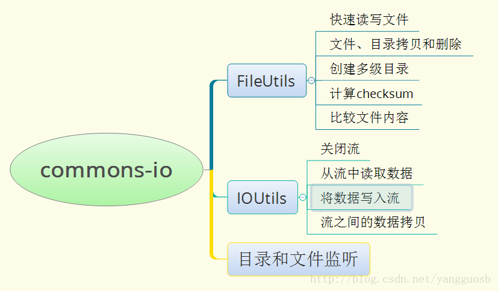
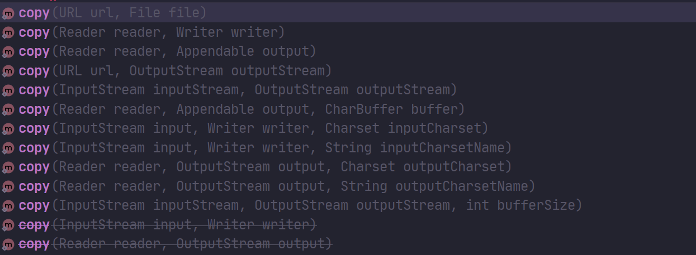

# commons-io工具包



## 1，简介

>   java io操作是开发中比较常用的技术,但是如果每次都使用原生的IO流来操作会显得比较繁琐。
>
>   Common IO 是一个工具库，用来帮助开发IO功能。

### 1.1 maven依赖

```xml
<dependency>
    <groupId>commons-io</groupId>
    <artifactId>commons-io</artifactId>
    <version>2.11.0</version>
</dependency>
```


## 2. IOUtils

>   包含一些工具类,用于处理读,写和拷贝，主要是IO流的相关操作。

### 2.1 copy方法

>   此方法有多个重载方法，满足不同的输入输出流，**其中输出文件可以不存在，但是文件所在的路径必须存在**。
>
>   

```java
// 将网络上资源写到本地
 IOUtils.copy(new URL("https://blog.csdn.net/backbug/article/details/99572931"), new File("D:\\Tmp\\demo.txt"));
// 以指定字符集输出字符，即指定输出的编码
IOUtils.copy(new FileReader(new File("D:\\Tmp\\demo.txt")),
            new FileOutputStream(new File("D:\\Tmp\\t1.txt")),
            "utf-8");
```

### 2.2 copyLarge

>    这个方法适合拷贝较大的数据流，比如2G以上

```java
 // 默认会用1024*4的buffer来读取
IOUtils.copyLarge(Reader input, Writer output)
IOUtils.copyLarge(Reader input, Writer output, char[] buffer)
```

### 2.3 toInputStream

>   将文本转换为输入流 ，可以指定输入流的编码，即以指定的编码解析输入。（输入流得到的内容就是文本


### 2.4 从输入流中获取字节数组

>   将输入流转换成字符数组。

```java
byte[] data = IOUtils.toByteArray(...);
```

### 2.5 从输入流中获取字符数组

```java
char[] chData = IOUtils.toCahrArray(...);
```

### 2.6 从输入中获取字符串

```java
char[] chData = IOUtils.toString(...);
```

### 2.5 按行读取数据

```java
List<String> line = IOUtils.readLines(...);
```

