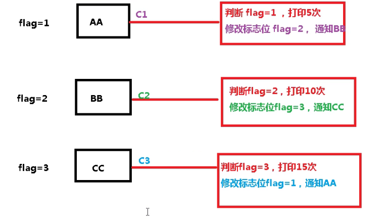
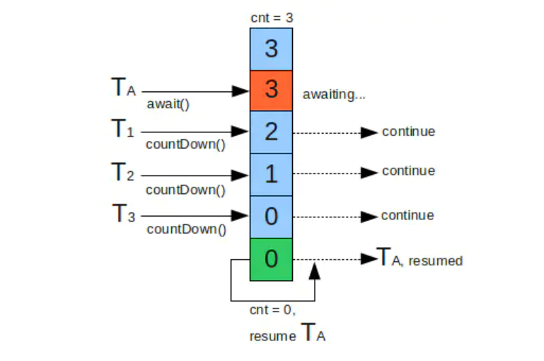
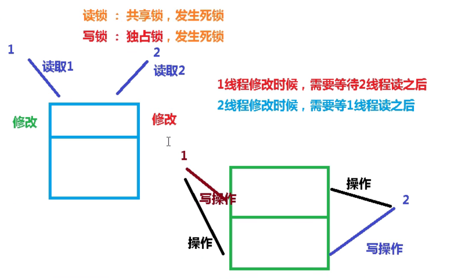

# Lock锁（显示的可重入锁）

**简介**

> juc下的locks包为锁和等待条件提供了一个框架的接口和类，他不同于内置的同步和监视器
>
> * Conditiion
> * Lock：提供比synchrozied更广泛的接口
> * ReadWriteLock


# 1，Lock接口

> Lock实现类：
>
> * ReentrantLock
> * ReentrantReadWriteLock
>   * ReentranReadWriteLock.ReadLock
>   * ReentrantReadWriteLock.WriteLock

**可重复锁：**

> (锁可以被重复利用) A 持有锁lock进行执行代码，A调用了B方法，但是B运行有需要同样的锁lock，若lock是可重入锁,A拥有了lock锁，B直接拿过来用，B代码执行。这个锁就是可重入锁。
>
> 若是不可重入锁则B无法运行
>
> **注意：**
>
> * 上锁：.lock()
> * 释放：unlock()


**使用**

* 上锁：.lock()
* 释放：unlock()

```java
public static void main(String[] args) {
    ReentrantLock lock = new ReentrantLock();
    ArrayList<String> list = new ArrayList<>();
    for (int i = 0; i < 30; i++) {
        new Thread(() -> {
             try {
                 // 上锁，如果抢到锁就会继续执行，否则阻塞等待直到获取锁
                 lock.lock();
                 list.add(UUID.randomUUID().toString());
                 System.out.println(list);
             } finally {
                 // 释放锁
                 lock.unlock();
             }
        }).start();
    }
}
```


# 2，线程的通信 synchrozied

> 线程按指定的顺序执行
>
> wait（）方法，必须在持有sychronized对象才能调用，也是该对象释放通知其他线程，wait会释放锁
>
> **wait 虚假唤醒：** 该方法对于某个参数的版本，实现中断和虚假唤醒是可能的，而且此方法应该**始终在循环**中使用，wait方法在那一行代码睡，就在那一行唤醒
>
> 原因：wait方法在那一行代码睡，就在那一行唤醒，唤醒时不会在执行if判断了。假设在睡时，抢到了cpu但是判断条件又不满足，由于不在进行判断了，就往下执行 -> 造成虚假唤醒：

**多线程编程固定步骤：**

**-> 上部：**

> 第一步：创建资源类，在资源类创建属性和操作方法

**-> 中部**

> 第二部：在资源类操作方法

1. 判断 (判断能否操作，例如：打印机没了还能打印吗)
2. 干活 (分配到资源就可以干活了)
3. 通知

> 第三步：创建多个线程，调用资源类的操作方法
>
> **第四步：防止虚假唤醒线程**


```java
// 资源类
public class Source {
    // 属性
    private int number = 0;

    // +1 的方法（操作方法）
    public synchronized void increment() throws InterruptedException {
        // 第二步，判断，干活，通知
        while (number != 0) { // 判断是否为0，不为0则等待
            this.wait();
        }
        // 如果值是0，就+1
        this.number++;
        System.out.println("+1 操作");
        // 通知其他线程
        this.notifyAll();
    }

    // -1 的方法（操作方法）
    public synchronized void decrement() throws InterruptedException {
        // 第二步，判断，干活，通知
        while (number != 1) {// 判断是否为1，不为1则等待
            this.wait();
        }
        this.number--;
        System.out.println("-1 操作");
        // 通知其他线程
        this.notifyAll();
    }
}
```

测试

```java
public static void main(String[] args) {
    Source source = new Source();
    new Thread(() -> {
        for (int i = 0; i < 30; i++) {
            try {
                source.increment();
            } catch (InterruptedException e) {
                e.printStackTrace();
            }
        }
    }, "AA").start();

    new Thread(() -> {
        for (int i = 0; i < 30; i++) {
            try {
                source.decrement();
            } catch (InterruptedException e) {
                e.printStackTrace();
            }
        }
    }, "BB").start();
}
```


# 3，Lock接口使用

**Lock接口**

| 返回值    | 方法                              | 描述                                                         |
| --------- | --------------------------------- | ------------------------------------------------------------ |
| void      | lock()                            | 获取锁，获取不到则程序在此等待                               |
| void      | lockInterruptibly()               | 如果当前线程未被中断，则获取锁                               |
| Condition | newCondition()                    | 返回绑定到此Lock实例的新Condition实例                        |
| boolean   | tryLock()                         | 仅在调用时锁为空闲才获取锁                                   |
| boolean   | tryLock(long time, TimeUnit uint) | 如果锁在给定的等待实际内空闲，并且当前线程未被中断，则获取锁 |
| void      | unlock()                          | 释放锁                                                       |
|           |                                   |                                                              |

**Condtion接口**

> Conditon将Object的监视方法分解为不同的对象。提供set(wati-set)。Conditon实例实质上被绑定到一个锁上。要为特定Lock实例获取Condition实例，请使用newCondition()方法

| 返回值 | 方法                            | 描述                                                         |
| ------ | ------------------------------- | ------------------------------------------------------------ |
| void   | await()                         | 造成当前线程在接收到信号之前处于等待状态（需要被唤醒）       |
| boolen | await(long time, TimeUnit uint) | 造成当前线程在接收到信号，或者达到指定等待时间之前处于等待状态（超过指定时间指定唤醒，争夺cpu） |
|        |                                 |                                                              |
|        |                                 |                                                              |
| void   | signal()                        | 唤醒一个等待的线程                                           |
| void   | signalAll()                     | 唤醒所有等待的线程                                           |


**Lock 实现线程间的通信**

```java
public class Source2 {
    // 创建Lock, Condition
    private Lock lock = new ReentrantLock();
    Condition condition = lock.newCondition();

    // 资源
    private Integer number = 0;

    // +1 操作
    public void incr() throws InterruptedException {
        // 上锁
        lock.lock();
        try {
            // 判断（等待）
            while (number != 0) {
                condition.await();
            }
            // 干活
            number++;
            System.out.println("+1 操作: " + number);
            // 通知
            condition.signalAll();
        } finally {
            // 解锁
            lock.unlock();
        }
    }

    // -1 操作
    public void decr() throws InterruptedException {
        // 上锁
        lock.lock();
        try {
            // 判断（等待）
            while (number != 1) {
                condition.await();
            }
            // 干活
            number--;
            System.out.println("-1 操作: " + number);
            // 通知
            condition.signalAll();
        } finally {
            // 解锁
            lock.unlock();
        }
    }
}
```


# 4，线程间的定制化通信

> 线程间的定制化通信即控制线程的执行过程。
>
> 如下，有线程间的定制化要求：
>
> * A线程打印5次
> * B线程打印10次
> * C线程打印15次
> * 进行10轮
>
> A,B,C线程有线程的执行过程要求

**实现1：使用变量标志，标志指明当前只能执行哪个线程**




# 5， synchrozied 锁（隐式可重入锁）

> * 是否是同一把锁
>   * 普通方法：锁是当前对象，如果对象不同锁也不同
>   * 静态方法：锁是当前字节码对象
> * 锁的范围
>   * 普通方法：范围是当前实例对象是this
>   * 静态方法：锁的是当前类Class字节码对象
>   * 同步代码块：锁是synchrozied（obj）括号里面配置的对象


# 6，公平锁和非公平锁

> 非公平锁：任务在给线程的分配是不公平的，有可能由一个线程一直干活，其他线程一直闲着。
>
> 后果：如果是多线程，售票员售票一个售票员一直在忙其他售票员却是在闲着，如果收入和售票的数有关，那么只有一个人在赚钱，其他人无钱可赚。

* new ReentrantLock() // 非公平锁
* new ReentrantLock(false)  // 非公平锁
* new ReentrantLock(true) // 公平锁

**优缺点：**

> 非公平锁：
>
> * 线程饿死
> * 效率高
>
> 公平锁：
>
> * 线程公平获取任务
> * 效率相对低（有询问和排队时间销毁）


# 7，可重入锁

> 可重入锁又叫递归锁：即一把锁在调用链中可以被重复使用，只要是同一把锁就可以往下调用

**synchrozied 可重入锁演示**

```java
public static void main(String[] args) {
    Object o = new Object();
    new Thread(() -> {
       synchronized (o) {
           System.out.println("外层");
           synchronized (o) {
               System.out.println("中层");
           }
       }
    }).start();
}
```

**Lock 可重入锁演示**

```java
public static void main(String[] args) {
    ReentrantLock lock = new ReentrantLock();
    new Thread(() -> {
        try {
            lock.lock();
            System.out.println("外层");
            try {
                lock.lock();
                System.out.println("中层");
            } finally {
                // 释放锁
                lock.unlock();
            }
        } finally {
            // 释放锁
            lock.unlock();
        }
    }, "AA").start();
}
```

**问题?: ** 

1.  中层的锁是否需要释放
   * 不释放（代码不写）：是不对的，因为**上锁和解锁是一对的**。如果还有其他线程，其他线程是无法执行的，因为锁还没释放
   * 释放锁：会释放外层的锁吗？不会。中层释放之后外层仍然持有锁


# 8，死锁

> **什么是死锁：** 两个或两个以上的线程在执行过程中，相互争夺资源而造成的一种无法进行下去相互等待的现象。如果没有外力干涉，他们是无法再执行下去的。
>
> **死锁产生条件：**
>
> 1. 并发访问条件
> 2. 相互争夺资源，并且资源不足（有限），不可剥夺
> 3. 进程运行推荐顺序不合适，资源分配不当
> 4. 形成循环等待链

**示例**

> 运行过程不一定会出现死锁，因为线程运行时不确定的，多运行几次。

```java
public static void main(String[] args) {
    Object a = new Object();
    Object b = new Object();
    new Thread(() -> {
        synchronized (a) {
            System.out.println(Thread.currentThread().getName() + "持有锁a");
            synchronized (b) {
                System.out.println(Thread.currentThread().getName() + "持有锁b");
            }
        }
    }, "AA").start();

    new Thread(() -> {
        synchronized (b) {
            System.out.println(Thread.currentThread().getName() + "持有锁b");
            synchronized (a) {
                System.out.println(Thread.currentThread().getName() + "持有锁a");
            }
        }
    }, "BB").start();
}
```


# 9，辅助类锁

## 9.1 闭锁（减少技术）CountDownLatch

> CountDownLatch是一个同步工具类，它允许一个或多个线程一直等待（await），直到其他线程执行完（countDown）后再执行。
>
> ​		CountDownLatch是通过一个计数器来实现的，计数器的初始值为”线程“的数量。每当一个线程完成了自己的任务后，计数的值就会减1。当计数器值到达0时，它所表示所有的线程已经完成了任务，然后在闭锁上等待的线程就可以恢复执行任务。
>
> **使用场景：**
>
> 闭锁可以用来确保特定活动直到其他的活动都完成后才开始发生(类似于多个任务的组合,所有任务都执行了才执行)
>
> **注意：**
>
> * CountDownLatch是“锁：，当一个线程或多个调用await方法时这些线程会被阻塞等待
> * 调用countDown方法的线程不会被阻塞，但会使计数count减1，当计数为0时，调用了await的被阻塞的线程会被唤醒



| 返回值  | 方法                              | 描述                                                         |
| ------- | --------------------------------- | ------------------------------------------------------------ |
|         | CountDownLatch(int count)         | 构造方法，初始化计算值                                       |
| void    | await()                           | 使当前线程在锁存器计数为零之前一直等待，除非线程中断         |
| boolean | await(int timeout, TimeUnit unit) | 使当前线程在锁存器计数为零之前一直等待，除非线程中断。超过等待时间会被唤醒 |
| void    | countDown()                       | 递减锁存器的计数，如果为0，则是否所有等待的线程。计数-1      |
| long    | getCount()                        | 返回计数                                                     |
| String  | toString()                        |                                                              |

这样理解通过await来阻塞等待，同countDown来将计数减一来唤醒阻塞线程

**使用案例**

```java
public static void main(String[] args) throws InterruptedException {
    CountDownLatch lock = new CountDownLatch(6);
    for (int i = 0; i < 6; i++) {
        new Thread(() -> {
            System.out.println(Thread.currentThread().getName() + "号学生离开了教室");
            lock.countDown();
        }, String.valueOf(i)).start();
    }

    // 该线程阻塞等待其他线程将计数减为0
    lock.await();
    System.out.println(Thread.currentThread().getName() + "班长关门（主线程或其他线程）");
}
```


## 9.2 循环栅栏 CyclicBarrier

> 其是一个辅助类，他允许一组线程相互等待，直到到达某个公共屏障点（线程到达屏障点，该线程未执行完的哦，都到了屏障点大家一起往下执行）才会继续下一步行动。
>
> 大概的意思就是一个可循环利用的屏障。
>
> **使用场景**
>
> * 可以用于多线程计算数据，最后合并计算结果的场景
>
> **理解：** 集齐七龙珠召唤神龙

| 返回值  | 方法                                           | 描述                                                         |
| ------- | ---------------------------------------------- | ------------------------------------------------------------ |
|         | CyclicBarrier（int parities）                  | 构造函数，给定数量参与线程个数                               |
|         | CyclicBarrier（int parities，Runnable action） | 构造函数，给定数量参与线程个数, 操作action有最后一个进入barrier的线程执行 |
| int     | await()                                        | 线程调用 await() 表示自己已经到达栅栏，该线程在此阻塞        |
| int     | await(int timeout, TimeUnit unit)              | 线程调用 await() 表示自己已经到达栅栏，该线程在此阻塞。超时执行action |
| int     | getParties()                                   | 查询已经参与线程个数                                         |
| boolean | isBroken()                                     | 是否处于损坏状态                                             |
| void    | reset()                                        | 将屏障重置为初始状态                                         |
|         |                                                |                                                              |

**代码**

```java
public static void main(String[] args) throws InterruptedException {
    // 参与者个数
   int parities = 10;
    CyclicBarrier cyclicBarrier = new CyclicBarrier(parities);
    for (int i = 0; i < parities; i++) {
        new Thread(() -> {
            System.out.println(Thread.currentThread().getName() + "到达栅栏点");
            try {
                // 设置屏障点，线程运行到此就会阻塞等待，直到所有线程都到此才会往下执行
                cyclicBarrier.await();
                // 线程都到达屏障点后执行
                System.out.println(Thread.currentThread().getName() + "进行下一步操作");
            } catch (Exception e) {
                e.printStackTrace();
            }
        }, String.valueOf(i)).start();
    }
}
```

**CyclicBarrier 与 CountDownLatch 区别：**

* CountDownLatch 是一次性的，CyclicBarrier 是可循环利用的

* CountDownLatch 参与的线程的职责是不一样的，有的在倒计时，有的在等待倒计时结束。CyclicBarrier 参与的线程职责是一样的。


## 9.3 信号量 Semaphore

> （功能强大的锁）
>
> [ˈseməfɔːr]
>
> 是一个计数的信号量。从概念上讲，信号量维护了一个许可集（许可证）。可以看作资源的集合。线程拿到其中一个许可证就可以执行，如果调用acquire()获取许可没拿到就会被阻塞。
>
> 案例：6量汽车，3个停车位


| 返回值  | 方法                                 | 描述                                                         |
| ------- | ------------------------------------ | ------------------------------------------------------------ |
|         | Semaphore(int permits)               | 构造函数，给定一定数目的许可证（资源）                       |
|         | Semaphore(int permits，boolean fair) | 构造函数，给定一定数目的许可证（资源）和公平设置             |
| void    | acquire()                            | 从信号量中获取一个许可，未获取到阻塞等待直到获取成功，或者线程被中断 |
| void    | acquire(int permits)                 | 从信号量中获取permits个许可，未获取到阻塞等待直到获取成功，或者线程被中断 |
| void    | release()                            | 释放一个许可，将其放回信号量中                               |
| void    | release(int permits)                 | 释放permits个许可，将其放回信号量中                          |
| boolean | tryAcquire()                         | 仅在调用时尝试获取一个许可                                   |
| .....   |                                      |                                                              |
|         |                                      |                                                              |

**注：** 如何讲一个许可提前交给一个线程从而实现同步控制呢

```java
public static void main(String[] args) {
    Semaphore semaphore = new Semaphore(3);
    for (int i = 0; i < 6; i++) {
        new Thread(() -> {
            try {
                // 抢占许可, 若获取不到就会阻塞等待直到获取许可
                semaphore.acquire();
                System.out.println(Thread.currentThread() + "抢到车位了");

                // 设置停车时间
                Thread.sleep(new Random().nextInt(5));
                System.out.println(Thread.currentThread() + "------- 离开停车位");
            } catch (InterruptedException e) {
                e.printStackTrace();
            } finally {
                // 释放许可（资源）
                semaphore.release();
            }
        }, String.valueOf(i)).start();
    }
}
```


## 9.4 读写锁

> 一个资源可以被多个读锁访问，或者可可以被一个写线程访问，但是不能同时存在读写线程，读写互斥，读读共享。
>
> * **悲观锁**：它指的是对数据被外界修改持保守态度，认为一定会发生并发问题。一开始就做了并发问题的控制，即实现了加锁机制。
> * **乐观锁**：乐观锁假设数据一般情况不会造成冲突，所以在数据进行提交更新的时候，才会正式对数据的冲突与否进行检测，如果冲突，则返回给用户异常信息，让用户决定如何去做
>   * 乐观锁适用于读多写少的场景，这样可以提高程序的吞吐量
>   * 乐观锁实现需要一个版本号，即要保证读的数据和写的时候是自己的
> * **MySQL表锁**：整张表都锁住，不会发生死锁
> * **MySQL行锁**：将表的一条记录锁住，会发生死锁


**读锁：**共享锁，会发生死锁

​	：读线程1在读取数据，读线程2也在读取数据，并且读线程1要修改数据，可是需要等读线程2读取完毕才能写入，恰巧读线程2也要修改数据，需要等读线程1读取完毕，这个时候出现相互等待的情况发生死锁。

**写锁：**独占锁，会发生死锁（操作多条记录才会出现）



```java
public class MyCache {

    /**
     * 读写锁
     */
    private ReentrantReadWriteLock readWriteLock = new ReentrantReadWriteLock();

    /**
     * 缓存
     */
    private Map<String, Object> cache = new HashMap<>();

    /**
     * 添加缓存
     */
    public void put(String key, Object data) {
        // 添加写锁, 未获取锁就会阻塞等待
        readWriteLock.writeLock().lock();

        try {
            System.out.println(Thread.currentThread().getName() + " 正在写操作" + key);
            cache.put(key, data);
            System.out.println(Thread.currentThread().getName() + " 正在写完了" + key);
        } finally {
            // 释放写锁
            readWriteLock.writeLock().unlock();
        }
    }

    /**
     * 获取数据
     */
    public Object get(String key) {
        // 添加读锁, 未获取锁就会阻塞等待
        readWriteLock.readLock().lock();
        Object data = null;
        try {
            data = cache.get(key);
            System.out.println(Thread.currentThread().getName() + "读取数据完毕 " + key);
        } finally {
            // 释放读锁
            readWriteLock.readLock().unlock();
        }
        
        return data;
    }
}

```


**缺点：**

* 饥饿现象：一直读，没有写或者一直写，没有读
* 写的时候不能读，读的时候不能写


**锁降级**
