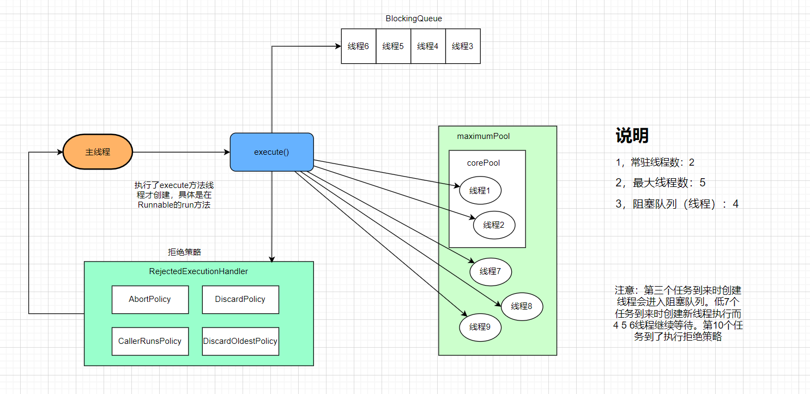

# TheadPool

## 1，线程池概述


## 2，线程池使用和底层原理

### 2.1 线程池使用方式

> **通过Executors工具类创建线程池ThreadPoolExecutor**
>
> * Executors.newFixedThreadPool(int n): 一池N线程
> * Executors.newSingleThreadPool(): 一个任务一个任务执行，一池一线程
> * Executors.newCacheThreadPool()：线程池根据需求创建线程，可扩容
>
> **自定义线程池**

**自定义线程池**

> **参数介绍**
>
> * corePoolSize：核心线程数，即常驻线程数
> * maximumPoolSize：最大线程数量
> * keepAliveTime：超出corePoolSize那部分线程的空闲（存活）时间
> * unit：时间单位
> * workQueue：任务队列，或说阻塞队列。核心线程数满时，该队列起作用
> * threadFactory：线程工厂，线程是一个一个的对象由线程工厂来创建（一般使用默认 Executors.defaultThreadFactory())
> * handler：拒绝策略，线程池无法处理时，对于新进来的任务作何处理。如： new ThreadPoolExecutor.AbortPolicy()

```java
public ThreadPoolExecutor(int corePoolSize,
                          int maximumPoolSize,
                          long keepAliveTime,
                          TimeUnit unit,
                          BlockingQueue<Runnable> workQueue,
                          ThreadFactory threadFactory,
                          RejectedExecutionHandler handler) {
    // ...
}
```


### 2.2 底层原理




### 2.3 拒绝策略

> **AbortPolicy(默认)** 
>
> > 直接抛出RejectedExecutionException异常阻止系统正常运行
>
> **CallerRunsPolicy**
>
> > "调用者运行"一种调节机制，该策略不会抛异常，亦不会抛弃任务，谁提交任务的谁来处理
>
> **DiscardOldestPolicy**
>
> > 抛弃队列中等待最近的任务，然后把当前任务加入队列中，尝试提交当前任务
>
> **DiscardPolicy**
>
> > 该策略默默地丢弃无法处理的任务，不予处理也不予抛出异常。如果允许任务丢失，这是最好的一种策略。

**代码**

```java
//。。。
```


## 3，分支合并框架