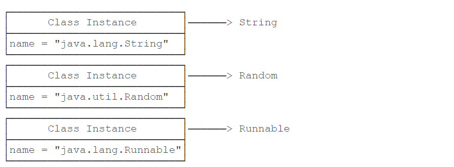

# Java反射

## 1，Class类

### 1.1 类与字节码对象

除了`int`等基本类型外，Java的其他类型全部都是`class`类（包括`interface`接口），`class`类（包括`interface`接口）本质都是数据类型（`type`）。

而类`class`是由JVM在执行过程中动态加载的。每加载一种`class`类，JVM就为其创建一个`Class`（大写）类型的实例，并关联起来。<font color="red">这里的`Class`类型是一个名叫`Class`的`class`</font>

```java
public final class Class {
    private Class() {}
}
```


这个`Class`实例是JVM内部创建的，如果我们查看JDK源码，可以发现`Class`类的构造方法是`private`，只有JVM能创建`Class`实例，我们自己的Java程序是无法创建`Class`实例。

JVM持有的每个`Class`实例都指向一个数据类型（`class`或`interface`）如：



### 1.1 字节码对象

一个`Class`实例包含了该`class`的所有完整信息：

*   name：类的全限定名称
*   package：包名
*   super：父类
*   interface：实现的接口
*   field：类的属性
*   method：类的所以方法
*   .....

>   如果获取某个Class实例，就可以通过这个`Class`实例获取到该实例对应的`class`类的所有信息，这种通过`Class`实例获取`class`信息的方法称为反射（Reflection）。
>
>   **PS: ** 因为`Class`实例在JVM中是唯一的，获取同一个`class`的`Class`实例是同一个实例，可以用`==`比较。

#### 1.2 获取字节码对象

**1，通过类的静态变量class获取**

```java
Class clazz = String.class;
```

**2，通过该实例变量提供的`getClass()`方法获取**

```java
String s = "Hello";
Class clazz = s.getClass();
```

**3，通过静态方法`Class.forName()`获取**

```java
Class clazz = Class.forName("java.lang.String");
```


### 1.3 `Class`实例==比较和`instanceof`的差别

>   用`instanceof`不但匹配指定类型，还匹配指定类型的子类。
>
>   `==`判断`class`实例可以精确地判断数据类型是否是同一个，但不能作子类型比较。


### 1.4 数组对象类型

>   数组（例如`String[]`）也是一种类，而且不同于`String.class`，它的类名是`[Ljava.lang.String;`(就是这个没写错)

## 2，反射创建对象

### 2.1 `Class.newInstance()`创建类实例

```java
// 获取String的Class实例:
Class clazz = String.class;
// 创建一个String实例:
String s = (String) clazz.newInstance()
```

>   通过`Class.newInstance()`可以创建类实例，它的局限是：只能调用`public`的无参数构造方法。带参数的构造方法，或者非`public`的构造方法都无法通过`Class.newInstance()`被调用。


# 二，访问字段

>   由于Class和class绑定，如果获取某个Class实例，就可以通过这个`Class`实例获取到该实例对应的`class`类的所有信息，这种通过`Class`实例获取`class`信息的方法称为反射（Reflection）。
>
>   对任意的一个`Object`实例，只要我们获取了它的`Class`，就可以获取它的一切信息。
>
>   比如：访问字段

## 1.1，访问字段信息的方法

-   Field getField(name)：根据字段名获取某个public的field（包括父类）
-   Field getDeclaredField(name)：根据字段名获取当前类的某个field（不包括父类）
-   Field[] getFields()：获取所有public的field（包括父类）
-   Field[] getDeclaredFields()：获取当前类的所有field（不包括父类）


**案例：**

```java
class Person {
    public String name;
}
```

```java
class Student extends Person {
    public int score;
    private int grade;
}
```

```java
public class Main {
    public static void main(String[] args) throws Exception {
        Class stdClass = Student.class;
        // 获取public字段"score":
        System.out.println(stdClass.getField("score"));
        // 获取继承的public字段"name":
        System.out.println(stdClass.getField("name"));
        // 获取private字段"grade":
        System.out.println(stdClass.getDeclaredField("grade"));
    }
}
```


## 1.2 Field 属性类

### 1.2.0 获取Field信息

>   一个`Field`对象包含了一个字段的所有信息，如：
>
>   *   `getName()`：返回字段名称，例如，`"name"`；
>   *   `getType()`：返回字段类型Class实例，也是一个`Class`实例，例如，`String.class`；
>   *   `getModifiers()`：返回字段的修饰符，它是一个`int`，不同的值表示不同的访问修饰符。


### 1.2.1 获取属性值

>   利用反射拿到字段的一个`Field`实例只是第一步，我们还可以拿到一个**实例**对应的该字段的值。
>
>   所以利用反射获取字段值，必然有`字节码对象，对象实例`。

**方法1：**与是否有get和set方法无关

```java
class Person {
    private String name;

    public Person(String name) {
        this.name = name;
    }
}
```

```java
public class Main {
    public static void main(String[] args) throws Exception {
        Object p = new Person("Xiao Ming");
        Class c = p.getClass();
        f.setAccessible(true);
        Field f = c.getDeclaredField("name");
        Object value = f.get(p);
        System.out.println(value); // "Xiao Ming"
    }
}
```

**方式2：**通过调用getter方法，该方式在Method章节


**注意：被定义为一个`private`字段，正常情况下是无法访问`类的`private`字段，可以：**

```java
f.setAccessible(true);
```

调用`Field.setAccessible(true)`的意思是，别管这个字段是不是`public`，一律允许访问。此外，`setAccessible(true)`可能会失败。


### 1.2.2 设值属性值

>   通过`Field`实例既然可以获取到`指定实例`的字段值，自然也可以设置字段的值。
>
>   设置字段值是通过`Field.set(Object target, Object value)`实现的，其中第一个`Object`参数是指定的实例，第二个`Object`参数是待修改的值。
>
>   同样的，修改非`public`字段，需要首先调用`setAccessible(true)`。


**方式1：**上述描述（与是否有get和set方法无关）

```java
public class Main {
    public static void main(String[] args) throws Exception {
        Person p = new Person("Xiao Ming");
        System.out.println(p.getName()); // "Xiao Ming"
        Class c = p.getClass();
        Field f = c.getDeclaredField("name");
        f.setAccessible(true);
        f.set(p, "Xiao Hong");
        System.out.println(p.getName()); // "Xiao Hong"
    }
}
```


**方式2：** 通过调用setter方法，该方式在Method章节


## 1.3，调用方法

>   能通过`Class`实例获取所有`Field`对象，同样的，可以通过`Class`实例获取所有`Method`信息。
>
>   **获取方法的方式：**
>
>   -   `Method getMethod(name, Class...)`：获取某个`public`的`Method`（包括父类）name是方法名，Class是参数的字节码对象。
>   -   `Method getDeclaredMethod(name, Class...)`：获取当前类的某个`Method`（不包括父类）name是方法名，Class是参数的字节码对象
>   -   `Method[] getMethods()`：获取所有`public`的`Method`（包括父类）
>   -   `Method[] getDeclaredMethods()`：获取当前类的所有`Method`（不包括父类）

```java
public class Main {
    public static void main(String[] args) throws Exception {
        Class stdClass = Student.class;
        // 获取public方法getScore，参数为String:
        System.out.println(stdClass.getMethod("getScore", String.class));
        // 获取继承的public方法getName，无参数:
        System.out.println(stdClass.getMethod("getName"));
        // 获取private方法getGrade，参数为int:
        System.out.println(stdClass.getDeclaredMethod("getGrade", int.class));
    }
}
// 内部类
class Student extends Person {
    public int getScore(String type) {
        return 99;
    }
    private int getGrade(int year) {
        return 1;
    }
}
// 内部类
class Person {
    public String getName() {
        return "Person";
    }
}
```


### 1.3.1 获取Method信息

>   一个`Method`对象包含一个方法的所有信息：
>
>   -   `getName()`：返回方法名称，例如：`"getScore"`；
>   -   `getReturnType()`：返回方法返回值类型，也是一个Class实例，例如：`String.class`；
>   -   `getParameterTypes()`：返回方法的参数类型，是一个Class数组，例如：`{String.class, int.class}`；
>   -   `getModifiers()`：返回方法的修饰符，它是一个`int`，不同的bit表示不同的含义。


### 1.3.2 调用普通方法

>   通过Class实例调用方法，调用的必然是某个对象实例的，Class只是定义，所以反射调用方法必须存在对象target。

```java
public class Main {
    public static void main(String[] args) throws Exception {
        // String对象:
        String s = "Hello world";
        // 获取String substring(int)方法，参数为int:
        Method m = String.class.getMethod("substring", int.class);
        // 在s对象上调用该方法并获取结果:
        String r = (String) m.invoke(s, 6);
        // 打印调用结果:
        System.out.println(r);
    }
}
```

对`Method`实例调用`invoke`就相当于调用该方法，`invoke`的第一个参数是对象实例，后面是可变参数，其要与方法参数一致。


### 1.3.3 调用静态方法

>   如果获取到的Method表示一个静态方法，调用静态方法时，由于无需指定实例对象，所以`invoke`方法传入的第一个参数永远为`null`。

```java
public class Main {
    public static void main(String[] args) throws Exception {
        // 获取Integer.parseInt(String)方法，参数为String:
        Method m = Integer.class.getMethod("parseInt", String.class);
        // 调用该静态方法并获取结果:
        Integer n = (Integer) m.invoke(null, "12345");
        // 打印调用结果:
        System.out.println(n);
    }
}
```


### 1.3.4 调用非public方法

>   调用非public方法与访问非publicField一样。
>
>   对于非public方法，我们虽然可以通过`Class.getDeclaredMethod()`获取该方法实例，但直接对其调用将得到一个`IllegalAccessException`。为了调用非public方法，我们通过`Method.setAccessible(true)`允许其调用。

```java
public class Main {
    public static void main(String[] args) throws Exception {
        Person p = new Person();
        Method m = p.getClass().getDeclaredMethod("setName", String.class);
        m.setAccessible(true);
        m.invoke(p, "Bob");
        System.out.println(p.name);
    }
}
// 内部类
class Person {
    String name;
    private void setName(String name) {
        this.name = name;
    }
}
```

**PS:** `setAccessible(true)`可能会失败。

**注意：**反射调用方法时，仍然遵循多态原则。


## 1.4 获取继承关系

### 1.4.1 获取父类的Class

*   Class.getSuperclass();

```java
public class Main {
    public static void main(String[] args) throws Exception {
        Class i = Integer.class;
        Class n = i.getSuperclass();
        System.out.println(n);
        Class o = n.getSuperclass();
        System.out.println(o);
        System.out.println(o.getSuperclass());
    }
}
```


### 1.4.2 获取interface

>   由于一个类可能实现一个或多个接口，通过`Class`我们就可以查询到实现的接口类型。
>
>   **注意：**`getInterfaces()`只返回当前类直接实现的接口类型，并不包括其父类实现的接口类型

```java
public class Main {
    public static void main(String[] args) throws Exception {
        Class s = Integer.class;
        Class[] is = s.getInterfaces();
        for (Class i : is) {
            System.out.println(i);
        }
    }
}
```


### 1.4.3 判断继承关系

当我们判断一个实例是否是某个类型时，正常情况下，使用`instanceof`操作符

```java
Object n = Integer.valueOf(123);
boolean isDouble = n instanceof Double; // false
boolean isInteger = n instanceof Integer; // true
boolean isNumber = n instanceof Number; // true
boolean isSerializable = n instanceof java.io.Serializable; // true
```

如果是两个`Class`实例，要判断一个向上转型是否成立，可以调用`isAssignableFrom()`

```java
// Integer i = ?
Integer.class.isAssignableFrom(Integer.class); // true，因为Integer可以赋值给Integer
// Number n = ?
Number.class.isAssignableFrom(Integer.class); // true，因为Integer可以赋值给Number
// Object o = ?
Object.class.isAssignableFrom(Integer.class); // true，因为Integer可以赋值给Object
// Integer i = ?
Integer.class.isAssignableFrom(Number.class); // false，因为Number不能赋值给Integer
```

