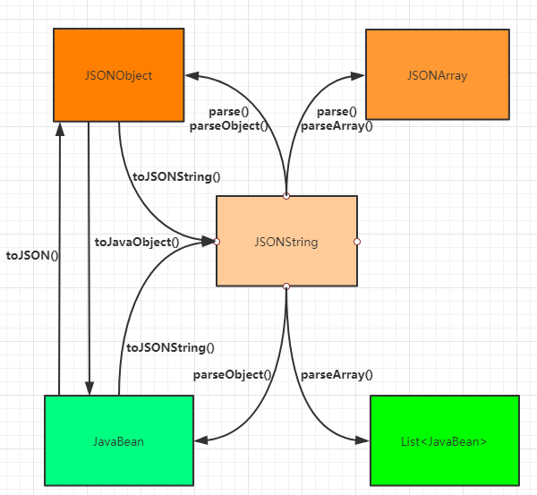

# FastJson

## Json数据格式

### 什么是json

> JSON(JavaScript Object Notation，js对象简谱) 是一种轻量级的数据交换格式。

### Json数据格式

* 对象:

  > {k1: v1, k2: v2}

* 数组: 中括号包裹，数据的元素的数据类型没有限制，数据之间使用逗号隔开

  > ["v1", {k1: v1}, 2, [{k2: v2, k3: v3}]]
  >
  > {
  >
  > ​	"k1": [
  >
  > ​		{"name": "name1", "age": 19},
  >
  > ​		{"name": "name2", "age": 20}
  >
  > ​	]
  >
  > }

注：通常两种格式是嵌套使用的，结构往往比较负责。key 和数组index确定元素


## FastJson 介绍

​		可以实现Java Bean序列化为JSON字符串，也可以从JSON字符串反序列化为Java Bean


**优点：**

* **速度快**（最快）

* 使用广泛

* **测试完备（功能稳定）**

* 使用简单

* 功能完备

  > 支持泛型，支持流处理超大文本，支持枚举，支持序列化和反序列化扩展


## FastJson 序列化API

> 序列化: 是将Java对象转化为Json格式字符串的过程。JavaBean对象，List集合对象，Map集合等
>
> JSON.toJSONString()




> 参与转换的对象主要有五种
>
> 1. **JSONString**：`json字符串`
> 2. **JSONObject**：`json对象`
> 3. **JSONArray**：`json对象数组`
> 4. **JavaBean**：`java对象`
> 5. **List** ：`java对象集合`
>
> 转化中用到的方法的方法名有如下几种
>
> * **parse**: JSONString ==> JSONObject/JSONArray
> * **parseObject**: JSONString ==> JSONObject/JavaBean
> * **pareseArray**: JSONString ==> JSONObject/List
> * **toJSONString**: JavaBean/JSONObject ==> JSONString
> * **toJSON**: JavaBean ==> JSONObject
> * **toJavaObject**: JSONObject ==> JavaBean


**注意：空值默认不会被序列化到json格式字符串中的**

* 序列化对象：对象

  ```java
   public void testFastJson() {
       Student s = new Student();
       s.setName("kato");
       s.setAge(19);
       s.setBirthday(new Date());
  
       String json = JSON.toJSONString(s);
       // 日期对象不对，如何改呢
       System.out.println(json);// 结果：{"age":19,"birthday":1633097253256,"name":"yanggy"}
   }
  ```

* 序列化集合：数组

```java
public void testFastJson2() {
    Student s = new Student();
    s.setName("kato");
    s.setAge(19);
    s.setBirthday(new Date());

    Student s1 = new Student();
    s1.setName("kato");
    s1.setAge(19);
    s1.setBirthday(new Date());

    ArrayList<Student> list = new ArrayList<>();
    list.add(s);
    list.add(s1);

    String jsonList = JSON.toJSONString(list);
    System.out.println(jsonList);
    //[{"age":19,"birthday":1633097543815,"name":"kato"},{"age":19,"birthday":1633097543815,"name":"kato"}]
 
}
```

* 序列化map对象：对象

  ```java
   public void testFastJson3() {
       Student s = new Student();
       s.setName("kato");
       s.setAge(19);
       s.setBirthday(new Date());
  
       HashMap<String, Object> map = new HashMap<>();
       map.put("student", s);
       map.put("total", 1);
       map.put("class", "01班");
  
       String json = JSON.toJSONString(map);
       System.out.println(json);
       // {"total":1,"student":{"age":19,"birthday":1633097936655,"name":"kato"},"class":"01班"}
   }
  ```

  

## FastJson 反序列化API

> 反序列化：将json格式字符串反序列化为Java对象的过程
>
> JSON.parseObject()
>
> JSON.parseArray()


* 反序列化为对象: 对象

  > 目标类型 obj =  JSON.parseObject("json字符串", 目标类型.class)

  ```java
  public void testFastJosn4() {
      String json = "{\"age\":19,\"birthday\":1633097253256,\"name\":\"asuna\"}";
      Student s = JSON.parseObject(json, Student.class);
      System.out.println(s);
      // 结果：Student(name=asuna, age=19, birthday=Fri Oct 01 22:07:33 CST 2021)
  }
  ```

* 反序列化为集合：List

  ```java
  public void testFastJosn5() {
      String jsonArr = "[{\"age\":19,\"birthday\":1633097543815,\"name\":\"kato\"},{\"age\":19,\"birthday\":1633097543815,\"name\":\"kato\"}]";
      List<Student> students = JSON.parseArray(jsonArr, Student.class);
      System.out.println(students);
      //结果： [Student(name=kato, age=19, birthday=Fri Oct 01 22:12:23 CST 2021), Student(name=kato, age=19, birthday=Fri Oct 01 22:12:23 CST 2021)]
  
  }
  ```

* 反序列化为Map：Map对象(JSON.parseObject() + 泛型引用参数)

  ```java
  public void testFastJosn6() {
      String jsonArr = "{\"student1\":{\"age\":19,\"birthday\":1633097936655,\"name\":\"kato\"}, \"student2\":{\"age\":21,\"birthday\":1633097936655,\"name\":\"asuna\"}}";
      Map<String, Student> stringStudentMap = JSON.parseObject(jsonArr, new TypeReference<Map<String, Student>>() {});
      for (Map.Entry<String, Student> entry : stringStudentMap.entrySet()) {
          System.out.println(entry.getValue());
      }
      /*
      Student(name=asuna, age=21, birthday=Fri Oct 01 22:18:56 CST 2021)
  	Student(name=kato, age=19, birthday=Fri Oct 01 22:18:56 CST 2021)
      */
  }
  ```

  > 反序列化为map是，需要使用泛型引用TypeReference（内部属性是反射的Type属性）有构造器可知不能直接创建，所以匿名内部类。


## 枚举 SerializerFeature

> JSON.toJSONString() + 枚举参数
>
> 枚举支持序列化的一些特性数据定义
>
> fastJosn默认对对象的属性值为null的字段不进行序列化到json格式字符串中的，如果要序列化则使用参数明确要序列化

* 枚举常量**WriteMapNullValue**序列化为**null**的字段

```java
public void testFastJson() {
    Student s = new Student();
    s.setName("kato");
    s.setAge(19);
    String json = JSON.toJSONString(s);
    System.out.println(json);
    // {"age":19,"name":"kato"}
}

public void testFastJson() {
    Student s = new Student();
    s.setName("kato");
    s.setAge(19);
    s.setBirthday(new Date());
    String json = JSON.toJSONString(s);
    System.out.println(json);
    // {"age":19,"birthday":1633101459105,"name":"kato"}
}

/******************** WriteMapNullValue *********************/
public void testFastJson() {
    Student s = new Student();
    s.setName("kato");
    s.setAge(19);
    String json = JSON.toJSONString(s, SerializerFeature.WriteMapNullValue);
    System.out.println(json);
}
```

* 枚举常量**WriteNullStringAsEmpty**字段为null序列化为”“

  ```java
  public void testFastJson() {
      Student s = new Student();
      s.setAge(19);
      s.setBirthday(new Date());
      String json = JSON.toJSONString(s, SerializerFeature.WriteNullStringAsEmpty);
      System.out.println(json);
      // {"age":19,"birthday":1633101725730,"name":""}
  }
  ```

* 枚举常量**WriteNullNumberAsZero**序列化自动值为null序列化为0


* 枚举常量**WriteNullBooleanAsFalse**布尔值为null时序列化为false


* 枚举常量**WriteDateUseDateFormat**日期格式化

  ```java
  public void testFastJson() {
      Student s = new Student();
      s.setAge(19);
      s.setBirthday(new Date());
      String json = JSON.toJSONString(s, SerializerFeature.WriteNullStringAsEmpty, SerializerFeature.WriteDateUseDateFormat);
      System.out.println(json);
      // {"age":19,"birthday":"2021-10-01 23:42:53","name":""}
  }
  ```

  


* 枚举常量**PrettyFormat**


## FastJson 注解

### @JSONField

* 位置：类，属性
* 作用：在进行序列化和反序列化时进行特性功能的定制
* 注解属性
  * name：序列化后的名字
  * ordinal：指定序列化后字段的顺序（0是默认顺序）越小越靠前
  * format：指定序列化后的格式。一般是日期，可以不适用枚举日期常量了
  * serialize：指定该字段是否要序列化
  * deserializer：是否反序列化该字段
  * serilaizerFeature：等价枚举常量

```java
@Data
public class Student {
    @JSONField(name = "studentName", ordinal = 1)
    private String name;
    private Integer age;
    @JSONField(format = "yyyy-MM-dd", ordinal = 3)
    private Date birthday;
    @JSONField(serialize = false)
    private String gender;
}

public void testFastJson() {
    Student s = new Student();
    s.setName("kato");
    s.setAge(19);
    s.setBirthday(new Date());
    s.setGender("女");
    String json = JSON.toJSONString(s);
    System.out.println(json);
    // {"age":19,"studentName":"kato","birthday":"2021-10-01"}
}
```


### @JSONType

* 位置：类上
* 作用：对该类的字段进行序列化和反序列化时特性的功能定制

* 属性
  * includes：要被序列化的字段
  * orders：序列化后字段顺序
  * serialzerFeature：等价枚举常量

```java
@Data
@JSONType(includes = {"name", "age", "gender"}, orders = {"name", "age", "gender"})
public class Person {
    private String name;
    private Integer age;
    private Date birthday;
    private String gender;
}
```


## 补充

> fastjson 主要有3个类：JSON， JSONObject，JSONArray
>
> JSONObject，JSONArray 继承JSON
>
> JSONObject 实现了 Map，代表json对象
>
> JSONArray 代表json对象数组


### JSONObject

> JSONObject实现了Map接口，而json对象中的数据都是以"键：值"对形式出现，可以猜想，    JSONObject底层操作是由Map实现的，所以可以像操作map一样

* 获取某个key的value值，无需解析json成pojo实体

  > JSONObject.parseObject(json) 返回就是一个map对象

  ```java
  public void testFastJosn4() {
      String json = "{\"age\":19,\"birthday\":1633097253256,\"name\":\"asuna\"}";
      String name = JSONObject.parseObject(json).getString("name");
      System.out.println(name);
      // asuna
  }
  ```

  

* 修改json字符串的某个值

  * 方法一：将字符串解析为对象，对象修改，然后反序列化为json格式字符串

  * 方法二：解析json字符串为map，调用map的put方法修改值

    ```java
    // JSONObject
    public void testFastJosn4() {
        String json = "{\"age\":19,\"birthday\":1633097253256,\"name\":\"asuna\"}";
        // 解析为map
        JSONObject jsonObjectMap = JSONObject.parseObject(json);
        // map修改key的值
        jsonObjectMap.put("name", "kato");
        // 反序列化为json字符串
        json = jsonObjectMap.toJSONString();
        System.out.println(json);
    }
    
    // JSON
    public void testFastJosn4() {
        String json = "{\"age\":19,\"birthday\":1633097253256,\"name\":\"asuna\"}";
        // 解析为map
        Map<String, Object> stringObjectMap = JSON.parseObject(json, new TypeReference<Map<String, Object>>() {
        });
        // map修改key的值
        stringObjectMap.put("name", "kato");
        // 反序列化为json字符串
        json = JSON.toJSONString(stringObjectMap);
        System.out.println(json);
    }
    ```

  
  
  
  # 补充

* fastJson 对空数组是如何解析

  > 假设又json字符串 "{name: 'kato', age: 21, hobby: []}"
  >
  > fastJson如何对hobby这个key-value解析呢？解析成对象是hobby是null还是空数组（大小为0）
  >
  > 答案是：空数组（大小为0的数组），不是null
