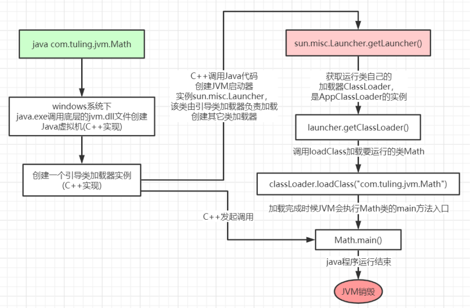
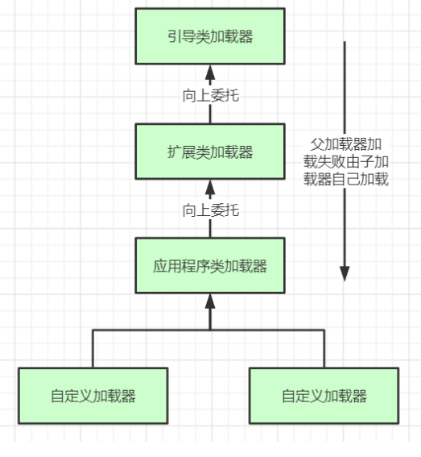

# JVM-类加载器

## 1，类加载全过程

>   当我们用java命令运行某个类的main函数启动程序时，首先需要通过类加载器把主类加载到 JVM。
>
>   过Java命令执行代码的大体流程如下：



### 1.1 LoadClass的类加载过程

>   **加载 >> 验证 >> 准备 >> 解析 >> 初始化 >> 使用 >> 卸载**

1.   **加载：** （磁盘到内存）在硬盘上查找并通过IO读入字节码文件，使用到类时才会加载。加载阶段会在内存中生成一个代表这个类的 java.lang.Class字节码对象。
2.   **验证：**校验字节码文件的正确性（是否是正确的Java字节码文件）。
3.   **准备：**给类的`静态变量`分配内存，并赋予默认值，常量直接赋值。
4.   **解析：** 将`符号引用`（如方法名，类名这些符号，在内存肯定代表一些东西）替换为直接引用（内存地址）
     1.   动态链接是在程序运行期间完成的将符号引用替换为直接引用
     2.   静态链接过程类加载期间完成
5.   **初始化：**对类的静态变量初始化为指定的值，`执行静态代码块`。

`JVM启动器实例sun.misc.Launcher。
sun.misc.Launcher初始化使用了单例模式设计，保证一个JVM虚拟机内只有一个sun.misc.Launcher实例。
在Launcher构造方法内部，其创建了两个类加载器，分别是
sun.misc.Launcher.ExtClassLoader(扩展类加载器)和sun.misc.Launcher.AppClassLoader(应用类加载器)。JVM默认使用Launcher的getClassLoader()方法返回的类加载器AppClassLoader的实例加载我们的应用程序。`

```java
//Launcher的构造方法
public Launcher() {
    Launcher.ExtClassLoader var1;
    try {
    	// 构造扩展类加载器，在构造的过程中将其父加载器设置为null
     	var1 = Launcher.ExtClassLoader.getExtClassLoader();
    } catch (IOException var10) {
   		throw new InternalError("Could not create extension class loader", var10);
    }
    try {
        //构造应用类加载器，在构造的过程中将其父加载器设置为ExtClassLoader，
        //Launcher的loader属性值是AppClassLoader，我们一般都是用这个类加载器来加载我们自己写的应用程序
        	this.loader = Launcher.AppClassLoader.getAppClassLoader(var1);
        } catch (IOException var9) {
            throw new InternalError("Could not create application class loader", var9);
        }
        Thread.currentThread().setContextClassLoader(this.loader);
        String var2 = System.getProperty("java.security.manager");
         //省略一些不需关注代码
    }
}
```


### 1.2 类加载器类型

>   *   引导类加载器：负责加载支撑JVM运行的位于JRE的lib目录下的核心类库，比如 rt.jar、charsets.jar等 。有C++创建的
>   *   扩展类加载器：负责加载支撑JVM运行的位于JRE的lib目录下的ext扩展目录中的JAR 类包 。在引导类加载器创建过程中创建
>   *   应用程序类加载器：负责加载ClassPath路径下的类包，主要就是加载你自己写的那 些类 。在引导类加载器创建过程中创建并指定与扩展类加载器的关系。
>   *   自定义加载器：负责加载用户自定义路径下的类包

```java
 public static void main(String[] args) {
        System.out.println(String.class.getClassLoader());
        System.out.println(com.sun.crypto.provider.DESKeyFactory.class.getClassLoader().getClass().getName());
        System.out.println(TestClassLoader.class.getClassLoader().getClass().getName());
        System.out.println();
        ClassLoader appClassLoader = ClassLoader.getSystemClassLoader();
        ClassLoader extClassLoader = appClassLoader.getParent();
        ClassLoader bootstrapLoader = extClassLoader.getParent();
    }
```

**注意：** 主类在运行过程中如果使用到其他类，会逐步加载这些类。jar包或war包里的类不是一次性全部加载的。


### 1.3 双亲委派机制

jvm类加载器是有亲子层级结构的，如下图：



>   类加载其实就有一个双亲委派机制，加载某个类时会先委托父`加载器`(不是父类)寻找目标类，找不到再委托上层父加载器加载，如果所有父加载器都找不到目标类，则在自己类加载路径中查找并载入目标类。
>
>   **PS:** `双亲委派机制说简单点就是，先找父亲加载，不行再由儿子自己加载`.

```java
//ClassLoader的loadClass方法，里面实现了双亲委派机制
protected Class<?> loadClass(String name, boolean resolve) throws ClassNotFoundException {
	synchronized (getClassLoadingLock(name)) {
        // 检查当前类加载器是否已经加载了该类
        Class<?> c = findLoadedClass(name);
        if (c == null) {
			long t0 = System.nanoTime();
			try {
				//如果当前加载器父加载器不为空则委托父加载器加载该类
				if (parent != null) {
					c = parent.loadClass(name, false);
				} else { 
					//如果当前加载器父加载器为空则委托引导类加载器加载该类
					c = findBootstrapClassOrNull(name);
				}
			} catch (ClassNotFoundException e) {
				// ClassNotFoundException thrown if class not found
				// from the non‐null parent class loader
			}
			if (c == null) {
				// If still not found, then invoke findClass in order
				// to find the class.
				long t1 = System.nanoTime();
				//都会调用URLClassLoader的findClass方法在加载器的类路径里查找并加载该类
				c = findClass(name);
				// this is the defining class loader; record the stats
				sun.misc.PerfCounter.getParentDelegationTime().addTime(t1 ‐ t0);
				sun.misc.PerfCounter.getFindClassTime().addElapsedTimeFrom(t1);
				sun.misc.PerfCounter.getFindClasses().increment();
			}
        }
        if (resolve) { //不会执行
            resolveClass(c);
        }
        return c;
	}
}
```

**大体逻辑：**

>   1.   首先，检查一下指定名称的类是否已经加载过，如果加载过了，就不需要再加载。
>   2.    如果此类没有加载过，那么，再判断一下是否有父加载器；如果有父加载器，则由父加载器加载（即调用parent.loadClass(name, false); 或者是调用bootstrap类加载器来加载。 
>   3.    如果父加载器及bootstrap类加载器都没有找到指定的类，那么调用当前类加载器的 findClass方法来完成类加载。


#### 1.3.1 设计双亲委派机制作用

*   **沙箱安全机制**：自己写的java.lang.String.class类不会被加载，这样便可以防止核心 API库被随意篡改
*   **避免类的重复加载**：当父亲已经加载了该类时，就没有必要子ClassLoader再加载一 次，保证被加载类的唯一性

```java
public class String {
    public static void main(String[] args) {
        System.out.println("------");
    }
}
错误: 在类 java.lang.String 中找不到 main 方法, 请将 main 方法定义为:
   public static void main(String[] args)
否则 JavaFX 应用程序类必须扩展javafx.application.Application
```

#### 13.2 全盘负责委托机制

>   指当一个ClassLoder装载一个类时，除非显示的使用另外一个ClassLoder，该类所依赖及引用的类也由这个ClassLoder载入。


#### 1.3.3 自定义类加载器

>   自定义类加载器只需要继承java.lang.ClassLoader 类，该类有两个核心方法，一个是 loadClass(String, boolean)，实现了双亲委派机制，还有一个方法是findClass，默认实现是空方法，所以我们自定义类加载器主要是重写findClass方法。

```java
public class MyClassLoader extends ClassLoader {
    private String classPath;

    public MyClassLoader(String classPath) {
        this.classPath = classPath;
    }

    private byte[] loadByte(String name) throws Exception {
        name = name.replaceAll("\\.", "/");
        FileInputStream fis = new FileInputStream(classPath + "/" + name
            + ".class");
        int len = fis.available();
        byte[] data = new byte[len];
        fis.read(data);
        fis.close();
        return data;
    }

    @Override
    protected Class<?> findClass(String name) throws ClassNotFoundException {
        try {
            byte[] data = loadByte(name);
            // defineClass将一个字节数组转为Class对象，这个字节数组是class文件读取后最终的字节数组。
            return defineClass(name, data, 0, data.length);
        } catch (Exception e) {
            e.printStackTrace();
            throw new ClassNotFoundException();
        }
    }
}
```

**演示**

```java
public static void main(String[] args) throws ClassNotFoundException {
    MyClassLoader classLoader = new MyClassLoader("D://Tmp");
    Class<?> clazz = classLoader.loadClass("com.demo.entity.U11");
    System.out.println(clazz.getClassLoader());
}
com.demo.loader.MyClassLoader@3af49f1c
```

放在D://Tmp//com//demo//entity下的是U11.class同时自己的项目中没有U11类，不然加载的是自己项目中的。


#### 1.3.4 打破双亲委派机制

>   重写类加载方法，实现自己的加载逻辑，不委派给双亲加载。
