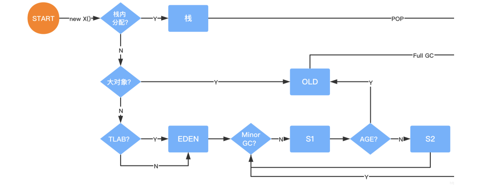
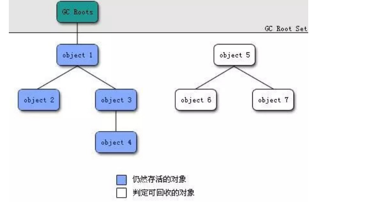

# 对象创建

## 1，对象的创建


**1. 类加载检查**

>   虚拟机遇到一条new指令时，首先将去检查这个指令的参数是否能在常量池中定位到一个类的符号引用，并检查这个符号引用代表的类是否已被加载、解析和初始化过。
>
>   没有，先执行相应的类加载过程

**2，分配内存**

**3，初始化**

>   给对象进行初始化赋予默认值，保证了对象的实例字段在Java代码中可以不赋初始值就直接使用。

**4，设值对象头**

>   对象在内存中存储的布局可以分为3块区域：对象头（Header）、 实例数据（Instance Data） 和对齐填充（Padding）。
>
>   对象头包括两部分信息：
>
>   *   第一部分：存储对象自身的运行时数据， 如哈希码（HashCode）、GC分代年龄、锁状态标志、线程持有的锁、偏向线程ID、偏向时间戳等。
>   *   第一部分：是类型指针，即对象指向它的类元数据的指针，虚拟机通过这个指针来确定这个对象是哪个类的实例。

**5，执行init方法**

>   执行方法，即对象按照程序员的意愿进行初始化。静态代码块，构造方法等。

## 2，对象内存分配

 

### 2.1 对象在栈上的分配

>   JVM内存分配可以知道JAVA中的对象都是在堆上进行分配，当对象没有被引用的时候，需要依靠GC进行回收内存，如果对象数量较多的时候，会给GC带来较大压力，也间接影响了应用的性能。
>
>   为提高性能，JVM通过`逃逸分析`确定该对象不会被外部访问。如果不会逃逸可以将该对象在栈上分配内存，对象随栈帧出栈而销毁。

#### 2.1.1 开启逃逸分析

JDK7之后默认开启逃逸分析，如果要关闭使用参数(-XX:-DoEscapeAnalysis)

```s
-XX:+DoEscapeAnalysis
```

### 2.2 对象在Eden的分配

>   大多数情况下，对象在新生代中 Eden 区分配。当 Eden 区没有足够空间进行分配时，虚拟机将发起一次Minor GC。
>
>   Eden与Survivor区默认8:1:1，让eden区尽量的大，survivor区够用即可。
>
>   ，eden区满了后会触发minor gc，剩余存活 的对象会被挪到为空的那块survivor区，下一次eden区满了后又会触发minor gc，把eden区和survivor区垃圾对象回 收，把剩余存活的对象一次性挪动到另外一块为空的survivor区。

#### 大对象直接进入老年代

```sh
 -XX:PretenureSizeThreshold=100000
```

>   大对象就是需要大量连续内存空间的对象（比如：字符串、数组）。JVM参数 -XX:PretenureSizeThreshold 可以设置大对象的大小，单位字节。
>
>   为什么要这样呢？ 为了避免为大对象分配内存时的复制操作而降低效率。

#### 长期存活的对象将进入老年代

>   。。。


## 3，对象回收

>   堆中几乎放着所有的对象实例，对堆垃圾回收前的第一步就是要判断哪些对象已经死亡（即不能再被任何途径使用的对象）。
>
>   判断如下：

### 3.1 引用计数法

>   给对象中添加一个引用计数器，每当有一个地方引用它，计数器就加1；当引用失效，计数器就减1；任何时候计数器为0 的对象就是不可能再被使用的。
>
>   个方法实现简单，效率高，但是目前主流的虚拟机中并没有选择这个算法来管理内存，其最主要的原因是它很难解决对象之间`相互循环引用的问题`。

### 3.2 可达性分析算法

>   将“GC Roots” 对象作为起点，从这些节点开始向下搜索引用的对象，找到的对象都标记为非垃圾对象，其余未标记的对象都是垃圾对象。
>
>   GC Roots根节点：线程栈的本地变量、静态变量、本地方法栈的变量等等



#### 3.2.1 常见引用类型

java的引用类型一般分为四种：强引用、软引用、弱引用、虚引用。

...

**finalize()方法最终判定对象是否存活**

即使在可达性分析算法中不可达的对象，也并非是“非死不可”的，这时候它们暂时处于“缓刑”阶段，要真正宣告一 个对象死亡，至少要经历再次标记过程。

