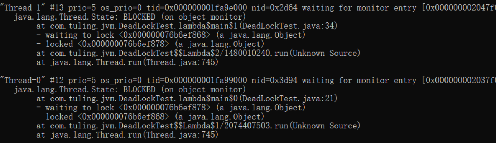

# jvm调优工具

## 1，jmap

此命令可以用来查看jvm内存信息，对象实例个数以及占用内存大小等

### 1.1 对象内存信息

这个命令用来查看对象在内存中的信息，如是实例个数。

<font color="red">可以辅助排查内存溢出，一定是同一类型对象比较多引起的，排查相关集合</font>

```sh
# 控制台显示
jmap -histo pid
# 输出到文件
jmap -histo pid > ./jmap.txt
```


*   num：序号 

*   instances：实例数量 
*   bytes：占用空间大小 
*   class name：类名称，[C is a char[]，[S is a short[]，[I is a int[]，[B is a byte[]，[[I is a int[][]

### 1.2 堆内存信息

>   查看堆内存信息，如堆配置，大小，使用情况等等

```sh
# 控制台显示
 jmap -heap pid
# 输出到文件
 jmap -heap pid > ./heap.txt
```


### 1.3 堆内存dump

可以设置内存溢出自动导出dump文件(内存很大的时候，可能会导不出来)

```sh
 jmap ‐dump:format=b,file=eureka.hprof pid
```

启动时添加参数

```markdown
1. -XX:+HeapDumpOnOutOfMemoryError
2. -XX:HeapDumpPath=./ （路径）
```

## 2，jstack

用jstack来查看进程，或查找死锁，死循环等等

```sh
jstack -l pid
```



*   "Thread-1" 线程名 
*   prio=5 优先级=5 
*   tid=0x000000001fa9e000 线程id 
*   nid=0x2d64 线程对应的本地线程标识nid 
*   java.lang.Thread.State: BLOCKED 线程状态

### 2.1 查看cpu飙高线程

jstack找出占用cpu最高的线程堆栈信息，可能是死循环。

****

**1, 使用命令top -p **

>   使用命令top -p pid  ，显示你的java进程的内存情况，pid是你的java进程号

```sh
top -p pid
```


**2, 按大小H，获取每个线程的情况**

>   top -p pid只显示进程的信息，我们需要获取进程中线程的信息，还需要按H


**3，找到内存和cpu占用最高的线程tid，比如2267**

**4，转为十六进制，此为线程id的十六进制表示**

**5，执行 jstack 2267 |grep -A 10 8db，得到线程堆栈信息中 8db这个线程所在行的后面10行，从堆栈中可以发现导致cpu飙高的调用方法**

**6，查看对应的堆栈信息找出可能存在问题的代码**