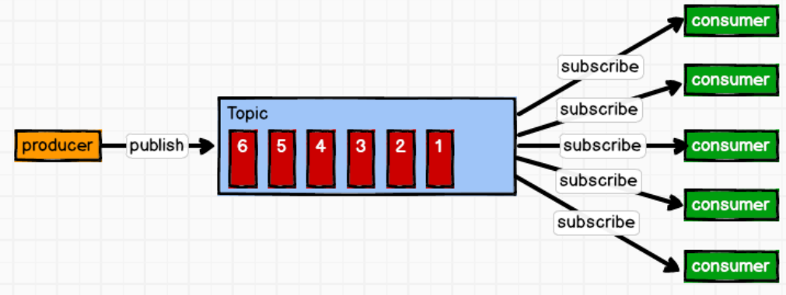
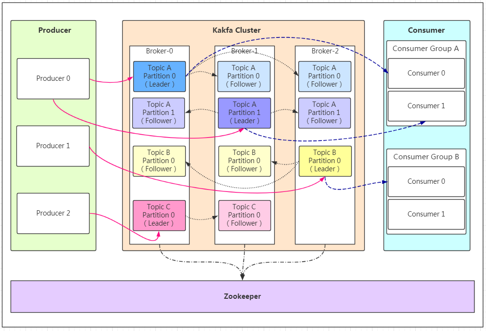
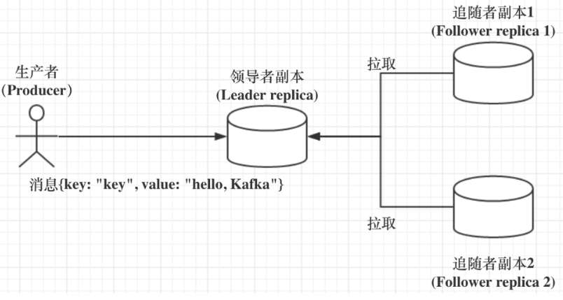
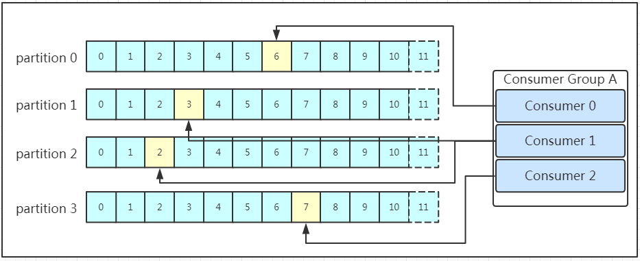
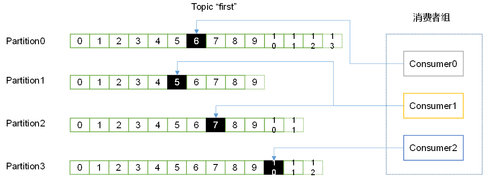
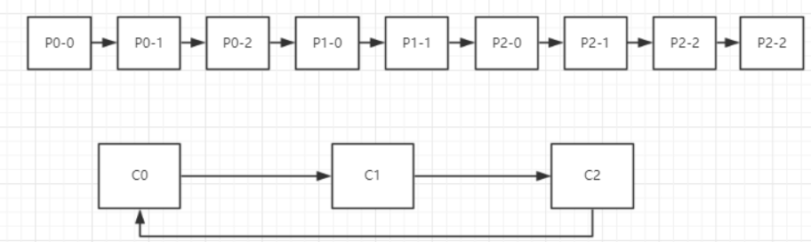

kafka

## 1，kafka 概述

>   Kafka 是一个`分布式`(集群部署，每个实例server就是broker)的基于`发布/订阅模式`的消息队列。
>
>   *   **消息根据topic分类**：Kafka保存消息时根据Topic主题进行归类。
>   *   zookeeper集群保存kafka 元数据meta信息，以保证系统可用性
>
>   一般应用在大数据日志处理或对实时性（少量延迟），可靠性（少量丢数据）要求稍低的场景。

### 1.1 发布订阅模式

Pub/Sub模式，包含主题（Topic中partition相当队列），发布者（Publisher即生产者producer），订阅者（Subscriber即消费者），多个发布者将消息发送到Topic，系统将这些消息传递给多个订阅者。

>   发布/订阅模式是一对多关系，生产消息后，推送给所有订阅者，消费者消费消息之后不会删除消息。




### 1.2 kafka 框架



*   Producer ：消息生产者或说发布者，发布消息到topic中（partition中）
*   Consumer ：消息消费者或是订阅者(应该说是消费者组订阅topic)，消费topic中特定分区消息
*   Topic：是消息的分类，可以理解为一个队列，生产者和消费者面向的都是一个 topic
*   Partition：分区，一个topic可以分为多个partition分布到多个broker上，每个partition是一个有序的队列（为实现扩展）
    *   **方便扩展**：可以通过扩展机器去轻松的应对日益增长的数据量
    *   **提高并发**：可以多个消费者同时消费数据，提高消息的处理效率
*   Consumer Group：消费者组CG，kafka用来实现一个topic消息的广播（发给所有的consumer，需要一个consumer一个CG）和单播（发给任意一个consumer）的手段。一个topic可以有多个消费者组，一个消费者组有多个消费者，同分组下的每个消费者消费不同分区的消息，一个分区只能有一个组内消费者消费。``消费者组是逻辑上的一个订阅者``
*   broker：一台kafka服务器就是一个broker
*   offset：消息存储的偏移量，kafka的存储文件都是按照offset.kafka来命名，用offset做名字的好处是方便查找
*   replica：副本，保证集群中的某个节点发生故障时数据不丢失，一个topic可有多个副本，一个 leader 和若干个 follower。`面向leader，leader才工作`
*   leader：主题下每个分区多个副本的“主”，**服务和消费都只找leader，follow仅仅当备份作用**

*   follower ：每个分区多个副本中的“从”，实时从 leader 中同步数据。

### 1.3 zookeeper与kafka

#### 1.3.1 broker注册

>   kafka是集群部署的，如何知道集群中broker节点有几个，是否还存活呢？
>
>   zookeeper将整个集群中的Broker管理起来，用来进行Broker服务器列表记录的节点，保存每个Broker的IP地址和端口信息。
>
>   其保存在zk节点：id是全局唯一的，
>
>   ```zk
>   /brokers/ids
>   ```
>
>   节点是临时节点，一旦Broker宕机，则对应的临时节点也会被自动删除。
>
>   ****

Kafka 集群中有一个 broker 会被选举为 Controller，负责管理集群 broker 的上下线，所有 topic 的分区副本分配和 leader 选举等工作。

#### 1.3.2 topic注册

>   kafka的生产者和消费者都是面向topic的，一个topic有多个分区并分布在多个broker上，topic的信息以及分区对应的broker信息应该保存在哪里呢？
>
>   也是由zookeeper来维护的，zookeeper保存了topic已经其分区信息，节点在：
>
>   ```zk
>   /brokers/topics
>   ```

#### 1.3.3 保存分区与Consumer注册

每个消息分区只能被同组的一个消费者进行消费，因此，需要在 Zookeeper 上记录消息分区与 Consumer 之间的关系。zk会管理消费者，Consumer注册参看下面Consumer注册。

节点在：

```zk
/consumers/[group_id]/owners/[topic]/[broker_id-partition_id]
```


### 1.4 消费者相关

#### 1.4.1 消费者&消费者组&分区

一个消费者组订阅一个topic，一个消费者组有多个消费者，一个消费者对应topic中不同的partition分区，即一个消费者消费一个分区。不同消费者组互不影响。

若分区一对多，消费者会争抢同一条消息（多了没意义）。

>    Kafka中，规定**每个消息分区只能被同组的一个消费者进行消费**，因此，需要在 Zookeeper 上记录消息分区与 Consumer 之间的关系。

**分区：**

同一个分区消息是有序的，但是不同分区不能保证有序。

#### 1.4.2 消息Offset

~~kafka0.9版本之前，**zk会管理消费者消费进度offset**~~

kafka0.9版本之后，**消费者进度放到了kafka中**

```zk
/consumers/[group_id]/offsets/[topic]/[broker_id-partition_id]
```

>   消费者对指定消息分区进行消息消费的过程中，**需要定时地将分区消息的消费进度Offset**保存，以便在该消费者进行重启或者其他消费者重新接管该消息分区的消息消费后，能够从之前的进度开始继续进行消息消费。

#### 1.4.3 消费者注册

>   kafka是发布订阅模式，需要消息消费者订阅topic，所以要知道有哪些消费者。
>
>   消费者服务器在初始化启动时加入消费者分组，每个消费者服务器启动时，都会到Zookeeper的指定节点下创建一个属于自己的消费者节点，完成节点创建后，消费者就会将自己订阅的Topic信息写入该临时节点。
>
>   zk：
>
>   *   对消费者分组中的消费者的变化注册监听
>   *   对Broker服务器变化注册监听
>   *   进行消费者负载均衡

**注意：producer不在zk中注册，消费者在zk中注册。**

### 1.5 kafka在zk中的节点结构


## 2，Kafka集群部署

**集群规划**

3台服务器，3个kafka，3个zookeeper

**1，安装kafak**

```sh
tar -zxvf kafka_2.11-0.11.0.0.tgz
# 可以改下文件夹名
mv kafka_2.11-0.11.0.0/ kafka
# 在kafka目录下创建logs文件夹，存放kafka持久化文件
mkdir logs
```

**2，修改配置文件**

配置文件在kafka/config/server.properties

```properties
# broker的全局唯一编号，不能重复
broker.id=0

# 删除topic功能使能
delete.topic.enable=true

# 处理网络请求的线程数量
num.network.threads=3

# 用来处理磁盘IO的线程数量
num.io.threads=8

# 发送套接字的缓冲区大小
socket.send.buffer.bytes=102400

# 接收套接字的缓冲区大小
socket.receive.buffer.bytes=102400

# 请求套接字的缓冲区大小
socket.request.max.bytes=104857600

# kafka持久化消息的目录，可以用逗号分隔设置多个  
# 最好写成data。他里面的00000.log是存放的数据
log.dirs=/opt/module/kafka/logs

# topic在当前broker上的分区个数
num.partitions=1

# 用来恢复和清理data下数据的线程数量
num.recovery.threads.per.data.dir=1

# segment文件保留的最长时间，超时将被删除
log.retention.hours=168

# 配置连接Zookeeper集群地址，指定了zk的集群地址
zookeeper.connect=hadoop101:2181,hadoop102:2181,hadoop103:2181
```

**3，配置环境变量**

```java
vim /etc/profile.d/my_env.sh
```

```sh
# KAFKA_HOME
export KAFKA_HOME=/xxx/kafka
export PATH=$PATH:$KAFKA_HOME/bin
```

```sh
source /etc/profile
```

**4, 创建集群启动脚本**

**5，启动集群**

## 3，Kafka命令

### 3.1 topic相关

>   一个topic有多个分区，每个分区又在不同的broker上，同时被消费者订阅，这些topic信息都保存在zookeeper上，topic相关操作需要指定zk，指定一个即可zk会自动找leader，指定多个可以zk不可用时，找可用的zk。

#### 创建topic

```sh
# 在zk集群里创建一个名为first的topic，该主题有2个分区，每个分区2个备份
bin/kafka-topics.sh --zookeeper hadoop102:2181 --create --replication-factor 2 --partitions 2 --topic first

# 这个用法和上面没有区别，只是多指定了zk机器，但是因为我们zk集群本来计算自动备份的，多指定几个只是怕集群里某个机器宕机了从而连不上全部集群。而如果没有宕机的话即使连的是zk的follower，他也会转发给zk的leader进行数据备份，备份好后通知zk的follower，该follower返回给kafka
bin/kafka-topics.sh --zookeeper hadoop102:2181,hadoop103:2181,hadoop104:2181 --create --replication-factor 2 --partitions 2 --topic first
```

**选项说明**：

-   –topic 定义topic名
-   –replication-factor 定义副本数
-   –partitions 定义分区数

#### 查看topic

*   列举所以topic
*   查看指定topic详情

```java
# 查看当前服务器所有topic # 数据在zk集群里
bin/kafka-topics.sh --zookeeper hadoop102:2181 --list

# 查看指定topic
bin/kafka-topics.sh --zookeeper hadoop102:2181  --describe --topic first
```

#### 删除topic

>   **前提：**需要server.properties中设置delete.topic.enable=true否则只是标记删除，重启之后才生效。
>
>   若delete.topic.enable=false(默认)：
>
>   *   若该topic没有被使用过，没有传输过信息，直接彻底删除
>   *   若该topic被使用过，传输过信息，并没有真正删除topic，只是把该topic标记为删除(marked for deletion)，重启kafka server后删除

```java
bin/kafka-topics.sh --zookeeper hadoop102:2181 --delete --topic first
```

#### 修改topic

>   只能增加分区数目

```sh
# 修改成2个分区 2个副本 只能增加分区，不能减少分区
bin/kafka-topics.sh --alter --zookeeper hadoop102:2181 --topic first --partitions 2

# 看一下修改成功没有
bin/kafka-topics.sh --zookeeper hadoop102:2181 --describe --topic first
```

### 3.2 消息相关

#### 生产者相关

生产者不和zookeeper打交道，不在zookeeper上注册，而是直接链接kafka，所以需要指定`broker`

```sh
# 用生产者控制台 连接hadoop102这台服务器里的broker 获取其中的名为first主题 向这个主题中生产数据 
bin/kafka-console-producer.sh --broker-list hadoop102:9092 --topic first
```

#### 消费者相关

>   消费者跟zookeeper打交道，消费者注册到zookeeper，记录consumer和partition关系以及offset等。
>
>   需要指定zookeeper（以及消费位置）

```sh
# 用消费者控制平台去 hadoop102这台zookeeper里 去消费 主题为first的主题
bin/kafka-console-consumer.sh --zookeeper hadoop102:2181 --from-beginning --topic first

# 查看所有正在连接的Consumer信息
bin/kafka-consumer-groups.sh --zookeeper localhost:2181 --list

bin/kafka-consumer-groups.sh --new-consumer --bootstrap-server localhost:9092 --list

#查看单个Consumer信息
bin/kafka-consumer-groups.sh --zookeeper localhost:2181 --describe --group BrowseConsumer

bin/kafka-consumer-groups.sh --new-consumer --bootstrap-server localhost:9092 --describe --group BrowseConsumer

# 重头开始消费某个Topic
bin/kafka-console-consumer.sh --zookeeper localhost:2181 --from-beginning --topic xxx

bin/kafka-console-consumer.sh --new-consumer --bootstrap-server localhost:9092 --from-beginning --topic xxx
```

-   –from-beginning：会把主题中以往所有的数据都读取出来。根据业务场景选择是否增加该配置。
-   订阅了但不在线，等上线之后是能读到消息的
-   最后要注意的是，如果往不存在的topic写数据，能不能写入成功呢？kafka会自动创建topic，分区和副本的数量根据默认配置都是1

## 4，kafka工作流程

### 4.1 发送消息

producer就是生产者，是数据的入口。Producer在写入数据的时候**永远的找分区的leader**，不会直接将数据写入follower！


消息写入leader后，follower是主动的去leader进行同步的！producer采用push模式将数据发布到broker，每条消息追加到分区中，顺序写入磁盘，所以同一分区数据是有序的！

#### 4.1.1 消费分区确定

topic有多个partition，当producer发布消息时，消息保存到哪个分区呢？

>   在rabbitmq中，发送消息时prodcuer指定queue或者routing-key，kafka呢？
>
>   *   指定partition：在写入的时候可以指定需要写入的partition
>   *    不指定partition：如果没有指定partition，但是设置了数据的key，则会根据key的值hash出一个partition
>   *    不指定partition：如果既没指定partition，又没有设置key，则会轮询选出一个partition。

#### 4.1.2 消息发布确认

>   保证消息不丢失是一个消息队列中间件的基本保证，kafka如何保证？
>
>   通过ACK消息确认机制。在生产者向topic写入数据的时候可以设置参数来确定是否确认kafka接收到数据，这个参数可设置的值为**0**、**1**、**all**。

*   acks=0： producer 不等待broker ack发布确认，当 broker 故障时有可能丢失数据，这种情况后面的producer.send的回调也会完成失去作用
    *   存在数据丢失
*   acks=1： producer等待leader的ack，partition的==leader 落盘(写入磁盘)==成功后返回ack(只等待leader写完就发回ack)。
    *   存在数据数据丢失，如：如果在 follower同步成功之前**leader故障**，那么将会丢失数据
*   acks=-1(all)：producer 等待”所有“broker的 ack， partition的leader和follower(ISR里的follower) 全部落盘成功后才返回ack。
    *   存在数据重复，如：在follower同步完成后，broker发送ack之前，**leader发生故障**，那么会造成数据重复
    *   存在数据丢失：比如ISR中**只有一个leader**，leader写完了就发送ACK，但是还没同步就挂掉了，此时也会丢失数据

------------------------------------------------
### 4.2 文件存储机制

>   Producer将数据发布到kafka后，集群就需要对数据进行保存写入磁盘，Kafka顺序写入数据（效率比随机写入高），并且是多个节点同时工作的效率很高。
>
>   每个topic可以有多个分区，每个分区是一个集群，有1个leader和多个follower（副本）。

****

​		topic 是逻辑上的概念（多个partition组成一个topic，数据存储在partition中），而 partition 是物理上的概念，`每个 partition 对应于一个 log 文件(即数据文件)`，该 log 文件中存储的就是 producer 生产的数据。

 		Producer 生产的数据会被不断追加到该log 文件末端，且每条数据都有自己的 offset**。 **消费者组中的每个消费者（消费特定分区）， 都会实时记录自己消费到（该分区）哪个 offset（在kafka中记录），以便出错恢复时，从上次的位置继续消费。

****

**为防止log文件过大导致数据定位效率低下，kafka做了分片和索引机制，如下：**

*   每个`partition`分为多个`segments`（章节）
*   每个`segments`对应两个文件，两个文件成对出现，如：000000000.index，000000000.log
    *   xxx.index（索引文件，记录序号i和对应的第i条信息的地址位置）
    *   xxx.log（数据文件，根据索引文件的消息偏移量查找消息数据）
*   这些文件位于一个partition文件夹下，partition文件夹的命名规则为：topic主题名 + 分区序号，如first-0

​		

### 4.3 副本机制

>   副本机制保证集群中的某个节点发生故障时数据不丢失（提供数据冗余），一个topic可有多个副本，一个 leader 和若干个 follower。
>
>   注意：副本保存在不同的broker上，若是同一个就没有意义了。

#### 4.3.1 副本工作原理

follower拉取leader，producer和consumer只与这个leader交互，其它replication作为follower从leader 中复制数据。



*   follower唯一任务就是同步leader
*   leader所在broker宕机后，选举一个follower称为新的leader（依托zookeeper的监控）

#### 4.3.2 follower同步条件

>   Kafka 引入了 In-sync Replicas，即 ISR 副本集合，ISR 中的副本都是与 Leader 同步的副本，相反，不在 ISR 集中就被认为是与 Leader 不同步。
>
>   **注意**：ISR 包含leader，且是一个动态调整的集合

##### 是否同步的依据是什么？

​	Broker 端replica.lag.time.max.ms 参数（Follower 副本能够落后 Leader 副本的最长时间间隔）值来控制哪个追随者副本与 Leader 同步，只要在这个范围内就是同步的。


##### 副本如何选举？

**kafka leader副本所在broker挂了，leader副本如何选举**

*   ISR不为空，从ISR中选举
*   ISR为空，Kafka也可以从不在 ISR 中的存活副本中选举（有数据一致性，数据丢失问题，强烈建议不要开启）

### 4.4 消息删除机制

无论消息是否被消费，kafka都会保留所有消息，但是不能永无止境的只追加迟早磁盘不够用的，因此，kafka提供两种数据删除策略：

*   基于时间：log.retention.hours=168 （7天）
*   基于大小：log.retention.bytes=1073741824

**ps**：因为Kafka读取特定消息的时间复杂度为O(1)，即与文件大小无关，所以这里删除过期文件与提高 Kafka 性能无关。

### 4.5 写入流程

>   消息由producer发送大broker，broker还需要将消息写入文件中，producer是面向topic的或者说是partition的，而partition是存在某台broker上的，所以写入流程如下：

1.   producer发送消息时，先计算partition，后从zookeeper节点找到该partition的leader（即副本的leader）
2.   producer将消息发送给该leader
3.   leader将消息写入本地log（其实时segments中的index和log文件）
4.   followers从leader pull消息，写入本地log后向leader发送ACK
5.   leader收到所有ISR中的replication的ACK后，增加HW（high watermark，最后commit 的offset）并向producer发送ACK

### 4.6 消费消息

消费者消费消息同样是面向topic，找leader。

**补充**

```markdown
push模式很难适应消费速率不同的消费者，因为消息发送速率是由broker决定的。push模式的目标是尽可能以最快速度传递消息，但是这样很容易造成消费者来不及处理消息，典型的表现就是拒绝服务以及网络拥塞。

而pull模式则可以根据consumer的消费能力以适当的速率消费消息。

pull模式，如果broker没有数据，消费者会轮询，忙等待数据直到数据到达，为了避免这种情况，我们允许消费者在pull请求时候使用“long poll”进行阻塞，直到数据到达 。
```

>   多个消费者可以组成一个消费者组（consumer group），每个消费者组都有一个组id，同一个消费组者的消费者可以消费同一topic下不同分区的数据，但是不存在组内多个消费者消费同一分区的数据。
>
>   **ps：**建议消费者组的consumer的数量与partition的数量一致！



#### 消费消息过程？

假如现在需要查找一个offset为368801的message是什么样的过程呢？


1.   先确定的partition（计算要消费哪个partition的数据）

2.   先找到offset的368801message所在的segment文件（利用二分法查找），这里找到的就是在第二个segment文件（由于index文件名是根据最后一次commit的偏移量命名，其是一个定位信息）

3.   打开找到的segment中的`.index`文件（该文件起始偏移量为368796+1，368796+5=368801，所以相对offset为5），但是文件采用的是稀疏索引（多个分区，单个分区索引不连续），利用二分法查找相对offset小于或者等于指定的相对offset的索引条目中最大的那个相对offset，所以找到的是相对offset为4的这个索引。

4.   根据找到的相对offset为4的索引确定message存储的物理偏移位置为256

5.   打开数据文件，从位置为256的那个地方开始顺序扫描直到找到offset为368801的那条Message

     总结：就是找消息的起始和结束位置

**ps**：**segment**+**有序offset**+**稀疏索引**+**二分查找**+**顺序查找**

### 4.7 kafka事务

## 5，AdminClient API

**依赖**

```xml
<dependency>
    <groupId>org.apache.kafka</groupId>
    <artifactId>kafka-clients</artifactId>
</dependency>
```

>   **AdminClient API**：允许管理和检测Topic、broker以及其他Kafka实例，与Kafka自带的脚本命令作用类似。

| API                   | 作用               |
| --------------------- | ------------------ |
| AdminClient           | 客户端对象         |
| NewTopic              | 创建主题           |
| CreateTopicsResult    | 创建主题的返回结果 |
| ListTopicsOptions     | 查询主题列表       |
| ListTopicsOptions     | 查询主题列表及选项 |
| DescribeOptionsResult | 查询主题           |
| DescribeConfigsResult | 查询主题配置项     |

### 5.1 AdminClient API案例

#### 创建AdminClient

```java
public static AdminClient adminClient(){
    Properties properties = new Properties();
    properties.setProperty(AdminClientConfig.BOOTSTRAP_SERVERS_CONFIG,"kafka1:9092");
    AdminClient adminClient = AdminClient.create(properties);
    return adminClient;
}
```

#### 创建topic

```java
 public static void createTopic() {
     // 连接kafka
     AdminClient adminClient = adminClient();
     // 副本因子
     Short rs = 1;
     // 创建topic，topic有分区和副本
     NewTopic newTopic = new NewTopic(TOPIC_NAME, 1 , rs);
     CreateTopicsResult topics = adminClient.createTopics(Arrays.asList(newTopic));
     adminClient.close();
 }
```

#### topic列表

```java
/**
 * 获取topic列表
 */
public static void topicList() throws Exception {
    AdminClient adminClient = adminClient();

    //是否查看Internal选项
    ListTopicsOptions options = new ListTopicsOptions();
    options.listInternal(true);

    //ListTopicsResult listTopicsResult = adminClient.listTopics();
    ListTopicsResult listTopicsResult = adminClient.listTopics(options);
    Set<String> names = listTopicsResult.names().get();

    //打印names
    names.stream().forEach(System.out::println);

    Collection<TopicListing> topicListings = listTopicsResult.listings().get();
    //打印TopicListing
    topicListings.stream().forEach((topicList) -> {
        System.out.println(topicList.toString());
    });
    adminClient.close();
}
```

#### 删除topic

```java
/**
 * 删除topic
 */
public static void delTopic() throws Exception {
    AdminClient adminClient = adminClient();
    DeleteTopicsResult deleteTopicsResult = adminClient.deleteTopics(Arrays.asList(TOPIC_NAME));
    deleteTopicsResult.all().get();
}
```

#### topic详情

```java
/**
 * 描述topic
 */
public static void describeTopic() throws Exception {
    AdminClient adminClient = adminClient();
    DescribeTopicsResult describeTopicsResult = adminClient.describeTopics(Arrays.asList(TOPIC_NAME));
    Map<String, TopicDescription> descriptionMap = describeTopicsResult.all().get();
    descriptionMap.forEach((key,value) -> {
        System.out.println("name: " + key+" desc: " + value);
    });
}
```

#### 修改配置信息

```java
/**
 * 修改配置信息 新版API
 */
public static void alterConfig2() throws Exception {
    AdminClient adminClient = adminClient();
    Map<ConfigResource, Collection<AlterConfigOp>> configMap = new HashMap<>();
    ConfigResource configResource = new ConfigResource(ConfigResource.Type.TOPIC,TOPIC_NAME);
    AlterConfigOp alterConfigOp = new AlterConfigOp(new ConfigEntry("preallocate","false"),AlterConfigOp.OpType.SET);
    configMap.put(configResource,Arrays.asList(alterConfigOp));
    AlterConfigsResult alterConfigsResult = adminClient.incrementalAlterConfigs(configMap);
    alterConfigsResult.all().get();
}
```

#### 增加分区数量

```java
private static final String TOPIC_NAME = "yibo_topic";

/**
 * 增加partitions数量
 * @param partitions
 * @throws Exception
 */
public static void incrPartitions(int partitions) throws Exception {
    AdminClient adminClient = adminClient();
    Map<String,NewPartitions> partitionsMap = new HashMap<>();
    NewPartitions newPartitions = NewPartitions.increaseTo(partitions);
    partitionsMap.put(TOPIC_NAME,newPartitions);
    CreatePartitionsResult partitionsResult = adminClient.createPartitions(partitionsMap);
    partitionsResult.all().get();
}
```

### 5.2 springboot 整合

#### kafka 客服端属性

```java
@Component
public class KafkaConfig{

    // 配置Kafka
    public Properties getProps(){
        Properties props = new Properties();
        // kafka 服务地址
        props.put("bootstrap.servers", "localhost:9092");
        /*    props.put("retries", 2); // 重试次数
        props.put("batch.size", 16384); // 批量发送大小
        props.put("buffer.memory", 33554432); // 缓存大小，根据本机内存大小配置
        props.put("linger.ms", 1000); // 发送频率，满足任务一个条件发送*/
        // key序列化器
        props.put("key.serializer", "org.apache.kafka.common.serialization.StringSerializer");
        // value序列化器
        props.put("value.serializer", "org.apache.kafka.common.serialization.StringSerializer");
        return props;
    }
}
```

#### kafka 配置类

```java
import org.apache.kafka.clients.admin.AdminClient;
import org.apache.kafka.clients.admin.AdminClientConfig;
import org.springframework.beans.factory.annotation.Value;
import org.springframework.context.annotation.Bean;
import org.springframework.context.annotation.Configuration;
import org.springframework.kafka.core.KafkaAdmin;
 
import java.util.HashMap;
import java.util.Map;
 
@Configuration
public class KafkaInitialConfiguration {

    /**
    * AdminClient 管理客服端
    */
    @Bean
    public AdminClient adminClient() {
        return AdminClient.create(kafkaAdmin().getConfig());
    }
}

```

#### 操作封装

```java
import org.apache.kafka.clients.admin.*;
import org.apache.kafka.common.KafkaFuture;
import org.springframework.beans.factory.annotation.Autowired;
import org.springframework.stereotype.Service;
 
import java.util.Arrays;
import java.util.HashMap;
import java.util.Map;
 
 
/**
 * @Describe 主题操作控制类
 */
@Service
public class KafkaConsole {
    @Autowired
    private AdminClient adminClient;
    
     /**
     * 创建主题
     */
    public void create(String topic, int partitions, int replication, Map<String, String> configs) throws Exception {
        // 为了兼容性增加一层副本系数和节点数量的判断
        if (replication > getBrokerNums()) {
            throw new RuntimeException("副本系数不能大于broker节点数量"); 
        }
        short replication_short = (short) replication;
        NewTopic newTopic = new NewTopic(topic, partitions, replication_short);
        // 创建主题的相关配置
        if (null != configs && configs.size() > 0) {
            newTopic.configs(configs);
        }
        CreateTopicsResult result = adminClient.createTopics(Arrays.asList(newTopic));
        result.all().get(timeout, TimeUnit.SECONDS);
    }
    
    /**
     * 主题列表
     */
    public Set<String> list() throws Exception {
        ListTopicsResult listTopicsResult = adminClient.listTopics();
        // Set<String> topics = listTopicsResult.names().get();
        Set<String> topics = listTopicsResult.names().get(timeout, TimeUnit.SECONDS);

        return topics;
    }
 	
     /**
     * 修改主题
     */
    public void update(String topic, List<AlterConfigOp> alterConfigOps) throws Exception {
    ConfigResource resource = new ConfigResource(ConfigResource.Type.TOPIC, topic);
    Map<ConfigResource, Collection<AlterConfigOp>> configs = new HashMap<>();
    configs.put(resource, alterConfigOps);
    adminClient.incrementalAlterConfigs(configs).all().get(timeout, TimeUnit.SECONDS);
}
    
    /**
     * 返回主题的信息
     */
    public KafkaFuture<Map<String, TopicDescription>> describeTopicInfo(String topicName) {
        DescribeTopicsResult result = adminClient.describeTopics(Arrays.asList(topicName));
        KafkaFuture<Map<String, TopicDescription>> all = result.all();
        return all;
    }
 	
     /**
     * 删除主题
     */
    public void delete(String topic) throws Exception {
        // 服务端server.properties需要设置delete.topic.enable=true，才可以使用同步删除，否则只是将主题标记为删除
        adminClient.deleteTopics(Arrays.asList(topic));
    }

     /**
     * 增加某个主题的分区（注意分区只能增加不能减少）
     */
    public void editTopicPartition(String topicName,Integer number){
        Map<String, NewPartitions> newPartitions=new HashMap<String, NewPartitions>();
        //创建新的分区的结果
        newPartitions.put(topicName,NewPartitions.increaseTo(number));
        adminClient.createPartitions(newPartitions);
    }
 	
    /**
     * 列出主题所有分区
     */
    public List<Integer> partitions(String topic) throws Exception {
        List<TopicPartitionInfo> partitionInfos = describe(topic).partitions();
        List<Integer> result = new ArrayList<>();
        for (TopicPartitionInfo partitionInfo : partitionInfos) {
            result.add(partitionInfo.partition());
        }
        return result;
    }
}
```

## 6，Producer API

Producer API是发布消息到1个或多个Topic，也就是生产者或者说发布方需要用到的API。

### 6.1 消息发送

1.   创建一个kafka生产者KafkaProducer，需要传递一个Properties属性（即指定集群地址，数据大小等客服端属性）
2.   创建消息对象ProducerRecord（包含`topic`、分区、key、`value`，其中topic和value必须指定）

****

>   主线程将待发送的消息封装成一个`ProducerRecord`实例，经过分区器确定分区，然后保存到本地内存缓存区中。另一个线程（I/O发送线程）则负责实时地将缓冲区中取出准备就绪的消息封装进一个批次（batch），统一发送给对应的broker。
>
>   因此，发送消息时，消息先进入缓冲区中，然后缓冲区中“多条”输出组成一个batch，统一发送给broker。
>
>   1.   业务数据封装成ProducerRecord对象，调用send方法将消息保存到缓冲区中
>   2.   Sender线程负责将消息信息构成请求，最终执行I/O线程发送消息（异步发送）
>
>   **ps**：KafkaProducer是线程安全的，多个线程间可以共享使用同一个KafkaProducer对象。

**相关参数：**

-   batch.size： 只有数据积累到 batch.size 之后， sender 才会发送数据。
-   linger.ms： 如果数据迟迟未达到 batch.size， sender 等待 linger.time 之后也会发送数据。

#### 发送案例

**不带回调函数的发送者**

```java
import org.apache.kafka.clients.producer.*;
import java.util.Properties;
import java.util.concurrent.ExecutionException;

public class CustomProducer {
    public static void main(String[] args) throws ExecutionException,InterruptedException {
        Properties props = new Properties();
        // kafka 集群， broker-list 必须指定
        props.put("bootstrap.servers", "hadoop102:9092");
        props.put("acks", "all");
        // 重试次数
        props.put("retries", 1);
        // 批次大小
        props.put("batch.size", 16384);
        // 等待时间
        props.put("linger.ms", 1);
        // RecordAccumulator 缓冲区大小
        props.put("buffer.memory", 33554432);
        // key序列化器必须指定
        props.put("key.serializer",
                  "org.apache.kafka.common.serialization.StringSerializer");
        // value序列化器必须指定
        props.put("value.serializer",
                  "org.apache.kafka.common.serialization.StringSerializer");
        // 生产者
        Producer<String, String> producer = new
            KafkaProducer<>(props);
        for (int i = 0; i < 100; i++) {
            producer.send(
                new ProducerRecord<String, String>(
                    "first",
                    Integer.toString(i), 
                    Integer.toString(i)));
        }
        // 所有的通道打开都需要关闭
        producer.close();
    }
}
```

### 6.2 生产者属性

Producer.Config

#### 必须参数

1.   **bootstrap.servers**：指定了ip、port对，用于创建向kafka broker服务器的链接。如k1:9092,k2:9092。如果kafka集群中机器数很多，那么只需指定部分broker即可，不需要列出所有的机器。因为不管指定几台机器，producer都会通过该参数找到并发现集群中所有broker。为该参数指定多态机器只是为了故障转移使用。这样即使某一台broker挂掉了，producer重启后依然可以通过该参数指定的其他broker连入kafka集群

2.   **key.serializer**：key序列化器，被发送到broker端的任何消息的格式都必须是字节数组，因此消息的各个组件必须首先做序列化，然后才能发送到broker。kafka大部分初始类型默认提供了现成的序列化器。用户可以自定义序列化器，只要实现Serializer接口即可。

3.   **value.serializer**：value序列化器，将消息value部分转换成字节数组。

****

#### 可选参数

1.   **acks**：ack确认
     *   acks=0：不等broker的返回
     *   acks=-1或者all：等待ISR中所有副本都成功落盘后应答
     *   acks=1：只等leader的落盘成功就应答
2.   **buffer.memory**：producer段缓存消息的缓冲区大小，字节为单位，默认值32MB。

3.   **compression.type**：producer发送时是否压缩数据。默认none。还有GZIP、Snappy、LZ4（性能最好）。

4.   **reties**：发送消息失败时重试次数，默认为0不重试（重试可能导致消息重复）。
5.   **batchsize**：通常一个小的batch中包含多条消息。默认16KB，一般都增加。
6.   **linger.ms**：即使batchsize没满，超过该设置时间后也会发送。默认为0表示消息立即发送，无需关心batch是否填满。
7.   **max.request.size**：能发送的最大消息大小，但包含一些消息头。默认1048576（太小）

8.   **request.timeout.ms**：超过默认的30s后仍没收到返回结果就会发生异常

### 6.3 生产者Java对象

**KafkaProducer**：生产者对象

```java
Producer<String, String> producer = new KafkaProducer<>(props);
```

**ProducerRecord**：消息体对象，封装消息

```java
ProducerRecord(topic, partition, key, value);
ProducerRecord(topic, key, value);
ProducerRecord(topic, value);

<1> 若指定Partition ID,则PR被发送至指定Partition
<2> 若未指定Partition ID,但指定了Key, PR会按照hasy(key)发送至对应Partition
<3> 若既未指定Partition ID也没指定Key，PR会按照round-robin模式发送到每个Partition
<4> 若同时指定了Partition ID和Key, PR只会发送到指定的Partition (Key不起作用，代码逻辑决定)
```

### 6.4 发送消息

kafka producer发送消息的主方法是send()方法。通过Java提供的Future同时实现了`同步发送`和`异步发送 + 回调`两种发送方式

#### 6.4.1 异步发送(回调)

>   send返回一个java的Future对象供用户获取发送结果（回调机制）。

```java
for (int i = 0; i < 100; i++) {
    producer.send(
        new ProducerRecord<String, String> ( "first", Integer.toString(i), Integer.toString(i))
        , new Callback() {
                // 回调函数， 该方法会在 Producer 收到 ack 时调用(异步调用)
                @Override
            	// 两个参数不会同时非空，即至少一个为null。若消息发送失败，metadata为null, 当消息发送成功时e为null。
                public void onCompletion(RecordMetadata metadata, Exception exception) {
                    // 发送成功
                    if (exception == null) {
                        System.out.println("success-> " + metadata.offset());
                    } else { 
                        exception.printStackTrace();
                    }
            }
        });
}
```

#### 6.4.2 同步发送

>   同步发送调用`send().get()`即可，get方法会一直等待下去直至broker将发送结果返回给producer程序。

```java
for (int i = 0; i < 100; i++) {
    producerRecord<String,String> record = new producerRecord<>("first",Integer.toString(i));
    // get方法会一直等待下去直至broker将发送结果返回给producer程序。
    // 返回的时候要不返回发送结果，要么抛出异常由producer自行处理。
    // 如果成功，get将返回对应的RecordMetadata实例（包含了已发送消息的所有元数据消息），包含了topic、分区、位移
    // send的返回值类型是Future<RecordMetadata> 
    // 调用get方法即可获取器结果
    producer.send(record).get();
}
```

#### 6.4.3 异常处理

>   不管是同步发送还是异步发送，发送都有可能失败，导致返回异常错误。
>
>   kafka的错误类型：
>
>   *   可重试异常
>   *   不可重复异常。
>
>   对于可重试异常，如果在producer程序中配置了重试次数，那么只要在规定的重试次数内自行恢复了，便不会出现在onCompletion的exception中.

不可重试异常都表明了一些严重或kafka无法处理的问题，与producer相关的如下：

-   RecordToolLargeException：发送的消息太大，超过了规定的大小上限
-   SerializationException：序列化失败异常
-   KafkaException：其他类型的异常

**异常处理**

```java
producer.send(record,new Callback(){
    @Override
    public void onCompletion(RecordMetaData metadata,Exception exception){
        if (exception == null) { // 发送成功
            System.out.println("success->" + metadata.offset());
        } else { 
            if(exception instanceof RetriableException){
                 // 处理可重试异常
            } else {
                // 不可重试异常 
        }
    }
})
```

**producer程序结束一定要关闭producer。因为producer程序运行时占用了系统资源**

### 6.5 生产过程

>   producer采用推（`push`）模式将消息发布到broker，每条消息都被追加（append）到分区（patition）中，属于**顺序写磁盘**

### 6.6 发布确认机制

>   消息的确认机制是保证消息不丢失的保障手段。
>
>    Kafka 为用户提供了三种可靠性级别，用户根据对可靠性和延迟的要求进行权衡（前面介绍生产者api参数属性）
>
>   **acks**：ack确认
>
>   *   acks=0：不等broker的返回，broker一接收到还没有写入磁盘就已经返回，这时send回调失去作用
>   *   acks=-1或者all：等待ISR中所有副本都成功落盘后应答
>       *   数据重复：如果在follower同步完成后，leader发送ack之前，leader发生故障，那么会造成数据重复
>       *   数据丢失：比如ISR中只有一个leader，leader写完了就发送ACK，但是还没同步就挂掉
>   *   acks=1：只等leader的落盘成功就应答
>       *   数据丢失：如果在 follower同步成功之前leader故障，那么将会丢失数据

#### 6.6.1 设置发布确认

send方法中回调函数可收到确认消息

```java
// JAVA API中的
// 无需得到回复
properties.put(ProducerConfig.ASKS_CONFIG,"0");
```

#### 6.6.2  副本同步策略

| 方案                             | 优点                                                     | 缺点                                                        |
| -------------------------------- | -------------------------------------------------------- | ----------------------------------------------------------- |
| 半数以上完成同步， 就发送 ack    | 延迟低                                                   | 选举新的 leader 时， 容忍 n 台 节点的故障，需要 2n+1 个副本 |
| 全部完成同步，才发送 ack         | 选举新的 leader 时，容忍 n 台节点的故障，需要 n+1 个副本 | 延迟高                                                      |
| 只要ISR集合中同步完成即可发送ack |                                                          |                                                             |
|                                  |                                                          |                                                             |

**Kafka 选择了第二种方案（+ISR），原因如下**

*   同样容忍 n 台节点的故障，第一种方案需要 2n+1 个副本，而第二种方案只需要 n+1个副本
*   第二种方案的网络延迟会比较高，但网络延迟对 Kafka 的影响较小

假设有一个节点迟迟没有同步，那么leader 就要一直等下去，直到它完成同步，才能发送 ack。这个问题怎么解决呢？ -> ISR

##### ISR

>    in-sync replica set (ISR)，意为**和 leader 保持同步的 follower 集合**.
>
>   如果 follower长 时 间 未 向 leader 同 步 数 据 ， 则 该 follower 将 被 踢 出 ISR ， 该 时 间 阈 值 由 replica.lag.time.max.ms 参数设定。
>
>   被踢出去的replication还在同步，只是不算在ISR里。被踢出去的同步追上leader后，又重新计入ISR

## 7，分区器

>   topic由partition分区构成，partition有多个log文件，index文件构造，log文件由多个消息构成。
>
>   *   每个Partition中的消息都是有序的，消息被不断追加到log上，其中的每一个消息都被赋予了唯一的offset值
>   *   kafka有自己的分区策略的，如果未指定，就会使用默认的分区策略（即`hash(key) % numPartitions`）


### 7.1 分区概述

#### 分区原因

1.   **提高并发**，多个partition可以同时多写，因为可以以Partition为单位读写
2.   方便扩展，可以增加节点以应对日益增长的数据

#### 默认分区器

>   可以模仿他实现Partition接口实现我们自己的分区器

````java
/**
 * 默认的分区策略：
 * 如果给定了分区，使用他
 * 如果没有分区但是有个key，就是就根据key的hash值取分区
*  如果分区和key值都没有，就采样轮询
 */
public class DefaultPartitioner implements Partitioner {
    private final ConcurrentMap<String, AtomicInteger> topicCounterMap = new ConcurrentHashMap<>();

    // 必要资源的初始化工作
    public void configure(Map<String, ?> configs) {}

    // 返回要放入的paritition
    public int partition(String topic,  // 主题
                         Object key,  // 给定的key
                         byte[] keyBytes,  // key序列化后的值
                         Object value,  // 要放入的值
                         byte[] valueBytes, // 序列化后的值
                         Cluster cluster) { // 当前集群
        
        List<PartitionInfo> partitions = cluster.partitionsForTopic(topic);
        // 对应主题的分区数
        int numPartitions = partitions.size();
        // 如果key为null
        if (keyBytes == null) {
            // 获取主题轮询的下一个partition值，但还没取模
            int nextValue = nextValue(topic);
            List<PartitionInfo> availablePartitions = cluster.availablePartitionsForTopic(topic);
            if (availablePartitions.size() > 0) {
                // 把上面的partition值取模得到真正的分区值
                int part = Utils.toPositive(nextValue) % availablePartitions.size();
                // 得到对应的分区
                return availablePartitions.get(part).partition();
            } else {
                // 没有分区
                // no partitions are available, give a non-available partition
                return Utils.toPositive(nextValue) % numPartitions;
            }
        } else {
            // 输入了key值，直接对key的hash值取模就可以得到分区号了
            return Utils.toPositive(Utils.murmur2(keyBytes)) % numPartitions;
        }
    }

    private int nextValue(String topic) {
        AtomicInteger counter = topicCounterMap.get(topic);
        if (null == counter) {
            counter = new AtomicInteger(ThreadLocalRandom.current().nextInt());
            AtomicInteger currentCounter = topicCounterMap.putIfAbsent(topic, counter);
            if (currentCounter != null) {
                counter = currentCounter;
            }
        }
        // 自增
        return counter.getAndIncrement();
    }

    // 关闭partitioner// 主要是关闭那些partitioner时初始化的系统资源等
    public void close() {}
}
````

#### 自定义分区器

```java
/* 自定义分区器*/
public class DefinePartitioner implements Partitioner {
    private final AtomicInteger counter = new AtomicInteger(0);
    @Override
    public int partition(String topic,  // 主题
                         Object key,  // 给定的key
                         byte[] keyBytes,  // key序列化后的值
                         Object value,  // 要放入的值
                         byte[] valueBytes, // 序列化后的值
                         Cluster cluster) { // 当前集群

        //然后在生产者中假如一行代码即可
        // 自定义分区 
        // 在生产者中指定
        props.put("partitioner.class", "com.xxx.kafka.CustomPartitioner");
        int numPartitions = partitions.size();
        if (null == keyBytes) {
            return counter.getAndIncrement() % numPartitions;
        } else
            return Utils.toPositive(Utils.murmur2(keyBytes)) % numPartitions;
    }
    @Override
    public void close() {
    }
    @Override
    public void configure(Map<String, ?> configs) {
    }
}

// 然后在生产者中假如一行代码即可
// 自定义分区 // 在生产者中指定
props.put("partitioner.class", "com.xxx.kafka.CustomPartitioner");
```


## 8，序列化器

>   数据在网络中传输，必须进行序列化转化为字节，而序列化器的作用就是如此。
>
>   Kafka 默认序列化器有：
>
>   *   字符串序列化器：org.apache.kafka.common.serialization.StringSerializer
>   *   整型序列化器：IntegerSerializer
>   *   字节数组序列化器：BytesSerializer
>
>   这些序列化器都实现了接口org.apache.kafka.common.serialization.Serializer

​		序列化器负责将该消息转换成字节数组；而与之相反，反序列化器则用于将consumer接收到的字节数组转换成相应的对象。

### 8.1 自定义序列化器

>   自定义序列化器需实现接口org.apache.kafka.common.serialization.Serializer，生产者客服端属性properties中指定序列化器的类全类名即可

```java
/**
* 自定义序列化器
    北京市昌平区建材城西路金燕龙办公楼一层 电话：400-618-9090
    使用自定义的序列化器
    见代码库：com.heima.kafka.chapter2.ProducerDefineSerializer
*/
public class CompanySerializer implements Serializer<Company> {
    @Override
    public void configure(Map configs, boolean isKey) {
    }
    @Override
    // 传入Company实例，转成byte[]
    public byte[] serialize(String topic, Company data) {
        if (data == null) {
            return null;
        }
        byte[] name, address;
        try {
            if (data.getName() != null) {
                name = data.getName().getBytes("UTF-8");
            } else {
                name = new byte[0];
            }
            if (data.getAddress() != null) {
                address = data.getAddress().getBytes("UTF-8");
            } else {
                address = new byte[0];
            }
            ByteBuffer buffer = ByteBuffer.allocate(4 + 4 + name.length + address.length);
            buffer.putInt(name.length);
            buffer.put(name);
            buffer.putInt(address.length);
            buffer.put(address);
            return buffer.array();
        } catch (UnsupportedEncodingException e) {
            e.printStackTrace();
        }
        return new byte[0];
    }
    
    @Override
    public void close() {
        
    }
}
```

**使用自定义序列化器**

```java
properties.put(ProducerConfig.VALUE_SERIALIZER_CLASS_CONFIG, CompanySerializer.class.getName());
KafkaProducer<String, Company> producer =  new KafkaProducer<>(properties);
```

## 9，broker数据存储

>   ​	消息生产者生产的消息发送给topic，最终给topic中某个partition分区，每一个 partition(文件夹)相当于一个巨型文件被平均分配到多个大小相等segment(段)数据文件里。
>
>   ​	segment文件生命周期由服务端配置參数决定，即消息持久化保存的生命周期可以指定，定期清理。

一个partition分为多个segment（为了提高查找效率）

**partiton中segment文件存储结构：**

-   索引文件index file：后缀`.index`
-   数据文件data file（不是日志，是消息数据）：后缀`.log`

**segment文件命名规则**：

​	partion全局的第一个segment从0开始，每一个segment文件名称是上一个segment文件最后一条消息的offset值，64位对齐，不足时用0填充，如下：。

```sh
-rw-r--r-- 1 it sudo  10485760 Aug 29 09:38 00000000000000000000.index
-rw-r--r-- 1 it sudo     0 Aug 29 09:38 00000000000000000000.log
-rw-r--r-- 1 it sudo  10485756 Aug 29 09:38 00000000000000000000.timeindex
-rw-r--r-- 1 it sudo     8 Aug 29 09:38 leader-epoch-checkpoint
```

### 9.1 索引

#### 9.1.2 数据文件的分段

​		kafka集群查询效率的手段之一就是将数据文件分段。比如有100条消息，他们的offset是从0到99。数据文件以该段中最小的offset命名。在查找指定offset的Message的时候，用二分查找就可以定位到该Message在哪个段中

****

#### 9.1.2 消息偏移量

​	数据文件分段使得可以在一个较小的数据文件中查找对应offset的Message，但是依然需要顺序扫描才能找到对应offset的Message。为了进一步提高查找的效率，Kafka为每个分段后的数据文件建立了索引文件，文件名与数据文件的名字是一样的，只是文件扩展名为.index。

------------------------------------------------
比如：要查找绝对 offset为7的Message：

首先是用二分查找确定它是在哪个LogSegment中。 打开这个Segment的index文件，也是用二分查找找到offset小于或者等于指定offset的索引条目中最大的那个offset。

### 9.2 日志清理

>   Kafka日志管理器允许定制删除策略。
>
>   *   按时间删除：删除修改时间在N天之前的日志
>   *   按大小删除：留最后的N GB数据的策略
>
>   Kafka消费日志删除思想：Kafka把topic中一个parition大文件分成多个小文件段，通过多个小文件段，就容易定期清除或删除已经消费完文件，减少磁盘占用。

#### 启用日志清理策略

```java
# 启动删除策略
log.cleanup.policy=delete
# 清理超过指定之间清理
log.retention.hours=16
# 超过指定大小后，删除旧的信息
log.retention.bytes=1073741824
```

### 9.3 ~~日志压缩~~

>   将数据压缩，只保留每个key（key理解我消息的又一次分类）最后一个版本的数据。
>
>   首先在broker的配置中设置log.cleaner.enable=true启用cleaner，这个默认是关闭的。
>
>   在Topic的配置中设置log.cleanup.policy=compact启用压缩策略。


## 10，Consumer API

Consumer API是消费者客服端使用的相关API.

Consumer 消费数据时的可靠性是很容易保证的，因为数据在 Kafka 中是持久化的，故不用担心数据丢失问题。

**为什么要维护Consumer消费数据的offset？**

>   由于 consumer 在消费过程中可能会出现断电宕机等故障， consumer 恢复后，需要从故障前的位置的继续消费，所以 consumer 需要实时记录自己消费到了哪个 offset，以便故障恢复后继续消费。

### 10.1 消费流程

​		consumer 采用 pull（拉） 模式从 broker 中读取数据（因为push推送模式很难适应消费速率不同的消费者， pull 模式则可以根据 consumer 的消费能力以适当的速率消费消息）。

**pull缺点：**

1.   如果 kafka 没有数据，消费者可能会陷入循环中， 一直返回空数据。

     >   解决方法：timeout 超时时长：Kafka 的消费者在消费数据时会传入一个时长参数 timeout，如果当前没有数据可供消费， 会等待一段时间之后再返回，这段时长即为 timeout。

### 10.2 创建消费

```sh
 bin/kafka-console-consumer.sh --zookeeper hadoop102:2181 --topic first
```

#### 消费者API

1.   创建消费者所需客服端属性Properties用户构造消费者
2.   构造KafkaConsumer对象（需要Properties属性）
3.   消费者订阅一个topic列表
4.   循环调用KafkaConsumer.poll()获取封装在ConsumerRecord的topic信息
5.   消息处理
6.   关闭KafkaConsumer

```java
import java.util.Arrays;
import java.util.Properties;
import org.apache.kafka.clients.consumer.ConsumerRecord;
import org.apache.kafka.clients.consumer.ConsumerRecords;
import org.apache.kafka.clients.consumer.KafkaConsumer;

public class CustomNewConsumer {
	public static void main(String[] args) {
		Properties props = new Properties();
		// 定义kakfa 服务的地址，不需要将所有broker指定上 
		props.put("bootstrap.servers", "hadoop102:9092");
		// 指定consumer group，该消费者所属消费者组
		props.put("group.id", "test");
		// 是否自动确认消费消息的offset 
		props.put("enable.auto.commit", "true"); 
		// 自动确认offset的时间间隔 
		props.put("auto.commit.interval.ms", "1000");
		// key的序列化类
		props.put("key.deserializer", "org.apache.kafka.common.serialization.StringDeserializer");
		// value的序列化类 
		props.put("value.deserializer", "org.apache.kafka.common.serialization.StringDeserializer");
		// 定义consumer 
		KafkaConsumer<String, String> consumer = new KafkaConsumer<>(props);
		
		// 消费者订阅的topic, 可同时订阅多个 
		consumer.subscribe(Arrays.asList("first", "second", "third"));
		// 循环调用
		while (true) {
			// 读取数据，读取超时时间为100ms 
			ConsumerRecords<String, String> records = consumer.poll(100);
			
			for (ConsumerRecord<String, String> record : records)
				System.out.printf("offset = %d, key = %s, value = %s%n", record.offset(), record.key(), record.value());
		}
	}
}
```

#### 消费者属性

##### 必选参数

*   bootstrap.servers：与生产者类似，用逗号分隔多组。同样如果是集群的话无需都指定，指定几个防止宕机即可，zookeeper会自动订阅集群内所有的指定topic。如果broker段没有使用ip配置advertised.listeners的话，就不要把bootstrap.servers写成ip，而应该是主机名，因为kafka不使用的全称域名FQDN。倘若不统一，会出现无法获取元数据的异常。
*   group.id：消费者组
*   key.deserializer：key序列化器
*   value.deserializer：value序列化器

------------------------------------------------
##### 可选参数

*   session.timeout.ms：检测组内成员发送崩溃的时间。倘若consumer两次poll()时间间隔超过这个参数，就会检测为coordinator就会认为这个consumer已经跟不上消费者组内其他成员的消费进度了，因此就把该消费者踢出消费者组，原来其消费的partition会分配给其他consumer。
*   max.poll.interval.ms：即上面consumer处理逻辑最大时间。
*   auto.offset.reset：
*   enable.auto.commit：自动提交
*   fetch.max.bytes：单次获取数据的最大字节数
*   max.poll.records：单次poll返回的最大消息数
*   heartbeat.interbal.ms：消费组内其他成员感知rebalance的时长，即如果consumer在timeout时长内都不发送心跳，coordinator就会认为它已经dead

#### 消费者Java

##### KafkaConsumer 消费者对象

```java
// 定义consumer 
KafkaConsumer<String, String> consumer = new KafkaConsumer<>(props);
// 或
KafkaConsumer<String, String> consumer = new KafkaConsumer<>(props, new StringDeserializer(), new StringDeserializer());
```

##### 订阅topic列表，订阅分区

```java
// 消费者订阅的topic, 可同时订阅多个 
consumer.subscribe(Arrays.asList("first", "second","third"));

// 通过正则表达式匹配多个主题。并且订阅之后如果又有新的匹配的新主题，那么这个消费者组会立即对齐进行消费。非常有用
// 实现了ConsumerRebalanceListener接口，但这里说明都不做
consumer.subscribe(Pattern.compile("kafka.*"), new NoOpConsumerRebalanceListener());

// 如果是使用独立consumer，可以手动订阅指定分区
TopicPartition tp1 = new TopicPartition("topic-name",0);
TopicPartition tp2 = new TopicPartition("topic-name",1);
consumer.assign(Arrays.asList(tp1,tp2));// 用的是assign
```

##### 获取消息

```java
// 需要在其他线程中调用consumer.wakeup()触发consumer的关闭。虽然consumer是线程不安全的，但其他用户调用这个函数是安全的
while (true) {
    // 读取数据，读取超时时间为100ms 
    ConsumerRecords<String, String> records = consumer.poll(100);

    for (ConsumerRecord<String, String> record : records)
        System.out.printf("offset = %d, key = %s, value = %s%n", record.offset(), record.key(), record.value());
}

```

##### 关闭Consumer

```java
try{
    while (true) {
        // 读取数据，读取超时时间为100ms 
        ConsumerRecords<String, String> records = consumer.poll(100);
        for (ConsumerRecord<String, String> record : records)
            System.out.printf("offset = %d, key = %s, value = %s%n", record.offset(), record.key(), record.value());
    }
    
}finally{
    KafkaConsumer.close();
    KafkaConsumer.close(timeout);//关闭消费者并最多当代timeout秒
}
```

### 10.3 消费者组

>   ​		消费者使用一个消费者组名group.id来表示自己（创建消费者的时通过properties指定），topic的每条消息都只会发送到每个订阅他的消费者组的一个消费者实例上。
>
>   ​		每个partition消息只能被发送到消费者组中一个消费者实例上，所以消费者组里的consumer不要比partition数多，多了没有意义。
>
>   ​		consumer从partition中消费消息是顺序消费，默认从头开始消费。
>
>   因此，消费者组可以实现单播，和广播，都是基于发布订阅：
>
>   *   广播：多个消费者组订阅topic，消息会被多个消费者消费。
>   *   单播：当消费者组订阅topic，消息只会被消费一次。
>
>   **消费者组的意义**
>
>   *   高容错性
>   *   高伸缩性



**ps：**消费者可以通过水平扩展的方式同时读取大量的消息。另外，如果一个消费者失败了，那么其他的group成员会自动负载均衡读取之前失败的消费者读取的分区。

### 10.4 消费者组再平衡

>   再均衡是指，对于一个消费者组，分区的所属从一个消费者转移到另一个消费者的行为，分区的消费者改变。因此，可以实现方便又安全地删除组内的消费者或者往消费者组里添加消费者。但是，再均衡发生期间，消费者是无法拉取信息。

#### 再平衡触发条件

1.   当一个 consumer 加入组时（如果consumer已经大于partition数量，加入是没有意义的）
2.   当一个 consumer 离开组时（同样的consumer还是大于分区数量，也是没有意义的）
3.   当 Topic 发生变化时，比如`添加新的分区`，会发生分区重分配

**PS:**producer是线程安全的，consumer不是线程安全的。因此consumer有两种典型的处理模式：

*   一是每个线程里创建自己consumer
*   二是全局只用一个consumer，然后线程加锁使用，或者自始至终只有一个线程在使用

**监听再平衡触发**

在订阅的使用，传递一个ConsumerRebalanceListener作为回调函数。

```java
// 出现再均衡时，马上再提交一回
public class CommitSynclnRebalance {
    public static void main(String[] args) {
        Properties properties = initNewConfig();
        KafkaConsumer<String, String> consumer = new KafkaConsumer<>(properties);
        HashMap<TopicPartition, OffsetAndMetadata> currentOffsets = new HashMap<>();
        
        consumer.subscribe(Arrays.asList("first"), new ConsumerRebalanceListener() {
            @Override
            public void onPartitionsRevoked(Collection<TopicPartition> partitions) {
                // 尽量避免重复消费
                consumer.commitAsync(currentOffsets);
            }
            @Override
            public void onPartitionsAssigned(Collection<TopicPartition> partitions) {
                // do nothing
            }
        });
        try {
            while (isRunning.get()){
                ConsumerRecords<String, String> records = consumer.poll(Duration.ofMillis(1000));
                for (ConsumerRecord<String, String> record : records) {
                    System.out.println(record.offset()+":"+record.value());
                    currentOffsets.put(new TopicPartition(record.topic(),record.partition()),new OffsetAndMetadata(record.offset()+1))
                }
            }
        } finally {
            consumer.commitAsync(currentOffsets,null);
        }
    }
}
```

#### 再平衡分配策略

>   已经触发再平衡，分区如何再次分配个消费者消费呢？
>
>   Kafka 有两种分配策略
>
>   1.   RoundRobin：把所有的 partition 和所有的 consumer 都列出来，然后按照 hashcode 进行排序，最后通过轮询算法来分配
>   2.   Range ：范围分区策略是对每个 topic 而言。通过 `partitions数/consumer数` 来决定每个消费者应该消费几个分区。

**RoundRobin：**

假如有3个Topic：T0, T1, T2

三个消费者: C0, C1, C2



### 10.5 Offset

>   这里的offset是consumer端的offset，每个consumer实例需要为他消费的partition维护一个记录自己消费到哪里的偏移offset。
>
>   kafka把offset保存在消费端的消费者组里。kafka引入了检查点机制定期对offset进行持久化。
>
>   offset可以避免 consumer 在消费过程中可能会出现断电宕机等故障， consumer 恢复后，需要从故障前的位置的继续消费，所以 consumer 需要实时记录自己消费到了哪个 offset，以便故障恢复后继续消费。

#### 10.5.1 位移提交

>   调用poll方法从partition拉取数据，然后可以调用commit方法告诉 partition这一批数据消费成功，返回值这批数据最高的偏移量提交给partition。
>
>   consumer客户端需要定期向kafka集群汇报自己消费数据的进度。当我们调用poll时就会根据该信息消费。
>
>   0.9.0.0版本之后，位移提交放到kafka-Broker内部一个名为`__concumer_offsets`的topic里。
>
>   **提交间隔：** 当`enable.auto.commit`设置为true，那么消费者会在poll方法调用后每隔5秒（由`auto.commit.interval.ms`指定）提交一次位移。

**自动提交offset相关参数：**

-   enable.auto.commit： 是否开启自动提交 offset 功能
-   auto.commit.interval.ms： 自动提交 offset 的时间间隔

**ps：** 返回给broker的offset是下一条要消费的位移

#### 10.5.2 Offset分类

Offset从语义上来看拥有两种：Current Offset和Committed Offset。

****

##### Current Offset

>   Current Offset保存在Consumer客户端中，它表示Consumer希望收到的下一条消息的序号，仅仅在poll方法中使用。如：Consumer第一次调用poll()方法后收到了20条消息，那么Current Offset就被设置为20，因此Consumer知道自己下一次消费从何开始。

****

##### Committed Offset

>   Committed Offset保存在Broker上，它表示Consumer已经确认消费过的消息的序号。主要通过`commitSync`和`commitAsync`API来操作。Committed Offset主要用于Consumer Rebalance。

**总结：Current Offset是针对Consumer的poll过程的，它可以保证每次poll都返回不重复的消息；而Committed Offset是用于Consumer Rebalance过程的，它能够保证新的Consumer能够从正确的位置开始消费一个partition，从而避免重复消费。**

------------------------------------------------
#### 10.5.3 手动提交offset

>   虽然自动提交 offset 十分简介便利，但由于其是基于时间提交的， 开发人员难以把握offset 提交的时机。因此 Kafka 还提供了手动提交 offset 的 API。

**提交API**

1.   commitSync（同步提交）：阻塞当前线程，直到提交成功，并且会自动失败重试(也可能失败)，由于同步提交 offset 有失败重试机制，故更加可靠。
2.   commitAsync（异步提交）：没有失败重试机制，故有可能提交失败。更多的情况下，会选用异步提交 offset 的方式
3.   可以传入一个Map显示地告诉kafka为那些分区提交位移。

##### 手动-同步提交

```java
public class CustomComsumer {
    public static void main(String[] args) {
        KafkaConsumer<String, String> consumer = new KafkaConsumer<>(props);
        consumer.subscribe(Arrays.asList("first"));//消费者订阅主题
        while (true) {
            //消费者拉取数据
            ConsumerRecords<String, String> records = consumer.poll(100);
            for (ConsumerRecord<String, String> record : records) {
                System.out.printf("offset = %d, key = %s, value = %s%n", record.offset(), record.key(), record.value());
            }
            // 同步提交，当前线程会阻塞直到 offset 提交成功
            consumer.commitSync();
        }
    }
}
```

##### 手动-异步提交

```java
public class CustomConsumer {
    public static void main(String[] args) {
        KafkaConsumer<String, String> consumer = new KafkaConsumer<>(props);
        consumer.subscribe(Arrays.asList("first"));//消费者订阅主题
        while (true) {
            ConsumerRecords<String, String> records = consumer.poll(100);//消费者拉取数据
            for (ConsumerRecord<String, String> record : records) {
                System.out.printf("offset = %d, key = %s, value = %s%n", record.offset(), record.key(), record.value());
            }
            // 异步提交
            consumer.commitAsync(new OffsetCommitCallback() {
                @Override
                public void onComplete(Map<TopicPartition, OffsetAndMetadata> offsets, Exception exception) {
                    if (exception != null) {
                        System.err.println("Commit failed for" + offsets);
                    }
                }
            });
        }
    }
}
```

**2**

```java
while(running){
    ConsumerRecords<String,String> records = consumer.poll(1000);
    // 按照分区进行位移提交
    for(TopicPartition partition,records.partition()){
        // 获取当前分区的消息
        List<ConsumerRecord<String,String>>partitionRecords = records.records(partition);
        // 处理当前分区的消息
        for(ConsumerRecord<String,String> record:partitionRecords){
            sout()
        }
        // 获得当前分区的最大位移
        long lastOffset = partitionRecords.get(partitionRecords.size() - 1).offset();
        // 提交的位移是吓一跳待读取消息的位移
        consumer.commitSync(Collections.singletonMap(partition,new OffsetAndMetadata(lastOffset+1)));
    }
}
```

##### 补充

无论是同步提交还是异步提交 offset，都有可能会造成数据的漏消费或者重复消费。

先提交 offset 后消费，有可能造成数据的漏消费；

而先消费后提交 offset，有可能会造成数据的重复消费。

### 10.6 位移管理

>   其实，offset就是consumer端维护的位置信息。offset对于 consumer非常重要，因为它是实现**消息交付**（`即消费应答`）语义保证( message delivery semantic)的基石。
>
>   常见的3种消息交付语义保证如下：
>
>   -   最多一次( at most once)处理语义：消息可能丢失，但不会被重复处理（`消息消费之前就提交位移`）。
>   -   最少一次( at least once)处理语义（默认）: 消息不会丢失，但可能被处理多次(`消息消费之后就提交位移`)。
>   -   精确一次( exactly once)处理语义：消息一定会被处理且只会被处理一次（at least once + 幂等性）。

#### 10.6.1 Exactly Once 语义

>   0.11 版本的 Kafka，引入了一项重大特性：幂等性
>
>   **幂等性**：指 Producer 不论向 Server 发送多少次重复数据， Server 端都只会持久化一条。幂等性结合 At Least Once 语义，就构成了 Kafka 的 Exactly Once 语义.
>
>   ****
>
>   要启用幂等性，只需要将 Producer 的参数中 <font color="red">enable.idompotence 设置为 true</font> 即可.
>
>   开启幂等性的 Producer 在初始化的时候会被分配一个 PID，发往同一 Partition 的消息会附带 Sequence Number。而Broker 端会对<PID, Partition, SeqNumber>做缓存，当具有相同主键的消息提交时， Broker 只会持久化一条。
>
>   但是 PID `重启`就会变化，同时`不同的 Partition` 也具有不同主键，所以幂等性无法保证跨分区跨会话的 Exactly Once。

```markdown
At Least Once + 幂等性 = Exactly Once
```

## 10，拦截器

### 10.1 消费者拦截器

```java
// 指定消费者拦截器
props.put(ConsumerConfig.INTERCEPTOR_CLASSES_CONFIG, MyConsumerInterceptor.class.getName());
```

### 10.2 生产者拦截器

 		Producer拦截器和consumer端拦截器是在kafka 0.10版本被引入的，主要用于实现clients端的定制化控制逻辑。roducer也支持指定多个拦截器按序作用域同一条消息从而形成一个拦截器链。

**实现接口**

```java
// 拦截器接口
public interface ProducerInterceptor<K, V> extends Configurable {
    
    // 获取配置信息和初始化数据时使用
    configure(config);

    // 该方法被封装进KafkaProducer.send()方法中，即它允许在用户主线程中。
    // producer确保在消息被序列化计算分区前调用该方法。
    // 可以操作消息，但最好不要修改topic和分区，否则会影响目标分区的集散
    public ProducerRecord<K, V> onSend(ProducerRecord<K, V> record);

    // 消息被应答之前或消息发送失败时调用，运行在producer的IO线程中因此不要在该方法中放入很“重"的逻辑，否则会拖慢producer的发送效率
    // 可以用e==null时判断消息发送成功计数
    public void onAcknowledgement(RecordMetadata metadata, Exception exception);

    // 拦截器关闭时调用
    public void close();
}

```

#### 配置拦截器

```java
// 2 构建拦截链
List<String> interceptors = new ArrayList<>();
interceptors.add("com.xxx.kafka.interceptor.TimeInterceptor"); 	interceptors.add("com.xxx.kafka.interceptor.CounterInterceptor"); 
props.put(ProducerConfig.INTERCEPTOR_CLASSES_CONFIG, interceptors);

String topic = "first";
Producer<String, String> producer = new KafkaProducer<>(props);
```

## 11，稳定性

>   kafka的消息传输保障机制非常直观。当producer发送消息时，一旦这条消息被commit，由于副本机制replication的存在，他就不会丢失。但是如果producer发送数据给broker后，遇到的网络问题而造成通信中断，那producer就无法判断该条消息是否已经提交（commit）。虽然Kafka无法确定网络故障期间发生了什么，但是producer可以retry多次，确保消息已经正确传输到broker中，所以目前Kafka实现的是at least once至少一次。

### 11.1 幂等性

**幂等性**：就是对接口的多次调用所产生的结果和调用一次是一致的。生产者在进行重试的时候有可能会重复写入消息，而使用Kafka的幂等性功能就可以避免这种情况。

#### 幂等性条件

*   只能保证 Producer 在单个会话内不丢失不重复，如果 Producer 出现意外挂掉再重启是无法保证幂等性的
*   幂等性不能跨多个 Topic-Partition，只能保证单个 partition 内的幂等性，当涉及多个 Topic-Partition 时，这中间的状态并没有同步

#### 开启幂等性

Producer 配置 enable.idempotence 为 true 即可。

```java
Properties props = new Properties();
props.put(ProducerConfig.ENABLE_IDEMPOTENCE_CONFIG, "true");
props.put("acks", "all"); // 当 enable.idempotence 为 true，这里默认为 all
props.put("bootstrap.servers", "localhost:9092");
props.put("key.serializer", "org.apache.kafka.common.serialization.StringSerializer");
props.put("value.serializer", "org.apache.kafka.common.serialization.StringSerializer");
KafkaProducer producer = new KafkaProducer(props);
producer.send(new ProducerRecord(topic, "test");

```

------------------------------------------------
### 11.2 事务

>   幂等性并不能跨多个分区运作，而事务可以弥补这个缺憾，事务可以保证对多个分区写入操作的原子性。
>
>   为了实现事务，应用程序必须提供唯一的transactionalId，这个参数通过客户端程序来进行设定。

```java
properties.put(ProducerConfig.TRANSACTIONAL_ID_CONFIG, transactionId);
```

#### 11.2.1 前期准备

事务要求生产者开启幂等性特性，因此通过将transactional.id参数设置为非空从而开启事务特性的同时需要将ProducerConfig.ENABLE_IDEMPOTENCE_CONFIG设置为true（默认值为true），如果显示设置为false，则会抛出异常。

##### API

```java
//初始化事务，前提是配置了transactionalId
public void initTransactions()
//开启事务
public void beginTransaction()
//为消费者提供事务内的位移提交操作
public void sendOffsetsToTransaction(Map<TopicPartition,OffsetAndMetadata> offsets, String consumerGroupId)
//提交事务
public void commitTransaction()
//终止事务，类似于回滚
public void abortTransaction(
```

**正常**

```java
/* * Kafka Producer事务的使用   */
public class ProducerTransactionSend {
    public static final String topic = "topic-transaction";
    public static final String brokerList = "localhost:9092";
    public static final String transactionId = "transactionId";
    public static void main(String[] args) {
        Properties properties = new Properties();
        properties.put(ProducerConfig.KEY_SERIALIZER_CLASS_CONFIG,
                       StringSerializer.class.getName());
        properties.put(ProducerConfig.VALUE_SERIALIZER_CLASS_CONFIG,
                       StringSerializer.class.getName());
        properties.put(ProducerConfig.BOOTSTRAP_SERVERS_CONFIG, brokerList);
        properties.put(ProducerConfig.TRANSACTIONAL_ID_CONFIG, transactionId);
        KafkaProducer<String, String> producer = new KafkaProducer<>
            (properties);

        producer.initTransactions();
        producer.beginTransaction();
        try {
            //处理业务逻辑并创建ProducerRecord
            ProducerRecord<String, String> record1 = new ProducerRecord<>(topic, "msg1");
            producer.send(record1);
            ProducerRecord<String, String> record2 = new ProducerRecord<>(topic, "msg2");
            producer.send(record2);
            ProducerRecord<String, String> record3 = new ProducerRecord<>(topic, "msg3");
            producer.send(record3);
            //处理一些其它逻辑
            producer.commitTransaction();
        } catch (ProducerFencedException e) {
            producer.abortTransaction();
        }
    }
}
```

**回滚**

```java
try {
    //处理业务逻辑并创建ProducerRecord
    ProducerRecord<String, String> record1 = new ProducerRecord<>(topic,"msg1");
    producer.send(record1);
    //模拟事务回滚案例
    System.out.println(1/0);
    ProducerRecord<String, String> record2 = new ProducerRecord<>(topic,"msg2");
    producer.send(record2);
    ProducerRecord<String, String> record3 = new ProducerRecord<>(topic, "msg3");
    producer.send(record3);
    //处理一些其它逻辑
    producer.commitTransaction();
} catch (ProducerFencedException e) {
    producer.abortTransaction();
}
```
