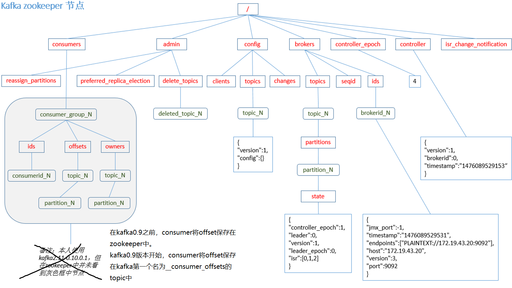
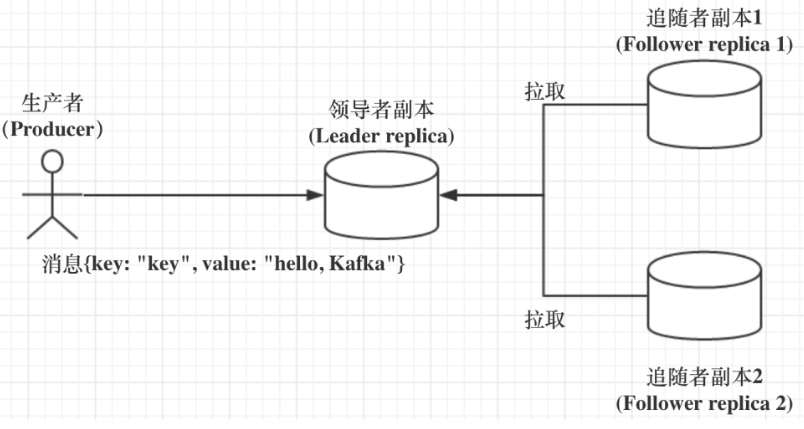

kafka

## 1，kafka 概述

>   Kafka 是一个`分布式`(集群部署，每个实例server就是broker)的基于`发布/订阅模式`的消息队列。
>
>   *   **消息根据topic分类**：Kafka保存消息时根据Topic主题进行归类。
>   *   zookeeper集群保存kafka 元数据meta信息，以保证系统可用性
>
>   一般应用在大数据日志处理或对实时性（少量延迟），可靠性（少量丢数据）要求稍低的场景。

### 1.1 发布订阅模式

Pub/Sub模式，包含主题（Topic中partition相当队列），发布者（Publisher即生产者producer），订阅者（Subscriber即消费者）多个发布者将消息发送到Topic，系统将这些消息传递给多个订阅者。

>   发布/订阅模式是一对多关系，生产消息后，推送给所有订阅者，消费者消费消息之后不会删除消息。


### 1.2 kafka 框架


*   Producer ：消息生产者或说发布者，发布消息到topic中（partition中）
*   Consumer ：消息消费者或是订阅者(应该说是消费者组订阅topic)，消费topic中特定分区消息
*   Topic：是消息的分类，可以理解为一个队列，生产者和消费者面向的都是一个 topic
*   Partition：分区，一个topic可以分为多个partition分布到多个broker上，每个partition是一个有序的队列（为实现扩展）
    *   **方便扩展**：可以通过扩展机器去轻松的应对日益增长的数据量
    *   **提高并发**：可以多个消费者同时消费数据，提高消息的处理效率
*   Consumer Group：消费者组GC，kafka用来实现一个topic消息的广播（发给所有的consumer，需要一个consumer一个GC）和单播（发给任意一个consumer）的手段。一个topic可以有多个消费者组，一个消费者组有多个消费者，同分组下的每个消费者消费不同分区的消息，一个分区只能由一个组内消费者消费。``消费者组是逻辑上的一个订阅者``
*   broker：一台kafka服务器就是一个broker
*   Offset：消息存储的额偏移量，kafka的存储文件都是按照offset.kafka来命名，用offset做名字的好处是方便查找
*   Replica：副本，保证集群中的某个节点发生故障时数据不丢失，一个topic由可有多个副本，一个 leader 和若干个 follower。`面向leader，leader才工作`
*   leader：主题下每个分区多个副本的“主”，**服务和消费都只找leader，follow仅仅当备份作用**

*   follower ：每个分区多个副本中的“从”，实时从 leader 中同步数据。

### 1.3 zookeeper与kafka

#### 1.3.1 broker注册

>   kafka是集群部署的，如何知道集群中broker节点有几个，是否还存活呢？
>
>   zookeeper将整个集群中的Broker管理起来，用来进行Broker服务器列表记录的节点，保存每个Broker的IP地址和端口信息。
>
>   其保存在zk节点：id是全局唯一的，
>
>   ```zk
>   /brokers/ids
>   ```
>
>   节点是临时节点，一旦Broker宕机，则对应的临时节点也会被自动删除。
>
>   ****

Kafka 集群中有一个 broker 会被选举为 Controller，负责管理集群 broker 的上下线，所有 topic 的分区副本分配和 leader 选举等工作。

#### 1.3.2 topic注册

>   kafka的生产者和消费者都是面向topic的，一个topic有多个分区并分布在多个broker上，topic的信息已经分区对应的broker信息应该保存在哪里呢？
>
>   也是由zookeeper来维护的，zookeeper保存了topic已经其分区信息，节点在：
>
>   ```zk
>   /brokers/topics
>   ```

#### 1.3.3 保存分区与Consumer注册

每个消息分区只能被同组的一个消费者进行消费，因此，需要在 Zookeeper 上记录消息分区与 Consumer 之间的关系。zk会管理消费者，Consumer注册参看下面Consumer注册。

节点在：

```zk
/consumers/[group_id]/owners/[topic]/[broker_id-partition_id]
```


### 1.4 消费者相关

#### 1.4.1 消费者&消费者组&分区

一个消费者组订阅一个topic，一个消费者组有多个消费者，一个消费者对应topic中不同的partition分区，即一个消费者消费一个分区。不同消费者组互不影响。

若分区一对多，消费者会争抢同一条消息（多了没意义）。

>    Kafka中，规定**每个消息分区只能被同组的一个消费者进行消费**，因此，需要在 Zookeeper 上记录消息分区与 Consumer 之间的关系。

**分区：**

同一个分区消息是有序的，但是不同分区不能保证有序。

#### 1.4.2 消息Offset

~~kafka0.9版本之前，**zk会管理消费者消费进度offset**~~

kafka0.9版本之后，**消费者进度放到了kafka中**

```zk
/consumers/[group_id]/offsets/[topic]/[broker_id-partition_id]
```

>   消费者对指定消息分区进行消息消费的过程中，**需要定时地将分区消息的消费进度Offset**保存，以便在该消费者进行重启或者其他消费者重新接管该消息分区的消息消费后，能够从之前的进度开始继续进行消息消费。

#### 1.4.3 消费者注册

>   kafka是发布订阅模式，需要消息消费者订阅topic，所以要知道有哪些消费者。
>
>   消费者服务器在初始化启动时加入消费者分组，每个消费者服务器启动时，都会到Zookeeper的指定节点下创建一个属于自己的消费者节点，完成节点创建后，消费者就会将自己订阅的Topic信息写入该临时节点。
>
>   zk：
>
>   *   对消费者分组中的消费者的变化注册监听
>   *   对Broker服务器变化注册监听
>   *   进行消费者负载均衡

**注意：producer不在zk中注册，消费者在zk中注册。**

### 1.5 kafka在zk中的节点结构



## 2，Kafka集群部署

**集群规划**

3台服务器，3个kafka，3个zookeeper

**1，安装kafak**

```sh
tar -zxvf kafka_2.11-0.11.0.0.tgz
# 可以改下文件夹名
mv kafka_2.11-0.11.0.0/ kafka
# 在kafka目录下创建logs文件夹，存放kafka持久化文件
mkdir logs
```

**2，修改配置文件**

配置文件在kafka/config/server.properties

```properties
#broker的全局唯一编号，不能重复
broker.id=0

#删除topic功能使能
delete.topic.enable=true

#处理网络请求的线程数量
num.network.threads=3

#用来处理磁盘IO的现成数量
num.io.threads=8

#发送套接字的缓冲区大小
socket.send.buffer.bytes=102400

#接收套接字的缓冲区大小
socket.receive.buffer.bytes=102400

#请求套接字的缓冲区大小
socket.request.max.bytes=104857600

#kafka持久化消息的目录，可以用逗号分隔设置多个  
#最好写成data。他里面的00000.log是存放的数据
log.dirs=/opt/module/kafka/logs

#topic在当前broker上的分区个数
num.partitions=1

#用来恢复和清理data下数据的线程数量
num.recovery.threads.per.data.dir=1

#segment文件保留的最长时间，超时将被删除
log.retention.hours=168

#配置连接Zookeeper集群地址，指定了zk的集群地址
zookeeper.connect=hadoop101:2181,hadoop102:2181,hadoop103:2181
```

**3，配置环境变量**

```java
vim /etc/profile.d/my_env.sh
```

```sh
# KAFKA_HOME
export KAFKA_HOME=/xxx/kafka
export PATH=$PATH:$KAFKA_HOME/bin
```

```sh
source /etc/profile
```

**4, 创建集群启动脚本**

**5，启动集群**

## 3，Kafka命令

### 3.1 topic相关

>   一个topic有多个分区，每个分区又在不同的broker上，同时被消费者订阅，这些topic信息都保存在zookeeper上，topic相关操作需要指定zk，指定一个即可zk会自动找leader，指定多个可以zk不可用时，找可用的zk。

#### 创建topic

```sh
# 在zk集群里创建一个名为first的topic，该主题有2个分区，每个分区2个备份
bin/kafka-topics.sh --zookeeper hadoop102:2181 --create --replication-factor 2 --partitions 2 --topic first

# 这个用法和上面没有区别，只是多指定了zk机器，但是因为我们zk集群本来计算自动备份的，多指定几个只是怕集群里某个机器宕机了从而连不上全部集群。而如果没有宕机的话即使连的是zk的follower，他也会转发给zk的leader进行数据备份，备份好后通知zk的follower，该follower返回给kafka
bin/kafka-topics.sh --zookeeper hadoop102:2181,hadoop103:2181,hadoop104:2181 --create --replication-factor 2 --partitions 2 --topic first
```

**选项说明**：

-   –topic 定义topic名
-   –replication-factor 定义副本数
-   –partitions 定义分区数

#### 查看topic

*   列举所以topic
*   查看指定topic详情

```java
# 查看当前服务器所有topic # 数据在zk集群里
bin/kafka-topics.sh --zookeeper hadoop102:2181 --list

# 查看指定topic
bin/kafka-topics.sh --zookeeper hadoop102:2181  --describe --topic first
```

#### 删除topic

>   **前提：**需要server.properties中设置delete.topic.enable=true否则只是标记删除，重启之后才生效。
>
>   若delete.topic.enable=false(默认)：
>
>   *   若该topic没有被使用过，没有传输过信息，直接彻底删除
>   *   若该topic被使用过，传输过信息，并没有真正删除topic，只是把该topic标记为删除(marked for deletion)，重启kafka server后删除

```java
bin/kafka-topics.sh --zookeeper hadoop102:2181 --delete --topic first
```

#### 修改topic

>   只能增加分区数目

```sh
# 修改成2个分区 2个副本 只能增加分区，不能减少分区
bin/kafka-topics.sh --alter --zookeeper hadoop102:2181 --topic first --partitions 2

# 看一下修改成功没有
bin/kafka-topics.sh --zookeeper hadoop102:2181 --describe --topic first
```

### 3.2 消息相关

#### 生产者相关

生产者不和zookeeper打交道，不在zookeeper上注册，而是直接链接kafka，所以需要指定`broker`

```sh
# 用生产者控制台 连接hadoop102这台服务器里的broker 获取其中的名为first主题 向这个主题中生产数据 
bin/kafka-console-producer.sh --broker-list hadoop102:9092 --topic first
```

#### 消费者相关

>   消费者跟zookeeper打交道，消费者注册到zookeeper，记录consumer和partition关系以及offset等。
>
>   需要指定zookeeper（以及消费位置）

```sh
# 用消费者控制平台去 hadoop102这台zookeeper里 去消费 主题为first的主题
bin/kafka-console-consumer.sh --zookeeper hadoop102:2181 --from-beginning --topic first

# 查看所有正在连接的Consumer信息
bin/kafka-consumer-groups.sh --zookeeper localhost:2181 --list

bin/kafka-consumer-groups.sh --new-consumer --bootstrap-server localhost:9092 --list

#查看单个Consumer信息
bin/kafka-consumer-groups.sh --zookeeper localhost:2181 --describe --group BrowseConsumer

bin/kafka-consumer-groups.sh --new-consumer --bootstrap-server localhost:9092 --describe --group BrowseConsumer

# 重头开始消费某个Topic
bin/kafka-console-consumer.sh --zookeeper localhost:2181 --from-beginning --topic xxx

bin/kafka-console-consumer.sh --new-consumer --bootstrap-server localhost:9092 --from-beginning --topic xxx
```

-   –from-beginning：会把主题中以往所有的数据都读取出来。根据业务场景选择是否增加该配置。
-   订阅了但不在线，等上线之后是能读到消息的
-   最后要注意的是，如果往不存在的topic写数据，能不能写入成功呢？kafka会自动创建topic，分区和副本的数量根据默认配置都是1

## 4，kafka工作流程

### 4.1 发送消息

producer就是生产者，是数据的入口。Producer在写入数据的时候**永远的找分区的leader**，不会直接将数据写入follower！


消息写入leader后，follower是主动的去leader进行同步的！producer采用push模式将数据发布到broker，每条消息追加到分区中，顺序写入磁盘，所以同一分区数据是有序的！

#### 4.1.1 消费分区确定

topic有多个partition，当producer发布消息时，消息保存到哪个分区呢？

>   在rabbitmq中，发送消息时prodcuer指定queue或者routing-key，kafka呢？
>
>   *   指定partition：在写入的时候可以指定需要写入的partition
>   *    不指定partition：如果没有指定partition，但是设置了数据的key，则会根据key的值hash出一个partition
>   *    不指定partition：如果既没指定partition，又没有设置key，则会轮询选出一个partition。

#### 4.1.2 消息发布确认

>   保证消息不丢失是一个消息队列中间件的基本保证，kafka如何保证？
>
>   通过ACK消息确认机制。在生产者向topic写入数据的时候可以设置参数来确定是否确认kafka接收到数据，这个参数可设置的值为**0**、**1**、**all**。

*   acks=0： producer 不等待broker ack发布确认，当 broker 故障时有可能丢失数据，这种情况后面的producer.send的回调也会完成失去作用
    *   存在数据丢失
*   acks=1： producer等待leader的ack，partition的==leader 落盘(写入磁盘)==成功后返回ack(只等待leader写完就发回ack)。
    *   存在数据数据丢失，如：如果在 follower同步成功之前**leader故障**，那么将会丢失数据
*   acks=-1(all)：producer 等待”所有“broker的 ack， partition的leader和follower(ISR里的follower) 全部落盘成功后才返回ack。
    *   存在数据重复，如：在follower同步完成后，broker发送ack之前，**leader发生故障**，那么会造成数据重复
    *   存在数据丢失：比如ISR中**只有一个leader**，leader写完了就发送ACK，但是还没同步就挂掉了，此时也会丢失数据

------------------------------------------------
### 4.2 文件存储机制

>   Producer将数据发布到kafka后，集群就需要对数据进行保存写入磁盘，Kafka顺序写入数据（效率比随机写入高），并且是多个节点同时工作的效率很高。
>
>   每个topic可以有多个分区，每个分区是一个集群，有1个leader和多个follower（副本）。

****

​		topic 是逻辑上的概念（多个partition组成一个topic，数据存储在partition中），而 partition 是物理上的概念，`每个 partition 对应于一个 log 文件(即数据文件)`，该 log 文件中存储的就是 producer 生产的数据。

 		Producer 生产的数据会被不断追加到该log 文件末端，且每条数据都有自己的 offset**。 **消费者组中的每个消费者（消费特定分区）， 都会实时记录自己消费到（该分区）哪个 offset（在kafka中记录），以便出错恢复时，从上次的位置继续消费。

****

**为防止log文件过大导致数据定位效率低下，kafka做了分片和索引机制，如下：**

*   每个`partition`分为多个`segments`（章节）
*   每个`segments`对应两个文件，两个文件成对出现，如：000000000.index，000000000.log
    *   xxx.index（索引文件，记录序号i和对应的第i条信息的地址位置）
    *   xxx.log（数据文件，根据索引文件的消息偏移量查找消息数据）
*   这些文件位于一个partition文件夹下，partition文件夹的命名规则为：topic主题名 + 分区序号，如first-0

​		

### 4.3 副本机制

>   副本机制保证集群中的某个节点发生故障时数据不丢失（提供数据冗余），一个topic由可有多个副本，一个 leader 和若干个 follower。
>
>   注意：副本保存在不同的broker上，若是同一个就没有意义了。

#### 4.3.1 副本工作原理

follower拉起leader，producer和consumer只与这个leader交互，其它replication作为follower从leader 中复制数据。



*   follower唯一任务就是同步leader
*   leader所在broker宕机后，选举一个follower称为新的leader（依托zookeeper的监控）

#### 4.3.2 follower同步条件

>   Kafka 引入了 In-sync Replicas，即 ISR 副本集合，ISR 中的副本都是与 Leader 同步的副本，相反，不在 ISR 集中就被认为是与 Leader 不同步。
>
>   **注意**：ISR 包含leader，且是一个动态调整的集合

##### 是否同步的依据是什么？

​	Broker 端replica.lag.time.max.ms 参数（Follower 副本能够落后 Leader 副本的最长时间间隔）值来控制哪个追随者副本与 Leader 同步，只要在这个范围内就是同步的。


##### 副本如何选举？

**kafka leader副本所在broker挂了，leader副本如何选举**

*   ISR不为空，从ISR中选举
*   ISR为空，Kafka也可以从不在 ISR 中的存活副本中选举（有数据一致性，数据丢失问题，强烈建议不要开启）

### 4.4 消息删除机制

无论消息是否被消费，kafka都会保留所有消息，但是不能永无止境的只追加迟早磁盘不够用的，因此，kafka提供两种数据删除策略：

*   基于时间：log.retention.hours=168 （7天）
*   基于大小：log.retention.bytes=1073741824

**ps**：因为Kafka读取特定消息的时间复杂度为O(1)，即与文件大小无关，所以这里删除过期文件与提高 Kafka 性能无关。

### 4.5 写入流程

>   消息由producer发送大broker，broker还需要将消息写入文件中，producer是面向topic的或者说是partition的，而partition是存在某台broker上的，所以写入流程如下：

1.   producer发送消息时，先计算partition，后从zookeeper节点找到该partition的leader（即副本的leader）
2.   producer将消息发送给该leader
3.   leader将消息写入本地log（其实时segments中的index和log文件）
4.   followers从leader pull消息，写入本地log后向leader发送ACK
5.   leader收到所有ISR中的replication的ACK后，增加HW（high watermark，最后commit 的offset）并向producer发送ACK

### 4.6 消费消息

消费者消费消息同样是面向topic，找leader。

**补充**

```markdown
push模式很难适应消费速率不同的消费者，因为消息发送速率是由broker决定的。push模式的目标是尽可能以最快速度传递消息，但是这样很容易造成消费者来不及处理消息，典型的表现就是拒绝服务以及网络拥塞。

而pull模式则可以根据consumer的消费能力以适当的速率消费消息。

pull模式，如果broker没有数据，消费者会轮询，忙等待数据直到数据到达，为了避免这种情况，我们允许消费者在pull请求时候使用“long poll”进行阻塞，直到数据到达 。
```

>   多个消费者可以组成一个消费者组（consumer group），每个消费者组都有一个组id，同一个消费组者的消费者可以消费同一topic下不同分区的数据，但是不存在组内多个消费者消费同一分区的数据。
>
>   **ps：**建议消费者组的consumer的数量与partition的数量一致！


#### 消费消息过程？

假如现在需要查找一个offset为368801的message是什么样的过程呢？


1.   先确定的partition（计算要消费哪个partition的数据）

2.   先找到offset的368801message所在的segment文件（利用二分法查找），这里找到的就是在第二个segment文件（由于index文件名是根据最后一次commit的偏移量命名，其是一个定位信息）

3.   打开找到的segment中的`.index`文件（该文件起始偏移量为368796+1，368796+5=368801，所以相对offset为5），但是文件采用的是稀疏索引（多个分区，单个分区索引不连续），利用二分法查找相对offset小于或者等于指定的相对offset的索引条目中最大的那个相对offset，所以找到的是相对offset为4的这个索引。

4.   根据找到的相对offset为4的索引确定message存储的物理偏移位置为256

5.   打开数据文件，从位置为256的那个地方开始顺序扫描直到找到offset为368801的那条Message

     总结：就是找消息的起始和结束位置

**ps**：**segment**+**有序offset**+**稀疏索引**+**二分查找**+**顺序查找**

### 4.7 kafka事务

## 5，AdminClient API

**依赖**

```xml
<dependency>
    <groupId>org.apache.kafka</groupId>
    <artifactId>kafka-clients</artifactId>
</dependency>
```

>   **AdminClient API**：允许管理和检测Topic、broker以及其他Kafka实例，与Kafka自带的脚本命令作用类似。

| API                   | 作用               |
| --------------------- | ------------------ |
| AdminClient           | 客户端对象         |
| NewTopic              | 创建主题           |
| CreateTopicsResult    | 创建主题的返回结果 |
| ListTopicsOptions     | 查询主题列表       |
| ListTopicsOptions     | 查询主题列表及选项 |
| DescribeOptionsResult | 查询主题           |
| DescribeConfigsResult | 查询主题配置项     |

### 5.1 AdminClient API案例

#### 创建AdminClient

```java
public static AdminClient adminClient(){
    Properties properties = new Properties();
    properties.setProperty(AdminClientConfig.BOOTSTRAP_SERVERS_CONFIG,"kafka1:9092");
    AdminClient adminClient = AdminClient.create(properties);
    return adminClient;
}
```

#### 创建topic

```java
 public static void createTopic() {
     // 连接kafka
     AdminClient adminClient = adminClient();
     // 副本因子
     Short rs = 1;
     // 创建topic，topic有分区和副本
     NewTopic newTopic = new NewTopic(TOPIC_NAME, 1 , rs);
     CreateTopicsResult topics = adminClient.createTopics(Arrays.asList(newTopic));
     adminClient.close();
 }
```

#### topic列表

```java
/**
 * 获取topic列表
 */
public static void topicList() throws Exception {
    AdminClient adminClient = adminClient();

    //是否查看Internal选项
    ListTopicsOptions options = new ListTopicsOptions();
    options.listInternal(true);

    //ListTopicsResult listTopicsResult = adminClient.listTopics();
    ListTopicsResult listTopicsResult = adminClient.listTopics(options);
    Set<String> names = listTopicsResult.names().get();

    //打印names
    names.stream().forEach(System.out::println);

    Collection<TopicListing> topicListings = listTopicsResult.listings().get();
    //打印TopicListing
    topicListings.stream().forEach((topicList) -> {
        System.out.println(topicList.toString());
    });
    adminClient.close();
}
```

#### 删除topic

```java
/**
 * 删除topic
 */
public static void delTopic() throws Exception {
    AdminClient adminClient = adminClient();
    DeleteTopicsResult deleteTopicsResult = adminClient.deleteTopics(Arrays.asList(TOPIC_NAME));
    deleteTopicsResult.all().get();
}
```

#### topic详情

```java
/**
 * 描述topic
 */
public static void describeTopic() throws Exception {
    AdminClient adminClient = adminClient();
    DescribeTopicsResult describeTopicsResult = adminClient.describeTopics(Arrays.asList(TOPIC_NAME));
    Map<String, TopicDescription> descriptionMap = describeTopicsResult.all().get();
    descriptionMap.forEach((key,value) -> {
        System.out.println("name: " + key+" desc: " + value);
    });
}
```

#### 修改配置信息

```java
/**
 * 修改配置信息 新版API
 */
public static void alterConfig2() throws Exception {
    AdminClient adminClient = adminClient();
    Map<ConfigResource, Collection<AlterConfigOp>> configMap = new HashMap<>();
    ConfigResource configResource = new ConfigResource(ConfigResource.Type.TOPIC,TOPIC_NAME);
    AlterConfigOp alterConfigOp = new AlterConfigOp(new ConfigEntry("preallocate","false"),AlterConfigOp.OpType.SET);
    configMap.put(configResource,Arrays.asList(alterConfigOp));
    AlterConfigsResult alterConfigsResult = adminClient.incrementalAlterConfigs(configMap);
    alterConfigsResult.all().get();
}
```

#### 增加分区数量

```java
private static final String TOPIC_NAME = "yibo_topic";

/**
 * 增加partitions数量
 * @param partitions
 * @throws Exception
 */
public static void incrPartitions(int partitions) throws Exception {
    AdminClient adminClient = adminClient();
    Map<String,NewPartitions> partitionsMap = new HashMap<>();
    NewPartitions newPartitions = NewPartitions.increaseTo(partitions);
    partitionsMap.put(TOPIC_NAME,newPartitions);
    CreatePartitionsResult partitionsResult = adminClient.createPartitions(partitionsMap);
    partitionsResult.all().get();
}
```

### 5.2 springboot 整合

#### kafka 客服端属性

```java
@Component
public class KafkaConfig{

    // 配置Kafka
    public Properties getProps(){
        Properties props = new Properties();
        // kafka 服务地址
        props.put("bootstrap.servers", "localhost:9092");
        /*    props.put("retries", 2); // 重试次数
        props.put("batch.size", 16384); // 批量发送大小
        props.put("buffer.memory", 33554432); // 缓存大小，根据本机内存大小配置
        props.put("linger.ms", 1000); // 发送频率，满足任务一个条件发送*/
        // key序列化器
        props.put("key.serializer", "org.apache.kafka.common.serialization.StringSerializer");
        // value序列化器
        props.put("value.serializer", "org.apache.kafka.common.serialization.StringSerializer");
        return props;
    }
}
```

#### kafka 配置类

```java
import org.apache.kafka.clients.admin.AdminClient;
import org.apache.kafka.clients.admin.AdminClientConfig;
import org.springframework.beans.factory.annotation.Value;
import org.springframework.context.annotation.Bean;
import org.springframework.context.annotation.Configuration;
import org.springframework.kafka.core.KafkaAdmin;
 
import java.util.HashMap;
import java.util.Map;
 
@Configuration
public class KafkaInitialConfiguration {

    /**
    * AdminClient 管理客服端
    */
    @Bean
    public AdminClient adminClient() {
        return AdminClient.create(kafkaAdmin().getConfig());
    }
}

```

#### 操作封装

```java
import org.apache.kafka.clients.admin.*;
import org.apache.kafka.common.KafkaFuture;
import org.springframework.beans.factory.annotation.Autowired;
import org.springframework.stereotype.Service;
 
import java.util.Arrays;
import java.util.HashMap;
import java.util.Map;
 
 
/**
 * @Describe 主题操作控制类
 */
@Service
public class KafkaConsole {
    @Autowired
    private AdminClient adminClient;
    
     /**
     * 创建主题
     */
    public void create(String topic, int partitions, int replication, Map<String, String> configs) throws Exception {
        // 为了兼容性增加一层副本系数和节点数量的判断
        if (replication > getBrokerNums()) {
            throw new RuntimeException("副本系数不能大于broker节点数量"); 
        }
        short replication_short = (short) replication;
        NewTopic newTopic = new NewTopic(topic, partitions, replication_short);
        // 创建主题的相关配置
        if (null != configs && configs.size() > 0) {
            newTopic.configs(configs);
        }
        CreateTopicsResult result = adminClient.createTopics(Arrays.asList(newTopic));
        result.all().get(timeout, TimeUnit.SECONDS);
    }
    
    /**
     * 主题列表
     */
    public Set<String> list() throws Exception {
        ListTopicsResult listTopicsResult = adminClient.listTopics();
        // Set<String> topics = listTopicsResult.names().get();
        Set<String> topics = listTopicsResult.names().get(timeout, TimeUnit.SECONDS);

        return topics;
    }
 	
     /**
     * 修改主题
     */
    public void update(String topic, List<AlterConfigOp> alterConfigOps) throws Exception {
    ConfigResource resource = new ConfigResource(ConfigResource.Type.TOPIC, topic);
    Map<ConfigResource, Collection<AlterConfigOp>> configs = new HashMap<>();
    configs.put(resource, alterConfigOps);
    adminClient.incrementalAlterConfigs(configs).all().get(timeout, TimeUnit.SECONDS);
}
    
    /**
     * 返回主题的信息
     */
    public KafkaFuture<Map<String, TopicDescription>> describeTopicInfo(String topicName) {
        DescribeTopicsResult result = adminClient.describeTopics(Arrays.asList(topicName));
        KafkaFuture<Map<String, TopicDescription>> all = result.all();
        return all;
    }
 	
     /**
     * 删除主题
     */
    public void delete(String topic) throws Exception {
        // 服务端server.properties需要设置delete.topic.enable=true，才可以使用同步删除，否则只是将主题标记为删除
        adminClient.deleteTopics(Arrays.asList(topic));
    }

     /**
     * 增加某个主题的分区（注意分区只能增加不能减少）
     */
    public void editTopicPartition(String topicName,Integer number){
        Map<String, NewPartitions> newPartitions=new HashMap<String, NewPartitions>();
        //创建新的分区的结果
        newPartitions.put(topicName,NewPartitions.increaseTo(number));
        adminClient.createPartitions(newPartitions);
    }
 	
    /**
     * 列出主题所有分区
     */
    public List<Integer> partitions(String topic) throws Exception {
        List<TopicPartitionInfo> partitionInfos = describe(topic).partitions();
        List<Integer> result = new ArrayList<>();
        for (TopicPartitionInfo partitionInfo : partitionInfos) {
            result.add(partitionInfo.partition());
        }
        return result;
    }
}
```

## 6，Producer API
