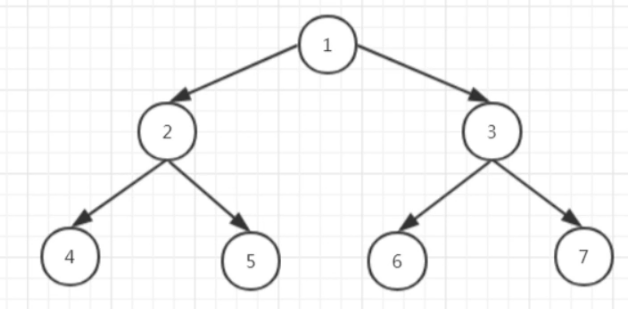
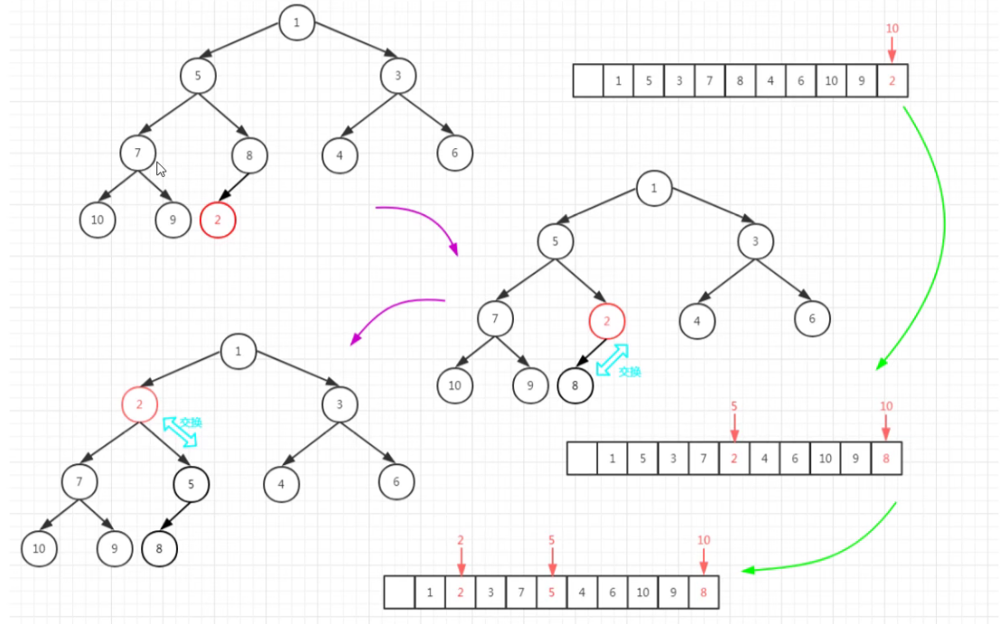
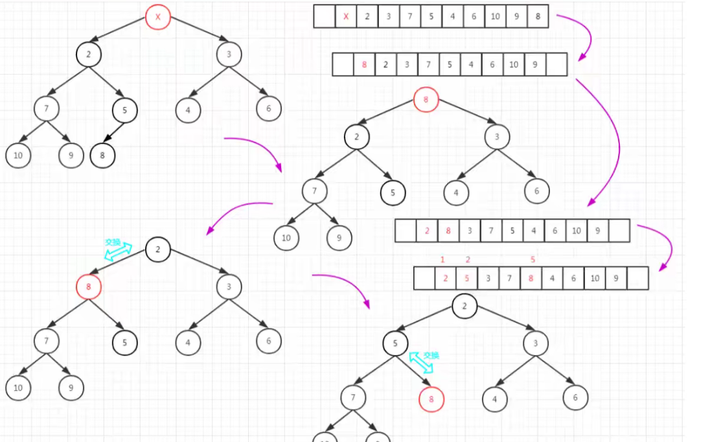

# JDK定时器

## 1，理论基础

### 1.1 小顶堆

> 即小根堆，堆是一种特殊的树，只要满足下面两个条件，它就是一个堆：
>
> 1. 是一个完全二叉树
> 2. 堆中的某个节点的值不大于（或不小于）其父节点的值。

如：

逻辑结构是数

物理结构是数组

> 每次到时取堆顶进行执行。



**插入新元素:**

> 插入尾部，让后上浮（小根堆，小的上浮）




**删除元素：**

> （小根堆）将尾部元素放到堆顶，然后下沉（那边小往那边下沉）。



### 1.2 时间轮算法


## 2，Timer定时任务

> .schedule()方法执行任务，真正的执行时间取决于上一次的结束任务 （丢任务）。
>
> .scheduleAtFixedRate() 严格按照预设的时间 （任务存在提前执行，执行时间会乱）。
>
> 原因：单线程，存在任务超时，任务阻塞
>
> 解决方法：多线程执行

```java
public class TimerTest {
    public static void main(String[] args) {
        Timer t = new Timer(); // 任务启动
        for (int i = 0; i < 2; i++) {
            TimerTask task = new FooTimerTask("foo" + i);
            t.schedule(task, new Date(), 2000); // 任务添加
        }
    }
}

class FooTimerTask extends TimerTask{

    private String name; 

    @Override
    public void run() {
        try {
            System.out.println("name = " + name);
            Thread.sleep(3000);
        } catch (InterruptedException e) {
            e.printStackTrace();
        }
    }

    public FooTimerTask(String name) {
        this.name = name;
    }
}
```


### 2.1 定时任务线程池

> 多线程

```java
public class TimerTest {
    public static void main(String[] args) {
        ScheduledExecutorService threadPool = Executors.newScheduledThreadPool(10);
        for (int i = 0; i < 2; i++) {
            threadPool.schedule(() -> {
                System.out.println("xxxxxx");
            }, 2, TimeUnit.SECONDS);
//            threadPool.scheduleAtFixedRate();
        }
    }
}
```

