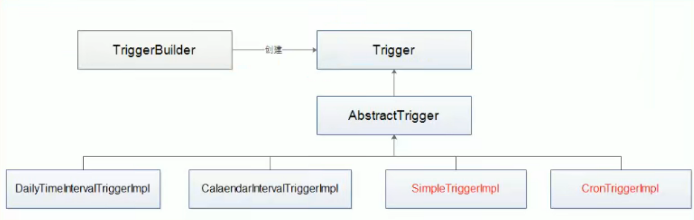
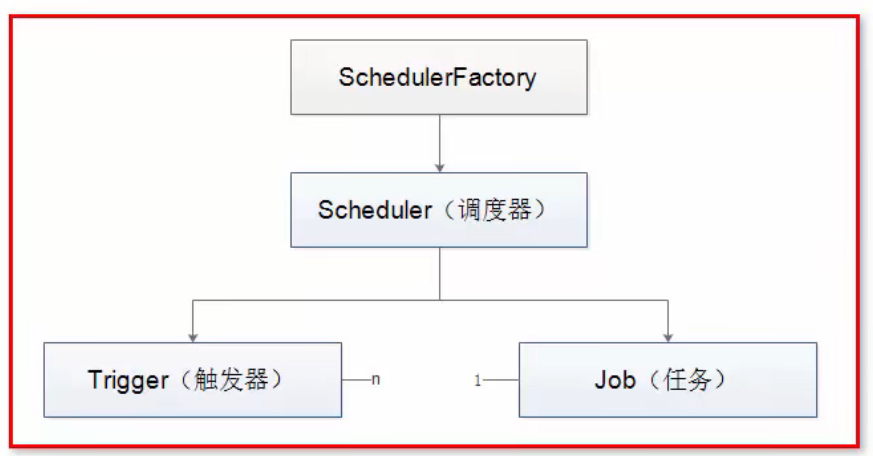

# Quartz定时任务

## 1. quartz使用

### 1.1 准备工作

 **maven依赖**

```xml
<!-- quartz核心包 -->
<dependency>
    <groupId>org.quartz-scheduler</groupId>
    <artifactId>quartz</artifactId>
    <version>2.3.2</version>
</dependency>
<!-- 工具（非必须） -->
<dependency>
    <groupId>org.quartz-scheduler</groupId>
    <artifactId>quartz-jobs</artifactId>
    <version>2.3.2</version>
</dependency>
```

### 1.2 入门案例

#### 1.2.1 定义Job类

> 定义Job类，此类的实例对象就是我们定时任务要处理的逻辑

```java
/**
 * quartz 任务
 */
public class HelloJob implements Job {
    /**
     * 定时任务逻辑
     *
     * @param jobExecutionContext
     * @throws JobExecutionException
     */
    @Override
    public void execute(JobExecutionContext jobExecutionContext) throws JobExecutionException {

        System.out.println("正在执行定时任务，时间是：" + LocalDateTime.now().format(DateTimeFormatter.ofPattern("yyy-MM-dd HH:mm:ss")));
    }
}

```

#### 1.2.2 创建启动类

> 在启动类中创建调度器Scheduler，任务JobDetail，触发器 Trigger。
>
> 将任务JobDetail与触发器 Trigger关联，任务Job是什么情况下才会被执行，需要在Trigger中指明。
>
> 注意：每次执行都会创建新的JobDetail去执行

```java
public class HelloSchedulerDemo {
    public static void main(String[] args) throws SchedulerException {
        // 1. 调度器 Scheduler，从工厂中胡哦亲调度器实例
        Scheduler scheduler = StdSchedulerFactory.getDefaultScheduler();

        // 2. 任务 JobDetail
        JobDetail jobDetail = JobBuilder.newJob(HelloJob.class)
            // 任务身份 - 参数1：任务名称（唯一），参数2：任务组的名称
            .withIdentity("job1", "group1")
            .build();

        // 3. 触发器 Trigger（任务按触发器定义的规则执行任务）
        SimpleTrigger trigger = TriggerBuilder.newTrigger()
            // 触发器身份 - 参数1：触发器名称（唯一），参数2：触发器组的名称。与JobDetail的没有任何关系
            .withIdentity("trigger1", "group1")
            // 调度启动时间-马上
            .startNow()
            // 调度类型
            .withSchedule(SimpleScheduleBuilder.repeatSecondlyForever(5))
            .build();

        // 调度器使用触发器调度任务（调度器关联触发器与任务）
        scheduler.scheduleJob(jobDetail, trigger);
        // 启动
        scheduler.start();
    }
}
```


## 2. Job和JobDetail介绍

> * Job：job是工作任务调度的接口（是接口需要被实现），任务类需要实现该接口。该接口定义execute方法，类型JDK提供的TimeTask类似的run方法。在里面编写业务逻辑。
> * Job实例在Quartz中的生命周期：每次调度器执行Job时，它在调用execute方法前会创建一个新的Job实例，当调度完成后，关联的Job对象就会被释放被垃圾回收机制回收。
> * JobDetail：JobDetail为Job实例提供了许多设值属性，以及JobDataMap成员变量属性，它用来存储特定的Job实现的状态信息，调度器想要借助JobDetail对象来添加Job实例。为Job任务提供属性，通过JobDetail添加Job的
> * JobDetail重要属性：name，group，jobClass，jobDateMap

```java
// 2. 任务 JobDetail
JobDetail jobDetail = JobBuilder.newJob(HelloJob.class)
    // 任务身份 - 参数1：任务名称（唯一），参数2：任务组的名称
    .withIdentity("job1", "group1")
    .build();
// job 的 name，group
System.out.println(jobDetail.getKey().getName());
System.out.println(jobDetail.getKey().getGroup());
// Job任务的类
System.out.println(jobDetail.getJobClass());
```

如果JobDetail没有指定group会有默认值DEFAUALT，但是name必须给。


## 3. JobExecutionContext

> * 当Scheduler调用一个Job，就会将JobExecutionContext传递给Job的execute方法；
> * Job能通过JobExecutionContext对象访问到Quartz运行时的环境以及Job本身的明细数据。

```java
public class HelloJob implements Job {
    /**
     * 定时任务逻辑
     *
     * @param jobExecutionContext job上下文对象
     * @throws JobExecutionException 异常
     */
    @Override
    public void execute(JobExecutionContext jobExecutionContext) throws JobExecutionException {
        // ...
		// job name group
        System.out.println(jobExecutionContext.getJobDetail().getKey().getName());
        System.out.println(jobExecutionContext.getJobDetail().getKey().getGroup());
        // job任务的class
        System.out.println(jobExecutionContext.getJobDetail().getClass());
    }
}
```


## 4. JobDataMap

> 在执行任务时，希望传递一些参数，希望能在执行任务的逻辑中获取，就可以使用到JobDataMap。

### 4.1 使用Map获取

> * 在进行任务调度时，JobDataMap存储在JobExecutionContext中
> * JobDataMap可以用来装载任何可序列化的数据对象，当Job实例对象被执行时这些参数对象会传递给它jobExecutionContext。
> * JobDataMap实现类JDK的Map接口
> * JobDetail和Trigger都能传递JobDataMap
>
> <font color="red">.usingJobData("key", "value")</font>

**传递参数：**

```java
public static void main(String[] args) throws SchedulerException {
        // 1. 调度器 Scheduler，从工厂中胡哦亲调度器实例
        Scheduler scheduler = StdSchedulerFactory.getDefaultScheduler();

        // 2. 任务 JobDetail
        JobDetail jobDetail = JobBuilder.newJob(HelloJob.class)
            // 任务身份 - 参数1：任务名称（唯一），参数2：任务组的名称
            .withIdentity("job1", "group1")
            // JobDetail JobDataMap 传递参数
            .usingJobData("jobMessage", "打印日志")
            .build();

        // 3. 触发器 Trigger（任务按触发器定义的规则执行任务）
        SimpleTrigger trigger = TriggerBuilder.newTrigger()
            // 触发器身份 - 参数1：触发器名称（唯一），参数2：触发器组的名称。与JobDetail的没有任何关系
            .withIdentity("trigger1", "group1")
            // Trigger JobDataMap 传递参数
            .usingJobData("triggerMessage", "trigger 参数值")
            // 调度启动时间-马上
            .startNow()
            // 调度类型
            .withSchedule(SimpleScheduleBuilder.repeatSecondlyForever(5))
            .build();

        // 调度器使用触发器调度任务（调度器关联触发器与任务）
        scheduler.scheduleJob(jobDetail, trigger);
        // 启动
        scheduler.start();
    }
```

**Job获取参数：**

```java
public class HelloJob implements Job {
    /**
     * 定时任务逻辑
     *
     * @param jobExecutionContext job运行时的上下文
     * @throws JobExecutionException
     */
    @Override
    public void execute(JobExecutionContext jobExecutionContext) throws JobExecutionException {
        System.out.println("正在执行定时任务，时间是：" + LocalDateTime.now().format(DateTimeFormatter.ofPattern("yyy-MM-dd HH:mm:ss")));
        // jobDetail 的JobDataMap
        JobDataMap jobDataMap = jobExecutionContext.getJobDetail().getJobDataMap();
        // trigger 的的JobDataMap
        JobDataMap triggerDataMap = jobExecutionContext.getTrigger().getJobDataMap();

        System.out.println(jobDataMap.getString("jobMessage"));
        System.out.println(jobDataMap.getString("不存在的key"));

        System.out.println(triggerDataMap.getString("triggerMessage"));
    }
}
```

注：还有setter方式，key就是属性名

## 5. 有状态和无状态的Job

> @PersistJobDataAfterExecution 注解的使用。
>
> 有状态的Job可以理解为多次Job任务调用期间可以持有一些状态信息，这些状态信息存储在JobDataMap中，而默认的无状态Job每次调用都会创建一个新的JobDataMap。
>
> 其实就是多次执行JobDetail是否是同一个。

### 5.1 创建Job类

> 在job类上添加注解
>
> @PersistJobDataAfterExecution
>
> 该Job是有状态，每次调用不会创建新的对象

```java
@PersistJobDataAfterExecution
public class HelloJob implements Job {

    private Integer count;

    public void setCount(Integer count) {
        this.count = count;
    }

    /**
     * 定时任务逻辑
     *
     * @param jobExecutionContext job运行时的上下文
     * @throws JobExecutionException
     */
    @Override
    public void execute(JobExecutionContext jobExecutionContext) throws JobExecutionException {
        // jobDetail 的JobDataMap
        JobDataMap jobDataMap = jobExecutionContext.getJobDetail().getJobDataMap();

        // 有状态Job
        this.count++;
        jobDataMap.put("count", this.count);
        System.out.println("计数 count：" + this.count);
    }
}
```

调度

```java
// 2. 任务 JobDetail
JobDetail jobDetail = JobBuilder.newJob(HelloJob.class)
    // 任务身份 - 参数1：任务名称（唯一），参数2：任务组的名称
    .withIdentity("job1", "group1")
    // JobDetail JobDataMap 传递参数
    .usingJobData("count", 0)
    .build();
```


## 6. Trigger




> Quartz有不同的触发器，不过用的最多的是SimpleTrigger和CronTrigger.
>
> 1）jobKey
>
> 表示job实例的标识，触发器被触发时，该指定job实例会被执行。
>
> 2）startTime
>
> 表示触发器的时间表，第一次开始被触发的时间，它的类型是Date
>
> 3）endTime
>
> 指定触发器终止被触发的时间，它的类型是Date，在此之后任务不会被执行。

**案例：**

**1 创建Job类**

```java
public class HelloTriggerJob implements Job {

    /**
     * 定时任务逻辑
     *
     * @param jobExecutionContext job运行时的上下文
     * @throws JobExecutionException
     */
    @Override
    public void execute(JobExecutionContext jobExecutionContext) throws JobExecutionException {
        // jobDetail 的JobDataMap
        Trigger trigger = jobExecutionContext.getTrigger();
        // jobKey, name, group
        System.out.println(trigger.getJobKey());
        System.out.println(trigger.getJobKey().getName());
        System.out.println(trigger.getJobKey().getGroup());

        Date startTime = trigger.getStartTime();
        Date endTime = trigger.getEndTime();
        System.out.println("开始时间：" + new SimpleDateFormat("yyyy-MM-dd HH:mm:ss").format(startTime));
        System.out.println("结束数据：" + new SimpleDateFormat("yyyy-MM-dd HH:mm:ss").format(endTime));
    }
}
```


**2 启动类**

```java
public class HelloSchedulerDemo {
    public static void main(String[] args) throws SchedulerException {
        // 1. 调度器 Scheduler，从工厂中胡哦亲调度器实例
        Scheduler scheduler = StdSchedulerFactory.getDefaultScheduler();

        // 设值任务的开始时间，结束时间
        Date startTime = new Date();
        Date endTime = new Date(System.currentTimeMillis() + 10000);

        // 2. 任务 JobDetail
        JobDetail jobDetail = JobBuilder.newJob(HelloTriggerJob.class)
            // 任务身份 - 参数1：任务名称（唯一），参数2：任务组的名称
            .withIdentity("job1", "group1")
            // JobDetail JobDataMap 传递参数
            .usingJobData("jobMessage", "打印日志")
            .usingJobData("count", 0)
            .build();

        // 3. 触发器 Trigger（任务按触发器定义的规则执行任务）
        SimpleTrigger trigger = TriggerBuilder.newTrigger()
            // 触发器身份 - 参数1：触发器名称（唯一），参数2：触发器组的名称。与JobDetail的没有任何关系
            .withIdentity("trigger1", "group1")
            // Trigger JobDataMap 传递参数
            .usingJobData("triggerMessage", "trigger 参数值")
            // 任务的开始时间
            .startAt(startTime)
            // 任务的结束时间
            .endAt(endTime)
            // 调度类型
            .withSchedule(SimpleScheduleBuilder.repeatSecondlyForever(5))
            .build();

        // 调度器使用触发器调度任务（调度器关联触发器与任务）
        scheduler.scheduleJob(jobDetail, trigger);
        // 启动
        scheduler.start();
    }
} 
```

.withRepeatCount(int count): 指定重复次数

### 6.1 SimpleTrigger

> SimpleTrigger是Trigger实现，是频率触发器。
>
> * SimpleTrigger的属性有：开始时间，结束时间，重复次数，重复的时间间隔
> * 重复次数的值可以为0，以及正整数，或者常量SimpleTrigger.REPEAT_INDEFINITELY
> * 重复的时间间隔必须为大于0的正整数，单位毫秒。
> * 如果有指定结束时间的属性值，则结束时间属性优先于重复次数的属性。这样的好处在于：但我们想要创建一个每隔10s触发一次直到结束时间的Trigger，而无需计算从开始到结束的重复次数，我们只需要简单的指定结束时间和重复次数的属性即可。


### 6.2 CronTrigger

> 如果你需要像日历那样按日程来触发任务，而不像SimpleTrigger那样每个特定的时间将触发，CronTrigger通常比SimpleTrigger更有用，因为它是基于日历的任务调度器。
>
> 使用CronTrigger，可以指定诸如：”每个周五中“，或者”每个工作日的9:30“或者”从周一，三，五上午9点到上午10点之间每个5分钟等“这样的日程安排来触发。同样的拥有startTime以指定日程从什么时候开始，也有可选endTime等。

#### 6.2.1 Cron表达式

> Cron表达式是一个由7个子表达式组成的字符串，每个字符串描述单独的日程细节。
>
> **{秒数} {分钟} {小时} {日期} {月份} {星期} {年份(可为空)}**

| 字段         | 允许值            | 允许的特殊字符  |
| ------------ | ----------------- | --------------- |
| 秒           | 0-59              | , - * /         |
| 分           | 0-59              | , - * /         |
| 小时         | 0-23              | , - * /         |
| 日期         | 1-31              | , - * ? / L W C |
| 月份         | 1-12 或者 JAN-DEC | , - * /         |
| 星期         | 1-7 或者 SUN-SAT  | , - * ? / L C # |
| 年（可为空） | 留空, 1970-2099   | , - * /         |

#### 6.2.2 特殊字符介绍

**\* **

> 字符被用来指定所有的值。如："*"在分钟的字段域里表示“**每**分钟”。

**? **

> “?”字符只在日期域和星期域中使用（冲突是不考虑，表示不设值该值）。它被用来指定“非明确的值”。当你需要通过在这两个域中的一个来指定一些东西的时候，它是有用的。看下面的例子你就会明白。 月份中的日期和星期中的日期这两个元素时互斥的一起应该通过设置一个问号来表明不想设置那个字段。

*****

**\- **

> “-”字符被用来指定一个范围。如：“10-12”在小时域意味着“10点、11点、12点”。

*****

**, **

> “,”字符被用来指定另外的值。如：“MON,WED,FRI”在星期域里表示”星期一、星期三、星期五”。

*****

**/ **

> “/”字符用于指定**增量**。如：“0/15”在秒域意思是每分钟的0，15，30和45秒。“5/15”在分钟域表示每小时的5，20，35和50。符号“*”在“/”前面（如：*/10）等价于0在“/”前面（如：0/10）。记住一条本质：表达式的每个数值域都是一个有最大值和最小值的集合，如：秒域和分钟域的集合是0-59，日期域是1-31，月份域是1-12。字符“/”可以帮助你在每个字符域中取相应的数值。如：“7/6”在月份域的时候只有当7月的时候才会触发，并不是表示每个6月。

*****

**L **

> L是‘last’的省略写法可以表示day-of-month和day-of-week域，但在两个字段中的意思不同，例如day-of-month域中表示一个月的最后一天。如果在day-of-week域表示‘7’或者‘SAT’，如果在day-of-week域中前面加上数字，它表示一个月的最后几天，例如‘6L’就表示一个月的最后一个星期五。

*****

**W**

> 字符“W”只允许**日期域出现**。这个字符用于指定日期的最近工作日。例如：如果你在日期域中写 “15W”，表示：这个月15号最近的工作日。所以，如果15号是周六，则任务会在14号触发。如果15好是周日，则任务会在周一也就是16号触发。如果是在日期域填写“1W”即使1号是周六，那么任务也只会在下周一，也就是3号触发，“W”字符指定的最近工作日是不能够跨月份的。字符“W”只能配合一个单独的数值使用，不能够是一个数字段，如：1-15W是错误的。
>
> “L”和“W”可以在日期域中联合使用，LW表示这个月最后一周的工作日。

*****

**#**

> 字符“#”只允许在**星期域中出现**。这个字符用于指定本月的某某天。例如：“6#3”表示本月第三周的星期五（6表示星期五，3表示第三周）。“2#1”表示本月第一周的星期一。“4#5”表示第五周的星期三。


**C**

> 字符“C”允许在日期域和星期域出现。这个字符依靠一个指定的“日历”。也就是说这个表达式的值依赖于相关的“日历”的计算结果，如果没有“日历”关联，则等价于所有包含的“日历”。如：日期域是“5C”表示关联“日历”中第一天，或者这个月开始的第一天的后5天。星期域是“1C”表示关联“日历”中第一天，或者星期的第一天的后1天，也就是周日的后一天（周一）。


#### 6.2.3 表达式举例

> "0 0 12 * * ?" 每天中午12点触发
>
> "0 15 10 ? * *" 每天上午10:15触发
>
> "0 15 10 * * ?" 每天上午10:15触发
>
> "0 15 10 * * ? *" 每天上午10:15触发
>
> "0 15 10 * * ? 2005" 2005年的每天上午10:15触发
>
> "0 * 14 * * ?" 在每天下午2点到下午2:59期间的每1分钟触发
>
> "0 0/5 14 * * ?" 在每天下午2点到下午2:55期间的每5分钟触发
>
> "0 0/5 14,18 * * ?" 在每天下午2点到2:55期间和下午6点到6:55期间的每5分钟触发
>
> "0 0-5 14 * * ?" 在每天下午2点到下午2:05期间的每1分钟触发
>
> "0 10,44 14 ? 3 WED" 每年三月的星期三的下午2:10和2:44触发
>
> "0 15 10 ? * MON-FRI" 周一至周五的上午10:15触发
>
> "0 15 10 15 * ?" 每月15日上午10:15触发
>
> "0 15 10 L * ?" 每月最后一日的上午10:15触发
>
> "0 15 10 ? * 6L" 每月的最后一个星期五上午10:15触发
>
> "0 15 10 ? * 6L 2002-2005" 2002年至2005年的每月的最后一个星期五上午10:15触发
>
> "0 15 10 ? * 6#3" 每月的第三个星期五上午10:15触发


#### 6.2.4 案例

```java
public class HelloCronSchedulerDemo {
    public static void main(String[] args) throws SchedulerException {
        // 1. 调度器 Scheduler，从工厂中胡哦亲调度器实例
        Scheduler scheduler = StdSchedulerFactory.getDefaultScheduler();

        // 设值任务的开始时间，结束时间
        Date startTime = new Date();
        Date endTime = new Date(System.currentTimeMillis() + 10000);

        // 2. 任务 JobDetail
        JobDetail jobDetail = JobBuilder.newJob(HelloTriggerJob.class)
            // 任务身份 - 参数1：任务名称（唯一），参数2：任务组的名称
            .withIdentity("job1", "group1")
            // JobDetail JobDataMap 传递参数
            .usingJobData("jobMessage", "打印日志")
            .usingJobData("count", 0)
            .build();

        // 3. 触发器 Trigger（任务按触发器定义的规则执行任务）
        Trigger trigger = TriggerBuilder.newTrigger()
            // 触发器身份 - 参数1：触发器名称（唯一），参数2：触发器组的名称。与JobDetail的没有任何关系
            .withIdentity("trigger1", "group1")
            // Trigger JobDataMap 传递参数
            .usingJobData("triggerMessage", "trigger 参数值")
            // 任务的开始时间
            .startAt(startTime)
            .endAt(endTime)
            // 调度类型-Cron触发器。每秒执行一次，直到endTime
            .withSchedule(CronScheduleBuilder.cronSchedule("* * * * * ?"))
            .build();

        // 调度器使用触发器调度任务（调度器关联触发器与任务）
        scheduler.scheduleJob(jobDetail, trigger);
        // 启动
        scheduler.start();
    }
}
```


## 7. 配置，资源SchedulerFactory

> Quartz以模块方式构架，因此，要使它允许，几个组件必须很好的咬合在一起。幸运由助手
>
> 所有的的Scheduler实例由SchedulerFactory创建
>
> Quartz的三个核心概念：调度器，任务，触发器，三者之间的关系是：



> 大家都知道，一个作业，比较重要的三个要素就是Schduler，JobDetail，Trigger。
>
> Trigger对应Job而言就好好比一个驱动器。


### 7.1 创建SchedulerFactory

* 使用一组参数（java.util.Properties) 来创建和初始化Quartz调度器
* 配置参数一般存储在quartz.properties文件中
* 调用getScheduler方法就能创建和初始化调度器对象

```java
StdSchedulerFactory fact = new StdSchedulerFactory();
Scheduler scheduler = fact.getScheduler();
```

**用法1：输出调度器开始的时间**

```java
 // 调度器使用触发器调度任务（调度器关联触发器与任务）
Date date = scheduler.scheduleJob(jobDetail, trigger);
```

**用法2：启动任务调度**

```java
 // 启动
 scheduler.start();
```

**用法3：任务调度挂起，即暂停操作**

```java
// 挂起
schduler.standby();
// .......
// 挂起任务重新启动
 scheduler.start();
```

**用法4：关闭任务调度**

```java
scheduler.shutdown();
// 等待所有真正执行的job执行完毕后，在关闭scheduler
scheduler.shutdown(true);
// 表示之间关闭scheduler
scheduler.shutdown(fale);
```


## 8. quartz.properties配置文件

>  quartz.properties是quartz的默认配置文件，默认路径在org.quartz包中的quartz.properties
>
> 我们也可以在项目中的资源添加 quartz.properties文件，去覆盖底层的配置文件

```properties
# quartz.properties
org.quartz.scheduler.instanceName: DefaultQuartzScheduler
org.quartz.scheduler.rmi.export: false
org.quartz.scheduler.rmi.proxy: false
org.quartz.scheduler.wrapJobExecutionInUserTransaction: false

org.quartz.threadPool.class: org.quartz.simpl.SimpleThreadPool
org.quartz.threadPool.threadCount: 10
org.quartz.threadPool.threadPriority: 5
org.quartz.threadPool.threadsInheritContextClassLoaderOfInitializingThread: true

org.quartz.jobStore.misfireThreshold: 60000

org.quartz.jobStore.class: org.quartz.simpl.RAMJobStore

#
```

### 8.1 调度器属性

**org.quartz.scheduler.instanceName：**

> org.quartz.scheduler.instanceName属性用来区分特定的调度器实例，可以安装功能用途来给调度器起名。

**org.quartz.scheduler.instanceId：**

> 属性和前者一样，也允许任何字符串，但是必须唯一，尤其是在一个集群环境中，作为集群唯一的key。假如你想quartz帮你生成这个值，可以试着为AUTO.


### 8.2 线程池属性

**org.quartz.threadPool.threadCount：**

> 处理Job线程个数，至少为1，但是最多的话不要超过100，在多数机器上设值该值超过100的话就显得相当不实用了，特别是job的执行时间比较长的情况下。

**org.quartz.threadPool.threadPriority：**

> 线程优先级，取值1-10。值越大则优先执行

**org.quartz.threadPool.class：**

> 线程池实现类


### 8.3 作业存储设值

> 描述了在调度器实例的生命周期中，Job和Trigger信息如何被存储的。


### 8.4 插件配置

> 满足特定需求用到的quartz插件的配置


## 9. Quartz监听器

### 9.1 JobListener

>   任务调度过程总，与任务Job相关的事件，Job开始要执行的提示；job执行完成的提示灯等。
>
>   Job监听器需要实现监听器接口

```java
public interface JobListener {
    String getName();
    void jobToBeExecuted(JobExecutionContext context);
    // context 上下文对象
    void jobExecutionVetoed(JobExecutionContext context);
    void jobWasExecuted(JobExecutionContext context, JobExecutionException jobException);
}
```

**其中：**

1)   )  getName()：用于获取该JobDetail的名称即类名
2)   ）jobToBeExecuted（）：Sechduler在JobDetail将要被执行时调用这个方法
3)   ）jobExecutionVetoed（）：Sechduler在JobDetail即将被执行，但又被TriggerListener否决时会调用该方法
4)   ）jobWasExecuted（）：Scheduler在JobDetail被执行之后调用该方法

#### 9.1.1 案例

>   其他过程与之前一样

**1. 创建监听器**

```java
public class HelloJobListener implements JobListener {
    @Override
    public String getName() {
        String name = this.getClass().getSimpleName();
        System.out.println("监听器：监听器的名称时：" + name);
        return name;
    }

    @Override
    public void jobToBeExecuted(JobExecutionContext context) {
        System.out.println("监听器：Sechduler在JobDetail将要被执行时调用这个方法");
        System.out.println("监听器：job的名称：" + context.getJobDetail().getKey());
    }

    @Override
    public void jobExecutionVetoed(JobExecutionContext context) {
        System.out.println("监听器：Sechduler在JobDetail即将被执行，但又被TriggerListener否决时会调用该方法");
    }

    @Override
    public void jobWasExecuted(JobExecutionContext context, JobExecutionException jobException) {
        System.out.println("监听器：Scheduler在JobDetail被执行之后调用该方法");
    }
}
```

**2，绑定监听器**

>   创建的监听如何知道自己监听哪个任务。
>
>   调度器上：

```java
// 创建并注册一个全局的JobListener, 对所有的JobDetail都起作用
scheduler.getListenerManager().addJobListener(new HelloJobListener());
// 创建并注册一个局部的监听器JobListener，表示指定任务Job
scheduler.getListenerManager().addJobListener(new HelloJobListener(), KeyMatcher.keyEquals(JobKey.jobKey("job1", "group1")));
```


### 9.2 TriggerListener

>   任务调度过程中，与触发器Trigger相关的事件：触发器触发，触发器未被正常触发，触发器完成等。
>
>   需要实现TriggerListener接口

```java
public interface TriggerListener {
    // 用于获取触发器的名称，必须返回一个名称不然报错
    String getName();
    // 当与监听器相关联的Trigger被触发，Job上的execute（）方法被执行时，Sechduler就会调用该方法。
    void triggerFired(Trigger trigger, JobExecutionContext context);
    // 在Trigger触发后，Job将要执行时由Scheduler调用该方法。TriggerListener给了一个选择去否决Job执行。假如这个方法返回true，这个job将不会为此次Trigger触发而执行。
    boolean vetoJobExecution(Trigger trigger, JobExecutionContext context);
    // Schduler调用这个方法时在Trigger错过触发时。
    void triggerMisfired(Trigger trigger);
    // Trigger被触发并且完成了Job的执行时，Scheduler调用这个方法。
    void triggerComplete(Trigger trigger, JobExecutionContext context, CompletedExecutionInstruction triggerInstructionCode);
}
```

#### 9.2.1 案例

**1. 创建触发器**

```java
public class HelloTriggerListener implements TriggerListener {
    // 必须返回name，可以自定义属性构造方法，或者其他的方式
    @Override
    public String getName() {
        return this.getClass().getSimpleName();
    }

    @Override
    public void triggerFired(Trigger trigger, JobExecutionContext context) {
        System.out.println("Job上的execute（）方法被执行时,该方法执行");
    }

    @Override
    public boolean vetoJobExecution(Trigger trigger, JobExecutionContext context) {
        System.out.println("如果返回true，则该任务不会被触发");
        return false;
    }

    @Override
    public void triggerMisfired(Trigger trigger) {
        System.out.println("Trigger错过后触发");
    }

    @Override
    public void triggerComplete(Trigger trigger, JobExecutionContext context, Trigger.CompletedExecutionInstruction triggerInstructionCode) {
        System.out.println("Trigger被触发并且完成了Job的执行时,执行该方法");
    }
}
```

**2. 绑定监听器**

```java
// 创建并注册一个全局的TriggerListener, 对所有的TriggerListener都起作用
 scheduler.getListenerManager().addTriggerListener(new HelloTriggerListener());
// 创建并注册一个局部的监听器TriggerListener
scheduler.getListenerManager().addTriggerListener(new HelloTriggerListener(),EverythingMatcher.allTriggers());
```


### 9.3 SchedulerListener

>   SchedulerListener会在Scheduler的生命周期中关键事件发生时被调用。与Scheduler有关的事件包括：增加一个job/trigger，删除一个job/trigger，sheduler发生严重错误，关闭scheduler等。
>
>   需要实现SchedulerListener接口

```java
public interface SchedulerListener {
    void jobScheduled(Trigger trigger);
    void jobUnscheduled(TriggerKey triggerKey);
    void triggerFinalized(Trigger trigger);
    void triggerPaused(TriggerKey triggerKey);
    void triggersPaused(String triggerGroup);
    void triggerResumed(TriggerKey triggerKey);
    void triggersResumed(String triggerGroup);
    void jobAdded(JobDetail jobDetail);
    void jobDeleted(JobKey jobKey);
    void jobPaused(JobKey jobKey);
    void jobsPaused(String jobGroup);
    void jobResumed(JobKey jobKey);
    void jobsResumed(String jobGroup);
    void schedulerError(String msg, SchedulerException cause);
    void schedulerInStandbyMode();
    void schedulerStarted();
    void schedulerStarting();
    void schedulerShutdown();
    void schedulerShuttingdown();
    void schedulingDataCleared();
}

```

