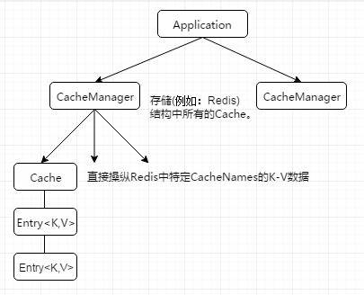

# Spring Cache


## 1、简介

**spring cache 模型**



* Spring 从 3.1 开始定义了 org.springframework.cache.Cache 和 org.springframework.cache.CacheManager 接口来统一不同的缓存技术；并支持使用 JCache（JSR-107）注解简化我们开发；

* Cache 接口为缓存的组件规范定义，包含缓存的各种操作集合；Cache 接 口 下 Spring 提 供 了 各 种 xxxCache 的 实 现 ； 如 **RedisCache** ， EhCacheCache , ConcurrentMapCache 等；
* CacheManager接口管理各缓存组件 
* 使用 Spring 缓存抽象时我们需要关注以下两点
  * 1、确定方法需要被缓存以及他们的缓存策略
  * 2、从缓存中读取之前缓存存储的数据

| 接口         | 作用                                  |
| ------------ | ------------------------------------- |
| Cache        | 缓存接口，定义缓存操作                |
| CacheManager | 缓存管理器，管理各种缓存（Cache）组件 |


## 2，基本概念


每个 CacheManager 就是一个缓存组件，CacheManager 下有多个Cache，每个 Cache 就是一个数据的分区，Cache 包含对这些数据的操作。

## 3、注解

| 注解           | 作用                                                         |
| -------------- | ------------------------------------------------------------ |
| @EnableCaching | 位于主启动类，开启基于注解的缓存                             |
| @Cacheable     | 主要针对方法配置，能根据方法的请求参数对其结果缓存           |
| @CacheEvict    | 清空缓存，对应一致性问题的**失效模式**                       |
| @CachePut      | 保证方法被调用，又希望结果被缓存，对应一致性问题的**双写模式** |
| @Caching       | 包含多个操作                                                 |

****

**@Cacheable**

>   表名修饰的方法返回值需要缓存。方法有缓存走缓存，无缓存则执行方法并将结果缓存（aop实现）
>
>   那么缓存在哪个分区（数据的逻辑归类，如是菜单相关数据或商品相关数据等待）？
>
>   缓存数据的key是什么？
>
>   ****
>
>   **Cacheable 属性**
>
>   *   value：缓存位置的名称（数据分区，如果是使用 EhCache 就是 Cache 的名字，即 xml 配置文件中 Cache 的名字），不能位空，指明将值缓存在哪个 Cache 中。
>   *   key：缓存的key，就如 map 中的 key，默认方法的所有参数进行组合。支持 spel 表达式。

****

**@CachePut**

>   缓存双写模式。与 @Cacheable 不同，@CachePut 会先执行方法，后把方法的返回值进行缓存，即更新缓存。其他支持的属性和用法和 @Cacheable 一致。

****

**@CacheEvict**

>   清空缓存，对应一致性问题的**失效模式**。
>
>   **Cacheable 属性**
>
>   *   value：缓存位置名称
>   *   key：缓存的key
>   *   condition：触发条件
>   *   allEnties：true 表示清除所有缓存，默认false
>
>   同 @Cacheable

### 3.1、Cacheable 属性参数

> 为了好理解 @Cacheabl e的 value 参数理解为 redis 中 hset key字段, 而 @Cacheable 的 key 参数相当是 hset 的 field字段, 最后 @Cacheable 注解所在的函数返回值是 hset 命令的 value 字段。
>

| 属性                    | 作用                                                         | 案例                                                         |
| ----------------------- | ------------------------------------------------------------ | ------------------------------------------------------------ |
| value                   | 缓存位置的名称（数据分区），必须指定至少一个。是数组。       | @Cacheable(value="mycache")<br />@Cacheable(value={"mycache1","mycache2"}) |
| key                     | 缓存的key，支持SpEL表达式，缺省按照方法的所有参数进行组合。  | @Cacheable(value="mycahe", key="#root.method.name")          |
| condition               | 缓存的条件，可以为空，使用spEL表达式，返回true/false，只用为true才缓存。在方法调用之前之后都能判断。 | @Cacheable（valeu="xx",condition="#username.length()>2")     |
| allEntires(@CacheEvict) | 是否清空所有缓存内容，缺省为false，如果指定为true，则方法调用后立即清除所有缓存 | @CahceEvict(value="testcache", allEntries=true)              |
| beforeInvoation         |                                                              |                                                              |
| unless                  |                                                              |                                                              |
|                         |                                                              |                                                              |

### 3.2、spel 表达式语法

**Cache SpEL available metadata**

| 名字         | 位置              | 描述                       | 示例               |
| ------------ | ----------------- | -------------------------- | ------------------ |
| methodName   | root object       | 当前被调用的方法名         | #root.menthodName  |
| method       | root object       | 当前被调用的方法           | #root.menthod.name |
| targer       | root object       | 当前被调用的目标对象       | #root.target       |
| targerClass  | root object       | 当前被调用的目标对象类     | #root.targetClass  |
| args         | root object       | 当前被调用的方法的参数列表 | #root.args[0]      |
| caches       | root object       |                            |                    |
| argumentname | evalution context | 方法参数的名字【我推荐】   | #参数名            |
| result       | evalution context | 方法执行后的返回值         | #result            |
|              |                   |                            |                    |


## 4、使用

redis 缓存为例。

### 4.1 、引入依赖

```xml
<!-- redis -->
<dependency>
    <groupId>org.springframework.boot</groupId>
    <artifactId>spring-boot-starter-data-redis</artifactId>
    <version>${redis.version}</version>
</dependency>

<!-- spring-cache -->
<dependency>
    <groupId>org.springframework.boot</groupId>
    <artifactId>spring-boot-starter-cache</artifactId>
</dependency>
```

### 4.2、配置

```properties
# redis: 单个节点
spring.redis.host=127.0.0.1
spring.redis.port=6379

# spring cache
# springcache 类型：redis
spring.cache.type=redis
# 指定缓存的生存时间
spring.cache.redis.time-to-live=3600000
# 给缓存key加前缀，用于区分是缓存：推荐不加
#spring.cache.redis.key-prefix=CACHE_
# 是否使用前缀：推荐使用-> 采用注解的value属性值
spring.cache.redis.use-key-prefix=true
# 是否缓存null值：解决缓存穿透问题
spring.cache.redis.cache-null-values=true
```

### 4.3、补充

**@Cacheable默认行为**

* cache有，方法不调用
* key是默认生成的：缓存名 ::simplekey::[]
* 缓存的value值默认使用jdk序列化（不通用）
* 默认生成时间 -1（存储数据一致性问题）

**修改**

* 指定缓存的存活时间

* json保存

### 4.4、自定义配置

​		如果需要改变springcache的默认配置，如key的String序列化，value值的json格式保存。就必须自定义配置

**原理**：

​		源码：CacheAutoConfiguration自动配置导入到  --> RealisCacheConfiguration。所以想要改变缓存的配置，只需要给容器中放一个CacheAutoConfiguration配置类即可是org.springframework.data.redis.cache.RedisCacheConfiguration包下的

```java
@Configuration
@EnableCaching // 开启缓存功能
@EnableConfigurationProperties(CacheProperties.class) //将配置文件中所有的配置都生效 ,CacheProperties交给容器,不然ttl等不生效
public class MyCacheConfig {
    @Bean
    RedisCacheConfiguration redisCacheConfiguration(CacheProperties cacheProperties) {
        // 1, 通过默认配置，在默认配置的基础上改
        RedisCacheConfiguration config = RedisCacheConfiguration.defaultCacheConfig();
        
        /*** 注意：每次配置都会产生新的一个配置类对象**/
        // 2,key 使用String序列化
        config = config.serializeKeysWith(RedisSerializationContext.SerializationPair.fromSerializer(new StringRedisSerializer()));
        // 3,value 使用json序列化(Generixxx代表兼容各种类型，内部时泛型)
        config = config.serializeValuesWith(RedisSerializationContext.SerializationPair.fromSerializer(new GenericJackson2JsonRedisSerializer()));

        CacheProperties.Redis redisProperties = cacheProperties.getRedis();
        //将配置文件中所有的配置都生效
        if (redisProperties.getTimeToLive() != null) {
            config = config.entryTtl(redisProperties.getTimeToLive());
        }
        if (redisProperties.getKeyPrefix() != null) {
            // 过期 config = config.prefixKeysWith(redisProperties.getKeyPrefix());
            config = config.prefixCacheNameWith(redisProperties.getKeyPrefix());
        }
        if (!redisProperties.isCacheNullValues()) {
            config = config.disableCachingNullValues();
        }
        if (!redisProperties.isUseKeyPrefix()) {
            config = config.disableKeyPrefix();
        }
        return config;
    }
}
```

