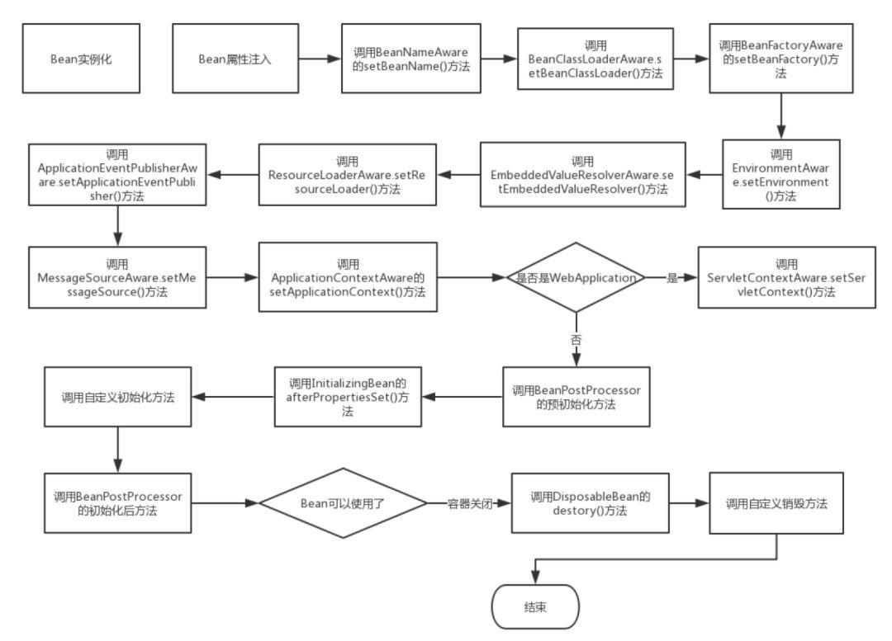
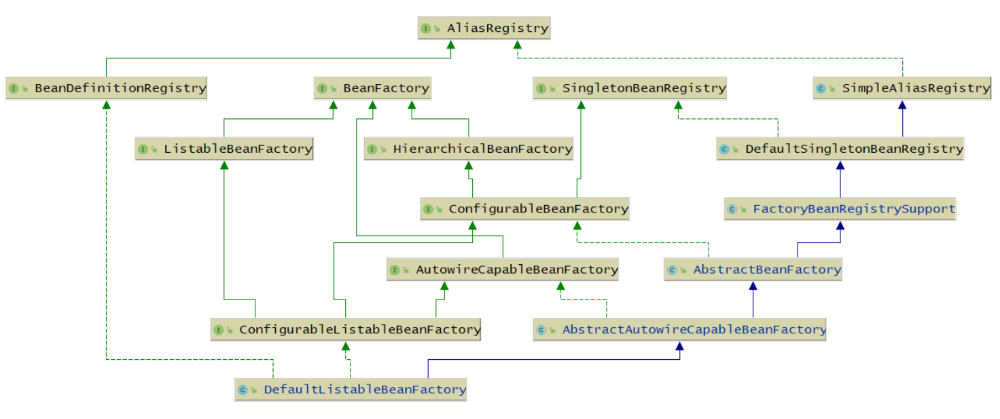

# Spring-01源码分析-spring过程&核心概念

## 1. 简介

>   使用spring入门代码：
>
>   ```java
>   ClassPathXmlApplicationContext context = new ClassPathXmlApplicationContext("spring.xml");
>   UserService userService = (UserService) context.getBean("userService");
>   userService.test();
>   ```
>
>   这三行代码做了什么，比如

1.   第一行代码，会构造一个ClassPathXmlApplicationContext对象，该对象是如何调用UserService的构造方法去实例一个对象的。
2.    第二行代码，会调用ClassPathXmlApplicationContext的getBean方法，会得到 一个UserService对象，getBean()是如何实现的？返回的UserService对象和我们自己直接new的UserService对象有区别吗？
3.   .第三行代码，就是简单的调用UserService的test()方法

### 1.1 JavaConfig

>   用ClassPathXmlApplicationContext其实已经过时了, AnnotationConfigApplicationContext的用法和ClassPathXmlApplicationContext是非常类似的，只不过需要传入的是一个class，而不是 一个xml文件。原理都一样，都是获取包路径
>
>   **注：**Spring MVC创建的是XmlWebApplicationContext，SpringBoot创建的是AnnotationConfigApplicationContext

**spring.xml**

```xml
<context:component-scan base-package="com.demo"/>
<bean id="userService" class="com.demo.service.UserService"/>
```

**AppConfig.java**

```java
ComponentScan("com.demo")
public class AppConfig {
    @Bean
    public UserService userService(){
    return new UserService();
	}
}
```


### 1.2 Spring 创建bean对象

#### 1.2.1 spring启动过程

>   调用getBean()就会去创建对象（此处不严谨，getBean可能也不会去创建对象)。在spring中肯定是根据某个来创建对象的。
>
>   当我们调用context.getBean("userService")时，就会去创建一个对象.

```java
AnnotationConfigApplicationContext context = new AnnotationConfigApplicationContext(AppConfig.class);
UserService userService = (UserService) context.getBean("userService");
userService.test();
```

**1. 解析AppConfig.class，得到扫描路径**

**2. 遍历扫描路径下的所有Java文件，如果发现某个类上存在@Component、 @Service等注解，记录下来保存到BeanDefinitionMap**

**3.  Spring会根据某个规则生成当前类对应的beanName，作为key存入Map，当前类作为value**

#### 1.2.2 Bean的创建过程

>   1.   实例化前-InstantiationAwareBeanPostProcessor：在根据BeanDefinition生成对象之前，spring提供的扩展点，执行其中的beforeXxx方法。
>   2.   实例化-创建bean对象：利用该类的构造方法来实例化得到一个对象(推断构造方法)或者工厂方法创建对象
>   3.   BeanDefinition的后置处理-BeanDefinitionPostProcessor：找到注入点@Autoware。
>   4.   实例化后-InstantiationAwareBeanPostProcessor：同实例化前的接口，执行的是另外一个方法afterXxx
>   5.   依赖注入：Spring会判断该对象中是否存在被@Autowired注解了的属性，有进行1步骤然后注入。
>   6.   属性处理-InstantiationAwareBeanPostProcessor的另外方法：可以自己处理@Autowired、@Resource、@Value等注解或者属性注入。
>   3.   执行Aware：Spring会判断该对象是否实现了Aware接口（类.class.isAssignableFrom(clazz) 或者 instanceof判断），那Spring就会调用这些方法并传入相应的参数，我们就可以得到某些参数了。
>        1.   BeanNameAware接口（可以获取beanName）
>        2.   BeanClassLoaderAware接口（可以获取类加载器）
>        3.   BeanFactoryAware接口（可以获取BeanFactory）
>        3.   ApplicationContextAware接口（获取ApplicationContext）
>   8.   初始化前-@PostConstruct注解和BeanPostProcessor接口： Aware回调后，Spring会判断该对象中是否存在某个方法被@PostConstruct注解 了，如果存在，Spring会调用当前对象的此方法；....。
>   9.   初始化-实现InitializingBean接口或者@InitMethod注解：Spring会判断该对象是否实现了InitializingBean接口，springg就会调用当前对象中的afterPropertiesSet()完成初始化；spring也会判断是否有该注解。
>   6.   初始化后-aop：Spring会判断当前对象需不需要进行AOP，否Bean就创建完了，是则会进行动态代理并生成一个代理对象做为Bean



#### 1.2.3 Bean创建之后

>   spring创建一个bean对象之后，对象如何保存，有如何被使用的。
>
>   1.   是单例Bean：那么会把该Bean对象存入一个Map，Map的key为beanName，value为Bean对象。
>   2.   原型Bean：后续没有其他动作，不会存入一个Map，下次 getBean时会再次执行上述创建过程，得到一个新的Bean对象。


### 1.3 推断构造方法

>   Spring创建Bean，需要利用该类的构造方法来实例化得到一个对 象，但是如果一个类存在多个构造方法，spring如何决定用哪个？

**1. 只有一个构造方法：**

如果一个类只存在一个构造方法，不管该构造方法是无参还是有参构造方法，Spring都会用这个构造方法，构造方法的参数也是spring注入的。

**2. 存在多个构造方法：**

>   a. 存在一个无参的构造方法，那么Spring就会用 这个无参的构造方法
>
>   b. 不存在一个无参的构造方法，那么Spring就会报错

**基本思想就是**

>   spring能够知道使用哪个构造方法，或者说没得选择只有这个。可以在构造方法上使用@Autowired告诉spring使用该构造方法
>
>   确定用哪个构造方法，确定入参的Bean对象，这个过程就叫做推断构造方法。


## 2，手写spring

>   spring是如何知道加载哪些类，并且创建一个对象，并且将对象保存到spring容器中；以及如何实现依赖注入。手写spring了解spring的启动过程。

### 2.1 手写配置类

>   spring 需要包的扫描路径。在spring.xml中有：
>
>   ```xml
>   <context:component-scan base-package="com.demo"/>
>   ```
>
>   在JavaConfig中使用配置类的方式

1.   创建@ComponentScan，@Autowired等注解，以及bean的后置处理器和aware接口
2.   创建 BeanDefinition
3.   创建配置类指定包扫描路径（myspring得到包的path路径，通过path路径加载类）

```java
@Retention(RetentionPolicy.RUNTIME)
@Target(ElementType.TYPE)
public @interface ComponentScan {
    String value() default "";
}
// ------------------------------
@Retention(RetentionPolicy.RUNTIME)
@Target(ElementType.TYPE)
public @interface Component {
    String value() default "";
}

// ------------------------------
@Retention(RetentionPolicy.RUNTIME)
@Target(ElementType.TYPE)
public @interface Scope {

    String value() default "";
}

// ------------------------------
@ComponentScan("com.pack.service")
public class AppConfig {
    
}

// ------------------------------
@Data
public class BeanDefinition {
    private Class type;
    private String scope;
    private boolean isLazy;
}

// ------------------------------
public interface BeanPostProcessor {
    default Object postProcessBeforeInitialization(Object bean, String beanName) {
        return bean;
    }

    default Object postProcessAfterInitialization(Object bean, String beanName) {
        return bean;
    }
}

// ----------------------------
public interface InitializingBean {
    void afterPropertiesSet();
}

// ----------------------------

```

### 2.2 手写ApplicationContext工厂类

>   myspring需要保存创建出来的对象，需要一个Map保存bean。
>
>   bean有多种如单例等。
>
>   主要：
>
>   1.   包扫描：scan(configClass)
>
>        1.   通过配置的class对象获取调用getAnnotation(ComponentScan.class)获取注解对象，调用注解属性获取属性的值，从而或去包路径
>
>        2.   类加载器加载包路径 URL resource = classLoader.getResource(path); 通过URL获取文件路径。扫描文件路径
>
>        3.   遍历该目录下的文件，获取类的全限定名称
>
>             ```java
>             // com 应该冲配置类的包路径获取
>             absolutePath = absolutePath.substring(absolutePath.indexOf("com"), absolutePath.indexOf(".class"));
>             absolutePath = absolutePath.replace("\\", ".");
>             ```
>
>        4.   bean定义： beanDefinitionMap.put(beanName, beanDefinition);
>
>   2.   创建bean：createBean(beanName, beanDefinition)
>
>        1.   遍历bean定义Map创建bean对象
>        2.   反射创建对象
>        3.   属性注入
>        4.   bean的aware处理
>        5.   postProcessor处理
>        6.   初始化处理

```java
public class ZhouyuApplicationContext {
    /**
     * 配置类
     */
    private Class configClass;

    /**
     * bean定义
     */
    private Map<String, BeanDefinition> beanDefinitionMap = new HashMap<>();

    /**
     * 单例池
     */
    private Map<String, Object> singletonObjects = new HashMap<>();

    /**
     * bean后置处理列表
     */
    private List<BeanPostProcessor> beanPostProcessorList = new ArrayList<>();

    public ZhouyuApplicationContext(Class<?> configClass) {
        // 赋值配置（包路径信息）
        this.configClass = configClass;
        // 完成包扫描，将bean定义存储在bean定义beanDefinitionMap中
        scan(configClass);
        // 遍历bean定义，创建bean对象，并保存到单例池中
        for (Map.Entry<String, BeanDefinition> entry : beanDefinitionMap.entrySet()) {
            String beanName = entry.getKey();
            BeanDefinition beanDefinition = entry.getValue();
            if (beanDefinition.getScope().equals("singleton")) {

                Object bean = createBean(beanName, beanDefinition);
                singletonObjects.put(beanName, bean);

            }
        }

    }

    private Object createBean(String beanName, BeanDefinition beanDefinition) {
        Class<?> clazz = beanDefinition.getType();
        Object instance = null;
        try {
            // 反射创建对象
            instance = clazz.getConstructor().newInstance();
            // 遍历每个属性，依赖注入
            for (Field field : clazz.getDeclaredFields()) {
                // 被@Autowired修饰的属性，先创建该对象，然后才依赖注入
                if (field.isAnnotationPresent(Autowired.class)) {
                    field.setAccessible(true);
                    field.set(instance, getBean(field.getName()));
                }
            }

            // aware处理
            if (instance instanceof BeanNameAware) {
                ((BeanNameAware)instance).setBeanName(beanName);
            }
            
            // postProcessor处理
            for (BeanPostProcessor beanPostProcessor : beanPostProcessorList) {
                instance = beanPostProcessor.postProcessBeforeInitialization(instance, beanName);
            }
            
            // InitializingBean 初始化处理
            if (instance instanceof InitializingBean) {
                ((InitializingBean)instance).afterPropertiesSet();
            }
            
            // 后置处理
            for (BeanPostProcessor beanPostProcessor : beanPostProcessorList) {
                instance = beanPostProcessor.postProcessAfterInitialization(instance, beanName);
            }

        } catch (InstantiationException | IllegalAccessException | InvocationTargetException | NoSuchMethodException e) {
            e.printStackTrace();
        }
        return instance;
    }


    public Object getBean(String beanName) {

        if (!beanDefinitionMap.containsKey(beanName)) {
            throw new NullPointerException();
        }

        BeanDefinition beanDefinition = beanDefinitionMap.get(beanName);

        if (beanDefinition.getScope().equals("singleton")) {
            Object singletonBean = singletonObjects.get(beanName);
            if (singletonBean == null) {
                singletonBean = createBean(beanName, beanDefinition);
                singletonObjects.put(beanName, singletonBean);
            }
            return singletonBean;
        } else {
            // 原型
            Object prototypeBean = createBean(beanName, beanDefinition);
            return prototypeBean;
        }

    }


    private void  scan(Class<?> configClass) {
        // 判断配置类是否存在注解 @ComponentScan
        if (configClass.isAnnotationPresent(ComponentScan.class)) {
            ComponentScan componentScanAnnotation = configClass.getAnnotation(ComponentScan.class);
            // 调用注解 @ComponentScan的value方法获取包路径
            String path = componentScanAnnotation.value();
            path = path.replace(".", "/");
            // 类加载路径, 获取资源URL
            ClassLoader classLoader = ZhouyuApplicationContext.class.getClassLoader();
            URL resource = classLoader.getResource(path);

            File file = new File(resource.getFile());
            if (file.isDirectory()) {
                for (File f : file.listFiles()) {
                    // 获取类的全限定名称
                    String absolutePath = f.getAbsolutePath();
                    // com 应该冲配置类的包路径获取
                    absolutePath = absolutePath.substring(absolutePath.indexOf("com"), absolutePath.indexOf(".class"));
                    absolutePath = absolutePath.replace("\\", ".");

                    try {
                        Class<?> clazz = classLoader.loadClass(absolutePath);

                        if (clazz.isAnnotationPresent(Component.class)) {
                            // BeanPostProcessor处理，判断该bean是否实现接口BeanPostProcessor，是添加到beanPostProcessorList后置处理列表
                            if (BeanPostProcessor.class.isAssignableFrom(clazz)) {
                                BeanPostProcessor instance = (BeanPostProcessor) clazz.getConstructor().newInstance();
                                beanPostProcessorList.add(instance);
                            }

                            // bean 定义
                            Component componentAnnotation = clazz.getAnnotation(Component.class);
                            String beanName = componentAnnotation.value();
                            if ("".equals(beanName)) {
                                beanName = Introspector.decapitalize(clazz.getSimpleName());
                            }

                            BeanDefinition beanDefinition = new BeanDefinition();
                            beanDefinition.setType(clazz);

                            if (clazz.isAnnotationPresent(Scope.class)) {
                                Scope scopeAnnotation = clazz.getAnnotation(Scope.class);
                                String value = scopeAnnotation.value();
                                beanDefinition.setScope(value);
                            } else {
                                beanDefinition.setScope("singleton");
                            }

                            beanDefinitionMap.put(beanName, beanDefinition);
                        }
                    } catch (ClassNotFoundException
                        | NoSuchMethodException
                        | InvocationTargetException
                        | InstantiationException
                        | IllegalAccessException e) {
                        e.printStackTrace();
                    }
                }
            }
        }
    }
}

```


## 3，spring底层核心架构

>   BeanDefinition表示Bean定义，BeanDefinition中存在很多属性用来描述一个Bean的特点。如：
>
>   *   **class**，表示Bean类型 
>   *   scope，表示Bean作用域，单例或原型等
>   *    lazyInit：表示Bean是否是懒加载
>   *    initMethodName：表示Bean初始化时要执行的方法 
>   *   destroyMethodName：表示Bean销毁时要执行的方法
>   *   ......

### 3.1 编程式定义BeanDefinition

```java
AnnotationConfigApplicationContext context = new AnnotationConfigApplicationContext(AppConfig.class);
// 生成一个BeanDefinition对象，并设置beanClass为User.class，并注册到ApplicationContext中
AbstractBeanDefinition beanDefinition = BeanDefinitionBuilder.genericBeanDefinition().getBeanDefinition();
beanDefinition.setBeanClass(User.class);
context.registerBeanDefinition("user", beanDefinition);

// ----- 其他属性
beanDefinition.setScope("prototype"); // 设置作用域
beanDefinition.setInitMethodName("init"); // 设置初始化方法
beanDefinition.setLazyInit(true); // 设置懒加载
```

​	通过，@Bean，@Component等申明式方式所定义的 Bean，最终都会被Spring解析为对应的BeanDefinition对象


### 3.2 BeanDefinitionReader

>   XmlBeanDefinitionReader，AnnotatedBeanDefinitionReader是BeanDefinition的读取器，spring底层用得比较多。
>
>   **可以直接注册为BeanDefinition对象**，并解析bean的属性

**1. AnnotatedBeanDefinitionReader**

>   能解析的bean的注解：@Conditional，@Scope、@Lazy、@Primary、@DependsOn ...

```java
nnotationConfigApplicationContext context = new AnnotationConfigApplicationContext(AppConfig.class);
AnnotatedBeanDefinitionReader annotatedBeanDefinitionReader = new AnnotatedBeanDefinitionReader(context);
// 将User.class解析为BeanDefinition
annotatedBeanDefinitionReader.register(User.class);
```

### 3.3 ClassPathBeanDefinitionScanner

>   ClassPathBeanDefinitionScanner是扫描器，但是它的作用和BeanDefinitionReader类似，它可以进行扫描，扫描某个包路径，对扫描到的类进行解析，比如：扫描到的类上如果存在@Component 注解，那么就会把这个类解析为一个BeanDefinition。

```java
nnotationConfigApplicationContext context = new AnnotationConfigApplicationContext();
context.refresh();
ClassPathBeanDefinitionScanner scanner = new ClassPathBeanDefinitionScanner(context);
scanner.scan("com.pack");

```


### 3.4 BeanFactory

>   Bean工厂，BeanFactory会负责创建Bean，并且提供获取Bean的 API。
>
>   DefaultListableBeanFactory



### 3.5 ApplicationContext

>   ApplicationContext是个接口，实际上也是一个BeanFactory，不过比BeanFactory 更加强大，比如：
>
>   *   HierarchicalBeanFactory：拥有获取父BeanFactory的功能 
>   *   ListableBeanFactory：拥有获取beanNames的功能
>   *   ResourcePatternResolver：资源加载器，可以一次性获取多个资源（文件资源等等）
>   *   EnvironmentCapable：可以获取运行时环境（没有设置运行时环境功能） 
>   *   **ApplicationEventPublisher**：拥有广播事件的功能（没有添加事件监听器的功能）
>   *   MessageSource：拥有国际化功能


### 3.6 资源加载

>   ApplicationContext还拥有资源加载的功能，比如，可以直接利用ApplicationContext获取某个文 件的内容：

```java
AnnotationConfigApplicationContext context = new AnnotationConfigApplicationContext(AppConfig.class);
Resource resource = context.getResource("file://D:\\xxxx\\com\\zhouyu\\service\\UserService.java");
System.out.println(resource.contentLength());
System.out.println(resource.getFilename());

Resource resource1 = context.getResource("https://www.baidu.com");
System.out.println(resource1.contentLength());
System.out.println(resource1.getURL());

Resource resource2 = context.getResource("classpath:spring.xml");
System.out.println(resource2.contentLength());
System.out.println(resource2.getURL());

// 一次性获取多个
Resource[] resources = context.getResources("classpath:com/zhouyu/*.class");
```


### 3.7 事件发布和监听

#### 3.7.1 定义自定义事件

>   定义一个要发布的事件，extends ApplicationEvent接口
>
>   不需要交给spring，只是告诉事件的类型，不做其他处理

```java
public class SysLogEvent extends ApplicationEvent {
    // 构造方法
    public SysLogEvent(OptLog optLog) {
        super(optLog);
    }
}
```


#### 3.7.2 定义事件监听器

>   监听器需要设值监听的事件类型

```java
@Component
public class SysLogListener {
    // 方法任意
    @EventListener(SysLogEvent.class)
    public void saveLog(SysLogEvent event) {
        OptLog sysLog = (OptLog) event.getSource();
        long id = Thread.currentThread().getId();
        System.out.println("监听到日志操作事件：" + sysLog + " 线程id：" + id);
        //将日志信息保存到数据库...
    }
}

// ---- 或者
@Bean
public ApplicationListener applicationListener() {
    return new ApplicationListener() {
        @Override
        // 事件类型 ApplicationEvent
        public void onApplicationEvent(ApplicationEvent event) {
        System.out.println("接收到了一个事件");
        }
	};
}
```

#### 3.7.3 发布事件

```java
applicationContext.publishEvent(new SysLogEvent(optLog));
```


### 3.8 ，类型转换

>   在Spring源码中(或者工作中)，有可能需要把String转成其他类型（或者一个类型转换为其他类型），所以在Spring源码中提供了一些技术来更方便的做对象的类型转化。


#### 3.8.1 JDK类型转换PropertyEditor

>   PropertyEditor，这其实是JDK中提供的类型转化工具类。但是它的功能有限，它只能将字符串转换为一个Java对象。

**1. 创建类型转换器(属性编辑器)**

>   在类型转换器中实现，类型的转换逻辑。

```java
import java.beans.PropertyEditor;
import java.beans.PropertyEditorSupport;

public class StringToUserPropertyEditor extends PropertyEditorSupport implements PropertyEditor {
    @Override
    public void setAsText(String text) throws IllegalArgumentException {
        User user = new User();
        user.setName(text);
        // 设值value值，外面就可以通过getValue（）获取转换后的对象了
        this.setValue(user);
    }
}
```


**2, 使用类型转换**

```java
public class TestProperty {
    public static void main(String[] args) {
        // new 类型转换器
        StringToUserPropertyEditor propertyEditor = new StringToUserPropertyEditor();
        // 调用转换方法，方法里保存转换后的对象
        propertyEditor.setAsText("yanggy");
        User value = (User) propertyEditor.getValue();
        System.out.println(value);
    }
}
```

#### 3.8.2 spring中使用JDK类型转换

**向Spring中注册PropertyEditor**

>   在属性注入时，只有当双方转换的类型都匹配时才会转换。
>
>   在属性注入时自动转换

```java
@Configuration
public class PropertyConfig {
    @Bean
    public CustomEditorConfigurer customEditorConfigurer() {
        CustomEditorConfigurer customEditorConfigurer = new CustomEditorConfigurer();
        Map<Class<?>, Class<? extends PropertyEditor>> propertyEditorMap = new HashMap<>();
        // User类的类型转换器是StringToUserPropertyEditor
        propertyEditorMap.put(User.class, StringToUserPropertyEditor.class);
        customEditorConfigurer.setCustomEditors(propertyEditorMap);
        return customEditorConfigurer;
    }
}
```

```java
@Component
public class UserService {
    @Value("xxx")
    private User user;
}
```


#### 3.8.3 类型转换服务ConversionService

>   Spring中提供了自己的类型转化服务，它比PropertyEditor更强大。`ConversionService`只是个Service，对于每个类型转换的操作，它并不是最终的操作者，它会将相应操作交给对应类型的转换器。由于业务复杂，对类型转换的要求也不一样，因此spring提供了几个接口来方便自定义转换器。如下：
>
>   ```java
>   DefaultConversionService conversionService = new DefaultConversionService();
>   // 类型转换服务可以添加多个类型转换器，有多种类型的重装方法
>   conversionService.addConverter();
>   ```

#### 3.8.3.1  Converter<S, R>

>   该接口只定义了一个转换方法，两个泛型参数则是需要转换的两个类型。`在单独处理两个类型的转换时这是首选`。但是倘若有同一父类（或接口）的类型需要进行类型转化，为每个类型都写一个Converter显然是十分不理智的。
>
>   ```java
>   // 两个泛型：S-源对象类型，T-转换后对象类型
>   @FunctionalInterface
>   public interface Converter<S, T> {
>   	@Nullable
>   	T convert(S source);
>   }
>   ```


**1，创建Converter实现类**

```java
public class U1ToU2Converter implements Converter<U1, U2> {
    /**
     * @param source 需要转换的源对象
     * @return 转换后的对象
     */
    @Override
    public U2 convert(U1 source) {
        U2 u2 = new U2();
        u2.setId(Integer.parseInt(source.getId()));
        u2.setAge(source.getAge().toString());
        u2.setName(source.getName());
        return u2;
    }
}
```

**2，类型转换服务添加类型转换器**

```java
public static void main(String[] args) {
        DefaultConversionService conversionService = new DefaultConversionService();
        conversionService.addConverter(new U1ToU2Converter());
        U1 u1 = new U1("100", "alice", 21);
        U2 u2 = conversionService.convert(u1, U2.class);
        System.out.println(u2);
 }
```


##### 3.8.3.2 ConverterFactory<S, R>

>   ```java
>   public interface ConverterFactory<S, R> {
>   	<T extends R> Converter<S, T> getConverter(Class<T> targetType);
>   }
>   ```
>
>   我们可以看到，该工厂方法可以生产从S类型到T类型的转换器，而T类型必定继承或实现R类型，我们可以形象地称为“一对多”，因此该接口更适合实现需要转换为同一类型的转换器。


##### 3.8.3.3，GenericConverter

>   有条件的类型转换（直接用ConditionalGenericConverter）
>
>   对于`GenericConverter`，`getConvertibleTypes`方法就返回这个转换器支持的转换类型（一对一，一对多，多对多都可以满足），`convert`方法和以前一样是负责处理具体的转换逻辑。

##### 3.8.3.4，ConditionalGenericConverter

>   如果你觉得对于一个转换器来说只通过判断源类型和目标类型是否一致来决定是否支持转换还不够，Spring还提供了另一个接口`ConditionalGenericConverter`。
>
>   在`matches`方法中就可以在源类型与目标类型已经匹配的基础上再进行判断是否支持转换。Spring官方实现`ConditionalGenericConverter`接口的转换器大多用来处理有集合或数组参与的转换，这其中的`matches`方法就用来判断集合或数组中的元素是否能够成功转换

```java
public class String2UserConverter implements ConditionalGenericConverter {
    /**
     * 类型转换的逻辑
     */
    @Override
    public boolean matches(TypeDescriptor sourceType, TypeDescriptor targetType) {
        // 这个单项转换 string -> user
        return sourceType.getType().equals(String.class) && targetType.getType().equals(User.class);
    }

    /**
     *  转换的类型对（可以有多对）
     */
    @Override
    public Set<ConvertiblePair> getConvertibleTypes() {
        return Collections.singleton(new ConvertiblePair(String.class, User.class));
    }

    /**
     * 类型转换的逻辑
     */
    @Override
    public Object convert(Object source, TypeDescriptor sourceType, TypeDescriptor targetType) {
        User user = new User();
        user.setName((String)source);
        return user;
    }
}
```

**2， 创建类型转换服务，注册类型转换器**

```java
public class TestProperty {
    public static void main(String[] args) {
        DefaultConversionService conversionService = new DefaultConversionService();
        // 类型转换服务注册类型转换器
        conversionService.addConverter(new String2UserConverter());
        User user = conversionService.convert("yangg", User.class);
        System.out.println(user);
    }
}
```


#### 3.8.4 Spring中使用ConversionService

>   如何使用转换器呢，Spring要求我们要把所有需要使用转换器注册到`ConversionService`，这样Spring在遇到类型转换的情况时，会去`ConversionService`中寻找支持的转换器，进行必要的格式转换。
>
>   ConversionServiceFactoryBean
>
>   或ConfigurableConversionService

```java
@Bean
public ConversionServiceFactoryBean conversionService() {
    ConversionServiceFactoryBean conversionServiceFactoryBean = new ConversionServiceFactoryBean();
    conversionServiceFactoryBean.setConverters(Collections.singleton(new StringToUserConverter()));
    return conversionServiceFactoryBean;
}
```


#### 3.8.5 格式化

>   与类型转换器类似可以使用类型转换器？
>
>   转换器提供的功能是一个类型到另一个类型的单向转换，而在web项目中，有些数据是需要经常做双向转换，最常见的就是日期时间了。将请求中一定格式的字符串转换为日期类型，而在返回的相应中将日期类型再做指定格式的格式化，Spring中提供的工具就是`Formatter`接口。
>
>   `Formatter`接口中拥有两个方法，一个是解析字符串的`parse`，一个是将字符串格式化的`print`，两个方法都拥有`Locale`类型的参数，因此还可根据地区来做出相应的定制。

```java
@FunctionalInterface
public interface Printer<T> {
    String print(T object, Locale locale);
}
// -------
@FunctionalInterface
public interface Parser<T> {
    T parse(String text, Locale locale) throws ParseException;
}
// -------
public interface Formatter<T> extends Printer<T>, Parser<T> {
}
```


### 3.9 BeanPostProcessor

>   BeanPostProcess表示Bena的后置处理器，我们可以定义一个或多个BeanPostProcessor。
>
>   一个BeanPostProcessor可以在任意一个Bean的初始化之前以及初始化之后去额外的做一些用户自定义的逻辑。当然，我们可以通过判断beanName来进行针对性处理（针对某个Bean，或某部分Bean）。我们可以通过定义BeanPostProcessor来干涉Spring创建Bean的过程。

```java
@Component
public class MyBeanPostProcessor implements BeanPostProcessor {
    @Override
    public Object postProcessBeforeInitialization(Object bean, String beanName) throws BeansException {
        if ("userService".equals(beanName)) {
            System.out.println("初始化前");
        }
        return bean;
    }
    @Override
    public Object postProcessAfterInitialization(Object bean, String beanName) throws BeansException {
        if ("userService".equals(beanName)) {
            System.out.println("初始化后");
        }
        return bean;
    }
}
```


### 3.10 BeanFactoryPostProcessor

>   BeanFactoryPostProcessor表示Bean工厂的后置处理器，其实和BeanPostProcessor类似，BeanPostProcessor是干涉Bean的创建过程，BeanFactoryPostProcessor是干涉BeanFactory的创 建过程。在postProcessBeanFactory()方法中对BeanFactory进行加工。

```java
@Component
public class MyBeanFactoryPostProcessor implements BeanFactoryPostProcessor {
    @Override
    public void postProcessBeanFactory(ConfigurableListableBeanFactory beanFactory) throws BeansException {
    	System.out.println("加工beanFactory");
    }
}

```


### 3.11 FactoryBean

>   BeanFactory是bean工厂，FactoryBean就是一个bean。
>
>   如果我们想一个 Bean完完全全由我们来创造，也是可以的，比如通过FactoryBean来创建，主要其没有结果bean的生命周期。
>
>   只会经过初始化后（初始化-实现InitializingBean接口springg就会调用当前对象中的afterPropertiesSet()完成初始化），其他Spring的生命周期步骤是不会经过的，比如依赖注入。


### 3.12 ExcludeFilter和IncludeFilter

>   个Filter是Spring扫描过程中用来过滤的。ExcludeFilter表示排除过滤器，IncludeFilter表示包 含过滤器。

```java
@ComponentScan(value = "com.xxx",
	excludeFilters = {@ComponentScan.Filter(
    	type = FilterType.ASSIGNABLE_TYPE,
		classes = UserService.class)})
public class AppConfig {
}
```

```java
@ComponentScan(value = "com.xxx",
    includeFilters = {@ComponentScan.Filter(
    	type = FilterType.ASSIGNABLE_TYPE,
    	classes = UserService.class)})
public class AppConfig {
}
```


### 3.13 MetadataReader、ClassMetadata、 AnnotationMetadata

>   MetadataReader元数据读取器，可以读取一个类从而得到一个类的元数据ClassMetadata，AnnotationMetadata。
>
>   MetadataReader默认实现SimpleMetadataReader

```java
public static void main(String[] args) throws IOException {
        SimpleMetadataReaderFactory simpleMetadataReaderFactory = new SimpleMetadataReaderFactory();
        // 构造一个MetadataReader
        MetadataReader metadataReader = simpleMetadataReaderFactory.getMetadataReader("com.xxx.service.UserService");
        // 得到一个ClassMetadata，并获取了类名
        ClassMetadata classMetadata = metadataReader.getClassMetadata();
        System.out.println(classMetadata.getClassName());
        // 获取一个AnnotationMetadata，并获取类上的注解信息
        AnnotationMetadata annotationMetadata = metadataReader.getAnnotationMetadata();
        for (String annotationType : annotationMetadata.getAnnotationTypes()) {
            System.out.println(annotationType);
        }
    }
```


#### 3.13.1 MetadataReader

>   MetadataReader表示类的元数据读取器，主要包含了一个AnnotationMetadata。

1.   获取类的名字、
2.   获取父类的名字 
3.    获取所实现的所有接口名 
4.   获取所有内部类的名字
5.   判断是不是抽象类
6.   判断是不是接口 
7.    判断是不是一个注解
8.   获取拥有某个注解的方法集合 
9.   获取类上添加的所有注解信息
10.    获取类上添加的所有注解类型集合

