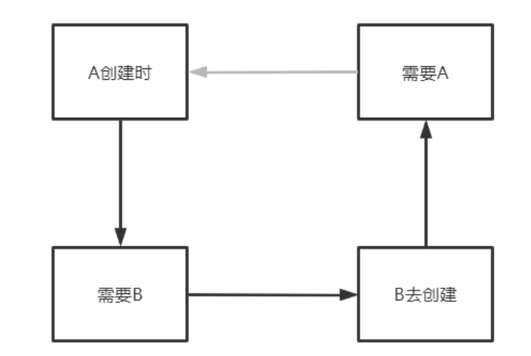
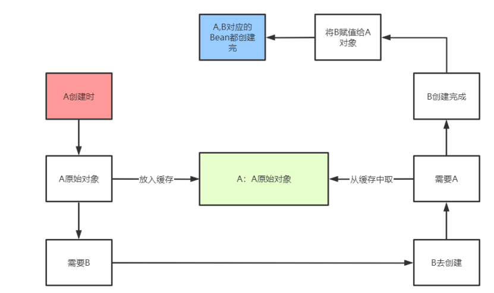

# spring循环依赖

>   循环依赖就是A对象依赖了B对象，B对象依赖了A对象。
>
>   如果不考虑Spring，循环依赖并不是问题，因为对象之间相互依赖是很正常的事情。
>
>   在spring生命周期，创建对象进行属性注入时可能会出现问题。
>
>   `ABean创建-->依赖了B属性-->触发BBean创建--->B依赖了A属性--->需要ABean（但ABean还在 创建过程中）`从而导致ABean创建不出来，BBean也创建不出来。
>
>   解决方案：三级缓存

```java
// A依赖了B
class A{
	public B b;
}
// B依赖了A
class B{
	public A a;
}
```


## 1，三级缓存

>   三级缓存是通用的叫法：
>
>   *    一级缓存为（单例池-完整bean对象）：singletonObjects 
>   *   二级缓存为（bean生命周期未走完-不完整的早期bean）：earlySingletonObjects
>   *    三级缓存为（缓存ObjectFactory-对象工厂-用来创建早期bean的）：singletonFactories

### 1.1 循环依赖解决思路

**出现循环依赖的原因：**`A创建时--->需要B---->B去创建--->需要A，从而产生了循环`



### 1.2 打破循环依赖

>   加个中间缓存，在创建B时需要A，把A的半成品给B即可，这个时候B就创建完成了。
>
>   注意：B在创建的过程中也会把B的早期对象存入缓存中，图中没显示。



​		从上面这个分析过程中可以得出，只需要一个缓存就能解决循环依赖了，那么为什么Spring中还需要 singletonFactories呢？原因在于此时存入的A早期对象不一定时最终的，可能存在代理。如下情况：

​		如果A的原始对象注入给B的属性之后，A的原始对象进行了 AOP产生了一个代理对象，此时就会出现，对于A而言，它的Bean对象其实应该是AOP之后的代理对 象，而B的a属性对应的并不是AOP之后的代理对象，这就产生了冲突。`B依赖的A和最终的A不是同一个对象。`

 		IOC和AOP如何共存，利用了第三级缓存singletonFactories。

​		`存入二级缓存的时aop的对象不就好了吗，singletonFactories就是创建aop代理对象的`

>   ​		在bean的生命周期中， `生成完原始对象之后`，就会构造一个ObjectFactory存入singletonFactories中。
>
>   ​	这个ObjectFactory就是上文说的labmda表达式，中间有getEarlyBeanReference方法，注意存入singletonFactories时并不会执行lambda表达式，也就是不会执行 getEarlyBeanReference方法。
>
>   ​		 从singletonFactories根据beanName得到一个ObjectFactory，然后执行 ObjectFactory，也就是执行getEarlyBeanReference方法，此时会得到一个A原始对象经过AOP之 后的代理对象，然后把该代理对象放入earlySingletonObjects中，注意此时并没有把代理对象放入 singletonObjects中。


### 1.3 总结

1.   singletonObjects：缓存经过了完整生命周期的bean
2.   earlySingletonObjects：缓存未经过完整生命周期的bean，如果某个bean出现了循环依赖， 就会提前把这个暂时未经过完整生命周期的bean放入earlySingletonObjects中，这个bean如果要经过AOP，那么就会把代理对象放入earlySingletonObjects中，否则就是把原始对象放入 earlySingletonObjects，但是不管怎么样，就是是代理对象，代理对象所代理的原始对象也是没有经过完整生命周期的，所以放入earlySingletonObjects我们就可以统一认为是未经过完整生命周期的bean。

3.   singletonFactories：缓存的是一个ObjectFactory，也就是一个Lambda表达式。在每个Bean的生成过程中，经过实例化得到一个原始对象后，都会提前基于原始对象暴露一个Lambda表达式，并保存到三级缓存中，这个Lambda表达式可能用到，也可能用不到，如果当前Bean没有出现循环依赖，那么这个Lambda表达式没用，当前bean按照自己的生命周期正常执行，执行完后 直接把当前bean放入singletonObjects中，如果当前bean在依赖注入时发现出现了循环依赖 （当前正在创建的bean被其他bean依赖了），则从三级缓存中拿到Lambda表达式，并执行 Lambda表达式得到一个对象，并把得到的对象放入二级缓存（(如果当前Bean需要AOP，那么 执行lambda表达式，得到就是对应的代理对象，如果无需AOP，则直接得到一个原始对象)）。
4.    其实还要一个缓存，就是earlyProxyReferences，它用来记录某个原始对象是否进行过AOP 了。

