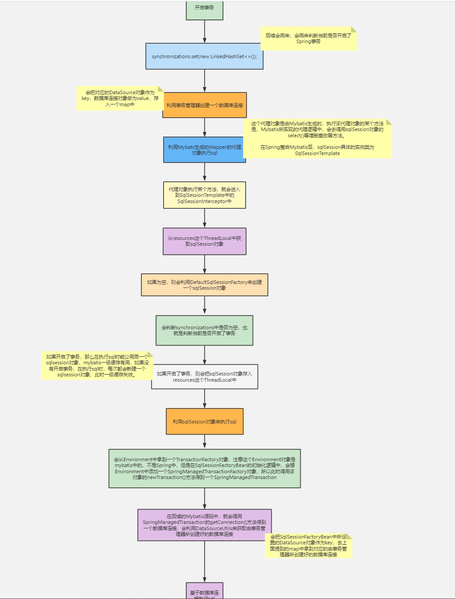

# spring整合myabtis

**整合思路：**

>   整合的核心思想就是把其他框架所产生的对象交给Spring容器，让其成为Bean。
>
>   通常我们可以采用@Import注解或者META-INF/spring.factories。然而接口或者说代码对象如何交给spring呢？mybatis自己可以产生dao的接口实现类，并且这些接口的代理实现都是动态产生的，起码使用时不知道有哪些实现，如何将代理对象交给spring就是整合的关键。
>
>   因为无法：@Import注解或者META-INF/spring.factories

## 1，手写spring-mybatis整合

**传统使用mybatis**

```java
InputStream inputStream = Resources.getResourceAsStream("mybatis.xml");
SqlSessionFactory sqlSessionFactory = new SqlSessionFactoryBuilder().build(inputStream);
SqlSession sqlSession = sqlSessionFactory.openSession();
Object res = sqlSession.selectOne("sql");
```

### 1.1 创建会话工厂

>   用上面代码我们知道，使用mybatis需要产生一个重量级对象sqlSession，通过它获取与mysql的连接会话。
>
>   所以第一步将SqlSessionFactory交给spring

**配置类：通过在main方法注入**

```java
@ComponentScan("com.xxx")
@MyMapperScan("com.xxx.mapper")
public class AppConfig {

	@Bean
	public SqlSessionFactory sqlSessionFactory() throws IOException {
		InputStream inputStream = Resources.getResourceAsStream("mybatis.xml");
		SqlSessionFactory sqlSessionFactory = new SqlSessionFactoryBuilder().build(inputStream);
		return sqlSessionFactory;
	}
}
```

**main：**

>   给外界使用则采用@Import注解或者META-INF/spring.factories注册配置类，使之成为starter。

```java
public static void main(String[] args) {

    AnnotationConfigApplicationContext context = new AnnotationConfigApplicationContext();
    context.register(AppConfig.class);
    context.refresh();
	// ....
}
```


### 1.2 注解和mapper接口

```java
/**
 * 扫描注解
 */
@Retention(RetentionPolicy.RUNTIME)
@Target(ElementType.TYPE)
@Import(MybatisImportBeanDefinitionRegistrar.class)
public @interface MyMapperScan {

    String value();
}
```

```java
public interface UserMapper {
    void selectById(String id);
}
```

### 1.3 mapper接口->bean

>   我们知道接口是无法实例化的，所以不能直接成为一个bean对象，但是其可以成为一个beanDefinition。
>
>   所以对应mapper接口，不能直接@Component，这样是得不到想要的代理对象的。
>
>   第一步：mapper接口 -> beanDefinition

```java
@Component
public class MybatisImportBeanDefinitionRegistrar implements ImportBeanDefinitionRegistrar {

    @Override
    public void registerBeanDefinitions(AnnotationMetadata importingClassMetadata, BeanDefinitionRegistry registry,
        BeanNameGenerator importBeanNameGenerator) {
        // 通过注解元数据对象去获取其扫描包路径下的mybatis扫描注解
        Map<String, Object> annotationAttributes = importingClassMetadata
            .getAnnotationAttributes(MyMapperScan.class.getName());
        if (annotationAttributes != null) {
            // 获取MyMapperScan的value属性值，即mapper路径
            String path = (String) annotationAttributes.get("value");
            // new BeanDefinitionScanner用于扫描包路径获取BeanDefinition
            MybatisClassPathBeanDefinitionScanner scanner = new MybatisClassPathBeanDefinitionScanner(registry);
            // 是否成为beanDefinition的一个过滤器
            scanner.addIncludeFilter((metadataReader, metadataReaderFactory) -> true);
            scanner.scan(path);  
        }
    }
}
```


### 1.4 自定义BeanDefinition扫描器

>   为了方便将mapper接口->BeanDefinition需要一个BeanDefinitionScanner。

```java
public class MybatisClassPathBeanDefinitionScanner extends ClassPathBeanDefinitionScanner {

    public MybatisClassPathBeanDefinitionScanner(BeanDefinitionRegistry registry) {
        super(registry);
    }

    @Override
    protected Set<BeanDefinitionHolder> doScan(String... basePackages) {
        Set<BeanDefinitionHolder> beanDefinitionHolders = super.doScan(basePackages);
        // 遍历每个beanDefinitionHolder获取beanDefinition
        for (BeanDefinitionHolder beanDefinitionHolder : beanDefinitionHolders) {
            BeanDefinition beanDefinition = beanDefinitionHolder.getBeanDefinition();

            beanDefinition.getConstructorArgumentValues().addGenericArgumentValue(beanDefinition.getBeanClassName());
            beanDefinition.setBeanClassName(MybatisFactoryBean.class.getName());
        }
        
        return beanDefinitionHolders;
    }

    /**
     * 判断是否是一个候选的Component
     * 这里是接口才能成为
     */
    @Override
    protected boolean isCandidateComponent(AnnotatedBeanDefinition beanDefinition) {
        return beanDefinition.getMetadata().isInterface();
    }
}
```


### 1.5 MybatisFactoryBean产生代理对象bean

>   通过FactoryBean间接让一个代理对象成为一个bean。

```java
/**
 * 通过FactoryBean间接让一个代理对象成为一个bean
 * 通用性：通过代码交给spring，所有在这里不使用注解(只能生成一个bean)交给spring
 */
public class MybatisFactoryBean implements FactoryBean<Object> {

    private Class<?> mapperInterface;

    private SqlSession sqlSession;

    public MybatisFactoryBean(Class<?> mapperInterface) {
        this.mapperInterface = mapperInterface;
    }

    @Autowired
    public void setSqlSession(SqlSessionFactory sqlSessionFactory) {
        sqlSessionFactory.getConfiguration().addMapper(mapperInterface);
        this.sqlSession = sqlSessionFactory.openSession();
    }

    @Override
    public Object getObject() throws Exception {
        return sqlSession.getMapper(mapperInterface);
    }

    @Override
    public Class<?> getObjectType() {
        return mapperInterface;
    }
}
```

## 2，Mybatis-Spring底层源码执行流程

>   基于Mybatis-Spring 2.0.6版本。

1.   通过@MapperScan导入了MapperScannerRegistrar类
     1.   MapperScannerRegistrar用户将接口->beanDefinition
     2.   @MapperScan可以或path路径交给MapperScannerRegistrar
2.   MapperScannerRegistrar类实现了ImportBeanDefinitionRegistrar接口，在spring启动时会调用registerBeanDefinitions方法，在该方法中注册我们的beanDefinition
3.   **在registerBeanDefinitions方法中注册一个MapperScannerConfigurer类型的BeanDefinition**（还没有扫描mapper接口）

4.   MapperScannerConfigurer实现了BeanDefinitionRegistryPostProcessor接口，所以Spring在启动过程中时会调用它的postProcessBeanDefinitionRegistry()方法。
5.   在postProcessBeanDefinitionRegistry方法中会生成一个`ClassPathMapperScanner对象`，然后进行扫描。

6.   扫描并且得到对应的BeanDefinition。
7.   把扫描得到的BeanDefinition进行修改（接口不可能实例化），把BeanClass修改为MapperFactoryBean，把AutowireMode修改为byType

8.   扫描完成后，Spring就会基于BeanDefinition去创建Bean了，相当于每个Mapper对应一个FactoryBean。
9.   在MapperFactoryBean中的getObject方法中，调用了getSqlSession()去得到一个sqlSession对象，然后根据对应的Mapper接口生成一个Mapper接口代理对象，这个代理对象就成为Spring容器中的Bean。
10.   sqlSession对象是Mybatis中的，一个sqlSession对象需SqlSessionFactory来产生。
11.   MapperFactoryBean的AutowireMode为byType，所以Spring会自动调用set方法，有两个set方法，一个setSqlSessionFactory，一个setSqlSessionTemplate，而这两个方法执行的前提是根据方法参数类型能找到对应的bean，所以Spring容器中要存在SqlSessionFactory类型的bean或者SqlSessionTemplate类型的bean。
12.   如果你定义的是一个SqlSessionFactory类型的bean，那么最终也会被包装为一个SqlSessionTemplate对象，并且赋值给sqlSession属性
13.   而在SqlSessionTemplate类中就存在一个getMapper方法，这个方法中就产生一个Mapper接口代理对象
14.   到时候，当执行该代理对象的某个方法时，就会进入到Mybatis框架的底层执行流程

图：



## 3，Mybatis后一级缓存失效问题

>   Mybatis中的一级缓存是基于SqlSession来实现的，如果使用的是同一个SqlSession对象，那么就能利用到一级缓存。
>
>   然而，一般情况下没执行一个sql时都会新生成一个SqlSession对象来执行该sql，这就是我们说的一级缓存失效。因为一个sql就是一个单独事务了。
>
>   所以保证同一个sqlSession要加**@Transactional**
>
>   实际上Spring整合Mybatis后一级缓存失效并**不是问题**，是正常的实现，因为，一个方法如果没有开启Spring事务，那么在执行sql时候，那就是每个sql单独一个事务来执行，也就是单独一个SqlSession对象来执行该sql，如果开启了Spring事务，那就是多个sql属于同一个事务，那自然就应该用一个SqlSession来执行这多个sql。所以，在没有开启Spring事务的时候，SqlSession的一级缓存并不是**失效**了，而是存在的生命周期太短了（执行完一个sql后就被销毁了，下一个sql执行时又是一个新的SqlSession了）