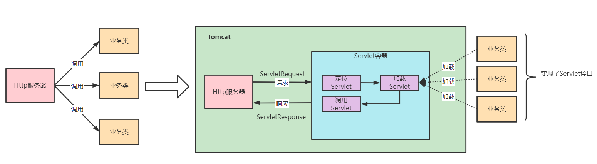
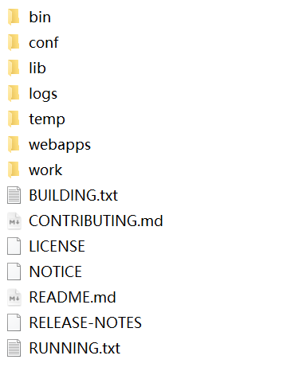
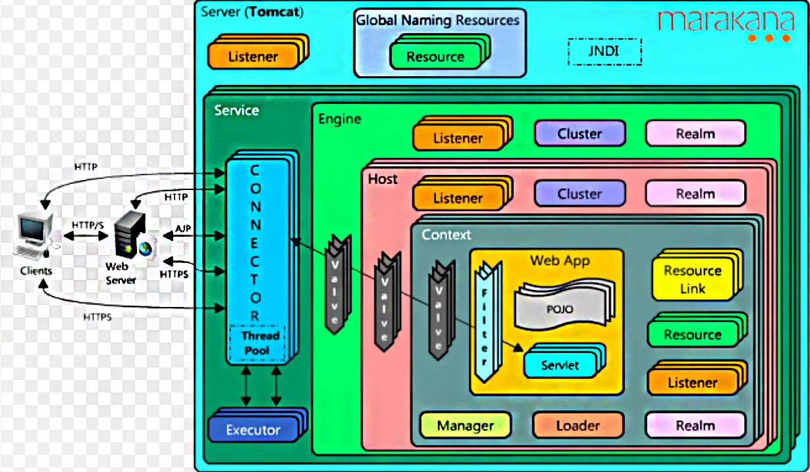
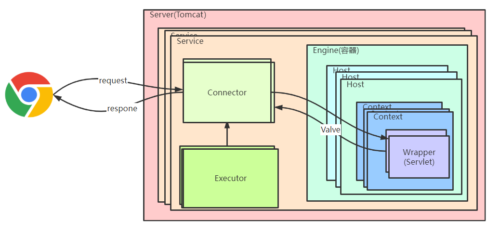
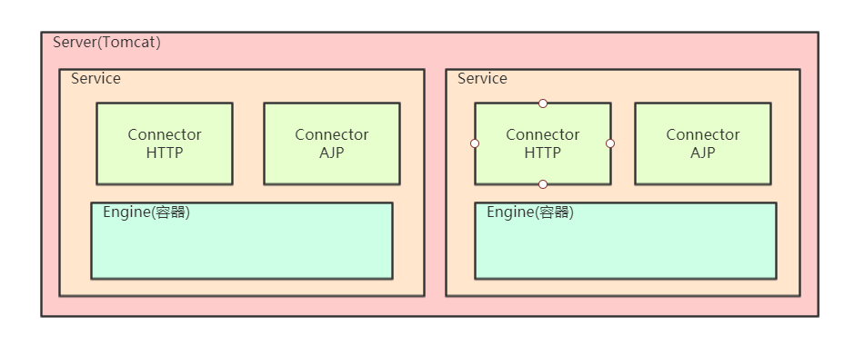

# Tomcat

## 1，Tomcat介绍

​		tomcat是一个开源的web服务器。

**核心**：http服务器 + servlet容器（servlet就是一个个程序员编写的处理业务功能的servlet实例）



**如何实现url请求和servlet业务类的映射呢？**

通过配置，一个servlet就映射一个url。

### 1.1 tomcat目录结构



**bin**

>   bin目录主要是用来存放tomcat脚本文件。
>
>   *   启动脚本：startup.sh，startup.bat
>   *   关闭脚本：shutdown.sh，shutdown.bat

****

**conf**

>   该目录存放tomcat配置文件
>
>   *   catalina.policy: Tomcat安全策略文件,控制JVM相关权限
>   *   catalina.properties : Tomcat Catalina行为控制配置文件,比如Common ClassLoader
>   *   logging.properties  : Tomcat日志配置文件（控制台乱码可修改其编码）
>   *   <font color="red">server.xml : Tomcat Server配置文件</font>
>   *   context.xml :全局Context配置文件
>   *   tomcat-users.xml : Tomcat角色配置文件
>   *   web.xml : Servlet标准的web.xml部署文件, Tomcat默认实现部分配置入内
>      *   org.apache.catalina.servlets.DefaultServlet
>
>      *   org.apache.jasper.servlet.JspServlet

****

**lib**

>   公共类库

****

**logs**

>   tomcat在运行过程中产生的日志文件

****

**webapps**

>   用来存放应用程序（war包），当tomcat启动时会去加载webapps目录下的应用程序

****

**work**

>   用来存放tomcat在运行时的编译后文件，例如：JSP编译后的文件

### 1.2 部署和启动tomcat

#### 方式 1

**将项目（war）包拷贝到webapps目录下（tomcat默认指定的应用base目录就是webapps）。**

​		原因在于tomcat做了如下配置，但是这么做web应用和tomcat是放在一起，如果需要tomcat安装目录与web应用在不同的目录需要使用其他方式。

**appBase可以使用绝对路径**

```xml
// 由于server.xml的Host默认指定appBase
// autoDeploy：热部署，不需要启动就可以部署新的应用
// unpackWARs：war包解压
<Host name="localhost"  appBase="webapps"
            unpackWARs="true" autoDeploy="true">
    <Valve className="org.apache.catalina.valves.AccessLogValve" directory="logs"
           prefix="localhost_access_log" suffix=".txt"
           pattern="%h %l %u %t &quot;%r&quot; %s %b" />

</Host>
```

****

#### 方式 2

**server.xml 种Host标签下配置Context**

```xml
<Host name="localhost"  appBase="webapps"
            unpackWARs="true" autoDeploy="true">
    <Valve className="org.apache.catalina.valves.AccessLogValve" directory="logs"
           prefix="localhost_access_log" suffix=".txt"
           pattern="%h %l %u %t &quot;%r&quot; %s %b" />
    
	<Context docBase="D:\mvc" path="/mvc"  reloadable="true" />	
</Host>
```

>   eclipse就是使用这种方式，这种方式就不需要将war放到webapps目录下，开发比较方便，但是不支持热部署。
>
>   **path**: 指定访问该Web应用的URL入口（即context-path）
>
>   **docBase**: 指定Web应用的文件路径，可以给定绝对路径，也可以给定相对于的appBase属性的相对路径。
>
>   **reloadable**: 如果这个属性设为true，tomcat服务器在运行状态下会监视在WEB-INF/classes和WEB-INF/lib目录下class文件的改动，如果监测到有class文件被更新的，服务器会自动重新加载Web应用。

#### 方式 3

​		在apache-tomcat-9.0.62\conf\Catalina\localhost目录下创建一个xml文件，文件名为应用名即context-path名。

比如创建web-demo.xml，path就是/web-demo

```xml
<Context docBase="D:\mvc" reloadable="true" />	
```

>   属性同方式二，但是可以不需要指定path属性，文件名就是contextPath。

**注意**：想要根路径访问，文件名为ROOT.xml

## 2，Tomcat核心组件

### 2.1 server.xml与Tomcat架构

**server.xml**：每个节点标签代表一个tomcat组件

```xml
<?xml version="1.0" encoding="UTF-8"?>
<!-- 顶层组件(server代表一个tomcat服务器)，可以包括多个Service -->
<Server port="8005" shutdown="SHUTDOWN">
  <!-- 顶层组件，可包含一个Engine一个Connector，多个连接器 -->
  <Service name="Catalina">
    <!-- 连接器组件，代表通信接口 -->
    <Connector port="8080" protocol="HTTP/1.1"
               connectionTimeout="20000"
               redirectPort="8443" URIEncoding="UTF-8"/>
    <!-- 容器组件，一个Engine组件处理Service中的所有请求，包含多个Host -->  
    <Engine name="Catalina" defaultHost="localhost">
	  <!-- 容器组件，处理特定的Host下客户请求，可包含多个Context -->
      <Host name="localhost"  appBase="webapps"
            unpackWARs="true" autoDeploy="true">
      
        <!-- 容器组件，为特定的Web应用处理所有的客户请求 -->
		<Context/>
      </Host>
    </Engine>
  </Service>
</Server>
```

**架构图**



**架构图简化**



>   **Tomcat 要实现 2 个核心功能**
>
>   1.   处理 Socket 连接，负责网络字节流与 Request 和 Response 对象的转化
>   2.   加载和管理 Servlet（Servlet是程序员编写用于处理Request对象的，并通过Response响应给用户）
>
>   因此，tomcat两个核心组件连接器（Connector）和容器（Container）来分别做这两件事情。连接器负责对外交流，容器负责内部业务处理。

### Server 组件

>   ​	指整个 Tomcat 服务器，包含多组服务（Service），负责管理和启动各个Service，同时监听 8005 端口发过来的 shutdown 命令，用于关闭整个容器 。

### Service 组件

>   ​		每个 Service 组件代表一台http通信服务，其包含一个Connector，一个Engine，Connector可以指定通信端口，这意味着一个Service组件对外提供一个通信端口（连接器或者容器都不能对外提供服务，需要把它们组装起来才能工作，组装后这个整体叫作 Service 组件）。
>
>   ​		通过在 Tomcat 中配置多个 Service，可以实现通过不同的端口号来访问同一台机器上部署的不同应用。



#### Connector组件

>   ​		Tomcat 与外部世界的连接器，监听固定端口接收外部请求，并将处理结果返回给外部。Servlet 容器屏蔽了不同的应用层协议及 I/O 模型，所以容器中获取到的都是一个标准的 ServletRequest 对象。

其功能功能：

1.   网络通信
2.   应用层协议解析。
3.   Tomcat Request/Response 与 ServletRequest/ServletResponse 的转化

因此，tomcat设计了3个组件来实现其功能：

-   EndPoint： 负责提供字节流给 Processor；
-   Processor：负责提供 Tomcat Request 对象给 Adapter；
-   Adapter：负责提供 ServletRequest 对象给容器。
