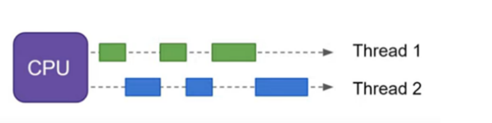
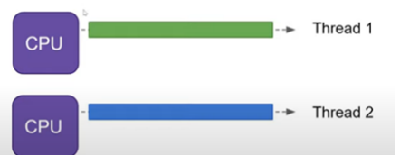
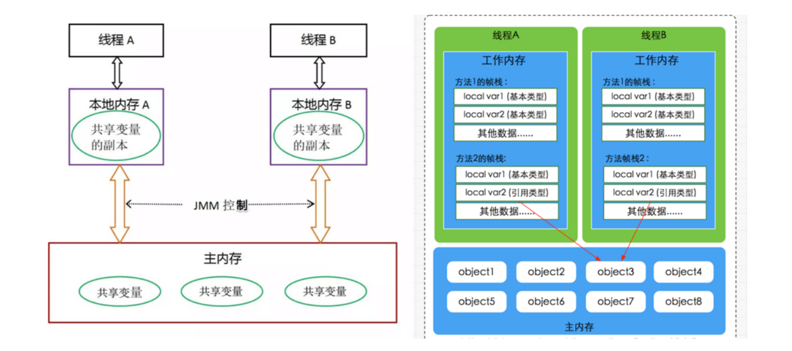
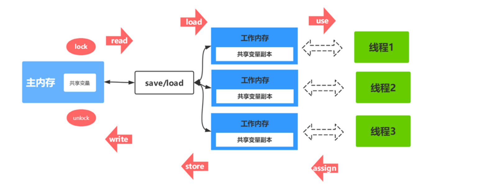
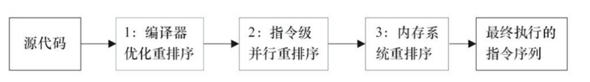

# JMM&并发特性

## 1，并发和并行

并发和并行目标都是为了最大化cpu的利用率。

### 1.1 并发concurrency

>   指多个进程在同一时间段内同时运行，但是同一时刻只能有一个进程执行，使得在宏观上具有多个进程同时执行的效果，但在微观上进程快速交替的执行。

### 1.2 并行parallel

>   指在同一时刻，有多个进程在多个处理器上同时执行。

并行在多处理器系统中存在，而并发可以在单处理器和多处理器系统中都存在。

### 1.3 并发三大特性

**并发编程Bug的源头：可见性、原子性和有序性**

有序性大多情况下是为了保证可见性

#### 1.3.1 可见性

>   可见性：当一个线程修改了共享变量的值，其他线程能够看到修改的值，则是可见性。
>
>   Java可见性实现：Java内存模型通过变量修改后将值同步到主内存，在另外一线程读取前从主内存刷新变量值，从主存中读取值，这种依赖主存作为传递媒介的方法来实现可见性。

#####  保证可见性措施

**Java层面：**volatile和锁机制如下：

*   通过 volatile 关键字保证可见性。
*   通过内存屏障保证可见性。
*   通过 synchronized 关键字保证可见性。
*   通过 Lock保证可见性。
*   通过 final 关键字保证可见性。

底层来将的两种：`内存屏障`，`上下文切换`。

#### 1.3.2 有序性

>   即程序执行的顺序按照代码的先后顺序执行。
>
>   JVM 存在指令重排，所以存在有序性问题。
>
>   指令重排：jvm在不改变原有代码执行结果的情况下，调整代码执行顺序。
>
>   ps：单线程环境有效性不影响

#####  保证有序性措施

*   通过 volatile 关键字保证可见性。 
*   通过内存屏障保证可见性。
*   通过 synchronized关键字保证有序性。
*   通过 Lock保证有序性。

#### 1.3.3 原子性

>   一个或多个操作，要么全部执行且在执行过程中不被任何因素打断，要么全部不执行。
>
>   **PS: **
>
>   *   不采取任何的原子性保障措施的自增操作并不是原子性的，即a++，或a--不是原子操作。
>   *   创建对象也不是原子操作。1，分配内存空间；2，对象属性初始化；3，对象地址赋值给变量。

#####  保证原子性措施

*   通过 synchronized 关键字保证原子性。
*   通过 Lock保证原子性。
*    通过 CAS保证原子性。

## 2，可见性问题分析

`Java中为什么多线程对共享变量的操作存在可见性问题？`

### 2.1 Java内存模型(JMM)

>   Java虚拟机规范中定义了Java内存模型（Java Memory Model)，用于屏蔽掉各种硬件和操作系统的内存访问差异。
>
>   JMM规定了一个线程如何和何时可以`访问`到由其他线程修改过后的共享变量的值，以及在必须时如何`同步`的访问共享变量。
>
>   JMM是围绕原子性、有序性、可见性展开的。

### 2.2 内存交互操作

>   关于`主内存`（线程共享的）与`工作内存`(线程的)之间的具体交互协议，即一个变量如何从主内存拷贝到工作内存、 如何从工作内存同步到主内存之间的实现细节，Java内存模型定义了以下八种操作来完成：
>
>   *   lock（锁定）：作用于主内存的变量，把一个变量标识为一条线程独占状态。
>   *   unlock（解锁）：作用于主内存变量，把一个处于锁定状态的变量释放出来，释放后的变量才可以被其他线程锁定。
>   *   read（读取）：作用于主内存变量，把一个变量值从主内存读取到线程的工作内存中，以便随后的load动作使用。
>   *   load（载入）：作用于工作内存的变量，它把read操作从主内存中得到的变量值放入工作内存的变量副本中。
>   *   use（使用）：作用于工作内存的变量，把工作内存中的一个变量值传递给执行引擎，每当虚拟机遇到一个需要使用变量的值的字节码指令时将会执行这个操作。
>   *   assign（赋值）：作用于工作内存的变量，它把一个值赋值给工作内存的变量，每当虚拟机遇到一个给变量赋值的字节码指令时执行这个操作。
>   *   store（存储）：作用于工作内存的变量，把工作内存中的一个变量的值传输到主内存中，以便随后的write的操作。
>   *   write（写入）：作用于主内存的变量，它把store操作从工作内存中一个变量的值传送到主内存的变量中。
>
>   **ps：**如果对一个变量执行lock操作，将会清空工作内存中此变量的值，在执行引擎使用这个变量前需要重新执行load或assign操作初始化变量的值。对一个变量执行unlock操作之前，必须先把此变量同步到主内存中（执行store和 write操作）。

### 2.3 JMM内存可见性保证

按程序类型，Java程序的内存可见性保证可以分为下列3类：

*   单线程程序：单线程程序不会出现内存可见性问题（不存在共享问题，所以不存在可见性问题）。
*   正确同步的多线程程序：正确同步的多线程程序的执行将具有顺序一致性，限制重排序保证可见性。
*   未同步/未正确同步的多线程程序：JMM为它们提供了最小安全性保障。

### 2.4 volatile的内存语义

#### 2.4.1 volatile的特性

**可见性：**对一个volatile变量的读，总是能看到（任意线程）对这个volatile变量最后的写入。

**原子性：**对任意单个volatile变量的读/写具有原子性，但类似于volatile++这种`复合操作不具有原子性`。

>   **补充：**`锁的互斥执行的特性可以确保对整个临界区代码的执行具有原子性。`
>
>   64位的long型和double型变量，只要它是volatile变量，对该变量的读/写就具有原子性。注意其是锁内存行。

**有序性：**对volatile修饰的变量的读写操作前后加上各种特定的`内存屏障`来`禁止指令重排序`来保障有序性。

>   当`写一个volatile变量`时，JMM会把该线程对应的本地内存中的共享变量值刷新到主内存。 
>
>   当`读一个volatile变量`时，JMM会把该线程对应的本地内存置为无效，线程接下来将从主内存中读取共享变量。

## 3，指令重排序

>   ​		只要程序的最终结果与它顺序化情况的结果相等，那么指令的执行顺序可以与代码顺序不一致，此过程叫指令的重排序。
>
>   ​		JVM能根据处理器特性（CPU多级缓存系统、多核处理器等）适当的对机器指令进行重排序，使机器指令能更符合CPU的执行特性，最大限度的发挥机器性能。

## 4，内存一致性协议

