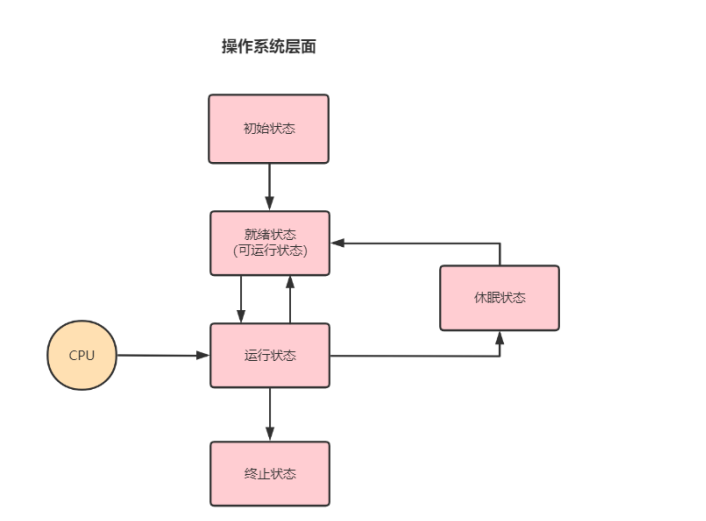
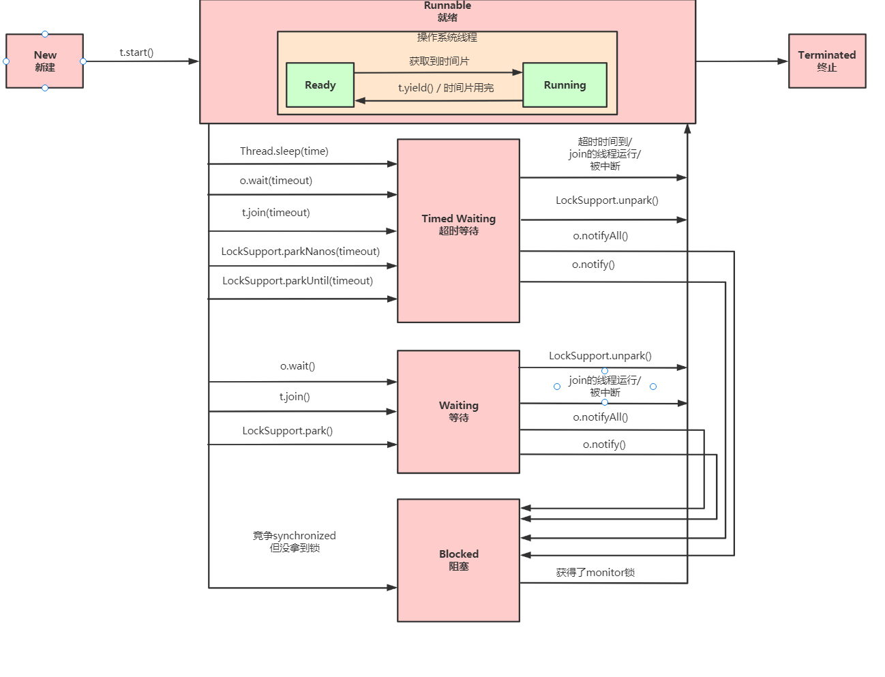

# 线程基础知识

## 1. 线程和进程

### 1.1 概念

**进程：** 进程是os资源（cpu，内存等）分配的基本单位，就是程序的一次运行。

**线程：**是操作系统调度 （CPU调度）执行的最小单位。

**关系：**线程是进程中的实体，是线程的实际运行，一个进程可以拥有多个线程，一个线程必须有一个父进程。


**区别：**

*   进程与进程之间是相互独立的，同一个进程内的线程，可以存在联系的。
*   通信方式不同
    *   线程通信相对简单，线程天然的共享内存，多个线程可以访问同一 个共享变量就可以完成通信。
    *   进程间通信：
        *   同一计算机通信的
        *   不同计算机通信：需要通过网络协议，如：http
*   进程和线程的切换：进程切换有上下文环境的切换，线程的切换则不需要

### 1.2 进程间通信

*   **管道通信**

    >   管道好比一个`文件`，一端往文件上写内容，另一端读取文件的内容。
    >
    >   同一计算机进程间的通信

*   **消息队列**

    >   利用消息队列完成进程间通信，例如：rabbitmq，kafka等等
    >
    >   可实现不同计算机间进程的通信

*   **共享内存**

    >   多个进程可以访问同一块内存空间。
    >
    >   这种方式需要依靠某种同步操作，如互斥锁和信号量等。
    >
    >   同一计算机进程间的通信

*   **信号量**

    >   进程之间及同一种进程的不同线程之间得同步和互斥手段。

*   **套接字**

    >   可用于网络中不同机器之间的进程间通信。

### 1.3 线程同步互斥

>   线程的同步互斥是线程之间的一种相互制约的关系（执行顺序）。

#### 1.3.1 临界关系相关概念

**临界资源：**多进程互斥共享的额资源（这些资源不能被线程任意的共享）

**临界区：**访问临界资源的代码

### 1.4 上下文切换

>   上下文切换是指CPU(中央处理单元)从一个进程或线程到另一个进程或线程的切换。
>
>   存在的进行环境的保存和恢复，代价比较大。

## 2，线程的生命周期

不同语言以及操作系统在描述线程生命周期是可能存在一些不同点。

### 2.1  os层面线程生命周期

>   操作系统层面的线程生命周期基本上可以用下图这个“**五态模型**”来描述。这五态分别是：初始状态、就绪状态、运行状态、阻塞状态（休眠状态）和终止状态。



**初始态：**

>   这个状态属于编程语言特有的，不过这里所谓的被创建（创建线程的结构体），仅仅是在编程语言层面被创建，而在操作系统层面，真正的线程还没有创建。（没有关联os）

**就绪状态：**

>   指的是线程可以分配 CPU 执行，其已经获取了出cpu以外的全部资源，得到cpu即可执行。

**休眠状态：**

>   运行状态的线程如果遇到阻塞事件，那么线程的状态就会转换到休眠状态，同时释放 CPU 使用权，休眠状态的线程永远没有机会获得 CPU 使用权。
>
>   **ps：**时间片用完会从运行态 -> 就绪态

**运行态：**

>   程序在执行

**终止状态：**

>   线程正常执行结束，或者被迫强制退出。


### 2.2 Java线程生命周期

>   Java 语言中线程共有六种状态，分别是：
>
>   1.   **NEW（初始化状态**） ：线程new出来，还未调用start方法之前的状态，其目前还只是java对象
>   2.   **RUNNABLE（可运行状态+运行状态）**：线程对象调用start方法，线程已经与os关联了
>        1.   ready：就绪状态
>        2.   running：运行态
>   3.   BLOCKED（阻塞状态） ：看下图
>   4.   WAITING（无时限等待）：看下图
>   5.   TIMED_WAITING（有时限等待） ：看下图
>   6.   **TERMINATED（终止状态）**：线程正常和非正常结束
>
>   **PS: ** Java 线程中的 BLOCKED、WAITING、TIMED_WAITING 对os来说都是一种状态， 即前面我们提到的休眠状态。



### 2.3 Thread常用方法

#### 2.3.1 sleep静态方法

>   状态：`Running --> TIMED_WAITING`

*    调用 sleep 会让当前线程从 Running 进入TIMED_WAITING状态，**不会释放对象锁**

    ``` java
    // 当前线程休眠3s
    Thead.sleep(3000);
    ```

    

*   其它线程可以使用 interrupt 方法打断正在睡眠的线程，这时 sleep 方法会抛出 InterruptedException，进入异常捕捉代码块中，并且会清除中断标志。

    ```java
    Thread t1 = new Thread(() -> {
        try {
            System.out.println(Thread.currentThread().getName() + "睡眠30s");
            Thread.sleep(30000);
            System.out.println(Thread.currentThread().getName() + "结束睡眠");
        } catch (InterruptedException e) {
            // 其他线程如主线程调用该线程的interrupt，就会打断睡眠，抛出异常而进入该代码块
            e.printStackTrace();
        }
    });
    t1.start();
    
    Thread t2 = new Thread(() -> {
        System.out.println(Thread.currentThread().getName() + "启动");
        System.out.println(Thread.currentThread().getName() + "执行完毕");
    });
    t2.start();
    t1.interrupt();
    ```

*   睡眠结束后的线程未必会立刻得到执行

    >   调用sleep的线程就会进入TIMED_WAITING状态，即os的休眠状态，其只能先从休眠状态 -> 就绪状态，然后争夺cpu才能再次运行。
    >
    >   sleep 结束只会进入os的就绪状态。

*   sleep当传入参数为0时，和yield相同

#### 2.3.2  yield静态方法

>   调用yield方法，该线程主动放弃时间片，将会从 running状态 -> ready状态（os层面），Java层面还Runnable状态。

*   yield会释放CPU资源（让优先级更高的线程获得执行机会），**不会释放对象锁**。假设当前进程只有main线程，当调用yield之后，main线程会继续运行，因为没有比 它优先级更高的线程

#### 2.3.3  join实例方法

>   等待调用join方法的线程结束之后，程序再继续执行。
>
>   `join可以理解成是线程合并，当在一个线程调用另一个线程的join方法时，当前线程阻塞等 待被调用join方法的线程执行完毕才能继续执行，所以join的好处能够保证线程的执行顺序，但 是如果调用线程的join方法其实已经失去了并行的意义，虽然存在多个线程，但是本质上还是串 行的，最后join的实现其实是基于等待通知机制`
>
>   如：t1线程调用t2线程的join方法，那么t1线程在调用位置等待t2线程执行完毕之后才能继续执行。

```java
Thread t1 = new Thread(() -> {
    try {
        System.out.println(Thread.currentThread().getName() + "睡眠30s");
        Thread.sleep(5000);
        Thread.yield();
        System.out.println(Thread.currentThread().getName() + "结束睡眠");
    } catch (InterruptedException e) {
        e.printStackTrace();
    }
});
t1.start();

Thread t2 = new Thread(() -> {
    try {
        System.out.println(Thread.currentThread().getName() + "启动");
        System.out.println(Thread.currentThread().getName() + "等待" + t1.getName() + "执行完毕");
        t1.join();
        System.out.println(Thread.currentThread().getName() + "执行完毕");
    } catch (InterruptedException e) {
        e.printStackTrace();
    }
});
t2.start();
```

#### 2.3.4 stop实例方法

>   stop()方法已经被jdk废弃，原因就是stop()方法太过于暴力，强行把执行到一半的线程终止。
>
>   stop会释放对象锁，可能会造成数据不一致。

**PS:** **wait，notify等方法是所有对象都有的。**

### 2.4 Java线程的中断机制

>   Java没有提供一种安全的、直接的方法来停止某个线程，而是提供了中断机制（是否中断取决于程序员）。
>
>   中断机制仅仅是打中断标志，是否真的中断还是取决于程序员。
>
>   程序员可以根据线程的中断标志，决定程序是自旋等待还行执行下去（即if或while判断执行不同的逻辑）

#### 2.4.1 中断API的使用

*   thread.interrupt()：（线程实例方法）作用是将中断标志位设置为true，不会停止线程。
*   thread.isInterrupted()：线程实例方法）判断当前线程的中断标志位是否为true，不会清除中断标志位。
*   Thread.interrupted()：（静态方法）判断当前线程的中断标志位是否为true，并清除中断标志 位，重置为fasle。

#### 2.4.2 中断标志感知

>   线程 sleep可以被thread.interrupt()中断，抛出中断异常：sleep interrupted， 清除中断标志位
>
>    wait可以被中断，抛出中断异常：InterruptedException， 清除中断标志位


## 3，Java线程间通信

### 3.1 管道通信

>   管道输入/输出流和普通的文件输入/输出流或者网络输入/输出流不同之处在于，它主要用于线程之间的数据传输，而传输的媒介为内存。
>
>   **管道输入/输出流如下4种具体实现:**
>
>   *   PipedOutputStream
>   *   PipedInputStream
>   *   PipedReader
>   *   PipedWriter
>
>   **ps: **将输出流和输入流进行连接，否则在使用时会抛出IOException

**代码存在小bug**

```java
public class Test1 {
    public static void main(String[] args) throws IOException {
        PipedWriter out = new PipedWriter();
        PipedReader in = new PipedReader();

        // 将输出流和输入流进行连接，否则在使用时会抛出IOException
        out.connect(in);

        Thread t1 = new Thread(new MyTask(in), "PrintThread");
        t1.start();

        int receive = 0;
        try {
            while (receive != -1) {
                out.write(receive);
                receive = System.in.read();
            }
        } finally {
            out.close();
            System.out.println("结束");
        }
    }

    static class MyTask implements Runnable {
        private PipedReader in;
        public MyTask(PipedReader in) {
            this.in = in;
        }

        @Override
        public void run() {
            try {
                int receive = 0;
                while (receive != -1) {
                    System.out.print("其他线程：" + (char) receive);
                    receive = in.read();
                }
            } catch (IOException e) {
                e.printStackTrace();
            }
        }
    }
}
```


### 3.2 等待唤醒(等待通知)机制

>   等待唤醒机制可以基于wait和notify方法来实现，在一个线程内调用该`线程锁对象`的wait方法， 线程将进入等待队列进行等待直到被唤醒。
>
>   **PS:** 有虚假唤醒问题

