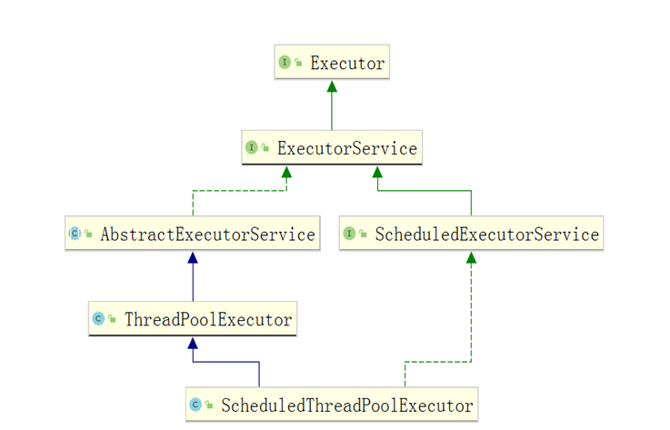
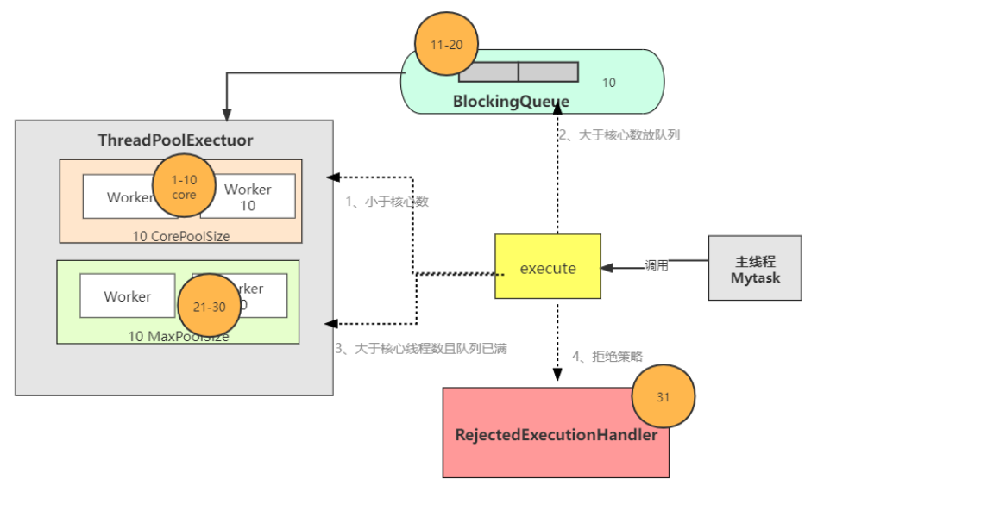
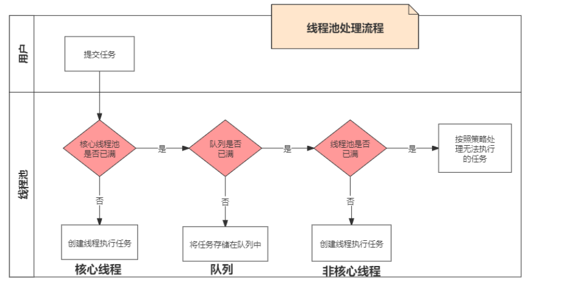
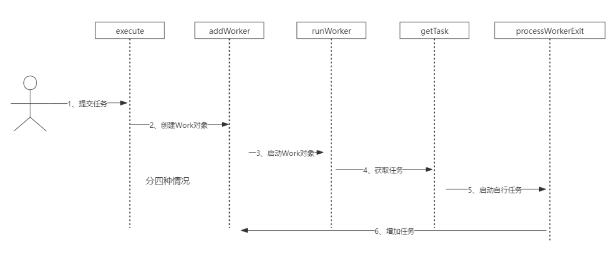
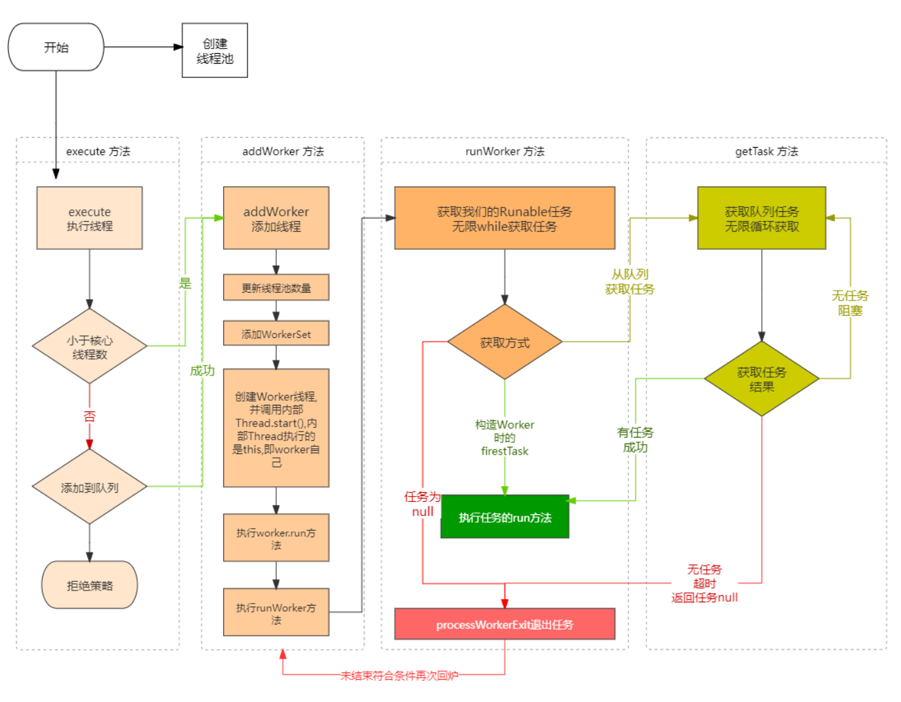
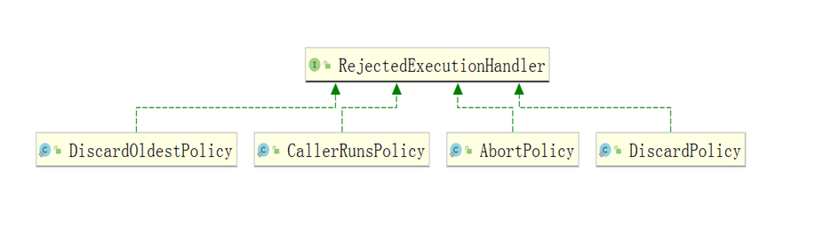
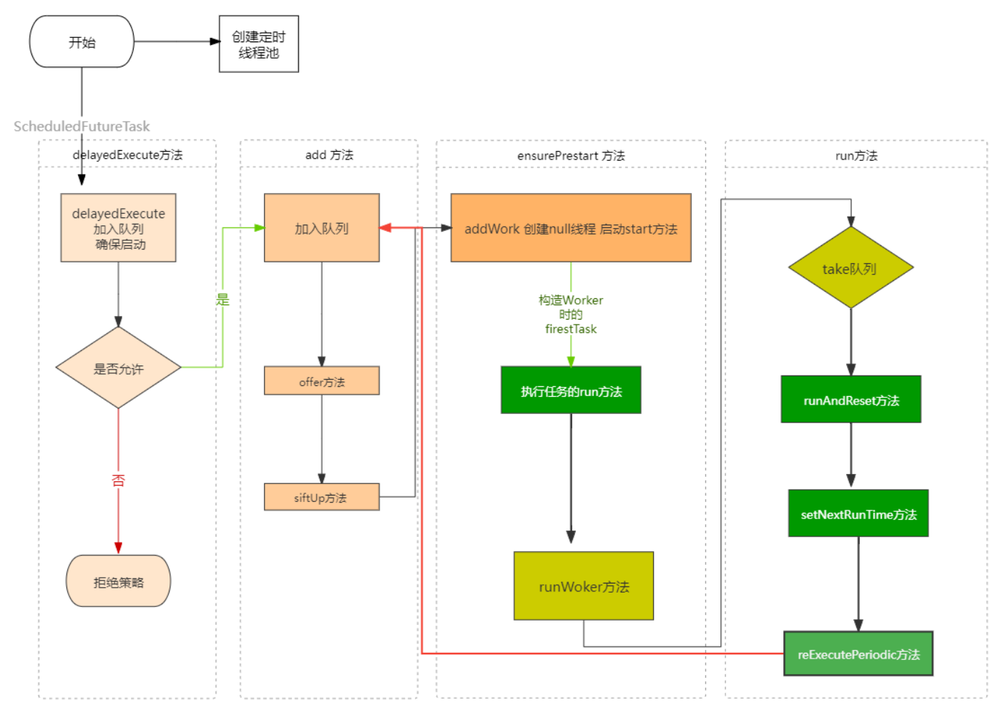

# Java并发线程池

线程池要考虑线程是什么类型的，cpu密集型，还是io密集型，还要充分考虑是否存在上下文环境的切换等待。

**线程池原理：**不推荐使用


**为什么不推荐使用？**

>   因为资源不可控：
>
>   1，假设是无界线程个数，如果某一时间有大量请求到了，假设每个线程申请一块空间，很容易把内存吃完，同时cpu飙高，典型的是大促场景。
>
>   2，假设是无界队列，如果任务执行很慢同时又有很多的任务到了，内存也很容易的被吃完，在微服务调用失败任务得不到释放。


**内置线程池对象类图：**



## 1，ThreadPoolExecutor.execute

**流程：**



```java
public static void main(String[] args) {
        ExecutorService executorService1 = Executors.newCachedThreadPool();
        ExecutorService executorService2 = Executors.newFixedThreadPool(10);
        ExecutorService executorService3 = Executors.newSingleThreadExecutor();
        ThreadPoolExecutor threadPoolExecutor = new ThreadPoolExecutor(10, 20, 0L, TimeUnit.MICROSECONDS,
            new LinkedBlockingDeque<Runnable>(10));
        for (int i = 1; i <= 100; i++) {
            int k = i;
            threadPoolExecutor.execute(() -> {
                try {
                    Thread.sleep(1000);
                    System.out.println("任务：" + k);
                } catch (InterruptedException e) {
                    e.printStackTrace();
                }
            });
        }
    }
```

### 1.1 execute方法



>   源码中COUNT_BITS是 int 位数COUNT_BITS = Integer.SIZE - 3
>
>   COUNT_BITS=32-3=29
>
>   实际上用32位中的高3位表示线程池的状态，低位表示线程数量

**execute核心代码：**

```java
// 获取线程池信息：高3位标识线程池状态，低位表示线程池数量
int c = ctl.get();
// 1，判断当前的线程数是否小于corePoolSize
// 是：使用入参任务通过addWord方法创建一个新的线程，在addWork里面提交任务，若成功调用线程的start方法执行任务-> run方法执行。
if (workerCountOf(c) < corePoolSize) {
    if (addWorker(command, true))
        return;
    c = ctl.get();
}
// 2, 没有完成任务提交：此时core线程都在工作不能执行新任务。
// 若：线程池状态为运行且能成功加入任务到工作队列，再进行一次check，如果状态在任务加入队列后变为非运行（有可能是在执行到这里线程池shutdown了），非运行状态下当然是需要reject并且移除任务。
// 然后再判断当前线程数是否为0（有可能这个时候线程数变为了0），是，新增一个线程
if (isRunning(c) && workQueue.offer(command)) {
    int recheck = ctl.get();
    if (! isRunning(recheck) && remove(command))
        reject(command);
    else if (workerCountOf(recheck) == 0)
        // 判断当前工作线程池数是否为0:是创建一个null任务，任务在堵塞队列存在了就会从队列中取出,这样做的意义是保证线程池在running状态必须有一个任务在执行。
        addWorker(null, false);
}
// 3, 不能加入任务到工作队列，将尝试使用任务新增一个非核心线程，如果失败reject
else if (!addWorker(command, false))
    reject(command);
```

**PS: **核心线程池不是创建线程池是就创建好的，而是提交任务是创建的，执行创建之后不在回收。

>   **阻塞队列**：offer方法和add方法差不多，队列是有大小的
>
>   *   add添加不下就会抛出异常
>   *   offer添加失败返回false
>
>   **拒绝策略：**拒绝策略不仅仅是在饱和状态下使用  （3），在线程池进入到关闭阶段同样     reject         


### 1.2  addWorker方法



>   需要注意的是代码中的worker对象是线程不是任务，其调用了一个start方法。
>
>   addWorker主要工作：

```java
private boolean addWorker(Runnable firstTask, boolean core) {
    // goto写法，用于重试
    retry:
    // 做check1检查
    for (;;) {
        int c = ctl.get();
        // 获取线程池状态，以检查其状态
        int rs = runStateOf(c);
        // 只有当running和SHUTDOW能添加任务。当SHUTDOWN时添加的任务->阻塞queue，若firstTask即任务=null则直接返回。null任务只有当线程池任务都执行完了，保留一个null任务使得线程池处于running。即非shutdown状态任务为空，队列非空就不能新增线程了
        if (rs >= SHUTDOWN && !(rs == SHUTDOWN && firstTask == null && !workQueue.isEmpty()))
            return false;
        // 做check2检查
        for (;;) {
            // 当前线程池状态running，获取最大线程数是否超过限制线程数，超过直接返回。说明达到了阈值。
            int wc = workerCountOf(c);
            if (wc >= CAPACITY || wc >= (core ? corePoolSize : maximumPoolSize))
                return false;
            // 到此，compareAndIncrementWorkerCount(c)中c++,工作线程池数量+1 如果成功就跳出死循环。
            if (compareAndIncrementWorkerCount(c))
                break retry;
            c = ctl.get();  // Re-read ctl
            // 进来的状态和此时的状态发生改变重头开始重试
            if (runStateOf(c) != rs)
                continue retry;
            // else CAS failed due to workerCount change; retry inner loop
        }
    }

    boolean workerStarted = false;
    boolean workerAdded = false;
    Worker w = null;
    // 上面主要是对ctl工作现场+1即线程+1, 下面才是真正干事的
    try {
        // Worker是线程而不是任务, 毎一个worker就是一个线程数
        // Worker:内部类, 封装了线程和任务通过threadfactory创建线程.
        w = new Worker(firstTask);
        final Thread t = w.thread;
        if (t != null) {
            // 上锁干活 
            final ReentrantLock mainLock = this.mainLock;
            mainLock.lock();
            try {
                // Recheck while holding lock.
                // Back out on ThreadFactory failure or if
                // shut down before lock acquired.
                int rs = runStateOf(ctl.get());
                // 还要判断线程状态
                if (rs < SHUTDOWN || (rs == SHUTDOWN && firstTask == null)) {
                    // 线程还没start就是alive就直接异常
                    if (t.isAlive()) // precheck that t is startable
                        throw new IllegalThreadStateException();
                    workers.add(w); 
                    int s = workers.size();
                    if (s > largestPoolSize)
                        // 记录最大线程数
                        largestPoolSize = s;
                    workerAdded = true;
                }
            } finally {
                // 放锁
                mainLock.unlock();
            }
            if (workerAdded) {
                // 启动线程，执行run方法
                t.start();
                workerStarted = true;
            }
        }
    } finally {
        // 失败回退，从wokers移除w，线程数减1，尝试结束线程池
        if (! workerStarted)
            addWorkerFailed(w);
    }
    return workerStarted;
}
```


### 1.3 Worker类

>   Worker:内部类, 封装了线程和任务通过threadfactory创建线程.


### 1.4 runwoker方法

>   runnable在addwork方法中调用start方法启动线程，run就会被执行。在run方法中又去执行runwoker方法。

```java
public void run() {
    runWorker(this);
}
```

```java
final void runWorker(Worker w) {
    // 获取当前线程,workder中封装有
    Thread wt = Thread.currentThread();
    Runnable task = w.firstTask;
    w.firstTask = null;
    w.unlock(); // allow interrupts
    boolean completedAbruptly = true;
    try {
        // task不为空就是执行task的， task为null是区阻塞队列中拿到了任务
        while (task != null || (task = getTask()) != null) {
            w.lock();
            // If pool is stopping, ensure thread is interrupted;
            // if not, ensure thread is not interrupted.  This
            // requires a recheck in second case to deal with
            // shutdownNow race while clearing interrupt
            if ((runStateAtLeast(ctl.get(), STOP) ||
                 (Thread.interrupted() &&
                  runStateAtLeast(ctl.get(), STOP))) &&
                !wt.isInterrupted())
                wt.interrupt();
            try {
                beforeExecute(wt, task);
                Throwable thrown = null;
                try {
                    task.run();
                } catch (RuntimeException x) {
                    thrown = x; throw x;
                } catch (Error x) {
                    thrown = x; throw x;
                } catch (Throwable x) {
                    thrown = x; throw new Error(x);
                } finally {
                    afterExecute(task, thrown);
                }
            } finally {
                // 这设置为空，等下次循环就会从队列里面获取
                task = null;
                // 完成任务数+1
                w.completedTasks++;
                w.unlock();
            }
        }
        completedAbruptly = false;
    } finally {
        processWorkerExit(w, completedAbruptly);
    }
}
```

**总结：**



## 2，拒绝策略



**ThreadPoolExecutor内部有实现4个拒绝策略**

​		但是一般都很少用，工作中一般都是自己实现。

*   CallerRunsPolicy：（谁提交谁负责）由调用execute方法提交任务的线程来执行这个任务
*   AbortPolicy：拒绝提交新任务，抛出异常RejectedExecutionException
*   DiscardPolicy：直接抛弃任务，不做任何处理
*   DiscardOldestPolicy：去除任务队列中的第一个任务（最旧的），重新提交


## 3，ScheduledThreadPoolExecutor

>   ScheduledThreadPoolExecutor是一个定时任务线程池，用于执行定时任务，延时任务。
>
>   **方法：**
>
>   *   ScheduledExecutorService.**schedule**：延迟指定时间之后只执行一次
>
>   *   ScheduledExecutorService**.scheduledAtFixedRate**：延迟指定时间后执行一次，之后按照固定的时长周期执行；
>
>   *   ScheduledExecutorService.**scheduledWithFixedDelay**：延迟指定时间后执行一次，之后按照：上一次任务执行时长 + 周期的时长的时间去周期执行，执行时间与上次结束时间有关。



### 1.1 scheduleAtFixedRate方法

>   在这个类中ScheduledThreadPoolExecutor

```java
public ScheduledFuture<?> scheduleAtFixedRate(Runnable command, long initialDelay, long period, TimeUnit unit) {
    if (command == null || unit == null)
        throw new NullPointerException();
    if (period <= 0)
        throw new IllegalArgumentException();
    // 内部类与worker类差不多
    ScheduledFutureTask<Void> sft =
        new ScheduledFutureTask<Void>(command,null,triggerTime(initialDelay, unit), unit.toNanos(period));
    // 空方法没有任何实现，扩展用
    RunnableScheduledFuture<Void> t = decorateTask(command, sft);
    sft.outerTask = t;
    // 相当execute方法
    delayedExecute(t);
    return t;
}
```

 **优先级是队列**

```java
private void delayedExecute(RunnableScheduledFuture<?> task) {
    if (isShutdown())
        reject(task);
    else {
        // 调用内部的add方法->调用offer方法，任务交给队列。优先级是队列。
        super.getQueue().add(task);
        if (isShutdown() &&
            !canRunInCurrentRunState(task.isPeriodic()) &&
            remove(task))
            task.cancel(false);
        else
            // 里面有addwork，添加null任务，这样就回去队列去拿任务执行。
            ensurePrestart();
    }
}
```

**添加到队列**

```java
public boolean offer(Runnable x) {
    if (x == null)
        throw new NullPointerException();
    RunnableScheduledFuture<?> e = (RunnableScheduledFuture<?>)x;
    final ReentrantLock lock = this.lock;
    lock.lock();
    try {
        int i = size;
        // 是否需要扩容
        if (i >= queue.length)
            grow();
        size = i + 1;
        if (i == 0) {
            queue[0] = e;
            setIndex(e, 0);
        } else {
            siftUp(i, e);
        }
        if (queue[0] == e) {
            leader = null;
            available.signal();
        }
    } finally {
        lock.unlock();
    }
    return true;
}
```

**执行任务**

>   delayedExecute中调用了addwork方法，出队是调用start方法执行任务
>
>   -> run方法
>
>   在run方法中会判断是什么类型的任务

```java
public void run() { 
    boolean periodic = isPeriodic();
    if (!canRunInCurrentRunState(periodic))
        cancel(false);
    else if (!periodic)
        ScheduledFutureTask.super.run();
    else if (ScheduledFutureTask.super.runAndReset()) {
        // 设值下次执行时间
        setNextRunTime();
        reExecutePeriodic(outerTask);
    }
}
```


# 自定义线程池

## 1，初始化线程的 4 种方式

*   继承 Thread：重新run方法
*   实现 Runnable 接口：将runnable任务交给Thread执行，起到线程与任务的解耦。
    *   问题1：不能抛出异常，只能自己解决
    *   问题2：不能得到返回结果

*   实现 Callable 接口 ： 返回FutureTask，通过其可以拿到返回结果，可以处理异常
*   线程池
    *   通过Executors工具类
    *   自定义线程池：new ThreadPoolExecutor

### 1.1 普通线程缺点

>   方式 1 和方式 2：主进程无法获取线程的运算结果。
>
>   方式 3：主进程可以获取线程的运算结果，但是不利于控制服务器中的线程资源。可以导致服务器资源耗尽。

### 1.2 new ThreadPoolExecutor

**最全的构造方法**

```java
public ThreadPoolExecutor(int corePoolSize,
                              int maximumPoolSize,
                              long keepAliveTime,
                              TimeUnit unit,
                              BlockingQueue<Runnable> workQueue,
                              ThreadFactory threadFactory,
                              RejectedExecutionHandler handler) {
        if (corePoolSize < 0 ||
            maximumPoolSize <= 0 ||
            maximumPoolSize < corePoolSize ||
            keepAliveTime < 0)
            throw new IllegalArgumentException();
        if (workQueue == null || threadFactory == null || handler == null)
            throw new NullPointerException();
        this.acc = System.getSecurityManager() == null ?
                null :
                AccessController.getContext();
        this.corePoolSize = corePoolSize;
        this.maximumPoolSize = maximumPoolSize;
        this.workQueue = workQueue;
        this.keepAliveTime = unit.toNanos(keepAliveTime);
        this.threadFactory = threadFactory;
        this.handler = handler;
    }
```

### 1.3 线程池参数

#### 1.3.1 corePoolSize

>   核心线程数：线程池的核心线程，一旦线程池创建的线程 <= corePoolSize数量这些线程是不会被回收的。
>
>   核心线程也不是创建ThreadPoolExecutor就创建好的（查看一些线程池工具类创建的无界线程池就知道了，不可能一下就创建那么多，是懒加载的），而是addWork是判断添加的。

### 1.3.2 maximumPoolSize

>   最多线程池数量，当核心线程池无空闲，并且阻塞队列也已经慢了，可以开新的线程来执行即将到来的任务，但最多的线程池个数是被maximumPoolSize限制的。
>
>   最多在新增 = maximumPoolSize - corePoolSize
>
>   这部分线程执行的是新任务，而不是队列的任务。


### 1.3.3 keepAliveTime

>   maximumPoolSize - corePoolSize这部分线程的空闲回收时间


### 1.3.4 BlockingQueue

>   阻塞队列，用来存储目前还不能被执行的任务，队列一般都是有界的。

### 1.3.5 ThreadFactory

>   创建线程池的工厂，一般采用默认。


### 1.3.5 RejectedExecutionHandler

>   任务拒绝策略。队列是有界的，总会有超出队列接收的时候，当队列无法装下是由RejectedExecutionHandler来处理。
>
>   一般都是自定义的拒绝策略，当然工具类提供了几种策略。
>
>   **ThreadPoolExecutor内部有实现4个拒绝策略**
>
>   ​		但是一般都很少用，工作中一般都是自己实现。
>
>   *   CallerRunsPolicy：（谁提交谁负责）由调用execute方法提交任务的线程来执行这个任务
>   *   AbortPolicy：拒绝提交新任务，抛出异常RejectedExecutionException
>   *   DiscardPolicy：直接抛弃任务，不做任何处理
>   *   DiscardOldestPolicy：去除任务队列中的第一个任务（最旧的），重新提交

